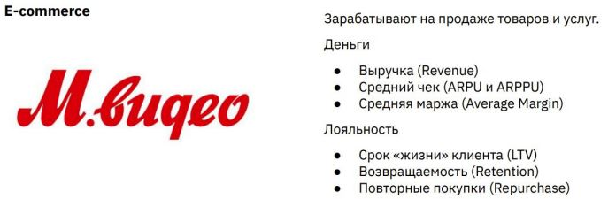
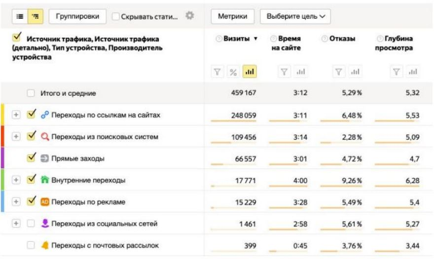
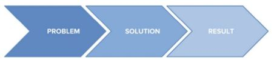
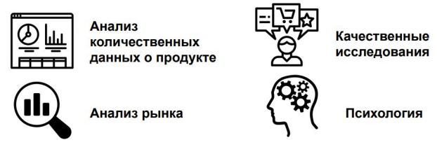
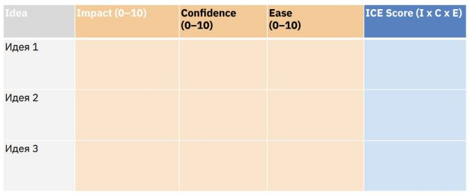

Урок 4. Основные метрики продукта

Аналитика, гипотезы и метрики

На этом занятии:

+ Какие есть верхнеуровневые предпосылки для анализа и выявления гипотез
+ Какие есть инструменты для гипотез и метрик в нашем кейсе?
+ Разбор метрик: какие они бываю и для какого типа бизнеса какие подходят маркетинговые метрики
+ Подход к формированию гипотез

# Предпосылки для метрик и гипотез

Зачем нужны метрики?
Основное - это декомпозиция бизнес задач:

+ У любого бизнеса есть ключевые верхнеуровневые показатели: выручка, прибыль, расходы
+ Каждый из этих показателей можно декомпозировать: например выручка формируется из количества продаж, среднего чека и LTV
+ Для расчета прибыли нужно в выручке учесть расходную часть: себестоимость и соотношение постоянных издержек расходы делятся на постоянные (аренда и Фȁȅ), переменные (доставка и производство)

# Любой вид анализа по итогу должен влиять на 
ключевые показатели бизнеса

# Какие есть инструменты?

1. WEB аналитика
    
    Google Analytics и Яндекс метрика - обе системы помогают считывать данные с сайта

2. CRM
    
    Анализирует путь клиента после того, как он 
оставил нам свои контакты и стал лидом

3. ERP
    
    Системы, которые содержат данные о сделках: чеки, суммы, принадлежность к конкретному клиенту

4. BI + базы данных
    Инструменты, которые помогают забрать данные из систем, объединить их для анализа и затем производить вычисления и визуализацию.

5. основной инструмент - это ваши мозги, данные сами по себе никаких метрик и гипотез не сгенерируют!

# Для чего используются метрики

1. Метрики позволяют видеть реальность и объективнее оценивать деятельность продукта целиком.
2. Метрики позволяют оценивать эффективность различных активностей и принимать более качественные решения на основе данных.

__Ключевые показатели эффективности__ - Key Performance Indicators (KPI) - это числовые показатели метрик, которые позволяют измерить степень достижения целей продукта.

# Виды метрик

## Метрики тщеславия vs метрики эффективности

+ Метрики тщеславия отвечают на вопрос "сколько?". Чтобы оценить масштаб, используются метрики-абсолюты.
+ Метрики эффективности отвечают на вопрос "насколько эффективно?". Драйверы роста.

## Метрики тщеславия

### Метрики-абсолюты измеряются в абсолютах:
+ просмотры страниц,
+ MAU (количество пользователей в месяц),
+ DAU (количество пользователей в день), 
+ количество установок/регистраций,
+ подписок.

### Плюсы
+ легко измерять,
+ наглядны и понятны рынку.

### Минусы
+ сложно принимать решения на основе этих метрик,
+ не дают ответа "хорошо/плохо", "лучше/хуже", "легко".

## Метрики эффективности

Относительные метрики:
+ CTR (процент кликов на рекламу (банер)),
+ CR (оставил контакты (перешёл из обезличенного состояния)),
+ ARPU (средняя выручка на юзера),
и т.д.

### Плюсы
+ позволяют принимать решения,
+ сложно накрутить,
+ удобны для измерения эффективности.

### Минусы
+ Бывает сложно посчитать,
+ Сложнее объяснить инвесторам,
+ Не всегда позволяют сравниться с конкурентами.

## Что такое хорошая метрика?

+ Чувствительная к изменениям в продукте,
+ Понятная (интерпретируемая) - всегда однозначно растет или падает при улучшениях или ухудшениях в продукте,
+ Сравнимая - поддаётся сравнению с собой или рынком,
+ Реальная - можно посчитать метрику и управлять метрикой посредством продуктовых решений.

# Что можно считать целью бизнеса?

Разберем примеры.

### Ключевые метрики для ритейла

### Ключевые метрики для продукта

### Ключевые метрики для aaS модели

### Ключевые метрики для автомобильного дилера

+ Выручка, операционная прибыль, чистая прибыль суммарная и на одного клиента
+ Цикл сделки, CJM, unit-экономика, CAC
+ ROMI
+ Цикл повторной продажи, возвращаемость
+ Менее важные метрики: MAU, DAU, время потраченное на сайте (CJM важнее), Retention, LT.

# Маркетинговые метрики

## CPO (cost per order) - стоимость одного заказа на сайте.
CPO - расходы на привлечение пользователей/количество заказов на сайте.

Затраты на контекстную рекламу - 83 726 р.
Заказов с рекламы - 62

СРО = 1350

## CPS (cost per sale) - стоимость одного оплаченного заказа с сайта.
CPS - расходы на привлечение пользователей/количество оплаченных заказов на сайте.

Затраты на привлечение пользователей на сайт - 2 372 947 р.
Продажи с сайта - 8 294

CPS = 286 р.

## CPL (cost per lead) - стоимость одного лида с сайта.
CPL - расходы на привлечение пользователей/количество лидов с сайта (обезличенный юзер - становиться пользователем - регистрация).

Затраты на привлечение пользователей на сайт - 627 492 р.
Лиды с сайта - 1 362

CPL = 460 р.

## CPA (cost per action) - стоимость действия пользователя, например, регистрация, покупка и т.д.

CPA - расходы на привлечение пользователей/количество действий пользователей на сайте.

Затраты на таргетированную рекламу - 263 640 р.
Регистраций на сайте - 1 749

CPA = 150 р.

# Что можно смотреть напрямую в GA/YM

## Показатели вовлеченности (собираются автоматически):
+ Глубина просмотра,
+ Время на сайте,
+ Отказы.

# Работа с гипотезами

## Что такое гипотеза?

Гипотеза в цифровых продуктах - это четко сформулированное предположение, основанное на известных значениях, которое технически возможно и необходимо проверить, чтобы опровергнуть или подтвердить.

__Например:__ мы предполагаем, что 10% маркетингового бюджета мы расходуем впустую и он не приносит продаж.

## Структура гипотезы

Действие [X] позволит увеличить метрику [N] на величину [Y], потому что [Z].

Если _убрать поле индекса_ из формы заказа, то мы _увеличим конверсию в заказ с 10 до 12 %_, потому что _упростим форму и повлияем на скорость её заполнения_.

# Требуется правильное целеполагание

+ Какую проблему я пытаюсь решить?
+ Каков масштаб проблемы?
+ Зачем вообще что-то менять?

# Требуется правильное целеполагание

# Подходы к формированию гипотез

# Методы тестирования гипотез

# Определение узкого места в бизнес процессе

# ICE score

# Приоритезация гипотез по ICE

# Практическое задание

+ Выведите список ключевых метрик для продукта автомобиль по подписке, опишите почему вы выбрали именно их и как их можно померить.

# Разбор ДЗ

## Ключевые метрики:
+ Выручка, чистая прибыль в разрезе каждой автомобильной модели 
+ Customer Journey Map, цепочки касаний по каждому клиенту, зависимость продаж и конверсий от количества шагов в цепочке
+ ROMI
+ Средний цикл заключения сделки
+ Список источников трафика, которые не участвуют в конверсионных цепочках
+ Все этапы воронки продаж в разрезе регионов

## Гипотезы
+ 10-15% бюджета можно смело сократить за счет источников, которые не попадаются в конверсионных цепочках, ICE - 250
+ Еще 20-30% бюджета можно либо оптимизировать, либо убрать за счет источников, которые участвуют в конверсионных цепочках, но не сильно, ICE - 45
+ Сможем понять цикл сделки, CJM и наиболее выгодные и продаваемые марки машин за счет чего сможем поднять чистую прибыль, ICE - 32
+ Сможем сделать скоринговую модель лидов для продавцов на местах, что повысит средний чек продаж, ICE - 20

# Словарь терминов с описаниями
https://www.notion.so/palexandr/d69f78ef95f54eefb918e6b3bd4b0974
