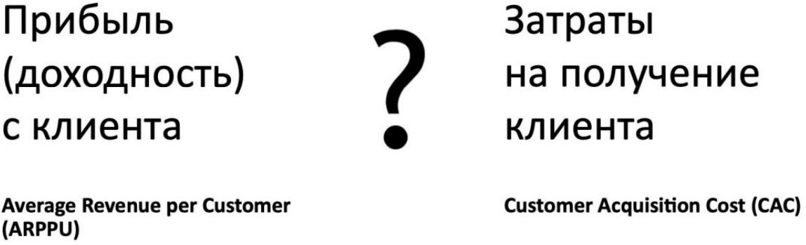

Урок 5. Unit-экономика

# На этом занятии:
+ Разбор ДЗ
+ Что такое Unit-экономика и как посчитать Unit
+ Зачем считать Unit-экономику
+ ROI/ROMI
+ Основные термины

# Что такое Unit-экономика и как определить Unit

## Что такое Unit?
Unit(юнит) — это: 
+ То, что мы масштабируем; 
+ Пользователи или клиенты, которые платят* (в цифровых продуктах); 
+ Единица, с которой мы зарабатываем — кто или что даёт нам деньги. 

Unit-экономика отвечает на вопрос, зарабатываем ли мы на конкретном пользователе (юните) или нет. 

Для этого нужно посчитать: 
1. Сколько денег потратили на привлечение пользователя? 
2. Сколько денег заработали с пользователя? **

Что такое Unit?

# Что нужно знать для расчета Unit экономики

1. Идея бизнеса и его способ монетизации. 
2. Количество вложений в маркетинг/разработку 
3. Рынок и ниша продукта. 
4. Метрики бизнеса.

# Традиционный бизнес VS digital

# Модель бизнеса

# Устройство бизнеса

# Зачем считать Unit-экономику

+ Определить прибыльность бизнеса;
+ Определить масштабирование - что будем масштабировать/растить?
+ Определить эффективность основных каналов продаж;
+ Найти точку безубыточности и просчитать доходность инвестиций;
+ Приоритизировать бэклог продукта.

# ROI/ROMI

ROI - (Return On Investment) или ROMI (Return On Marketing Investment) - окупаемость инвестиций.

Эта метрика показывает возвращаемость вложенных в определенный рекламный канал средств.

# Переменные в формулах:

# Задачи

# Чтобы понять, «сходится» ли unit-экономика, нужно посчитать LTV и CPA. Если CPA>LTV, то нет.

# Основные термины

## Переменные в формулах

# Точки роста

# Практическое задание

+ Что является unit’ом для авто дилера
+ Выведите список ключевых метрик для авто дилера с точки зрения Unit-экономики
+ Придумайте параметры, в разрезе который будет важно считать метрики Unit-экономики (например категория девайса или браузер)

# Разбор ДЗ
+ Что является unit’ом
    +   Unit’ом является клиент, вокруг него крутятся основные метрики:
        + выручка,
        + прибыль,
        + средний чек,
        + CJM 
        и прочее.

+ Ключевые метрики для авто дилера с точки зрения Unit-экономики:
    + Выручка, чистая прибыль на одного клиента,
    + Customer Journey Map, цепочки касаний по каждому клиенту,
    + Средний цикл заключения сделки.

+ Параметры/разрезы для Unit-экономики:
    + Регионы,
    + Источники трафика,
    + Марки,
    + Модели,
    + Период,
    + Категории девайсов.
