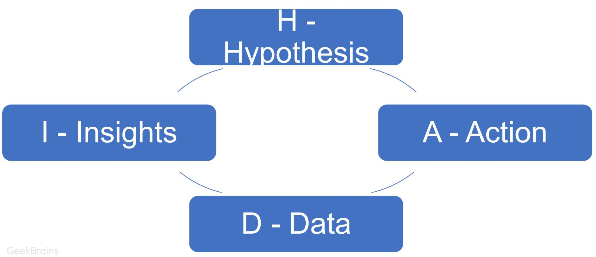

Урок 6. Разработка гипотезы

# 1. HADI

У меня крутая идея! А давайте сделаем!

А __ЗАЧЕМ__ мы это будем делать?

А что мы для этого __БУДЕМ ДЕЛАТЬ__?

А __СКОЛЬКО__ на выходе мы __ОЖИДАЕМ__?

А какой __ВЫВОД__ из всего этого?

# HADI циклы

H – Гипотеза (Hypothesis) – этап генерации гипотез.

A – Действие (Action) – этап реализации гипотез. 

D – Аналитика (Data) – этап сбора данных и подведение аналитики за наблюдаемый период.

I – Выводы (Insight) – этап интерпретации, подведения итогов – сработала ли гипотеза? 

# Hypothesis (Гипотеза)

Общий шаблон формулировки

ЕСЛИ мы сделаем (описываете действие), 

ТО произойдет (описываете ожидаемый результат в цифрах)

Hypothesis – Формулировка гипотезы

## User story:
+ Как _[тип пользователя]_,
+ я хочу _[сделать то-то и то-то]_, 
+ таким образом я смогу _[получить такую то выгоду]_

## Job story:
+ Когда _[ситуация и контекст]_, 
+ пользователь хочет _[его мотивация]_, 
+ и может _[получить выгоду]_,
+ а мы хотим _[это мы хотим чтобы пользователь сделал]_

## Мs верим, в _[то, во что верим / на что хотим повлиять]_ и если мы  сделаем _[условие 1]_ и _[условие 2]_, то получим _формализованный результат]_ за _[срок]_.

## Гипотезы формируются в формате SMART:

S – Specific: конкретность, ясность

M – Measurable: измеримость

A – Achievable: достижимость

R – Relevant: согласованность, своевременность, важность

T – Timebound: определенность по срокам

## Гипотеза про реальный мир – только факты!

Мнения, метод экспертных оценок и галлюцинации убираем

## Логическая связь результата эксперимента и конечной цели - желательна, но не всегда достижима

## Hypothesis – Дополнительные проверки?

1. Если вы читаете гипотезу, и она вам кажется элементарной, значит она сформулирована верно и ее не нужно уточнять.
2. Если вы не уверены в каком-то из условий, то его проверка должна превратиться в гипотезу.
3. Процесс уточнения гипотезы может пройти несколько циклов.
4. Необходимо также проверить, что проверку можно упростить и\или ускорить.

# Идея <> Гипотеза
# Гипотеза = оформленная идея

## Hypothesis – Истоxники идей и гипотез

Генераwиz гипотез на основе:
- Оценка bottle neck (горлышко бутылки) – узких мест продукта
- Оценка тепловых карт/eye tracking/фокус группы и тд
- Оценка логов Click Stream (логов приложения) на SQL/Python/ML 
- Оценка конкурентов/рынка/бенчмарки
- Опросы клиентов/ работа в «полях»
- Экспертные оценки (Фаундер, CЕО, Лидеры мнений)
- Стратегия, RoadMap

# У меня крутая идея! А давайте сделаем!

## Вводная информация: на рынке продажи авто, по статистике более 50% покупают в кредит.

## Пример Hypothesis
Мы верим, что клиенты, которым дорого сразу оплатить авто, готовы покупать его в кредит, и если мы прозвоним 20 лидов и предложим акцию с 0% по кредиту и расскажем об экономии,
то 8 из них возьмут контакт банка (для рассрочки)

# Action - Действие

## Нужно ответить на вопросы:
1. Каким образом будем проверять?
2. Записываем четкие шаги фактически проводимого эксперимента
3. Какие данные будем собирать?

## Action – Приоритезируйте гипотезы
- RICE (Reach, Impact, Confidence, Effort)
- ICE (Impact, Confidence, Easy)
- … 

Общее правило: 

VALUE \ TIME

## ICE = Impact * Confidence * Easy
### Impact - ВЛИЯНИЕ (от 0 до 10)
Насколько ваша гипотеза положительно повлияет на ключевой показатель, который вы пытаетесь улучшить. (деньги, ключевые метрики и т.д.)
### Easy - ЛЕГКОСТЬ РЕАЛИЗАЦИИ (от 0 до 10)
Простота реализации. Это оценка того, сколько усилий и ресурсов требуется для реализации этой гипотезы
### Confidence - УВЕРЕННОСТЬ (от 0 до 10)
Насколько вы уверены в оценках влияния и легкости реализации гипотезы

## RICE = (Reach * Impact * Confidence) / Effort
### Reach - ОХВАТ
Какое количество людей, денег и т.д. охватит данная гипотеза
### Impact - ВЛИЯНИЕ (от 0 до 10)
Насколько ваша гипотеза положительно повлияет на ключевой показатель, который вы пытаетесь улучшить. (деньги, ключевые метрики и т.д.)
### Confidence - УВЕРЕННОСТЬ (от 0 до 10)
Насколько вы уверены в оценках влияния и легкости реализации гипотезы
### Effort - ТРУДОЗАТРАТЫ
Затраты на реализацию гипотезы (деньги, время и т.д.)

## Система скоринга на ваш вкус ...
### СЛОЖНОСТЬ (от 1 до 5)
Сложность реализации 
### ВЕРА В УСПЕХ (от 0 до 100%)
Насколько вы верите в успешность данной гипотезы
### ЭФФЕКТ (в $, в ключевой метрике)
Сколько гипотеза может принести 
### Hypothesis Score = (Эффект / Сложность) * Вера в успех

# Data - Аналитика
## Проверка:
__Эти данные точно от этого эксперимента?__
1. Данные нужно __снять в полном плановом объеме__
2. __Иногда нужно время__, чтобы накопить
3. __Время__ должно быть __строго конечно__
4. _Блокировка:_ __запрет других экспериментов на этих данных__

## Пример Data
### Эффект:
- Примерный рост +400 заказов в месяц 
### Измерения:
- Конверсия всей платформы выросла до 7%
- Конверсия каждого этапа воронки - вырос лишь этап прихода к дилеру

# Insights - Выводы
1. Развернутый результат эксперимента
    - Цифры
    - Гипотеза подтвердилась / опровергнута
    - Допущенные ошибки
2. Развернутый вывод + дальнейшие шаги
    - Как можем применить на практике полученные знания?
    - Что нужно улучшить?
    - Какие новые гипотезы можем сформулировать для дальнейшего исследования?

## Insights - Выводы
+ ### Гипотеза ОПРОВЕРГНУТА - берем следующую!
   - Надо ли изменить условия?
   - Может некорректный эксперимент?
   - Эффект не возник или возник частично?
+ ### Гипотеза - ПОДТВЕРДИЛАСЬ
   - Мы точно исключили внешние факторы?
   - Мы сможем это воспроизвести снова?
   - Мы можем превратить это в регулярный процесс? Как?

## Пример Insights

Из-за плохого экрана списка моделей был сниженный CR в заявку. Это было вызвано тем, что не отображались картинки. 

Изменения этого экрана привело к росту всей платформы в 7 раз 
(конверсия с 1 до 7%).

Дальнейшие шаги будут косметические – не принесут сильного 
эффекта

## Далее
1. Оцените полученные результаты и ответьте на следующие вопросы:
    - Чему вы научились в ходе эксперимента?
    - Как вы можете применить на практике полученные знания?
    - Что нужно улучшить?
    - Какие новые гипотезы можем сформулировать для дальнейшего исследования?
2. Сформулируйте выводы по результатам проведенного эксперимента и фиксируйте описание дальнейших шагов. 
3. Перезапускайте цикл с новыми гипотезами

## Все масштабируем только ПОСЛЕ проверки гипотез !!!

## НЕ ВСЁ гипотезы, есть и ЗАДАЧИ !!!
## Задача = ты знаешь как это работает
## Гипотеза - ты не можешь этим управлять, можешь только получать отклик

# Сколько стоят придуманные вами решения?
## Зная, что 9 из 10 гипотез, обычно, не дают никакого эффекта?

## Любая гипотеза - это либо ФОТ, либо расходы на подрядчика

# Длā чего нужны HADI циклы?
- Формирование Data Driven культуры
- Масштабировать в бизнесе только то, что имеет максимальную 
ценность!
- Объективизация принятия решений
- Планирование и приоритизация работы команды
- Оценка развития продукта

# Объективизация принятия решений

В любой момент времени у команды продукта есть:
- 100 идей от сотрудников/партнеров/рынка/клиентов
- 500 нерешенных проблем
- 300 интересных фичей «как у конкурента»
В один спринт(2 недели) можно взять ~4 задачи * 24 спринта в год = 96 задач в год(в идеальном мире).

Какие задачи брать сейчас? Какие потом? Какие не брать никогда? 

## Какую задачу взять, если:
1. Продакт менеджер хочет делать оптимизация корзины
2. UX специалист говорит, что нужно починить визуализация элементов и иконок в приложении 
3. Директор по продукту говорит, что нужно добавить чаевые в приложение 

???

Послушать аналитика и сделать то, что приносит больше всего убытков (потерянной прибыли) в данный момент критичнее всего.

# Практическое задание

Сформулируйте 2 простые и 2 сложные гипотезы по нашему пилотному проекту.

Простая - это, например, прямые заходы чаще всего будут последним переходом в цепочке.

Сложная - это, например, мы не сможем отключить источники трафика, которые не участвуют в конверсионных цепочках без понижения количества конверсий.

# Что почитать?
HADI в стартапе https://www.carrotquest.io/blog/kejs-kak-uskorit-razvitie-proekta/

Про HADI https://leadstartup.ru/db/hadi

Успешный успех с HADI https://habr.com/ru/company/friifond/blog/338240/

5 лайфхаков HADI: https://www.iidf.ru/media/articles/lifehacks/hadi-tsikly-5-layfkhakov/

ICE vs RICE : https://habr.com/ru/company/hygger/blog/422131

# Посмотреть сериал: Битва за Uber

