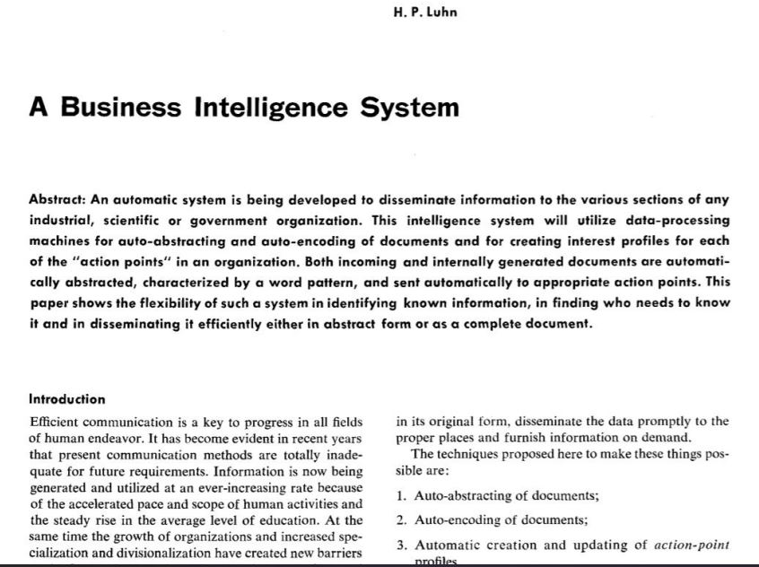
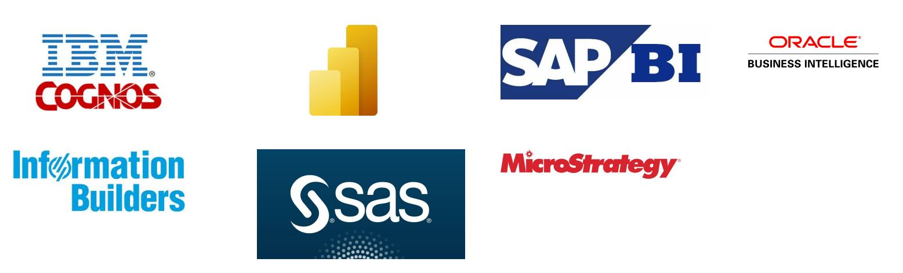
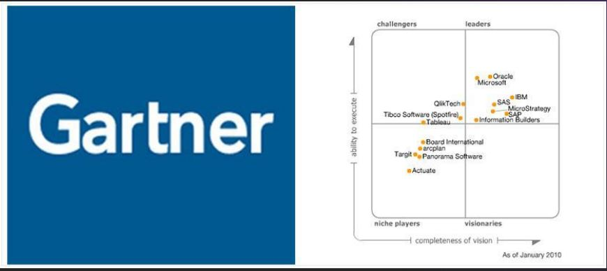
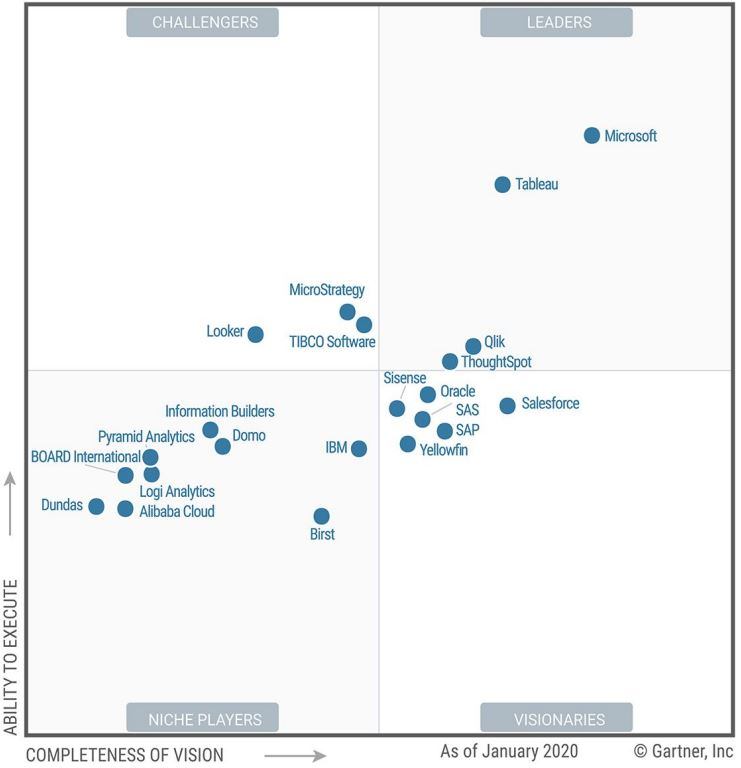
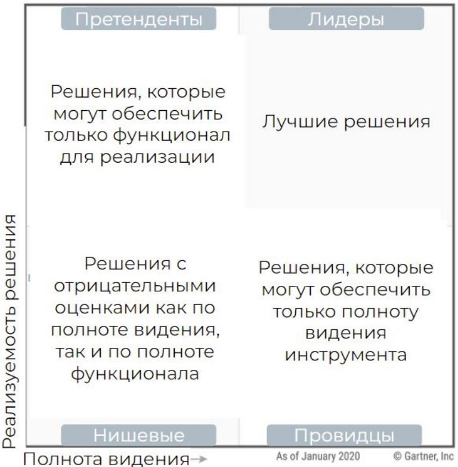
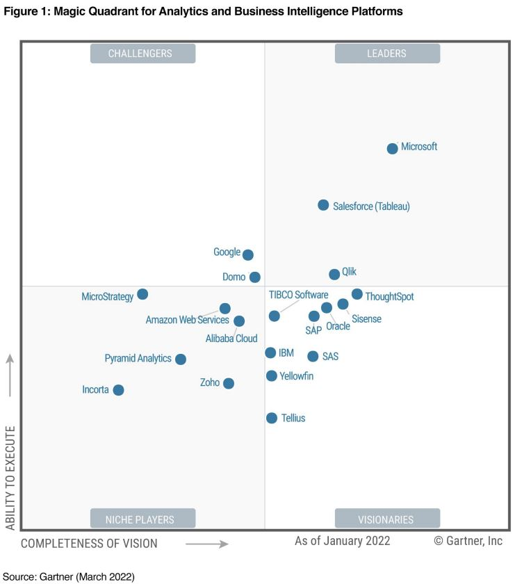
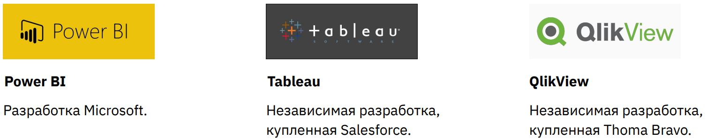
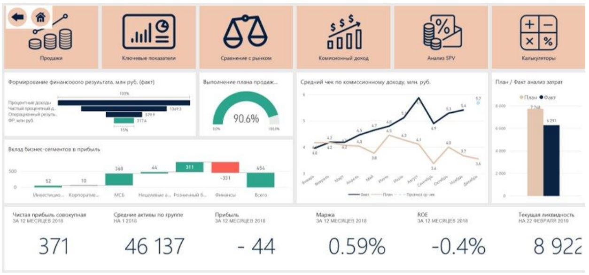
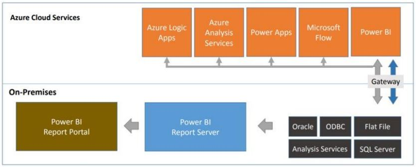

Урок 7. Какие есть решения на рынке BI

# На этом уроке
+ Рынок и история BI
+ Позиция Power BI на рынке
+ Версии Power BI
+ Power Query

## Что такое BI и в чем его миссия?

Если просто, то BI - это Excel + Power Point в одном инструменте, где есть больше возможностей, чем в самих Excel и Power Point.

Если более научно, то BI - это автоматизация аналитических процессов для презентации данных в красивой форме.

BI расшифровывается как Business Intelligence и не переводится на русский. В проф сообществе так и говорят “биай”

# Миссия BI

Миссия BI заключается в том, чтобы обеспечить организацию оперативными данными для помощи в принятии управленческих решений.

BI делает решения более понятными и объективными. Помогает принимать их быстрее, что сверхважно для любой современной организации.

Например в BI можно настроить push уведомления на ответственного сотрудника при наступлении какого-то события, чтобы он отреагировал на ситуацию сразу, а не после совещания.

# История возникновения BI систем

Ганс Питер Лун — сотрудник IBM, одного из первых IT-гигантов. Часто его называют «отцом Business intelligence»

В 1958 году он написал статью «A Business Intelligence System»

В статье даётся определение BI:

«An automatic system… developed to disseminate information to the various sections of any industrial, scientific, or government organization»

«Это автоматизированная система, разработанная с целью распределения информации различных направлений деятельности любой индустриальной, научной или государственной организаций»

Аналитик Gartner Ховард Дреснер даёт близкое к современному определение систем BI: «концепты и методы, позволяющие улучшать процесс принятия бизнес - решений, благодаря использованию систем, помогающих преобразовать данные в факты»

2000-е

Активное появление решений по BI от различных компаний. Как независимых, так и крупных: Oracle, IBM, Microsoft

Появление квадранта Gartner, который оценивает уровень развития BI-систем на рубеже нулевых и десятых годов можно считать символической точкой развития BI систем в современном виде.

Gartner выпускает наиболее популярную классификацию BI систем.

# Какие есть BI инструменты и как определить уровень их развития

Основной рейтинг BI инструментов выпускает компания Gartner

+ Международная исследовательская компания
+ Специализируется на рынке IT
+ Основана в 1979 году
+ Выпускает регулярные «рейтинги» IT-систем, в том числе и BI
+ Рейтинги составляются в виде магического квадранта
+ В 2009 году выиграла судебный иск по поводу легитимности магических квадрантов
+ Все лидеры делают прессрелизы по факту выхода нового квадранта

## 2020 год 

## Как оценивается:

## Полнота видения
+ Насколько решение соответствует потребностям рынка?
+ Какова стратегия продвижения системы?
+ Как выстраивается стратегия продаж и ценообразования? 
+ Как развивается продукт? Применяются ли инновационные технологии? 
+ Соответствует ли решение задачам предприятий разного масштаба? 
+ Есть ли особенность географической стратегии и планы по развитию в других странах?

## Реализуемость решения

+ Насколько просто и удобно интегрировать систему в рабочий процесс? 
+ Что отличает платформу от конкурентов? 
+ Соответствуют ли решения практическим задачам пользователей?
+ Продукт оперативно реагирует на тенденции рынка? 
+ Им комфортно пользоваться?
+ Легко ли его обновлять?
+ Какие особенности есть у техподдержки?
+ Что говорят пользователи? 

# Лидеры рынка (большая тройка)

# Power BI

+ Разработка Microsoft
+ Лидер квадранта Gartner последних лет
+ Активно развивается с 2015 года
+ Хорошо интегрируется с другими программами Microsoft
+ Языки: DAX, Power Query, R, Python

# Tableau

+ Независимая разработка
+ Близко к Power BI в квадранте Gartner все последние годы
+ Исторический лидер до развития Power BI
+ Компании, которые давно внедрили BI, часто до сих пор работают в Tableau
+ В 2019 году куплена Salesforce

# QlikView

+ Независимая разработка
+ Индивидуальный язык работы с данными
+ Enterprise-решение
+ Падает в рейтинге квадранта Gartner
+ Куплена Tomas Bravo

# Версии Power BI

Базовые версии
1. Power BI Desktop – основной инструмент для разработки
2. Power BI Pro – самый доступный и простой инструмент для работы в команде

Продвинутые версии
1. Power BI Embedded
2. Power BI Premium
3. Power BI On Premise

# Power BI Desktop

+ Бесплатная программа
+ Основной инструмент для работы и создания отчётов
+ Нужна для первоначальной разработки отчётов
+ Постоянно обновляется, нужно отслеживать обновления на сайте Microsoft

# Power BI Pro

+ Облачный продукт
+ Продаётся по подписке
+ Стоит порядка 1000 рублей в месяц
+ Входит в Office 365 версии E5
+ Подходит для совместной разработки
+ Позволяет делиться отчётами
+ Одной лицензии достаточно, чтобы делиться отчётом через прямую ссылку

# Power BI Embedded

+ Продаётся по подписке
+ Является приложением внутри облачного продукта Azure
+ Позволяет встроить целое приложение Power BI в портал или сайт
+ Даёт дополнительные возможности для веб-разработки поверх BI
+ Минимальная стоимость в год — порядка 500 000 рублей
+ Стоимость зависит от плотности использования: платим за действие

# Power BI Embedded. Пример

# Power BI Premium

+ Продаётся по подписке
+ Стоит порядка 5 000 $ в месяц
+ В дополнение к BI даёт дополнительные серверные мощности
+ Подходит для Enterprise-компаний с высокой нагрузкой на BI-систему
+ Передовой продукт Microsoft

# Power BI on Premise

+ Продаётся по подписке
+ Не облачный продукт
+ Подходит для компаний, которые не хотят выкладывать данные в облако

# Power BI on Premise

## Облачные версии
1. Серверные мощности могут увеличиваться под задачи
2. Обновляется каждый месяц
3. Есть кастомные визуализаций, R визуализаций и ArcGIS maps

## On Premise версии
1. Серверные мощности зависят от внутренних возможностей
2. Обновляется несколько раз в год
3. Нет кастомных визуализаций, R визуализаций и ArcGIS maps

# Power BI Mobile

+ Мобильное приложение
+ Продукт, дополняющий одну из основных версий
+ Отчёты для мобильных устройств нужно создавать отдельно от десктопной
+ Бесплатный продукт

# Практическое задание

Скачайте Power BI Desktop по ссылке: 
https://powerbi.microsoft.com/ru-ru/downloads/

