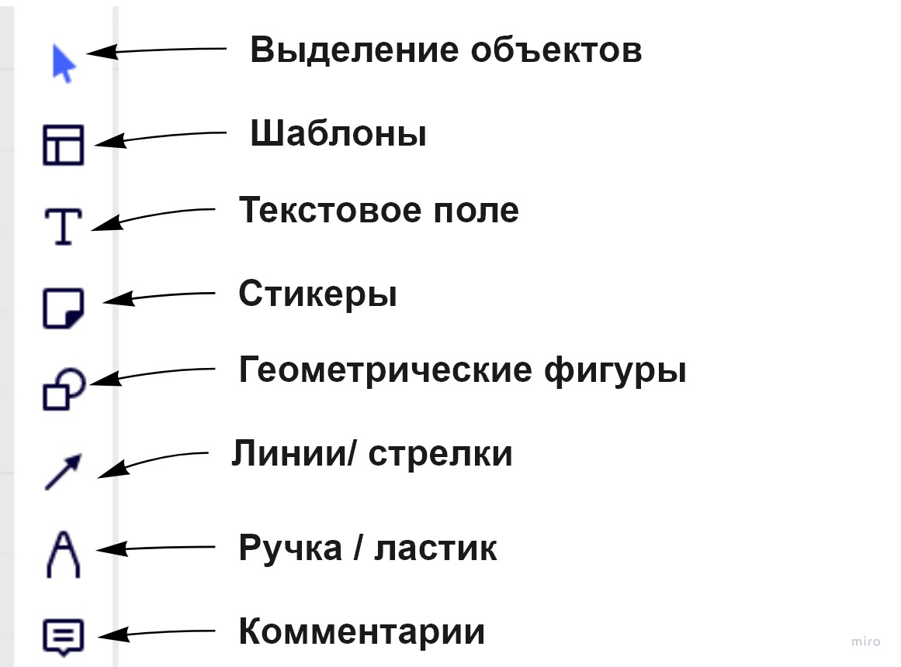
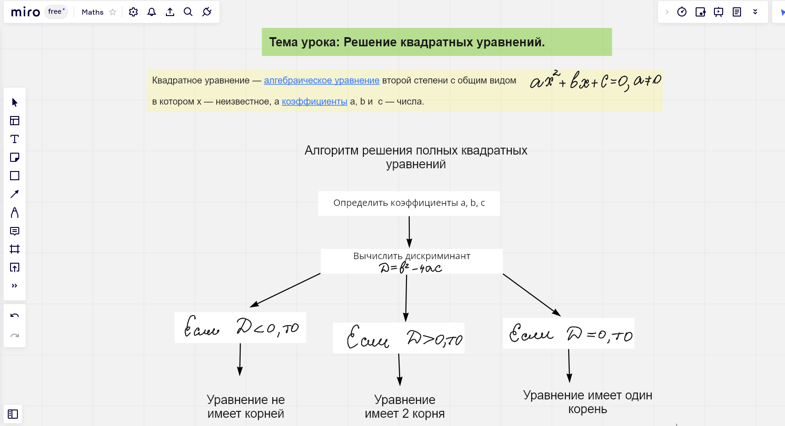
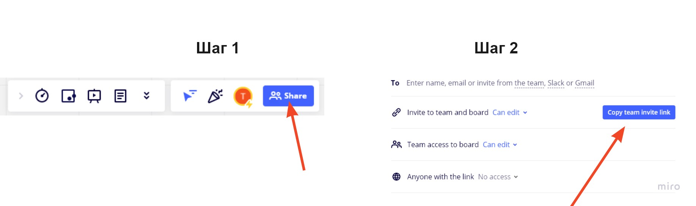
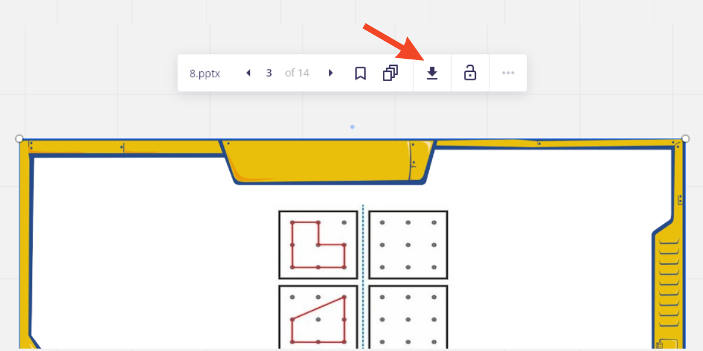
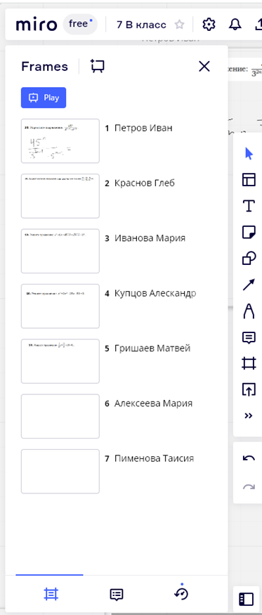
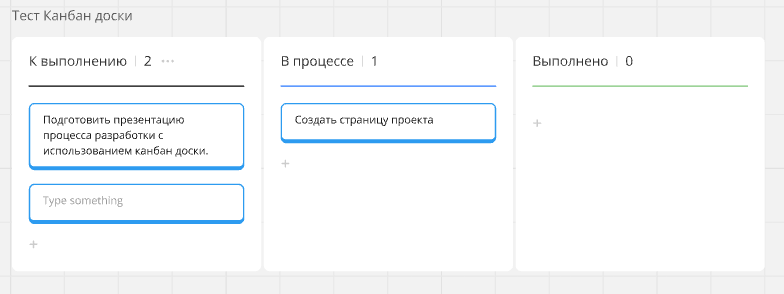

# Применение онлайн-доски Miro.com при обучении математике

## Содержание

+ [1. Введение](#1-введение)
  + [1.1 Вступительное слово](#11-вступительное-слово)
  + [1.2 Краткая инструкция по курсу](#12-краткая-инструкция-по-курсу)
+ [2. Регистрация на Miro.com](#2-регистрация-на-mirocom)
+ [3. Основной набор инструментов Miro](#3-основной-набор-инструментов-miro)
+ [4. Добавление пользователей](#4-добавление-пользователей)
+ [5. Наполнение доски. Загрузка файлов, интеграция](#5-наполнение-доски-загрузка-файлов-интеграция)
  + [5.1 Загрузка изображений](#51-загрузка-изображений)
  + [5.2 Загрузка текстовых документов, таблиц, презентаций](#52-загрузка-текстовых-документов-таблиц-презентаций)
  + [5.3 Инструмент Frame. Деление рабочего поля, создание презентаций](#53-инструмент-frame-деление-рабочего-поля-создание-презентаций)
  + [5.4 Интеграция с Google Drive](#54-интеграция-с-google-drive)
  + [5.5 Загрузка заданий с LearningApps.org и YouTube](#55-загрузка-заданий-с-learningappsorg-и-youtube)
  + [5.6 Создание диаграмм, назначение заданий, Kanban](#56-создание-диаграмм-назначение-заданий-kanban)
+ [6. Экспорт материалов (Сохранение материалов занятия)](#6-экспорт-материалов-сохранение-материалов-занятия)
+ [7. Практика использования Miro.com (Проведение индивидуального занятия по математике.)](#7-практика-использования-mirocom-проведение-индивидуального-занятия-по-математике)
+ [8. Итоговый проект](#8-итоговый-проект)

## 1. Введение

### 1.1 Вступительное слово

В настоящее время в учебном процессе активно используются компьютерные технологии. Зимой 2020-го года эпидемия новой коронавирусной инфекции (covid-2019) стала причиной перевода учебного процесса на разных уровнях образования в дистанционный формат.

Большое разнообразие приложений для организации видеоконференций (Skype, Zoom, и др.) позволили сделать это относительно безболезненно. Однако, для успешного проведения онлайн-занятий, необходимо использовать не только видеосвязь, но и специальный инструмент – аналог маркерной или меловой доски, на котором можно было бы писать, рисовать, размещать разнообразные типы учебных материалов, в том числе и работая совместно с учениками. Таким инструментом является онлайн-доска, которая представляет собой специальный онлайн-сервис, на котором все пользователи могут собраться в едином рабочем пространстве.

Ссылка на онлайн-доску [Miro.com](https://miro.com/index/)

Использовать Miro можно разными способами:

+ **Интерактивный учебник** – добавляйте обучающие материалы на доску, управляйте вниманием учеников, перемещайтесь по страницам и схемам вместе с группой.
+ **Обучающий вебинар** – составьте план работы, добавьте полезные материалы, проведите совместную встречу, а после подведите итоги и разошлите их всем участникам.
+ **Групповая работа** – научите учащихся работать в команде, разделять обязанности, ставить цели и задачи, следите за их активностью и взаимодействием, добавляйте свои комментарии и направляйте их.
+ **Уникальный проект** – подключите фантазию и реализуйте все свои замыслы, чтобы наиболее эффективно донести информацию до аудитории.

*Примечание:* В данном курсе рассмотрены возможности Miro на основе бесплатного тарифа.

---
[Содержание](#содержание)

### 1.2 Краткая инструкция по курсу

Последовательность прохождения курса регулируется студентом.

1. Знакомство с Miro.com с нуля. Желательно проходить модули по заданной очередности.
2. Пользователь с аккаунтом (но без опыта использования). Приступать можно с модуля 3, пропустив регистрацию.
3. Постоянный пользователь платформы Miro.com. Прохождение определенных модулей по вашему усмотрению.

*Примечание.* Задания для самостоятельной работы выполняются по усмотрению студента. Но как говорится: "Скажи мне — и я забуду, покажи мне — и я запомню, дай мне сделать — и я пойму.".

*Совет.* Выполняйте все задания из курса на одной доске (возможно, по одной теме). Это позволит вам в результате получить полноценный проект, с применением всех изученных инструментов.

---
[Содержание](#содержание)

## 2. Регистрация на Miro.com

[]

Для работы на онлайн-доске Miro.com необходима регистрация преподавателя и студентов (учеников).

Создание аккаунта может быть выполнено двумя способами:

1. Регистрация аккаунта по почте.
2. Вход через аккаунты: Google, Slack, Microsoft, Apple ID.

**Задание для самостоятельной работы.**

1. Выполнить регистрацию на онлайн доске Miro.com URL: [Miro.com](https://miro.com/index/)
2. Создать доску, дать название.
3. Установить управление масштабом с помощью мыши.

---
[Содержание](#содержание)

## 3. Основной набор инструментов Miro

Основной набор инструментов для рисования и записей пригодится на каждом занятии, в него включены

+ текстовое поле,
+ ручка,
+ геометрические фигуры,
+ маркер для выделения, а также
+ стикеры и
+ комментарии для оценки работ обучающихся или групповых обсуждений.

Это даёт возможность конспектировать материал, выделять основные мысли, которые обучающиеся должны фиксировать в тетрадях. В данном случае не требуется дополнительных заготовок к уроку, всё выполняется в режиме реального времени.

[Video](../Miro/Videos/3_Основнои_набор_инструментов_Stepik.mp4)

**Задание для самостоятельной работы.**

Используя основной набор инструментов, подготовить конспект к занятию.

*Примечание.* Лучше всего подготовить конспект, который может быть использован в практике. Поэтому темы будут индивидуальны.

Пример оформления конспекта.

---
[Содержание](#содержание)

## 4. Добавление пользователей

Пользователи (обучающиеся ) могут присоединиться к доске по ссылке. Для этого им необходимо пройти регистрацию.

Этапы получения ссылки.

Настройки прав доступа позволяют выбирать один из вариантов:

1. Возможность просмотра
2. Возможность комментирования
3. Возможность редактирования
4. Отсутствие возможностей

[Video](../Miro/Videos/4_Добавление_пользователеи_Stepik.mp4)

**Задание для самостоятельной работы.**

1. Отправить пользователям ссылку на подключение к доске. (Примечание: для тренировки вы можете выполнить вход самостоятельно с разных устройств, либо поработать вместе с коллегами).
2. Отправить 4 возможных ссылки (по правам доступа). Посмотреть, как видит доску ученик.
3. Протестировать функцию отслеживания ученика на доске.

---
[Содержание](#содержание)

## 5. Наполнение доски. Загрузка файлов, интеграция

### 5.1 Загрузка изображений

На мой взгляд, большим преимуществом онлайн-доски Miro.com является возможность загрузки файлов различных форматов.

Данная платформа предоставляет несколько вариантов загрузки изображений, что значительно экономит время при проведении занятий.

[Video](../Miro/Videos/5_1_Загрузка_изображении_Stepik.mp4)

**Задание для самостоятельной работы.**

*Примечание.* Как вы могли заметить, задания транслируют материал, предложенный в видео-уроке. Поэтому выполнение заданий может осуществляться параллельно просмотру.

1. Загрузить изображение из браузера ( Ctrl+C-> Ctrl+V)
2. Загрузить изображение с устройства, сохранить его в папке на доске Saved files.
3. Создать стикер настроения или оценок и прикрепить картинки из предложенных библиотек.

---
[Содержание](#содержание)

### 5.2 Загрузка текстовых документов, таблиц, презентаций

[Video](../Miro/Videos/5_2_Загрузка_текстовых_документов_таблиц_презентации_Stepik.mp4)

*Примечание.* Все файлы с доски можно скачивать на устройство, если это необходимо. Для этого нужно выбрать файл и нажать клавишу скачивания.

**Задание для самостоятельной работы.**

1. Загрузить на доску текстовый файл, электронную таблицу, презентацию.
2. Вставить содержание электронной таблицы с помощью стикеров.
3. Оставить ссылку на полезный ресурс.

---
[Содержание](#содержание)

### 5.3 Инструмент Frame. Деление рабочего поля, создание презентаций

+ Как создавать интерактивные учебники на Miro.com?
+ Как создавать презентации на Miro.com?
+ Как разделить большое поле доски на части, чтобы структурировать информацию?
+ Как проводить групповые самостоятельные работы, чтобы обучающиеся не списывали?
+ В решении данных вопросов Мы будем использовать инструмент **Frame**, что в переводе означает **рамка**.

[Video](../Miro/Videos/5_3_Инструмент_Frame_Деление_рабочего_поля_создание_презентации.mp4)

**Задание для самостоятельной работы.**

+ Создать на доске Miro.com 7 рамок с помощью инструмента Frame.
+ Назвать каждую рамку фамилией и именем обучающегося, прикрепить задания для индивидуальной работы.
+ Каждый Frame расположить на большом расстоянии друг от друга (без возможности списывания).
+ Потренироваться переключаться между слайдами и отслеживать местоположение пользователей (для этого необходимо подключить их к доске).
+ Оставить комментарий к двум рамкам.

*Пример.*

---
[Содержание](#содержание)

### 5.4 Интеграция с Google Drive

Интеграция Miro.com с Google Drive позволяет изменять информацию файлов в едином рабочем пространстве и автоматически обрабатывать и сохранять все изменения.

Miro предлагает средство выбора документов Диска в приложении и возможность редактирования прям в Miro.

В бесплатном тарифе поддерживаются: Google Документы (с возможностью перелистывания на доске),  Google Таблицы, Google Презентации.  

[Video](../Miro/Videos/5_4_Интеграция_с_Google_Drive_Stepik.mp4)

**Задание для самостоятельной работы.**

1. Интегрировать Google Диск в Вашем аккаунте Miro.com.
2. Прикрепить на доске по одному из возможных файлов Диска: текстовый документ; таблицу; презентацию.
3. Внести изменения в Google файлы с доски Miro.

---
[Содержание](#содержание)

### 5.5 Загрузка заданий с LearningApps.org и YouTube

На сегодняшний день уроки математики (собственно, как и другие дисциплины) не обходятся без интерактивного сопровождения: задания, аудио и видео-материалы.

Возможности онлайн-доски позволяют просматривать видео с YouTube. А также прикреплять интерактивные задания с Learning.Apps.org, выполнение которых осуществляется также на Miro.

Это позволяет экономить время на занятиях, нет необходимости переходить по ссылкам.

Примечание. Как создавать задания для класса и проверять выполнение работы на платформе LearningApps.org.

URL: [Дидактор](http://didaktor.ru/kak-otslezhivat-rabotu-uchenikov-v-learningapps/)

[Video](../Miro/Videos/5_5_Загрузка_задании_с_LearningApps_org_и_YouTube_Stepik.mp4)

Задание для самостоятельной работы.

1. К конспекту, созданному в модуле 3 добавьте видео с YouTube. (Если конспекты не сохранились, то просто прикрепите видео на доске).
2. Также прикрепите задание с платформы LearningApps.org, подходящее по теме занятия.

*Примечание.* Вы можете создать своё задание на LearningApps.org или воспользоваться каталогом заданий.

Не забывайте про инструмент Frame.

---
[Содержание](#содержание)

### 5.6 Создание диаграмм, назначение заданий, Kanban

В данном видео будут рассмотрены несколько дополнительных инструментов, которые могут использованы в образовательном процессе.

1. Создание диаграмм: круговая, столбчатая и др. Редактировать их можно на доске.
2. Назначение заданий каждому ученику с указанием срока выполнения.
3. Создание Kanban доски, которая может быть использована при подготовки проектов.

[Video](../Miro/Videos/5_6_Создание_диаграмм_назначение_задании_Kanban_Stepik.mp4)

---
[Содержание](#содержание)

## 6. Экспорт материалов (Сохранение материалов занятия)

Бесплатный тариф позволяет сохранять результаты записей в нескольких различных форматах:

1. В виде картинки. JPG
2. В PDF формате.
3. Формат CSV (содержимое в столбце в порядке: текст-описание-карты-URL-теги).
4. Ссылка доски в Google Диске.

[Video](../Miro/Videos/6_Сохранение_материалов_занятия_Stepik.mp4)

**Задание для самостоятельной работы.**

Примечание. На Вашей доске есть записи с предыдущих заданий. Сохранять можно их.

Сохраните записи с доски в трёх форматах:

1. JPG
2. PDF
3. Ссылка на Google Диске

---
[Содержание](#содержание)

## 7. Практика использования Miro.com (Проведение индивидуального занятия по математике.)

Данный урок содержит небольшой фрагмент занятия по математике. По теме: "Построение графика линейной функции".

Какова цель видео?

Показать, как проводятся занятия на Miro.com без предварительных заготовок (только лишь учебные материалы, которые Мы итак готовим к каждому занятию).

Аналогичным образом могут проводиться лекции, мозговые штурмы, онлайн-встречи и тд. Главное, чтобы все участники были подключены к доске и могли воспользоваться загруженными материалами.

НАПОМИНАЮ. Что все результаты сохраняются, пользователи в любое время могут ими воспользоваться.

[Video](../Miro/Videos/7_Проведение_индивидуального_занятия_по_математике_Stepik.mp4)

---
[Содержание](#содержание)

## 8. Итоговый проект

Уважаемые студенты! В данном курсе вы познакомились с возможностями онлайн-доски Miro.com. Вашим итоговым проектом по курсу будет являться оформленная доска!

**Техническое задание.**

+ Оформление доски может быть подготовлено по любой теме (нескольким темам), которая может иметь практическое применение.
+ Проект должен включать в себя использование основного набора инструментов, Frame, наличие тестовых документов, изображений, презентаций.
+ На доске разместить минимум одно задание с LearningApps.org.
+ Сохранить материалы в папке Saved files.
+ Ссылку на оформленную доску прикрепить в ответе на задание.

Желаю удачи!

[Проба пера](https://miro.com/welcomeonboard/WHMxR29ocWNLMXkzV0E0cHJYU2xkbEl6QXhOdmIzQUdRbE9uUENBaTJQQUNiZHFCc1BHVDh5WUwwb0VEcUxFcXwzNDU4NzY0NTU4ODg2NDQyODQ0fDI=?share_link_id=685334424373)

Если вы заметили в курсе какие-то недочёты или проблемы, просьба сообщить об этом по [адресу](tanya.kozlova19751998@gmail.com). Также вы можете оставить информацию в отзыве или комментариях.

Также буду благодарна вашим отзывам по курсу, которые вы можете отправить на [почту](tanya.kozlova19751998@gmail.com).

Или оставить на данной платформе. Спасибо!
