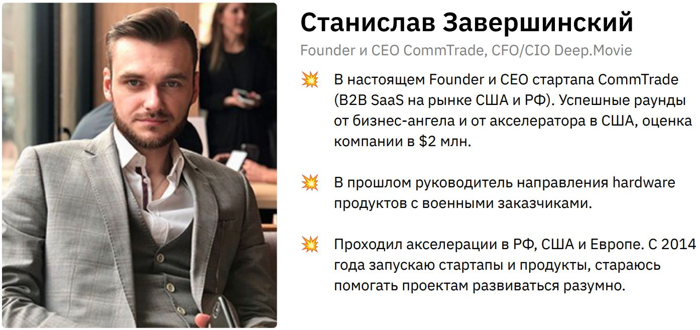
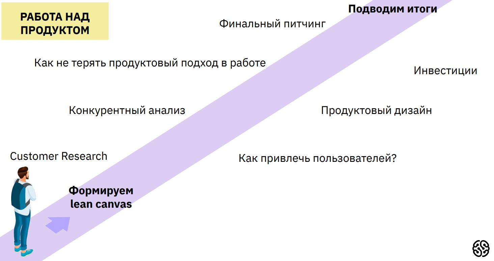
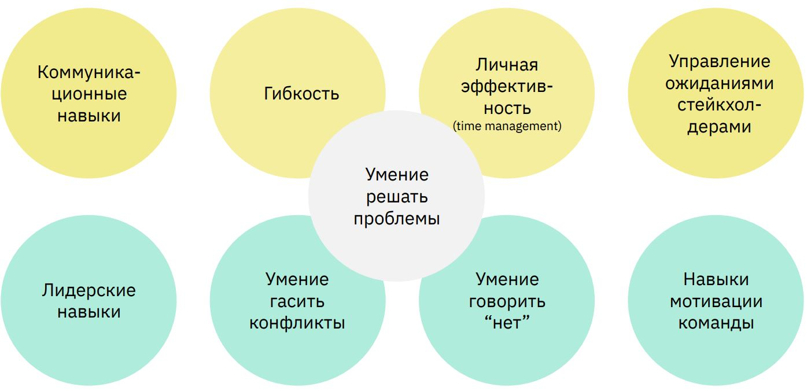
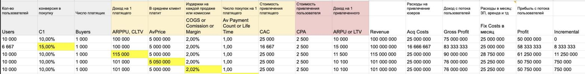
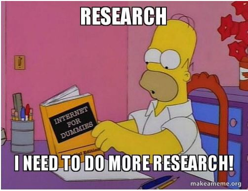
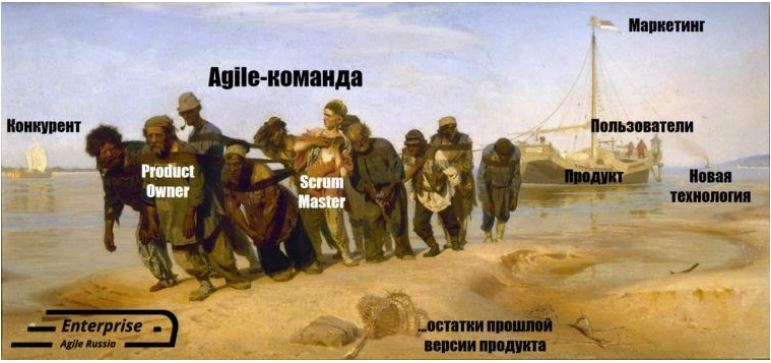

# Урок 2. Вводный урок: Определям верхнеуровневый план работ и зоны ответственности продакта и проджекта.

# Что мы будем делать и как работать?

+ 14/30 дней буткемпа
+ 1 час в день почти без выходных
+ Время вебинара всегда разное! Следите за расписанием!
+ Минимум необходимой теории - максимум практики
+ 2 преподавателя
+ 1 общий продукт

Полное погружение в разработку и запуск продукта с нуля!

# Для того, чтобы буткемп прошел продуктивно, вам нужно:
+ Внимательно смотреть все лекции, а еще лучше - 
участвовать в вебинарах, так вовлеченность в 
обучение выше,
+ Выполнять домашние задания - только так вы погрузитесь в специальность максимально,
+ Задавать вопросы в специально отведенное время

# Что такое продукт?

__товар или услуга__, которую можно предложить рынку, и которая:
+ будет удовлетворять потребности клиентов
+ будет достигать поставленные цели компании

Другие определения продукта:
+ Способ конкретной реализации нашей идеи и конкретный способ зарабатывать деньги (А. Морейнис).
+ Клиент х Бизнес х Технологии (Марти Кеган)
+ Все, что может быть полезно людям настолько, что они готовы за это заплатить (Аноним)

# Какой продукт мы будем делать?

## Продукт:
Разрабатываем и запускаем курс-bootcamp для молодых продактов и проджектов "Как создать продукт за 30 дней и 30 ночей"

## Гипотеза: 
У молодых IT-специалистов будет востребован короткий курс в формате марафона, на котором по шагам ежедневно будет создаваться продукт и освещаться методы и инструментарий запуска продуктов.

# Soft Skills

# Hard skills

## Работа с пользователями
+ CustDev
+ Customer Journey Map
## Понимание рынка и продукта
+ Определение объема рынка (TAM, SAM, SOM)
+ Определение стратегии выхода на рынок (ADL-матрица, 5 сил Портера, SWOT-анализ, PEST-анализ)
+ Определение бизнес-модели продукта (Lean Canvas, Business Model Canvas, Value Proposition) 
## Работа с метриками
+ Работа с системами аналитики (Я.Метрика, Google Analytics, мобильная аналитика)
+ Проведение A/B-тестов 
+ Расчет unit-экономики
## Выстраивание процессов разработки
+ Управление разработкой: Scrum, Kanban
+ Фреймворки приоритизации продуктовых задач
+ Формирование роуд мапа продукта

# Product development -
(разработка нового продукта) процесс создания и вывода нового продукта (товара или услуги) на рынок

Что включает в себя Product Development:
+ Изменения в существующий продукт
+ Полная переработка продукта
+ Расширение продуктовой линейки
+ Новая продуктовая линейка
+ Новое позиционирование
+ Абсолютно новый продукт

# Этапы Product development

# Генерация и проверка гипотез
Необходимо сформировать список гипотез и найти дешевые способы проверить их

## На какие вопросы надо ответить:
+ какая боль решается? Не могу позволить репетитора для ребенка так как дорого
+ кто ваш клиент? Женщины 35+ с детьми школьного возраста
+ какие каналы продвижение будут использоваться? Вк, Instagram, Facebook, реклама в лифте
+ кто ваши конкуренты? Обычные репетиторы
+ какое ваше конкурентное преимущество? Низкая цена

# Экономический анализ

Считаем экономику продукта, чтобы подтвердить ее жизнеспособность
+ Оцениваем объемы рынка вашего продукта, и потенциальную долю, которую планируется занять, таким образом мы оцениваем примерную выручку продукта
+ Считаем юнит-экономику продукта, чтобы на старте понимать, может ли продукт приносить прибыль

# Экономический анализ
TAM 1 млрд руб
SAM 100 млн руб
SOM 10 млн руб

# Запуск MVP-продукта Первая версия продукта

С помощью максимально простой реализации запускаем первую версию продукта

## Критерии запуска:
+ быстро (до месяца)
+ закрывает 1 боль
+ ограниченная аудитория
+ ограниченный ассортимент

## Цель: 
Продукт должен как можно быстрее столкнуться с реальностью. Столкновение с реальностью вызывает страх, но это лучший способ запуска продукта

# Как будем работать мы?

## Начнем с гипотезы и lean canvas:

Формируем lean canvas продукта "Буткемп" часть 1:

Сегменты потребителей, их проблемы и боли? Потребители, проблемы, решения, альтернативы, ранние последователи.

Формируем lean canvas продукта "Буткемп" часть 2: 

А что по ценностному предложению и нечестным преимуществам? Думаем о каналах продвижения и метриках. Финансы или определяемся с доходной и расходной частью.

## Продолжим исследованиями потенциальной аудитории:

_Customer Research:_ Определяем риски продукта, почему мы провалимся?
_Customer Research:_ Определяемся с моделями монетизации. Разбираем цели и стратегию нашего 
продукта и способы их достижения.
_Customer Research:_ Генерируем и приземляем гипотезы по продукту: Мультивселенные идей.
_Customer Research:_ Валидируем гипотезы (Количественные и качественные исследования)

# Подумаем над привлечением аудитории и посмотрим что там у конкурентов

_Как привлечь пользователей?_ Выбираем каналы продвижения для нашего продукта 
_Как привлечь пользователей?_ Юнит-экономика (часть 1)
_Как привлечь пользователей?_ Юнит-экономика (часть 2) Определяемся, какие каналы будут самыми эффективными, и в которые мы будем вкладываться
_Конкурентный анализ:_ Анализируем конкурентов и их буткемпы.

## Сделаем таки продукт:

_Продуктовый дизайн:_ Думаем над дизайном продукта. CJM

_Продуктовый дизайн:_ Финализируем идеи для дизайна и делаем набросок

Выходной у 30 дневного, у 14 дневного подведение итогов

_Zero-code или создаем сайт для буткемпа своими руками_ 

    (часть 1: Выбираем инструмент)

_Zero-code или создаем сайт для буткемпа своими руками_ 

    (часть 2: Тильда - я у мамы фронтендер)

## Поговорим о работе и её методах:

+ ТРИЗ / АРИП
+ GIST /Impact / Road Planning
+ Servant Leadership
+ Метод Канбан
+ Scrum фреймворк
+ Инструменты фасилитации /Обратная связь
+ Модель культур Шнейдера / OKR / Workplace Learning
+ Кайдзен / Теория ограничений и развития систем

## Подумаем где достать инвестиции и как рассказать о нашем продукте:

### Инвестиции: 
Как привлечь инвестиции на развитие нашего продукта? (часть 1 - Сколько?)
### Инвестиции: 
Как привлечь инвестиции на развитие нашего продукта? (часть 2 - Как?)
### Финальный питчинг: Что рассказываем о продукте?
### Разговор с продактом: "Перспективы профессии"

## А что будет дальше?
ДЕНЬ 2: Формируем lean canvas продукта "Буткемп" часть 1:

Сегменты потребителей, их проблемы и боли? Потребители,проблемы, решения, альтернативы, ранние последователи.

Домашнее задание: Подготовить Lean Canvas в части потребителей, проблем, решений, альтернатив
