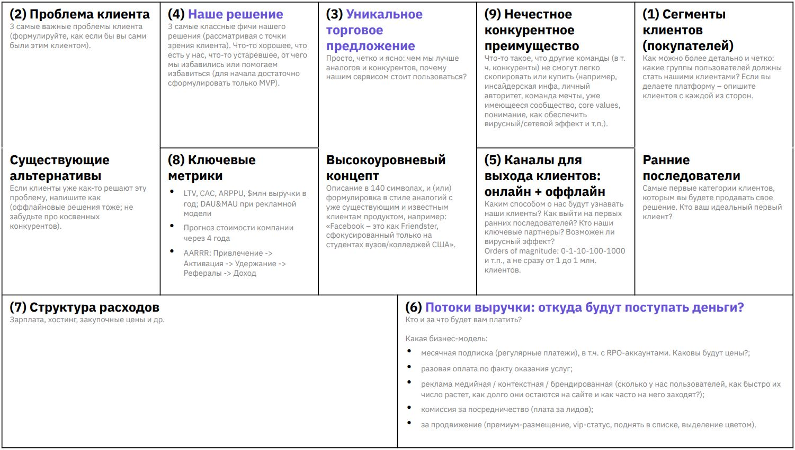
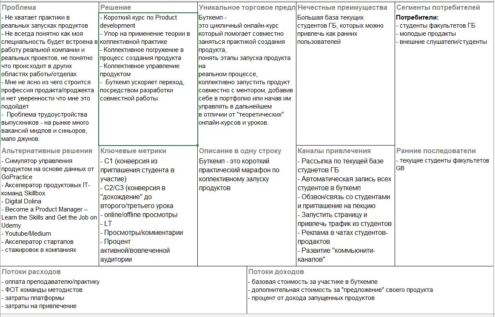
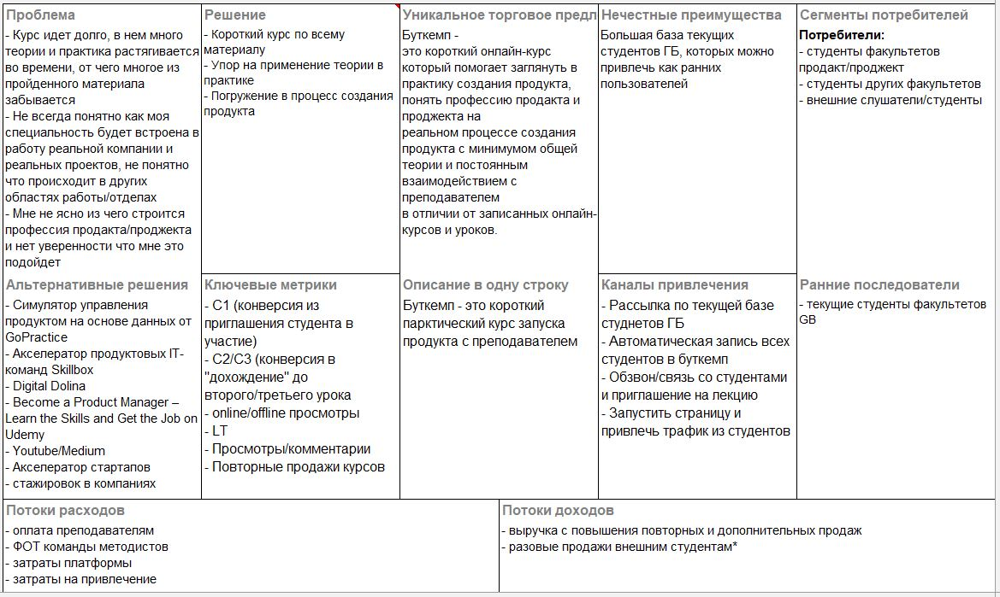
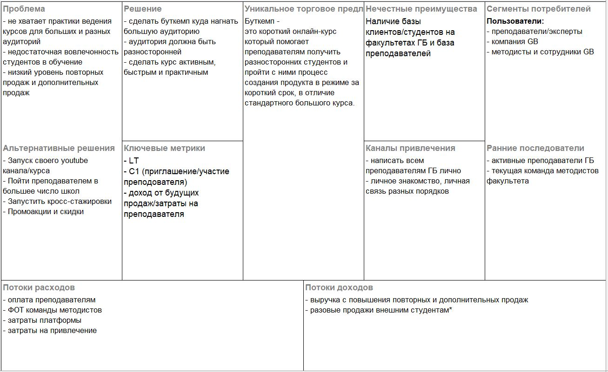
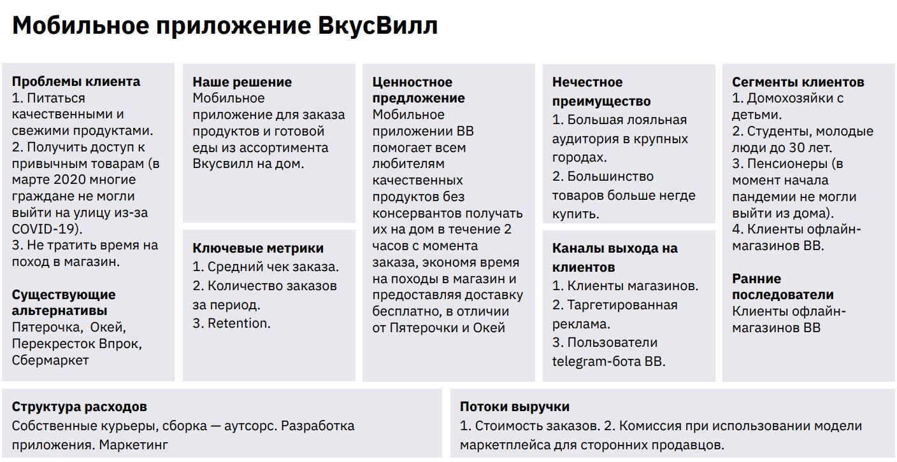
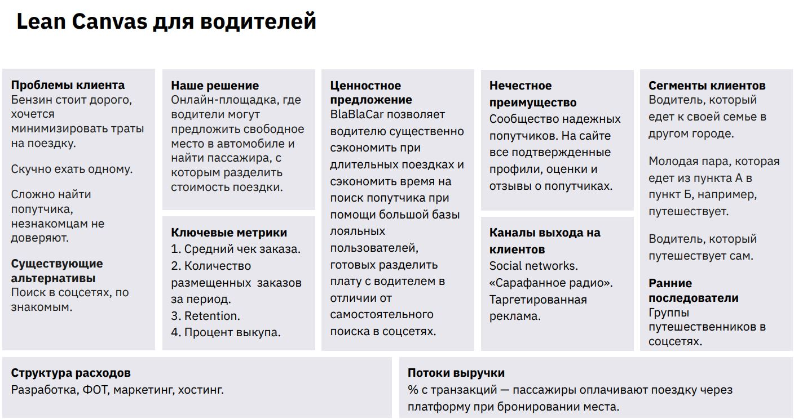
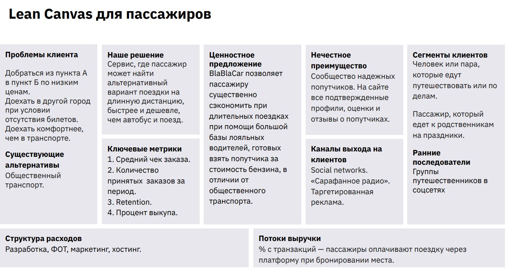

# Урок 3. Формируем lean canvas продукта "Буткемп" часть 1: Сегменты потребителей, их проблемы и боли? Потребители, проблемы, решения, альтернативы, ранние последователи.

# Начнем с гипотезы и lean canvas:
1. Сегменты потребителей, их проблемы и боли?

Потребители, проблемы, решения, альтернативы, ранние последователи.
2. А что по ценностному предложению и нечестным преимуществам? 

Думаем о каналах продвижения и метриках. Финансы или 
определяемся с доходной и расходной частью.

# Три стадии продукта
1. Problem /Solution Fit (Поиск решения для проблемы)

    Вы убеждаетесь, что у людей действительно есть проблема, а у Вас есть решение.

2. Product /Market Fit (Поиск продукта для рынка)

    Вы убеждаетесь, что Ваше решение — это продукт, который клиенты готовы покупать.

3. Scale (Масштабирование)

    Вы увеличиваете масштаб Вашего бизнеса.

## Эрик Рис: Успешным становится лишь тот стартап, который успевает сделать необходимое число корректировок бизнес-идеи до того, как закончатся необходимые ресурсы. 

# Lean Canvas — ваш «План А»

Подход к комплексному описанию продукта по методологии Lean Startup.

## Помогает менеджеру продукта:
+ понять продукт со всех сторон;
+ найти “узкие места” и сформировать рисковые гипотезы;
+ объяснить свои идеи команде и стейкхолдерам.

## Lean Canvas опирается на 3 понятия:

+ Customer development
    
    Методология непрерывного получения обратной связи от потребителя, параллельного процессу разработки продукта

+ Lean Startup

    Методология использования коротких быстрых итераций для тестирования гипотез 

+ Bootstrapping
    
    Методология развития компании на ей же заработанные деньги

# Слушатели контента (потребители) New

# Слушатели контента (потребители)

# Создатели контента (пользователи)

# 1. Сегменты клиентов

## Сегменты клиентов (покупателей)

## Кто клиент?
Определите, кто будет покупать продукт, а кто — пользоваться им. Например, если вы делаете приложение или сервис для компаний, за выбор и оплату обычно отвечает руководитель, а за использование продукта — его сотрудники.

### Как можно более детально и четко: 
Какие группы пользователей должны стать нашими клиентами? Если вы делаете платформу – опишите клиентов с каждой из сторон. 

## Кто первые пользователи?
Соберите группу из нескольких представителей вашей целевой 
аудитории. Они будут участвовать в разработке и запуске 
продукта: помогать проверять гипотезы, первыми тестировать, 
что получилось, и давать обратную связь.

### Ранние последователи
Самые первые категории клиентов, которым вы будете продавать свое решение. Кто ваш идеальный первый клиент?

## Сегменты потребителей:

### Потребители:
- студенты факультетов ГБ
- молодые продакты
- внешние слушатели/студенты
### Ранние последователи:
- текущие студенты факультетов GB

# 2. Проблемы клиента

## Какая проблема есть у клиента?
Посмотрите на все сегменты покупателей из первого блока и сформулируйте, какую их потребность закрывает продукт.

## Кто уже решает эту проблему?
Выявите всех существующих конкурентов. Любую проблему уже кто-то решает, но кто — не всегда очевидно. 

Если ваш продукт — сервис вызова такси, и вы закрываете потребность в комфортном передвижении, то ваши конкуренты — не только аналогичные сервисы, но и компании, которые продают автомобили.

## Проблема:
- Не хватает практики в реальных запусках продуктов
- Не всегда понятно как моя специальность будет встроена в работу реальной компании и реальных проектов, не понятно что происходит в других областях работы/отделах
- Мне не ясно из чего строится профессия продакта/проджекта и нет уверенности что мне это подойдет
-  Проблема трудоустройства выпускников - на рынке много вакансий мидлов и синьоров, мало джунов.

## Альтернативные решения:
- Симулятор управления продуктом на основе данных от GoPractice
- Акселератор продуктовых IT-команд Skillbox
- Digital Dolina
- Become a Product Manager – Learn the Skills and Get the Job on Udemy
- Youtube/Medium
- Акселератор стартапов
- стажировок в компаниях

# 3. Уникальное торговое предложение (Решение проблемы)

## Как продукт решит проблему пользователя?
Опишите несколько ключевых функций продукта, которые решают проблемы пользователей и будут поддержкой вашего УТП.

Подумайте, какие функции должны появиться в продукте в первую очередь, а без каких продукт уже может существовать и приносить пользователям ценность.

### Не спешите описывать решение.

Довольно часто оно оказывается существенно изменено после первых интервью с потенциальными потребителями

## УТП:
__Буткемп__ - это цикличный онлайн-курс который помогает совместно заняться практикой создания продукта, понять этапы запуска продукта на реальном процессе, коллективно запустить продукт совместно с ментором, добавив себе в портфолио или начав им управлять в дальнейшем в отличии от "теоретических" онлайн-курсов и уроков. 

# Примеры Lean Canvas

# Lean Canvas для нескольких ролей
1. Определите основные сегменты: кто пользователи и кто покупатели?
2. Для каждой выделенной роли сформируйте Lean Canvas, акцентируя внимание на проблемах и выгодах для текущего сегмента. 

## BlaBlaCar

2 роли с разными потребностями:
1. Водители, у которых во время длительной поездки есть свободное место в автомобиле. Хотят разделить стоимость поездки и сэкономить. 

2. Пассажиры, которым нужно доехать из одного города или страны в другой пункт назначения. Ищут альтернативный способ добраться по более низким ценам и комфортнее общественного транспорта.

##

Модель Lean Canvas — это не окончательный бизнес-план. Её суть в том, чтобы _изложить на бумаге первые идеи и начать их тестировать_, постепенно улучшая. 

Только так можно создать продукт, который будет отвечать реальным потребностям пользователей

# Домашнее задание:
Подготовить Lean Canvas в части ценностного предложения и нечестных преимуществ

