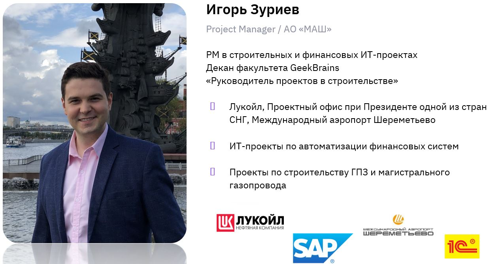
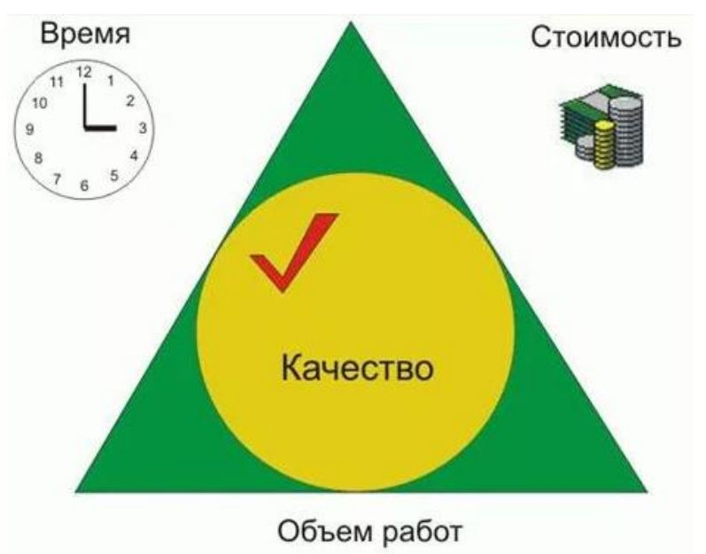
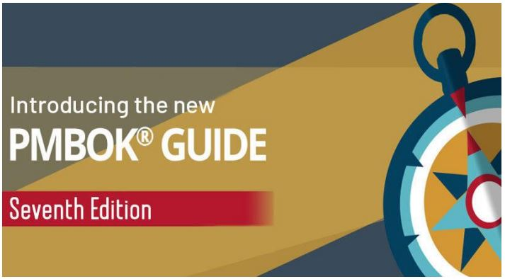
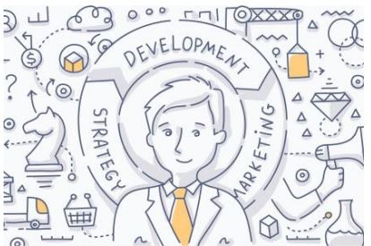
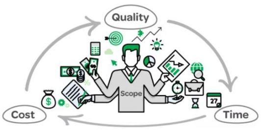
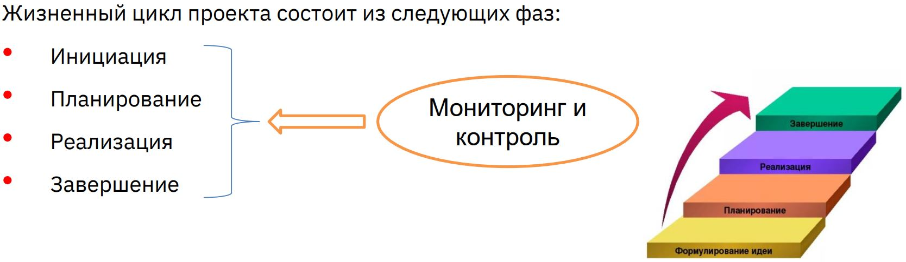
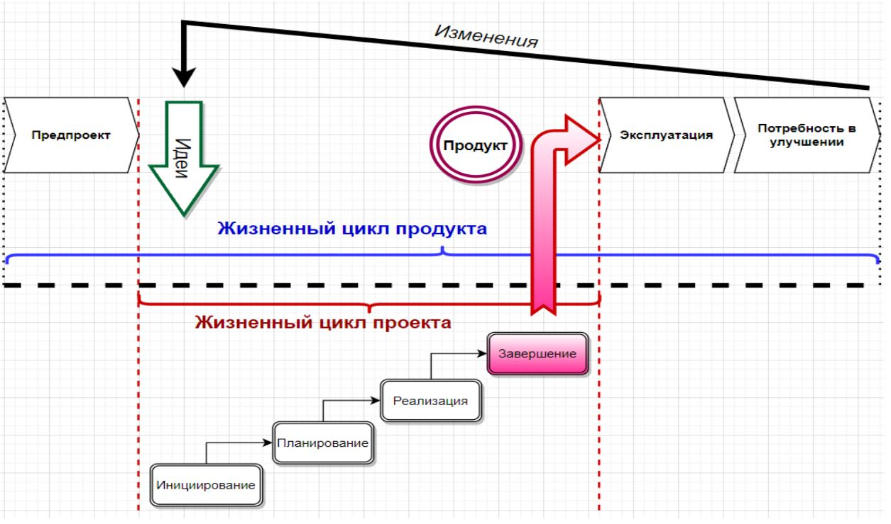

# Урок 2. С чего начать свой проект

# Мои контакты:

@igor_zuriev
i.zuriev@gmail.com

# Что будет на семинаре сегодня

+ С чего начать свой первый проект
+ Что такое Project management
+ Жизненный цикл проекта и продукта проекта
+ Фазы жизненного цикла проекта
+ Кейсы

# Что такое Project management?

## Железный треугольник проекта

# PMBOK

+ Свод знаний по управлению проектами (англ. Project Management Body Of Knowledge)
+ стандарт разработан PMI
+ основной справочный материал и руководство для профессионалов
+ самое актуальное издание — 7, (2021 г.)

# Project manager и Product owner В чём разница?

## Жизненный цикл проекта

### Кто отвечает за продукт?

__Управление продуктом (Product Management)__ – процесс генерации, планирования, разработки, тестирования, запуска и вывода продукта на рынок.

__Менеджер продукта (Product Manager)__ – профессионал, в обязанности которого входит создание и поддержание оптимальной ценности продукта на протяжении его жизненного цикла.

### Кто отвечает за проект?

__Управление проектом (Project Management)__ – приложение знаний, навыков, инструментов и методов к работам проекта для удовлетворения требований, предъявляемых к проекту.

__Менеджер проекта (Project Manager)__ – профессионал, осуществляющий управление проектом, командой проекта и ответственный за достижение целей проекта.

# С чего начать свой первый проект?

## Жизненный цикл проекта

Это набор фаз, через которые проходит проект с момента его начала до момента завершения.

## Жизненный цикл проекта состоит из следующих фаз:
+ Инициация
+ Планирование
+ Реализация
+ Завершение

# Кейсы

## Кейс 1
Вас назначили Project manager-ом проекта по разработке мобильной игры
### С чего начнёте?

## Кейс 2
1. Как разобьёте предыдущий проект по разработке мобильной игры на основные фазы Жизненного цикла?
2. Что будете делать на этих фазах?

