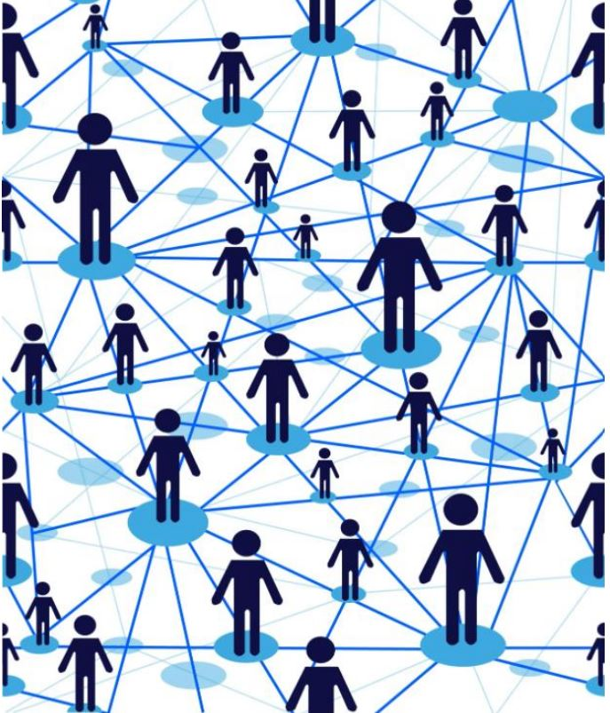
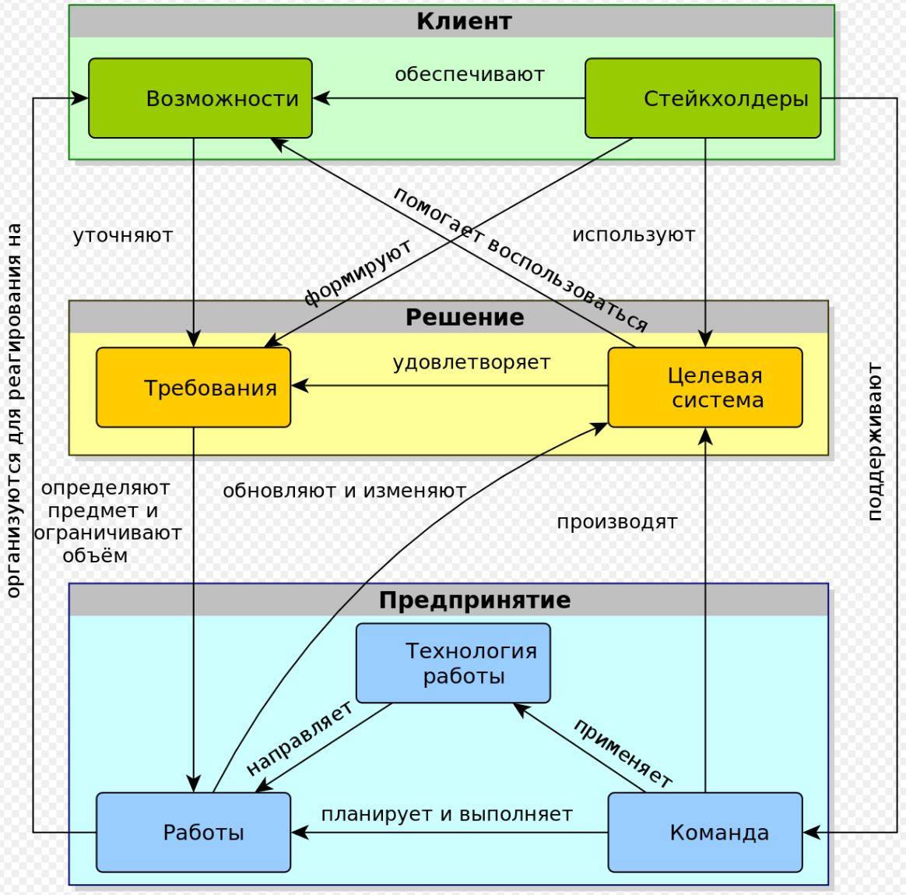
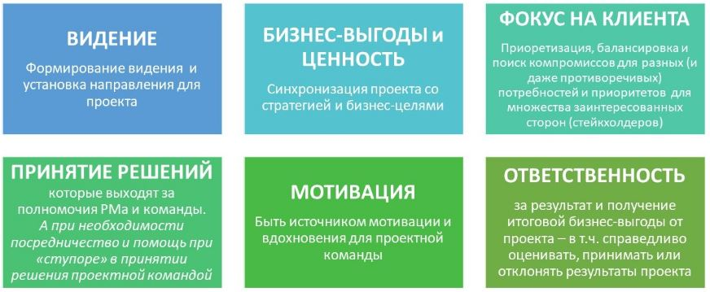
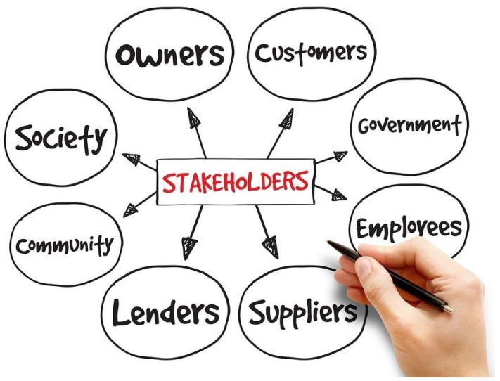
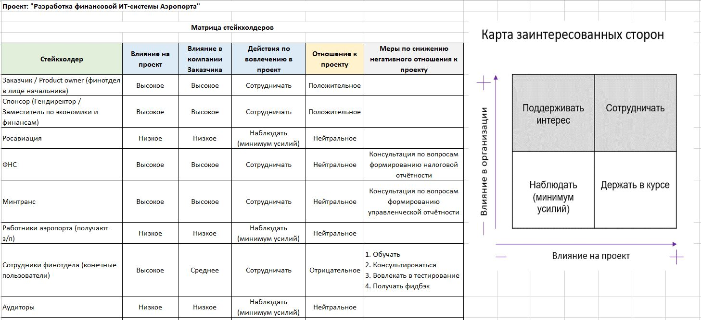
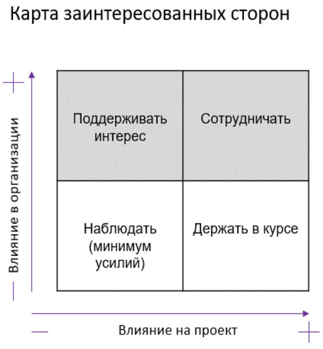

# Урок 3. Как идентифицировать заинтересованные стороны проекта

# Что будет на семинаре сегодня:
+ Кто такие заинтересованные стороны проекта?
+ Зачем их идентифицировать в самом начале?
+ Заказчик, спонсор, участники проектной команды.
+ Кейсы.

# Кто такие заинтересованные стороны проекта (стейкхолдеры)?

__Стейкхолдер__ это лицо, группа или организация, которая может влиять, на которую могут повлиять или которая может воспринимать себя подвергнутой влиянию решения, операции или результата проекта, программы или портфеля.

## Могут:
+ быть внешними или внутренними по отношению к проекту
+ участвовать в нём активно, неактивно или вообще о нём не знать
+ могут оказывать положительное или отрицательное воздействие на проект
+ могут подвергаться положительному или отрицательному воздействию от проекта

Другие определения:

Индивидуум, команда, организация или их группы, имеющие интерес в системе.

Люди, группы или организации, которые могут влиять на систему или на которых может повлиять система.

Лицо, группа или организация, которая может влиять, на которую могут повлиять или которая может воспринимать себя подвергнутой влиянию решения, операции или результата проекта (PMBoK).

Лицо или организация, которые могут воздействовать на осуществление деятельности или принятие решения, быть подверженными их воздействию или воспринимать себя в качестве последних.

Том Гилб: _Стейкхолдеров всегда на одного больше, чем вы знаете, а те, которых вы знаете, имеют минимум на одну потребность больше, чем вам сейчас известно._

Стейкхолдеры обеспечивают возможности для системы и являются источником требований для системы.

В системной инженерии стейкхолдеры рассматриваются в контексте процесса принятия решений как люди или организации, зависящие от результатов принимаемых решений. Понимание того, кто является стейкхолдером по отношению к принимаемым решениям, должно быть установлено заранее. Очень часто этого не происходит — стейкхолдеры не определяются до принятия решений. Однако, как только решение будет объявлено или реализовано, все, кто хоть как-то был затронут этим решением, выскажут своё мнение.

# Кто может быть заинтересованными сторонами (стейкхолдерами) проекта?

Исчерпывающего списка типов (групп) стейкхолдеров не существует, так как для различных целевых систем они могут значительно отличаться.

Это могут быть:

+ Приобретающая сторона, или покупатель (англ. acquirer) — организация или физическое лицо, которое приобретает или получает (англ. procures) продукт или услугу от поставщика. Приобретающей стороной может быть: покупатель, заказчик, владелец, оптовый покупатель.
+ Заказчик, или клиент (англ. customer) — организация или физическое лицо, получающее продукт или услугу.
+ Разработчик (англ. developer) — организация или физическое лицо, которое выполняет задачи разработки, включая анализ требований, проектирование, тестирование в течение всего жизненного цикла.
+ Поставщик (англ. supplier) — организация или физическое лицо, которое вступает в соглашение с приобретающей стороной на поставку продукта или услуги.
+ Пользователь (англ. user) — лицо или группа лиц, извлекающих пользу в процессе применения системы.
+ Производитель (англ.  producer) — представитель, ответственный за выполнение работы; лицо, ответственное за выравнивание расписания, бюджета и ограниченность ресурсов, чтобы удовлетворить клиента.
+ Сопровождающая сторона (мейнтейнер) — организация или физическое лицо, выполняющее поддержку системы на одном или нескольких этапах жизненного цикла; организация, которая осуществляет деятельность по сопровождению.
+ Ликвидатор (англ. disposer) — организация или физическое лицо, выполняющее ликвидацию (изъятие и списание) рассматриваемой системы и связанных с нею эксплуатационных и поддерживающих служб.
+ Аккредитор, или инспектор (англ. accreditor) — организация или физическое лицо, выполняющее проверку системы на соответствие требованиям в процессе сдачи системы в эксплуатацию.
+ Регулирующий орган (англ. regulatory bodies) — организация или физическое лицо, проверяющее систему на соответствие требованиям в процессе эксплуатации.
+ Остальные — персонал поддержки (англ. supporters), инструкторы (англ. trainers), операторы (англ. operators) и другие.

# Кто такой Спонсор проекта?

Спонсор проекта - лицо (или группа лиц), предоставляющее ресурсы и поддержку для проекта и ответственное за достижение успеха.

## Зачем идентифицировать?
+ Сроки
+ Бюджет
+ Содержание
+ Риски

Спонсор помогает и обеспечивает принятие нужных проекту решений, которые находятся вне полномочий руководителя проекта и проектной команды.

Спонсор выполняет, в частности, следующие функции и роли:

+ Доносит команде проекта своё видение, цели и ожидания.
+ Поддерживает соответствие проекта бизнес-целям и стратегии.
+ Является защитником и адвокатом проекта, проектного менеджера и команды на всех уровнях организации.
+ Всячески содействует принятию решений для проекта на уровне высшего руководства организации (или политической элиты, если речь о преобразовании стран, общества и т. д.).
+ Лично решает все проблемы, которые вне полномочий проектного менеджера и команды управления проектом.
+ Помогает выбивать и защищать ресурсы проекта от посягательств.
+ Устраняет препятствия и барьеры для проекта (в частности, внутриорганизационные и политические, решения с государственными регуляторами).
+ Доносит возможности, которые открываются при реализации проекта (окно возможностей), до высшего руководства для принятия решений по действиям с ними.
+ Отслеживает результаты проекта после его завершения, чтобы обеспечить реализацию ожидаемых бизнес-выгод и ценности.

# Кейсы

## Кейс 1 Проект по автоматизации финансовой системы Аэропорта
### Идентифицируйте стейкхолдеров

### Матрица стейкхолдеров

## Кейс 2 Проект: Разработка автоматизированной системы финансов Аэропорта

### Project manager: Вы
### Заказчики проекта:
+ Бухгалтерия
+ Финансовая дирекция
+ Юридический департамент
+ Служба эксплуатации самолётов
+ Дирекция капитального строительства
### Ситуация: требования заказчиков к автоматизированной системе меняются в процессе разработки и противоречат друг другу

## Кейс 3 Проект по разработке мобильного приложения для интернет-магазина одежды
### Идентифицируйте стейкхолдеров

## Заинтересованные стороны (стейкхолдеры) проекта:
+ заказчик
+ спонсор
+ сам Project manager
+ команда проекта
+ все подрядчики
+ исполнители работ
+ привлекаемые эксперты
+ государственные контролирующие органы
+ руководители функциональных подразделений
+ сотрудники компаний
+ клиенты
+ бизнес-партнёры
+ кредиторы
+ конкуренты

## Матрица стейкхолдеров

Внести всех стейкхолдеров
+ Оценить их влияние на проект
+ Оценить их влияние в компании заказчика
+ Определить отношение к проекту
+ Выработать меры по снижению негативного влияния на проект

