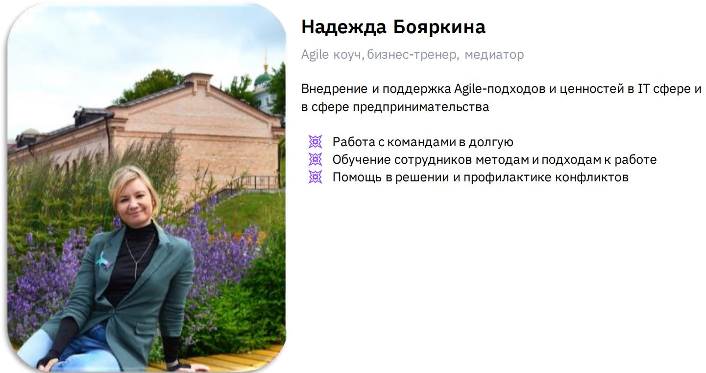
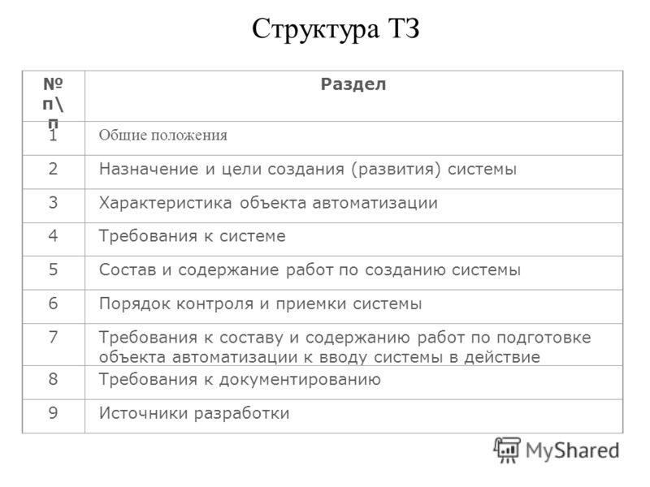
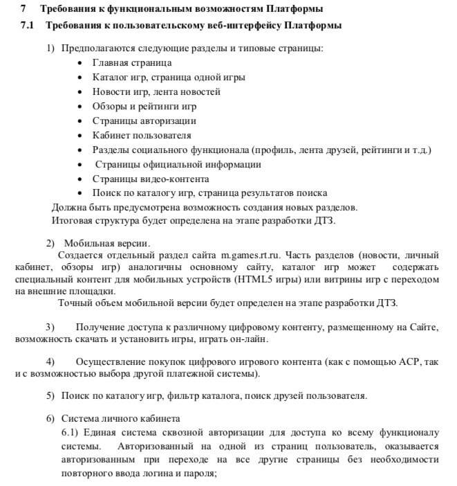
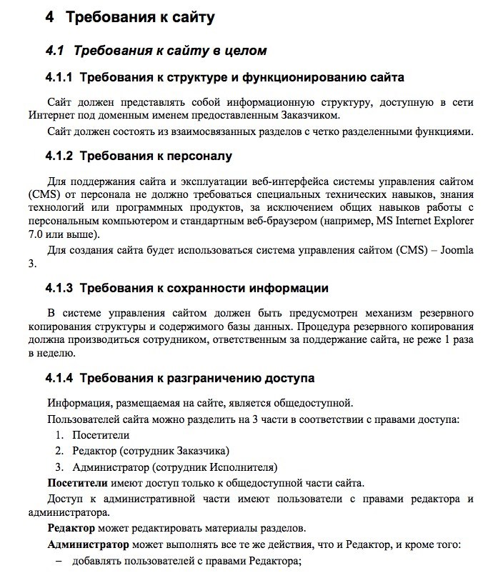

Урок 4. Бизнес-функциональные требования, Техническое задание и Product Vision

@sinila - telegram

# Что будет на семинаре сегодня
+ 📌 Бизнес-функциональные требования
+ 📌 Техническое задание
+ 📌 Product Vision
+ 📌 Кто всё это создаёт?
+ 📌 Кейсы

# Что такое Product Vision?

## Product Vision 

Это документ, кратко описывающий с точки зрения бизнеса цели создания продукта, его концепцию, развитие, целевое состояние и место среди других продуктов на рынке.

_На основании бизнес-кейса и Product Vision менеджер 
проекта управляет содержанием проекта._

## Давайте рассмотрим несколько основных определений, которые чаще всего встречаются в рунете:

__Видение продукта__ — цель и причина создания. Какие боли и проблемы потенциальной аудитории решает продукт. Определение коррелирует с миссией компании.

__Видение продукта__ — краткая концепция. Ее используют в качестве ориентирования и мотивации во время работы. Команда и стейкхолдеры используют Product Vision, чтобы принимать верные решения.

__Видение продукта__ — описание конкретной точки, в которой продукт должен оказаться спустя какое-то время.

__Видение продукта__ — краткое описание текущего положения продукта среди конкурентов, ценностного предложения, рынка, потребителей, конкурентов и т.п.

## Шаблоны и примеры Product Vision

Для упрощения разработки видения продукта специалисты разработали шаблон Product Vision. Он включает в себя необходимые блоки, которые нужно дополнить информацией о своем продукте:
+ Для (ключевой пользователь)
+ Который (обозначение проблемы или возможности)
+ (Название продукта) это (категория продукта)
+ Который (ключевое преимущество, убедительная причина для покупки)
+ В отличие от (ключевой прямой конкурент)
+ Наш продукт (обозначение ключевого отличия)

Это оптимальный вариант для начинающих, кто хочет создать первые видения.

Можете использовать структуру Джеффри Мура, которую он предложил в 2006 году в книге «Преодоление пропасти»:

+ Для (целевого клиента), который (заявление о необходимости или возможности), (название продукта) является (категория продукта), что (ключевая выгода, причина для покупки).
+ В отличие от (первичной конкурентной альтернативы), наш продукт (утверждение первичной дифференциации).

По такой схеме он писал заявления о позиционировании. Но как показывает практика, формат подходит для создания видения продукта.

## Как создать хороший Product Vision

Использование шаблонов не гарантирует получение хорошего Product Vision. Сначала соберите важные данные, нужные для составления видения продукта:
+ кто ваш клиент;
+ что нужно вашему клиенту;
+ какова текущая ситуация на рынке;
+ какова ваша конкурентоспособность в целевых областях.

Для сбора этой информации проведите исследования рынка и анализ конкурентов.

У начинающих специалистов редко получается подготовить видение продукта с первого раза. Как правило:
+ первый вариант — черновой,
+ второй — отредактированный и только
+ третий — итоговый.

Советуем проводить разработку Product Vision на общем совещании команды, чтобы не упустить важные детали.

Вот еще несколько советов от опытных продактов, как сделать видение продукта эффективным:
+ Мотивируйте команду на достижение целей.

    Грамотный Product Vision дает четкие ориентиры для команды. Абстрактные цели не подойдут, они должны быть понятными и осязаемыми. Тогда вся команда покажет максимальную эффективность и никто не спросит, почему приходится работать с раннего утра до позднего вечера. Все сотрудники сами будут хотеть этого.

+ Не усложняйте, делайте видение простым.

    Четко пропишите в Product Vision, что делать разработчикам, а чего нет. Это должна быть инструкция, по которой команда сможет работать без вас.

+ Создайте ценность для компании.
    
    Видение продукта должно не только удовлетворять ваши потребности, но и создавать дополнительную ценность для организации (особенно если планируете получать финансирование и поддержку). Впоследствии продавать продукт будет проще, если видение направлено на поддержку целей компании.

Есть несколько способов внедрить видение продукта в работу команды:
+ Сделайте физический вариант Product Vision.
    
    Распечатайте большой плакат и передайте команде. Если над созданием продукта трудится несколько коллективов, сделайте по одному экземпляру на каждый.

+ Включите видение продукта в рабочий процесс.
    
    Убедитесь, что оно включено в цели продукта и выпуска.

+ Взаимодействуйте с документом при составлении краткосрочных спринтов.
    
    Со временем видение станет частью вас, всегда будет в голове и станет направлять в работе.

Правильный Product Vision направляет команду, помогает в выполнении задач и достижении целей. Поначалу кажется, что сделать видение продукта несложно. На самом деле требуется немало времени, чтобы получить хороший результат. Используйте шаблоны, данные в статье, для упрощения задачи. Но не бойтесь вносить правки и экспериментировать — только так можно добиться успеха!

# Что такое Бизнес-функциональные требования (БФТ)?

## Бизнес-функциональные требования – это основной способ передачи требований от владельца продукта или бизнес-заказчика команде проекта.

Например:
+ ✓ отображение имени на экране
+ ✓ распечатка закрывающей документации
+ ✓ заведение нового клиента в систему

Тут можно выделить ряд характерных признаков, которые будут указывать, что это требования от бизнеса:
+ бизнес-требования всегда написаны с точки зрения клиента;
+ это широкие требования высокого уровня, но все же ориентированные на детали;
+ они не являются целями компании, но помогают компании достичь целей;
+ отвечают на вопросы «почему» и «что». Что хочет компания получить? И почему ей это нужно.

__Функциональные требования__ — это Действия, которые система должна выполнить, для реализации бизнес-требований.

Таким образом, функциональные требования связаны с разрабатываемым решением или программным обеспечением. Сформулируем функциональные требования для вышеуказанного примера:
+ система должна отображать долготу и широту сотрудника через GPS/ГЛОНАСС;
+ система должна отображать позиции сотрудников на карте;
+ система должна позволять менеджерам отправлять уведомления своим подчиненным на местах.

## Выделим следующие особенности:
+ функциональные требования всегда пишутся с точки зрения системы;
+ они более конкретные и подробные;
+ именно благодаря выполнению функциональных требований, разрабатывается, эффективное решение, отвечающее потребностям бизнеса и целям клиента;
+ отвечают на вопрос «как». Как система решает бизнес требования.

Следует сказать пару слов о __нефункциональных требованиях__ (также известных как «требования к качеству»), которые накладывают ограничения на дизайн или реализацию (например, требования к производительности, безопасности, доступности, надежности).

Такие требования отвечают на вопрос «какой» должна быть система.

# Что такое Техническое задание (ТЗ)?

Техническое задание – подробная конфигурация сооружаемого ПО с описанием свойств характеристик назначений каждого элемента и компонента продукта.

Документ-задание на разработку продукта.

Документ для приёмочного тестирования.

Техническое задание — исходный документ на проектирование технического объекта (изделия).

ТЗ устанавливает основное назначение разрабатываемого объекта, его технические характеристики, показатели качества и технико-экономические требования, предписание по выполнению необходимых стадий создания документации (конструкторской, технологической, программной и т. д.) и её состав, а также специальные требования.

Техническое задание является юридическим документом — как приложение включается в договор между заказчиком и исполнителем на проведение проектных работ и является его основой: определяет порядок и условия работ, в том числе цель, задачи, принципы, ожидаемые результаты и сроки выполнения.

То есть должны быть объективные критерии, по которым можно определить, сделан ли тот или иной пункт работ или нет.

Все изменения, дополнения и уточнения формулировок ТЗ обязательно согласуются с заказчиком и им утверждаются.

Это необходимо и потому, что в случае обнаружения в процессе решения проектной задачи неточностей или ошибочности исходных данных возникает необходимость определения степени вины каждой из сторон-участниц разработки, распределения понесенных в связи с этим убытков.

Техническое задание, как термин в области информационных технологий – это юридически значимый документ, содержащий исчерпывающую информацию, необходимую для постановки задач исполнителям на разработку, внедрение или интеграцию программного продукта, информационной системы, сайта, портала либо прочего ИТ сервиса.

## Переводим на понятный язык:

1. ТехЗадание — оно ставит задачу.

    А значит оно должно идти перед прототипом, скетчем, тестом, дизайн-проектом, потому что любой майндмеп, диаграмма потоков данных, архитектура — это уже выполнение некой задачи, это ответ на вопрос.
    
    А до того, как сам вопрос еще не задан, не сформулирован и не подписан всеми сторонами — любой ответ будет априори неправильным, не так ли?
    
    Итак, начало любой работы над любым проектом — это постановка задачи, а не судорожный поиск набросков десятка вариантов ее решения.

2. Собственно из первого пункта логично вытекает и новый — сам текст ТЗ обязан начинаться с главы «Цели и задачи», четко формулирующей, какие бизнес-цели преследует вся эта очередная попытка повысить энтропию в мире.
    
    Бесцельное задание, которое не решает никаких проблем, не достигает ничего и делается «от скуки» — официально не считается Техническим Заданием, а с этого момента находится в статусе «обычная бумажка».

3. Как же вам понять, решает ли предложенная дизайн-концепция или интерактивный прототип, а то и готовый к употреблению сайт — вышеизложенную задачу бизнеса?
        
    Ничего не поделаешь, придется опять вернуться к определению: «определяет… ожидаемые результаты и сроки выполнения.
    
    То есть должны быть объективные критерии, по которым можно определить, сделан ли тот или иной пункт работ или нет».
    
    То есть ТЗ без четких измеримых показателей в рублях, секундах, тонно-километрах или градусах Цельсия — быть не может.
    
    Бриф может, или прототип, или еще любая абсурдная бумажка, но только не ТехЗадание.

    Отсюда делаем вывод, что в настоящем ТЗ обязательно должна быть глава «Порядок приемки и оценки», когда эти самые показатели берутся, замеряются, и стороны либо пожимают друг другу руки, либо отправляют проект на переделку.

4. ТехЗадание должно обязательно согласоваться с общим бизнес-планом заказчика, с его стратегией развития бизнеса и анализом сегмента рынка. 
    
    Именно все это позволит установить правильные цели, вывести точные метрики, по которым затем адекватно провести приемку готового инфопродукта. 
    
    Отсутствие у заказчика бизнес-плана автоматически гарантирует непрофессиональное выполнение Технического Задания.

    Знает ли студия на аутсорсе бизнес-цели и измеримые показатели бизнеса лучше его владельца? 
    
    Очевидно, что нет, а значит правильное ТЗ должно писаться представителями Заказчика, а не наемными работниками Исполнителя. 
    
    Абсурд, когда исполнитель сам себе ставит задачу, затем сам себе придумывает способы ее оценки, и в конце сам же выставляет себе итоговую отметку за сделанную работу. 
    
    В идеале такой «самодеятельности» быть не должно, хотя на практике повсюду именно так и происходит, в результате чего ТехЗадание и не оказывает нужной помощи проекту, слишком часто являясь по сути фиктивным документом. Не надо так.

5. Каждое внесение правок в готовое ТЗ должно стоить денег.         
    
    Нельзя бесплатно и бесконечно править «Конституцию вашего проекта» только потому, что одна из сторон передумала, не выспалась, внезапно решила сэкономить и т.д.
    
    Цена каждого изменения в ТЗ должна также четко прописываться заранее в соответствующей главе.

Кстати, по идее точно также каждая правка в дизайне или внесение изменений в список страниц или функций должна иметь четкую цену, которая оплачивается заранее, до начала внесения данного изменения. Лично я предлагаю любую редактуру утвержденного ТЗ оценивать в 30% от всего бюджета проекта, но вы можете поступать иначе.

Стоит ли упоминать, что в ТЗ просто необходимо заранее указывать сроки и общий бюджет на разработку, а также список всех существующих ресурсов и ограничений? — Нет, это будет уж слишком очевидно.

Итак: Что делаем? Для чего? Как поймем, что сделали? Сколько стоит каждый пивот? — написанные на листочке ответы на все эти вопросы и являются «серебряной пулей», способной вытащить даже самый провальный проект.

## Контрольные вопросы

А здесь перечислю ответы на самые часто встречающие вопросы от заказчиков:

1. Так что, на написание ТехЗадания может еще и официальный ГОСТ есть? 
    
    Да, даже несколько.

    __ГОСТ 34.602.89 «Техническое задание на создание автоматизированной системы»__

2. А что, в ТехЗадание не входит описание нужных страниц, количества кнопок, используемых библиотек, гайдлайнов и т.д.?

    В само ТЗ нет, но в Приложения вы можете все это поместить, разумеется скорректировав все это с вышеописанными целями, ограничениями и способами дальнейшей оценки достигнутого результата.
    
    Размещайте хоть весь будущий контент, хоть описание типовых персонажей — но не вместо четкой постановки задачи, а уже после нее.

3. Так может оно мне такое и не нужно?

    Возможно, сегодня тысячи сайтов делаются вообще без ТЗ, также, как тысячи людей в мире прекрасно живут, будучи слепыми от рождения.
    
    Но если вы хотите видеть — куда вы вообще движетесь, осознанно принимать решения и самостоятельно оценивать полученные результаты — то без ТЗ тут не обойтись.

4. Вот вы и Википедия пишете, что ТЗ создается заказчиком. Но я не умею\мне некогда\просто не хочу его делать сам. Как же быть?

    Отдать разработку ТЗ третьей стороне, вполне знакомой с вашим бизнесом, его задачами, целевой аудиторией и потребностями, и в то же время досконально осведомленной о всех этапах веб-разработки.
    
    Эта третья сторона станет неким «веб-нотариусом», то есть гарантом того, что исполнитель не занизит нужные вам показатели или не затянет сроки, и что заказчик установит достижимые метрики и на итоговой приемке не будет субъективно оценивать созданный продукт, на ходу изменяя зафиксированные ранее требования.

5. И что, если ТЗ является юридическим документом, то я потом могу засудить аутсорсера, не заплатить ему, заставить переделать все в десятый раз?
    
    Если документ составлен правильно, указаны цели и методология оценки их достижения; если документ подписан сторонами и упомянут в Договоре (само ТехЗадание договором не является) — то конечно же сможете.
    
    А вот с обычным брифом, прототипами, арт-креатив-макетом, Безопасной сделкой на FL — уже нет.

6. Мне говорят, что работа будет вестись по какому то то ли скраму, то ли аджайлу; а значит архаичное ТЗ мне больше уже не нужно. Это так?
    
    Посудите сами: вам называют непонятное слово, явно что-то маскирующее и вот уже на основании незнакомого вам термина предлагают отказаться от юридически грамотного и наполненного целями и метриками документа.
    
    Сам же agile никаких целей вроде «достичь не менее 10 000 посещений к концу года», или «достичь цифры более 25 заказов с сайта через месяц» — установить не может, это просто способ проведения совещаний и новой организации нерадивых сотрудников.
    
    Задумайтесь несколько раз: «А не пускают ли вам пыль в глаза?».
    
    На самом деле никакому новомодному скраму профессиональное ТЗ повредить не может, а вот помочь — обязательно.

# Кейсы

## Кейс 1 Проект по разработке сайта

БФТ, ТЗ или Product Vision?

БФТ для создания сайта

## Для удобства документ разбит на несколько разделов:
+ ✓ Бизнес-требования.

    Это самые приоритетные требования, которые определяют цель создания сайта и задачи.

+ ✓ Дизайнерские требования.
    
    Здесь описаны цвета, шрифты, стилистика будущего сайта. Они должны совпадать с идеей или фирменным стилем заказчика.

+ ✓ Требования пользователей сайта.
    В данном блоке прописано, какую информацию может просматривать/добавлять/редактировать пользователи сайта. 
    
    Например, менеджеру по продажам в интернет-магазине нужен только доступ к заказам, а бухгалтеру – к счетам и отчетам.
+ ✓ Требования посетителей сайта. Здесь описан путь посетителя на сайте.
    
    Если проект очень крупный, составляется полноценная концепция поведения аудитории – Customer Journey Map.

Это тоже БФТ

## Кейс 2 Проект: Разработка онлайн системы резервирования автомобилей

### Документ - Product Vision

ИТ-проект для рынка России представляет функцию онлайн резервирования автомобилей в дополнение к текущим ИТ-продуктам компании «А». 

Благодаря новой возможности покупатель сможет закончить все необходимые шаги резервирования автомобиля на сайте и отправить свои данные напрямую дилеру, сократив при этом временные затраты на оформление документов в дилерском центре.

В 2021 году компания «А» должна будет сфокусировать свое внимание на подключении к данной функции подержанных автомобилей, а затем в 2022 году уже будут подключены и новые автомобили.

## В какой последовательности эти документы появляются?

### Последовательность:
1. Сформировать Product Vision
2. Собрать БФТ
3. Написать ТЗ на разработку продукта

## Кто готовит Product Vision, БФТ и ТЗ?

## __Product owner__

Иногда с помощью Project manager-а, особенно ТЗ

# Менеджер продукта и владелец продукта: в чем разница

Разбираемся с ролями и обязанностями продакт-менеджера и продакт-овнера

## Кто чем занимается?

Если вкратце, продакт-менеджер — лицо, которое принимает окончательное стратегическое решение по продукту: по его видению, стратегии, бизнес-цели. А владелец продукта — это роль в методологии Scrum, ответственная за достижение максимальной ценности продукта.

Продакт-менеджер — это наёмный предприниматель внутри компании. Он нацелен на развитие продукта, который с наименьшими вложениями принесёт наибольшую прибыль. Продакт-менеджер сфокусирован на долгосрочной стратегии, отвечает за исследование конкурентной среды и своей аудитории. Здесь речь идёт о маркетинговых задачах и взаимодействии с клиентами.

Продакт-оунер несёт ответственность за достижение максимальной ценности продукта — как результата работы команды. И добивается он этого при помощи Scrum — фреймворка гибкой разработки программного обеспечения. Владелец продукта понимает, кто чем занимается в команде, управляет бэклогом, плотно взаимодействует с разработчиками и другими заинтересованными лицами. Он отвечает за то, чтобы все члены команды имели ясное представление, над чем работают и в какой последовательности будут выполнять задачи.

Менеджер продукта
+ Маркетинг продуктов
+ Поддержка продаж продукта
+ Составление бюджета
+ Долгосрочное прогнозирование
+ Обслуживание клиентов
+ Поддержка команды доставки решения

Владелец продукта
+ Посещение координационных встреч команды
+ Организация демонстраций
+ Проведение достаточного анализа, чтобы убедиться, что требования готовы к работе
+ Участие в постоянных испытаниях

## Может ли продакт-оунер быть менеджером продукта?

Короткий ответ: да, владелец продукта может быть менеджером продукта — и наоборот. А если это всё-таки два разных специалиста, то крайне важно, чтобы они понимали, чем различаются их роли и обязанности.

