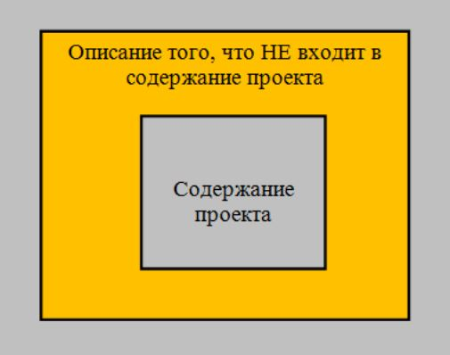

# Урок 5. Что такое содержание проекта и содержание продукта

## Что будет на семинаре сегодня
+ Что такое содержание проекта и содержание продукта
+ Границы
+ Ограничения
+ Допущения проекта
+ Кто и как определяет
+ Кейсы

# Что такое Содержание проекта?

Содержание проекта - это список работ по проекту, которые нужно реализовать, чтобы достигнуть целей проекта и получить запланированные результаты (конечный продукт).

Внимание!
Описать содержание проекта на фазе «Инициация» можно верхнеуровнево.

Полная детализация происходит уже на фазе «Планирование».

Точный план полного скоупа (от англ. scope) проекта поможет заинтересованным лицам понять, какую работу необходимо выполнить в рамках проекта и определить его границы. Если вы управляете проектом, вам нужно знать, как определить его скоуп, чтобы прийти к успешному завершению проекта. В этой статье мы поговорим о процессах, которые включает в себя управление скоупом проекта.

## Что такое скоуп в управлении проектами?

Скоуп продукта включает описание фич, характеризующих продукт, результат или услугу. Обычно это составляющая продукта, вызывающая наибольший интерес конечного пользователя.

Скоуп проекта определяет тот объем работы, который должен быть выполнен, чтобы успешно поставить продукт, результат или услугу в соответствии со скоупом продукта. Он содержит краткое описание проекта и говорит, как заинтересованные стороны планируют достичь своей цели.

## Почему скоуп в управлении проектами важен?

Скоуп четко описывает все элементы проекта. Он описывает правила, по которым что-то может быть добавлено или убрано по мере развития проекта. Скоуп помогает менеджеру проекта оценить время и затраты, которые потребует проект. Четкое информирование о скоупе проекта гарантирует то, что все заинтересованные стороны сошлись во мнениях о том, что необходимо сделать и как именно они это реализуют.

Управление скоупом определяет механизмы контроля для управления непредвиденными событиями и ограничивает случаи изменений, происходящих во время разработки и реализации проекта. По сути, это способствует наилучшему прогнозированию затрат и планированию мероприятий, что приводит к сокращению убыток/потерь.

## Процессы управления скоупом проекта
Ниже перечислим типичные процессы управления скоупом проекта:

1. Планирование скоупа

    Опишите, как вы будете создавать, валидировать и контролировать скоуп проекта. Чтобы создать его, можно использовать устав проекта (англ. Project Charter) или план управления проектом (англ. Project Management Plan). 
    
    Следует организовать встречи, на которых предстоит определить процесс создания для утверждения скоупа, как команда будет участвовать в запросах на изменение (англ. Change Request), и разногласиях об элементах скоупа, процедуре принятия результатов и иерархической структуре работ (ИСР) (англ. Work Breakdown Structure, WBS).

2. Сбор требований

    Требования — это цели, достижение которых удовлетворит стейкхолдеров. Чтобы понять, что это за требования, можно проводить интервью, исследования, воркшопы и обсуждения в фокус-группах с стейкхолдерами.

    Проект может преследовать несколько целей, например, создание нового сервиса внутри организации или разработка нового софта. Зафиксируйте письменно соответствующую информацию в подробный список с намерением достигнуть все поставленные цели. 
    
    Вам необходимо понимать требования, чтобы максимально снизить вероятность неприятных событий и получить ожидаемые результаты.

3. Определение скоупа

    Определите скоуп вашего проекта в описании содержания проекта (англ. Project Scope Statement).
    
    Описание содержания проекта отражает в деталях все, что включено в основные конечные результаты.
    
    Это включает в себя потребности проекта, зоны ответственности каждого члена команды и необходимые процедуры для завершения, верификации и согласования после завершения работы.
    
    В описании также поясняются ожидаемые результаты проекта.

    Описание содержания проекта служит основой для совершения проектных решений с того момента, как все стейкхолдеры выразили свое с ним согласие.

    Перечислим некоторые пункты, которые должно содержать описание:
    + Описание скоупа продукта
    + Допущения проекта (англ. assumptions)
    + Результаты проекта
    + Проектные ограничения и исключения
    + Критерии приемки продукта

4. Создание иерархической структуры работ

    Иерархическая структура работ (ИСР) (англ. Work Breakdown Structure, WBS) — важный инструмент управления проектами.
    
    Он заключается в разделении всего проекта на отдельные задачи.
    
    Как только вы определили результаты проекта в описании содержания проекта, вы можете организовать их в небольшие элементы — «пакеты работ», тем самым упростив управление ими.

5. Валидация результатов

    Рассмотрите и утвердите результаты проектов со стейкхолдерами. В случае возникновения разногласий можно сделать пересмотр в соответствии с обратной связью стейкхолдера.

6. Контроль скоупа

    В течение проекта критически важно контролировать скоуп и управлять возможными изменениями.
    
    Для достижения контроля вы можете сравнить отчет о производительности с набором требований и проверить, есть ли между ними разница. 
    
    В случае необходимости можно изменить скоуп с помощью процесса управления изменения. 
    
    Непредвиденные события могут произойти, но если вы подготовлены к тому, чтобы справиться с такими изменениями, которые оказывают влияние на скоуп, это в конечном итоге не должно повлиять на проект.

    Процесс управления изменениями обычно включает отправку официального запроса на изменения стейкхолдерам.
    
    Они анализируют влияние запрашиваемого изменения на стоимость, качество и график проекта, и как только они принимают предложение, менеджер проекта вносит изменения в первоначальный план.

## Как определить описание содержания проекта

Описание содержания проекта дает пояснения по ограничениям проекта.

Он определяет элементы, которые содержит финальный продукт или услугу а также те, которые не включены.

Это важная информация для членов команды, стейкхолдеров и высшего руководства.

Не существует строгих указаний относительно рекомендуемого объема этого документа, но есть некоторые шаги, на которые стоит обратить внимание при написании:
1. Создание описания скоупа

    Создайте подробное описание результата, продукта или услуги. 
    
    Убедитесь, что вы фокусируетесь на тех деталях, которые помогут стейкхолдерам понять, где пролегают границы проекта.
    
    Пример: Подрядчику дали задачу установить новый бухгалтерский софт. Скоуп проекта заключается в установке нового софта и управлении миграцией всех учетных данных из старой системы в новую.

2. Определение результатов

    Результаты — это то, что проект будет производить. Описание содержания проекта должно включать подробный список результатов, включая те, которые кажутся очевидными.

    Пример: Подрядчик обязуется предоставлять еженедельный отчет о проведенной работе и проводить тестирование в конце каждой фазы.

3. Определение критериев приемки

    Описание содержания проекта должно содержать описание критериев, которые должны быть выполнены до приемки результатов поставки проекта. Критерии приемки могут указывать, например, необходимо ли тестирование для определения завершенности. Сроки приемки и согласование финансирования — еще одни критерии, которые стоят упоминания. Также можно указать, принимает ли организация финальные решения и может ли быть составлен акт выполненных работ.

    Пример: Последний успешный тест с текущими учетными данными завершает последнюю фазу. Главный бухгалтер вместе с директором компании должен подписать результаты этого теста, что обуславливает завершение проекта.

4. Список исключений скоупа

    Когда некоторые элементы не включены в проект и открыты к интерпретации, лучше исключить их полностью. 

    Пример: Подрядчик может отказаться от технической поддержки пользователей бухгалтерского софта после завершения проекта.

5.  Идентификация ограничений 

    Полное описание ограничений может помочь стейкхолдерам понять, в каких ситуациях возникают проблемы. 
    
    Важно понимать, что ограничения часто взаимосвязаны. В качестве примеров ограничений могут служить: время, бюджет, риски, качество, степень удовлетворенности пользователей, ресурсы, организация, устойчивость и методология.

    Пример: На этапе установки софта может возникнуть ограничение по времени: проект должен быть завершен и запущен до окончания текущего финансового года. В приведенном выше примере есть организационное ограничение: проект считается завершенным, когда его подписали руководитель и директор. Если же они этого не сделали по причине своего отсутствия, это может повлиять на сроки.

6. Избегайте предположений

    Управляя проектом, убедитесь, что вы не исключаете любую необходимую информацию, чтобы помочь стейкхолдерам понять ситуацию в случае возникновения проблем. Не стоит просто предполагать, что вы все на одной волне — общайтесь открыто, так, чтобы все владели актуальной информацией.

    Пример: На этапе установки софта подрядчик предполагает, что конечные пользователи смогут участвовать в тестировании софта на протяжении проекта. Другое же предположение может быть таким, что даты отпусков руководителя и директора строго фиксированы.

7. Заручиться помощью

    Вы также можете проконсультироваться со специалистами, чтобы получить необходимую информацию для описания скоупа. Они помогут определить потенциальные проблемы, которые могут возникнуть в течение фазы планирования проекта. Также, консультации со стейкхолдерами на встречах и воркшопах очень важны для сбора всей запрашиваемой информации и информирования о скоупе проекта. Для успеха проекта крайне важно прояснить все непонятные области и разрешить конфликты.

    Пример: Разработчик может нанять стороннего консультанта для участия в проекте.

# Из чего состоит Содержание проекта

+ Цели проекта
+ Описание содержания продукта
+ Критерии приёмки продукта
+ Границы проекта
+ Ограничения проекта
+ Допущения проекта

# Что такое Содержание продукта?

Содержание продукта - свойства и функции, которые характеризуют 
продукт проекта, т.е. результат, который передаётся заказчику.

# Что такое Границы проекта?

Границы проекта это описание того, что не входит в 
содержание проекта.

В ходе описания границ проекта определяются и документируются все моменты, которые могут подразумеваться как часть проекта, но таковой не являются.
 

# Что такое Ограничения проекта?

Ограничения проекта это некие факторы, которые ограничивают 
наши возможности по реализации проекта.

Ограничения на проекте бывают юридическими, законодательными, техническими, организационными и т.д.

# Что такое Допущения проекта?

Допущения проекта это наши предположения о том, какова будет окружающая среда проекта, на основе которых мы этот проект планируем.

На основе допущений проекта мы:
+ получим инструмент управления заинтересованными лицами
+ договоримся на берегу обо всём ещё до старта проекта
+ лучше оценим окружение проекта
+ будем управлять рисками

# Кейсы

## Кейс 1 Проект по автоматизации системы бюджетирования
+ Заказчик поверхностно сформулировал идею: автоматизировать всю внутреннюю финансовую систему компании
+ Вы осуществили сбор требований
+ Выяснилось: автоматизируем только внутреннюю систему бюджетирования, бухгалтерию не трогаем

Что это? Границы, ограничения или допущения проекта?

__Это - границы!__

## Кейс 2 Проект по разработке веб-сайта интернет-магазина

Узнали: Заказчик недоступен для обсуждения и согласования вопросов проекта с 1 по 5 число каждого календарного месяца

Что это? Границы, ограничения или допущения проекта?

__Это - ограничения!__

## Кейс 3 Проект по модернизации Центра обработки данных для Аэропорта:
+ Большая часть расходов на закупку иностранного оборудования за долл.США
+ Курс иностранной валюты не стабилен

__Это - допущение!__

## Кейс 4 Проект по разработке системы сбора багажа в аэропорту

Узнали: На фазе «Инициация проекта» Вы узнаёте, что крупная компания-проектировщик и программный интегратор ИТ-системы по сбору и сортировки багажа ушла с рынка РФ

__Это - не проблема, но - ограничение!__

# Кто определяет Содержание, Границы, Ограничения и Допущения проекта?

Project manager:
+ сбор требований к продукту
+ Product Vision
+ БФТ
+ ТЗ

# Кто определяет Содержание продукта проекта?

Product owner / Заказчик

