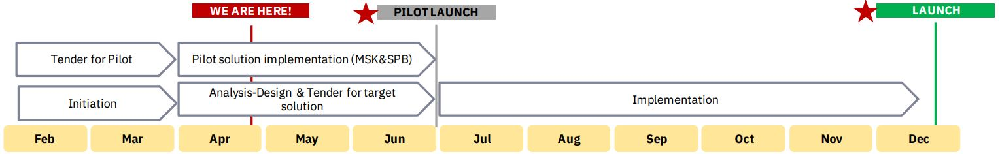

# Урок 6. Что такое дорожная карта проекта

## Что будет на семинаре сегодня:

+ 📌 Дорожная карта
+ 📌 Инструменты для построения
+ 📌 Кейсы
+ 📌 Построим дорожную карту
+ 📌 Небольшое задание на размышление

## Что такое Дорожная карта?

Дорожная карта проекта (Project Roadmap) это простое и понятное визуальное представление ключевых этапов, работ и вех (генеральный план) проекта.

## Зачем нужна Дорожная карта?

Цель дорожной карты:
+ донести главные идеи и прогресс в задачах до членов команды и заинтересованных сторон (спонсора, ТОП менеджеров, партнеров и пр.).

Дорожная карта состоит из инициативы глобального уровня и всех её запланированных шагов.

## Составили и забыли?

Обязательно следует актуализировать Roadmap проекта на протяжении всего жизненного цикла проекта

## Что должна включать в себя Дорожная карта?

Отличия Roadmap проекта от календарного плана проекта:
+ ✓ Включает только ключевые задачи проекта, без мелких деталей
+ ✓ Текущая дата и вехи проекта
+ ✓ Понятная и простая визуализация

## Что такое вехи проекта?

Вехи проекта:
+ ❖ обозначают определённые точки на хронологии проекта
+ ❖ эти контрольные точки показывают, когда заканчиваются отдельные действия или когда начинается новая стадия
+ ❖ это дорожные указатели, помогающие не 
сбиться с пути

## Кому нужна Дорожная карта?

Дорожная карта нужна
+ ➢ Заказчику,
+ ➢ Спонсору,
+ ➢ Куратору,
+ ➢ Топ-менеджменту.

## Где нарисовать Дорожную карту?

Платформы для визуализации дорожной карты:

+ ✓ Roadmunk,
+ ✓ Taskworld,
+ ✓ Proofhub,
+ ✓ GanttPRO,
+ ✓ Wizeline,
+ ✓ Roadmap planner,
+ ✓ Hygge.

# Кейсы
Проект: Разработка веб-сайта интернет магазина одежды

Построим Дорожную карту

# Подумайте дома на досуге!

Вопрос для размышления:

Что дальше необходимо сделать с дорожной картой, чтобы правильно рассчитать сроки реализации проекта?

