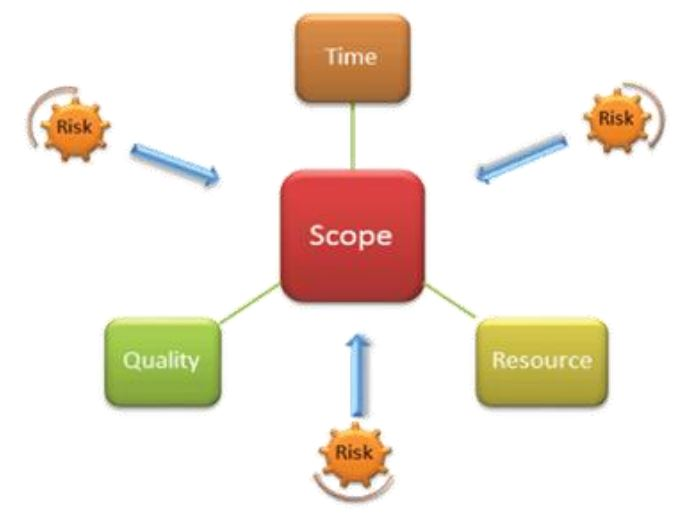

# Урок 7. Как сформировать иерархическую структуру работ

## Что будет на семинаре сегодня
+ ИСР / СДР / WBS
+ Для чего нужна ИСР
+ Как построить ИСР
+ Кейсы
+ Построим ИСР

## Подумали дома на досуге?

Что дальше необходимо сделать с дорожной картой, чтобы правильно рассчитать сроки реализации проекта?

Декомпозировать Дорожную карту на работы более низкого уровня в иерархической структуре работ.

## ИСР (Иерархическая структура работ)
## СДР (Структурная декомпозиция работ)
## WBS (Work Breakdown Structure)

Что это такое?

## ИСР / СДР / WBS

+ Представляет собой перечень задач проекта
+ Детализированная Дорожная карта

Нужно понимать перечень работ и задач, которые стоят перед вами для выполнения проекта.

# Зачем нужна ИСР / СДР / WBS?

Цель ИСР / СДР / WBS:

Организует и определяет всё содержание проекта

# Составили и забыли?

Обязательно, при внесении изменений в Содержание проекта нужно вносить корректировки в ИСР / СДР / WBS 

# До какого уровня детализировать?

Детализация ИСР / СДР / WBS

Декомпозиция производится до уровней, на которых возможна реалистичная оценка: сроков, стоимости, рисков.

# Почему стоит использовать ИСР / WBS / СДР?

+ Помогает правильно организовать проект
+ Оказывает помощь в описании содержания проекта для заинтересованных сторон
+ Помогает распределить обязанности
+ Показывает основные этапы проекта и все ракурсы контроля
+ Позволяет правильно оценить затраты, риски и время работ

# Кому нужна ИСР / СДР / WBS ?

+ Project manager-у
+ Команде проекта

Как инструмент управления содержанием проекта

# Где сформировать ИСР / СДР / WBS ?

Лучше всего в ПО, где рисовали дорожную карту
+ GanttPRO
+ MS Project
+ Project Libre
+ Roadmunk
+ Taskworld
+ Proofhub
+ Wizeline
+ Roadmap planner
+ Hygger

# Кейсы

## Проект: Разработка веб-сайта интернет магазина одежды
 
Построим ИСР на основе разработанной Дорожной карты

TODO: В папке /Files/07... переработать в текстовый вид