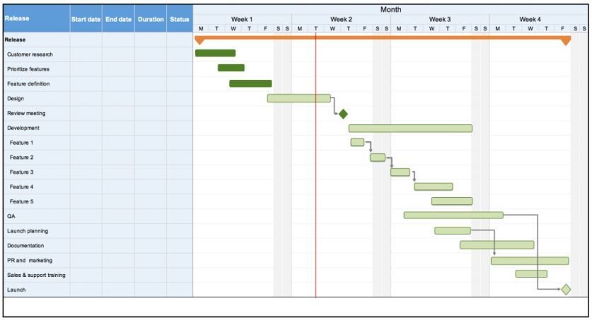
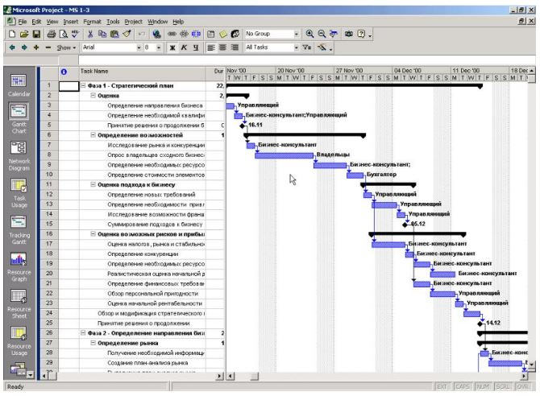

# Урок 8. Как построить план-график своего проекта

Что будет на семинаре сегодня
+ 📌 План-график проекта
+ 📌 Зачем нужен
+ 📌 Что показывает
+ 📌 Методы оценки длительности работ
+ 📌 Кейс - построим ПГ

# Что такое Календарный план-график проекта?

Разрабатывается на основе результатов анализа операций (работ) проекта, их последовательности и длительности, а также необходимых для их выполнения ресурсов.

# В каком виде представляется Календарный план-график проекта?

Календарный План-график = Диаграмма Ганта

+ ➢ все операции (работы) проекта
+ ➢ вехи проекта (Project Milestones)
+ ➢ зависимости между работами
+ ➢ сроки начала и завершения работ
+ ➢ ресурсы, необходимые для выполнения работ
+ ➢ статус выполнения работ

# Почему важен Критический путь проекта?

Операции (работы), лежащие на критическом пути, не имеют резерва времени выполнения, т.е. при срыве их сроков сдвигаются сроки всего проекта.

# Кто следит за критическим путём проекта?

Руководитель проекта в первую очередь должен следить за исполнением задач, лежащих на критическом пути, а также фиксировать появление новых критических путей.

# Как оценить работы по длительности?

❖ Экспертная оценка

    Используется для верхнеуровневой оценки сроков. На основании опыта эксперта. В случае оценки уникальной операции, по которой нет возможности оценить длительность работ точно.

❖ По аналогам
    
    Применяется при оценке неуникальной операции, по которой есть фиксированная длительность работ.

❖ Параметрическая
    
    По объёмам работ и производительности. Наиболее точная оценка работ.

# Где сформировать План-график?

Лучше всего в ПО, где формировали дорожную карту и ИСР

+ ✓ GanttPRO
+ ✓ MS Project
+ ✓ Project Libre
+ ✓ Roadmunk
+ ✓ Taskworld
+ ✓ Proofhub
+ ✓ Wizeline
+ ✓ Roadmap planner
+ ✓ Hygger

# Кейсы

## Кейс
Проект:Разработка веб-сайта интернет магазина одежды

Построим План-график на основе разработанной Дорожной карты и ИСР

TODO: В папке /Files/08... переработать в текстовый вид