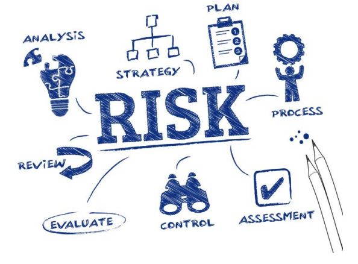
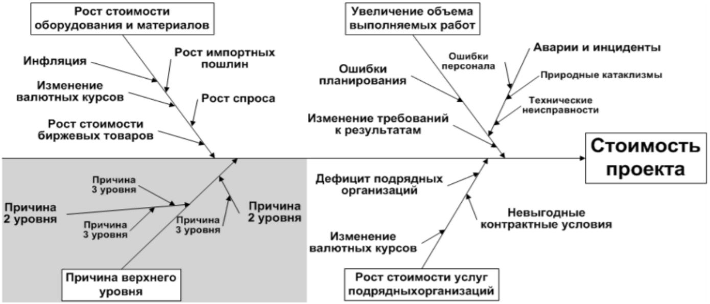
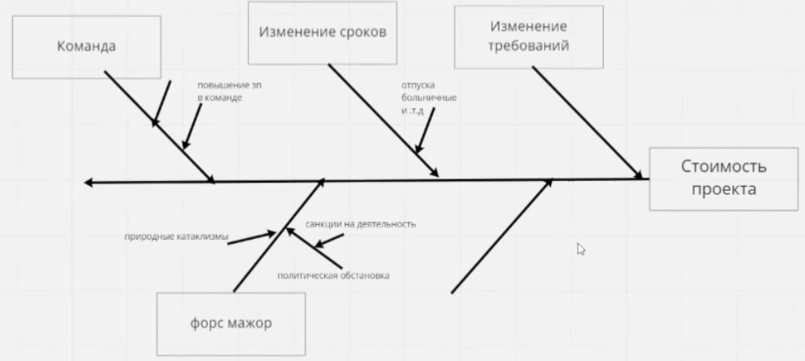
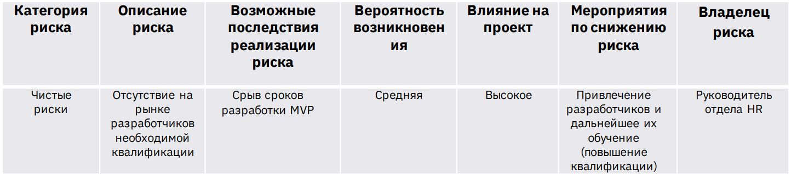
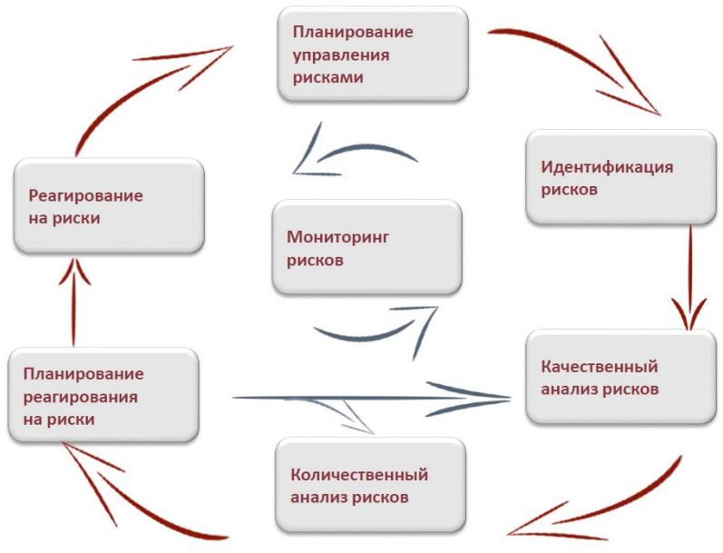

# Урок 9. Как идентифицировать и оценить риски проекта

# Что будет на семинаре сегодня
+ 📌 Как идентифицировать риски
+ 📌 Оценка рисков
+ 📌 Диаграмма Исикавы
+ 📌 Кейс по идентификации и оценке рисков
+ 📌 Реестр рисков

# Что такое риски проекта?

Риски проекта это неопределенное событие или условие, которое в случае возникновения оказывает воздействие (позитивное или негативное) по меньшей мере на одну из целей проекта, например, на сроки, стоимость, содержание или качество

# Какие Вы знаете категории рисков?

+ • Чистые риски – риски с негативным влиянием, представляющие потенциальную угрозу для проекта.
+ • Возможности – риски с позитивным влиянием, являющиеся потенциально благоприятными событиями для проекта.
+ • Бизнес-риски – возможные события в будущем, представляющие как угрозу, так и благоприятную возможность для проекта.

Так же риски можно классифицировать на известные и неизвестные.

# Пример

## Чистые риски
+ Пожар;
+ Отсутствие на рынке необходимых специалистов для выполнения специфических работ;
+ Наличие конкурента;
+ Нестабильная политическая обстановка;
+ ...

## Возможности
+ Принят законодательный акт, позволяющий Вам беспошлинно завозить импортное оборудование на проект;
+ …

## Бизнес-риски
+ Рост и падение курса иностранной валюты;
+ …

# Как идентифицировать риски?

## Диаграмма Исикавы

+ ➢ Это инструмент, который обеспечивает системный подход к определению фактических причин возникновения рисков и проблем
+ ➢ Также называется: «причинно-следственная диаграмма» (англ. Cause and Effect Diagram) или «рыбий скелет» (англ. FishboneDiagram)
+ ➢ Метод был предложен в 1952 году профессором Токийского университета, крупнейшим специалистом в области управления качеством Каору Исикавой

# Пример Диаграммы Исикавы

# Кейсы

# Кейс Проект:Разработка мобильной игры – стартап

Идентифицируем риски с помощью диаграммы Исикавы

# Идентифицировали, а что дальше?

## Матрица рисков

Это инструмент процесса управления угрозами, предназначенный для повышения объективности его интерпретации. Чтобы поместить пункт в матрицу, необходимо присвоить ему рейтинг вероятности и величины ущерба для проекта.

## Рейтинг рисков

+ Низкий:
    
    последствия незначительны, и вряд ли это произойдет. 
    
    Эти типы угроз, как правило, игнорируются и часто имеют зелёную цветовую кодировку.

+ Средний: 

    вероятность возникновения не позволяет их игнорировать, а последствия могут быть ощутимыми. 
    
    Если возможно, необходимо принять меры для предотвращения возникновения средних рисков, но следует помнить, что они не являются приоритетными и не могут критично влиять на успех проекта. 
    
    Имеют цветовую маркировку жёлтого цвета. 

+ Высокий: 
    
    имеют серьёзные последствия и, вполне вероятно, реализуются. 
    
    На них следует реагировать в ближайшем будущем.
    Они часто окрашены также в жёлтый или оранжевый цвет.

+ Экстремальный: 

    катастрофические риски, которые имеют серьёзные последствия и имеют высокую вероятность возникновения.
    
    Имеют высший приоритет. 
    
    Могут угрожать успешности выполнения большей части поставленных задач. 
    
    Следует немедленно предпринять меры по устранению или снижению возможных последствий. 
    
    Их часто окрашивают в красный цвет.

# А какой документ появляется на выходе идентификации, оценки и анализа рисков?

## Реестр рисков

# Сделали в самом начале и забыли потом?

## НЕТ! Project manager следит за рисками на протяжении всего проекта

