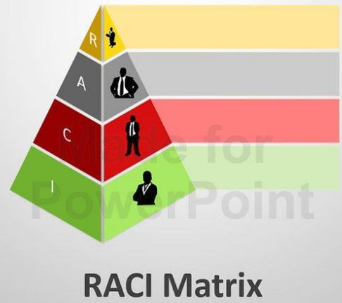
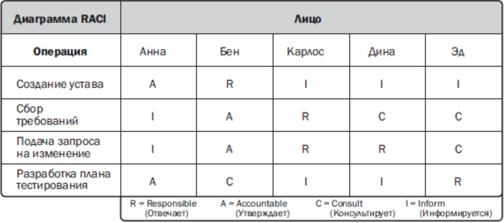
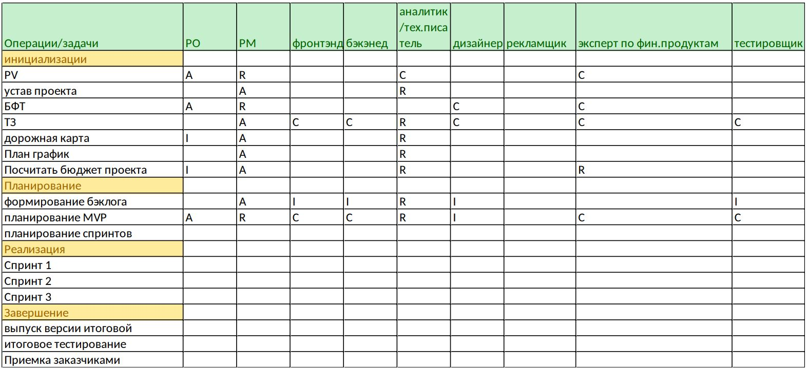
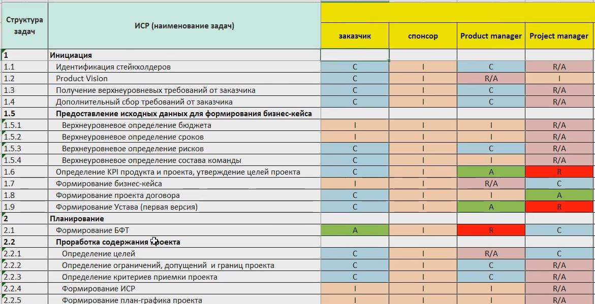
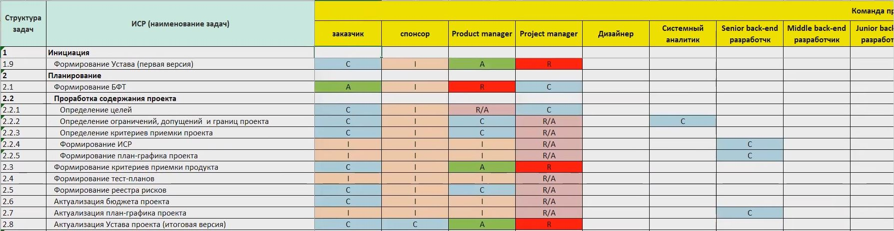
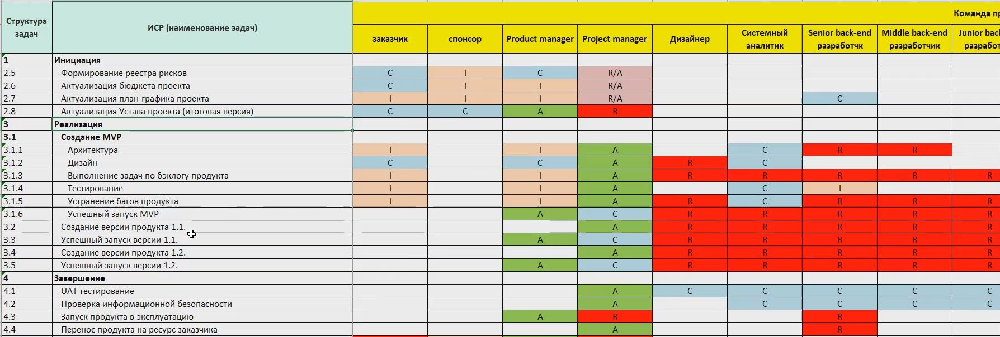

# Урок 10. Как определить команду проекта

# Что будет на семинаре сегодня
+ 📌 Команда проекта
+ 📌 Матрица RACI
+ 📌 Кто из специалистов нужен
+ 📌 Распределение зоны ответственности
+ 📌 Кейсы

# Кто входит в команду проекта?

+ ✓ Руководитель проекта
+ ✓ Спонсор проекта
+ ✓ Заказчик/Владелец продукта
+ ✓ Эксперты/Исполнители
+ ✓ Привлечённые компании-подрядчики

# Вспомним! За что отвечает руководитель проекта?

## Руководитель проекта

+ Лицо, назначенное исполняющей организацией возглавить команду и отвечающее за достижение целей проекта.

Главное лицо в проекте, от личностных и деловых качеств которого зависит степень достижения целей проекта и его успех.

# А что делает в команде спонсор проекта?

## Спонсор проекта:
+  Лицо (или группа лиц), предоставляющее ресурсы и поддержку для проекта и ответственное за успех достижения стратегической цели.

# Что делает в команде заказчик проекта?

## Заказчик проекта

+ ➢ Лицо или организация, которые будут использовать продукт и результаты проекта.
+ ➢ Может быть как внешней по отношению к исполнителю организацией, так и внутренним отделом или департаментом самой компании-исполнителя.

## Функции заказчика проекта / Product owner-а

+ ➢ Определение и утверждение целей и результатов проекта
+ ➢ Определение требований к продукту проекта
+ ➢ Согласование лимитов финансирования проекта,ограничений, предположений и допущений

+ ➢ Выполнение арбитражных функций (при 
необходимости)
+ ➢ Приёмка продукта и результатов проекта
+ ➢ Использование выгод и результатов проекта

# Эксперты/исполнители – как понять кто нужен?

## Источники информации

+ ➢ БФТ
+ ➢ ТЗ
+ ➢ Содержание проекта
+ ➢ Дорожная карта
+ ➢ ИСР
+ ➢ План-график

# Как распределить ответственность между всеми?

## Матрица RACI

Инструмент визуального представления распределения ответственности и полномочий в проекте.

Матрица RACI позволяет избежать недопонимания в вопросах, связанных с правами, обязанностями и границами ответственности участников проекта.

## Аббревиатура RACI

+ ❖ __Responsible__ (исполнитель): отвечает за выполнение задачи.
+ ❖ __Accountable__ (ответственный): отвечает за качество и утверждение результатов выполнения задачи. Обладатель этой роли наделяется полномочиями для осуществления обратной связи с исполнителями.
+ ❖ __Consulted__ (консультант, эксперт):привлекается как носитель уникальных знаний (например, эксперт в предметной области).
+ ❖ __Informed__ (информируемый): его необходимо держать в курсе принимаемых решений и/или хода выполнения задачи (чаще всего в одностороннем порядке, т.к. у него нет полномочий напрямую влиять на выполнение задачи).

## Пример матрицы RACI

## Важные правила для матрицы RACI

+ ❖ Accountable – должен быть только один
+ ❖ Responsible –должен быть по каждой операции (работе), их может быть несколько, причём возможны совмещения
+ ❖ Каждая деятельность обязательно должна иметь Accountable и Responsible

# Кейсы

## Кейс Проект: Разработка мобильного приложения для небольшого частного коммерческого банка с нуля.

У заказчика, который имеет общее представление, каким должно быть мобильное приложение, какие функции оно должно выполнять, есть потребность разработать MVP продукта и он готов активно участвовать в разработке.

Определим команду, распределим ответственность и сформируем матрицу RACI

Полезные каналы от GB:
https://t.me/vacancies_gb
https://t.me/career_gb
https://t.me/geekbrains_ru

