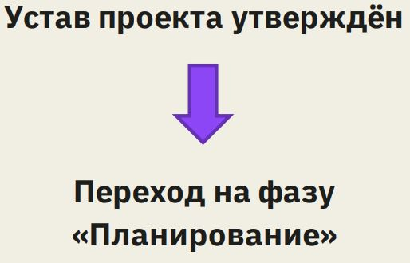

# Урок 11. Что такое Устав проекта

# Что будет на семинаре сегодня
+ 📌 Устав проекта
+ 📌 Для чего нужен
+ 📌 Из каких разделов состоит
+ 📌 Кем утверждается
+ 📌 Кейсы

# Что такое Устав проекта?

Это документ, выпущенный инициатором или спонсором проекта, который формально авторизует существование проекта и предоставляет руководителю проекта (Project manager-у) полномочия использовать ресурсы организации в операциях проекта.

# Что содержит в себе Устав проекта?
+ ❖ цели проекта
+ ❖ требования к продукту и его ключевые характеристики
+ ❖ критерии приёмки продукта
+ ❖ границы проекта
+ ❖ ограничения и допущения
+ ❖ контрольные события расписания (вехи)
+ ❖ риски проекта

# В конце какой фазы Жизненного цикла проекта появляется Устав проекта?

Устав появляется в конце фазы Инициация (выход фазы)

# Кто формирует Устав проекта?

PM + команда

# Кто утверждает Устав проекта?

__Заказчик + Спонсор__

# Зачем утверждать Устав проекта?

Устав нужно утвердить
+ Проведение проектного комитета и принятие решения об открытии проекта.
+ Официально означает старт проекта и утверждение Project manager-а на должность.
+ Вовлечение заказчика и спонсора в проект.

# Что происходит после утверждения Устава?

Устав проекта:
+ является на проекте основополагающим документом, который вбирает в себя все ключевые характеристики проекта

# Кейсы

# Кейс Проект: Разработка мобильного приложения для интернет-магазина одежды

Сформируем Устав проекта

/Files/011.pdf - Пример Устава проекта
