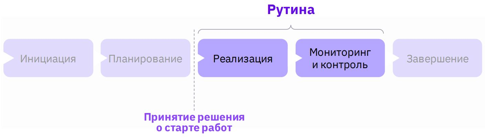
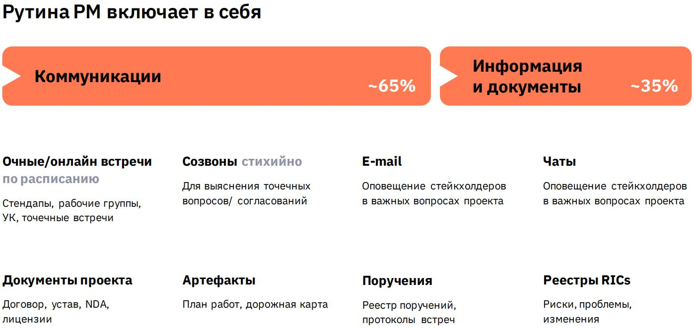
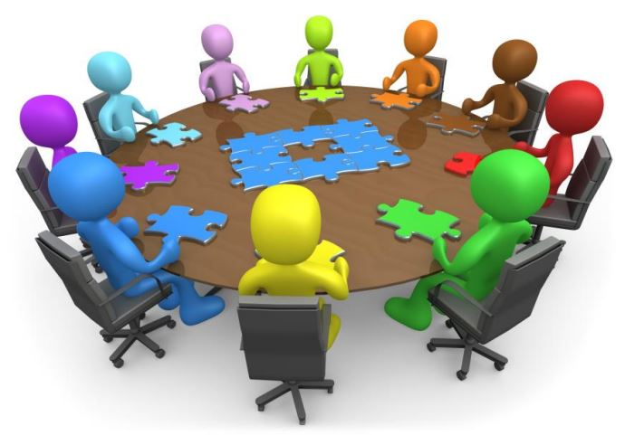
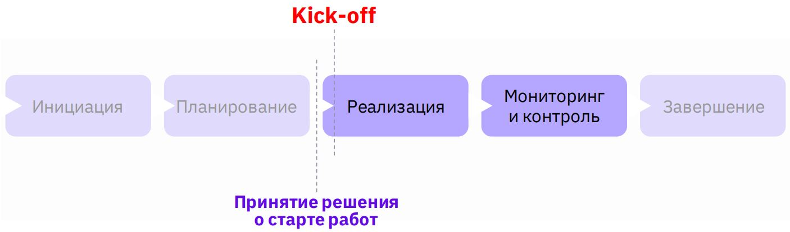
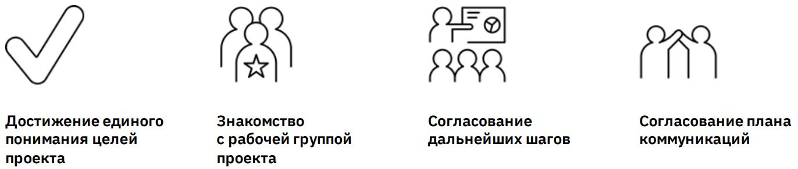

# Урок 12. Как начать реализацию проекта

# Что будет на семинаре сегодня
+ 📌 Когда начинается реализация проекта
+ 📌 Рутина PM
+ 📌 Kick-off встреча
+ 📌 Кейс

# Когда начинается рутина PM?

# Что подразумевает под собой понятие Рутина PM?

# Что такое Kick-off?

Стартовая встреча с участниками проекта после утверждения проекта на реализацию

# Когда проводится Kick-off?

# Кто присутствует на данной встрече?

## Кто присутствует на Kick-off встрече

👓Заказчики проекта
+ Кто будет использовать конечный продукт и их руководство

💪Команда проекта
+ РП, администратор проекта, аналитик, тимлид разработки

👔 Смежные подразделения (стейкхолдеры)
+ Служба информационной безопасности, юристы, инфраструктурные отделы и т.д.

💰 Спонсор проекта
+ Цель присутствия – вводные по проекту, вступительное слово

# Зачем нужна Kick-off встреча?

# Что делать дальше?

Хватит заседать и совещаться – пора работать! ☺

# Кейсы

## Кейс Проект:Автоматизация системы бухгалтерского учёта.
## Заказчик:
Крупная компания с филиалами в 3-х городах: 
+ Москва,
+ Санкт-Петербург и 
+ Казань.
## Состояние сейчас:
На данный момент расчёт зарплаты происходит руками в Excel силами бухгалтеров из этих 3-х городов.
## Решение:
Куплено ПО в виде коробочного решения от вендора. Внедрение и доработка – силами нашей компании.

## Что будем обсуждать на Kick-off и кого пригласим?

