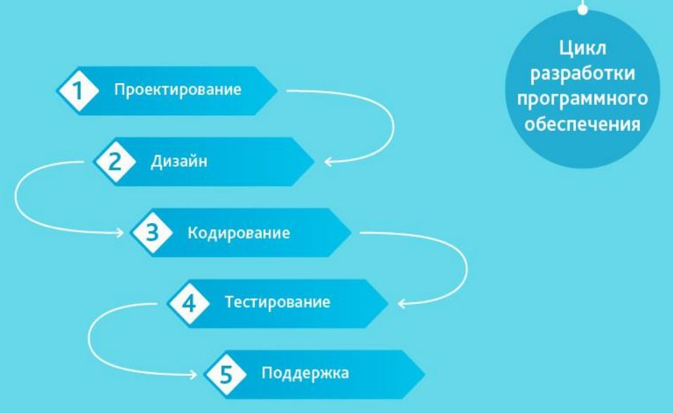
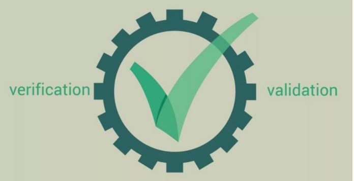
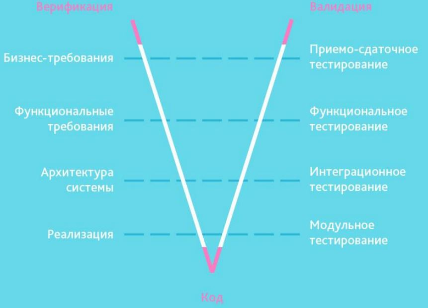
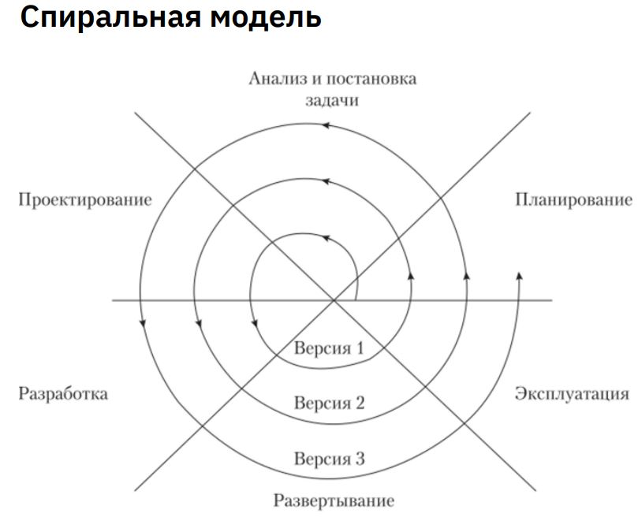
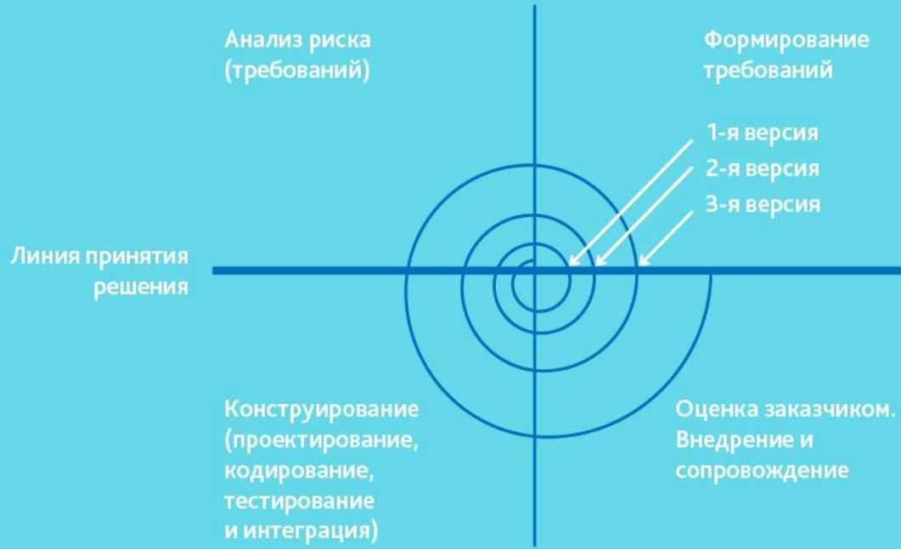
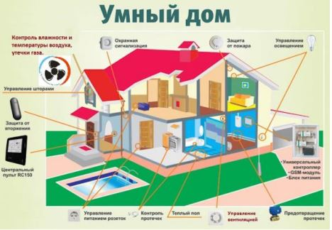

# Урок 13. Традиционные методологии разработки

# Что будет на семинаре сегодня
+ Waterfall
+ V-образная модель
+ Спиральная модель
+ Кейсы

# Какие традиционные методологии разработки Вы знаете?

Самые распространённые Традиционные методологии разработки:

+ «Waterfall Model»
+ V-образная модель
+ Спиральная модель

# Что такое Waterfall (Каскадная модель / Водопад) разработки ИТ-продукта?

## Waterfall
+ является традиционной и самой старейшей моделью управления разработкой продукта
+ предполагает последовательное выполнение всех фаз проекта
+ итоговый продукт будет получен после завершения всех фаз проекта
+ долгое время рассматривалась как основной способ регулярной разработки ПО
+ в 70-80-x годах XX в. была принята Министерством обороны США как Стандарт

# Как Вы думаете какие у неё есть недостатки?

## Преимущества
+ Разработку легко контролировать
+ Стоимость проекта определяется на начальном этапе
+ Не нужно нанимать тестировщиков с серьёзной технической подготовкой

## Недостатки
+ Тестирование начинается на последних этапах разработки
+ Заказчик видит готовый продукт в конце разработки и только тогда может дать обратную связь
+ Разработчики пишут много технической документации, что задерживает сроки

# Где можно применить Waterfall?

+ Когда требования известны, понятны и зафиксированы
+ Нет противоречивых требований к функционалу продукта
+ Нет проблем с доступностью программистов нужной квалификации
+ В относительно небольших проектах

## Примеры

+ в медицинской отрасли
+ в космической отрасли
+ в строительстве

## Почему?
+ Потому что там уже есть много нормативных документов и законодательных актов
+ Именно они помогают чётко сформировать требования к новому ИТ-продукту

# Что такое V-образная модель и чем она отличается от Waterfall?

+ усовершенствованная каскадная модель
+ заказчик с командой одновременно составляют требования к системе и описывают, как будут тестировать её на каждом этапе

# Как Вы думаете какие у неё есть недостатки?

## Преимущества
+ количество ошибок в архитектуре ПО сводится к минимуму
+ преимущества Waterfall

## Недостатки
+ если при разработке архитектуры была допущена ошибка, то вернуться и исправить её будет стоить также дорого, как и в Waterfall

# А что такое спиральная модель?

+ работы над проектом представляются как цикл (спираль)
+ каждый виток спирали является водопадной моделью.

## Особенности спиральной модели

+ цикл начинается с этапа сбора требований к предполагаемым изменениям, вносимым на данном витке, и завершается реализацией прототипа = решается основная проблема традиционных моделей о невозможности изменения требований к продукту
+ заказчик и команда разработчиков серьёзно анализируют риски проекта и выполняют проект итерациями
+ последующая стадия основывается на предыдущей
+ в конце каждого витка (цикла итераций) принимается решение, продолжать ли проект

# Преимущества и недостатки Спиральной модели

## Преимущества
+ уделяется большое внимание проработке рисков

## Недостатки
+ есть риск застрять на начальном этапе (бесконечно совершенствовать первую версию продукта и не продвинуться к следующим)
+ разработка длится долго и стоит дорого

# Кейсы

# Кейс Проект: Разработка системы умный дом.
## Что нужно сделать:
Разработать систему управления чайником, телевизором и холодильником с телефона.

## Как организовать разработку по Waterfall ?

###  Решение
Действуем по модели «водопад» и разрабатываем сразу весь продукт:

+ выслушали идею
+ провели анализ предложений на рынке
+ обсудили с заказчиком архитектуру системы
+ написали большое ТЗ на весь продукт (писали долго и трудно)
+ разработали
+ протестировали в самом конце
+ «выкатили» конечный продукт

Появились ошибки кода, баги и прочие моменты только в самом конце

# Кейс Проект: Разработка системы умный дом.
## Что нужно сделать: 
Разработать систему управления чайником, телевизором и холодильником с телефона.
Как организовать разработку по V-образной модели ?

# Решение

Действуем по модели «водопад», но добавляем этапы промежуточных тестирований:

+ выслушали идею
+ провели анализ предложений на рынке
+ обсудили с заказчиком архитектуру системы
+ написали большое ТЗ (писали долго и трудно)
+ разработали управление чайником – протестировали
+ разработали управление телевизором – протестировали
+ разработали управление холодильником – протестировали
+ «выкатили» конечный продукт

Баги и ошибки есть, но их гораздо меньше

# Кейс Проект: Разработка системы умный дом.
## Что нужно сделать: 
Разработать систему управления чайником, телевизором и холодильником с телефона.

Как организовать разработку по Спиральной модели ?

## Решение

Разделим разработку на 3 витка:
1. Управление чайником
2. Управление телевизором
3. Управление холодильником

## Решение

1. Действуем по модели «водопад» в рамках 1-ого витка спирали:
    + выслушали идею
    + провели анализ предложений на рынке
    + оценили риски
    + обсудили с заказчиком архитектуру системы
    + решили, как будем её реализовывать
    + разработали
    + протестировали
    + «выкатили» конечный продукт
2. Заказчик:
+ оценил результат
+ оценил риски необходимости следующей версии продукта
+ подумал создать следующую версию продукта – с управлением телевизором
+ рассчитал сроки, бюджет и заказал разработку

Программисты снова использовали каскадную модель и представили заказчику более сложный продукт, разработанный на базе первого.

3. Заказчик:
+ принял продукт
+ подумал, что пора создать функциональность для управления холодильником с телефона
+ проанализировал риски и понял, что в холодильник сложно встроить Wi-Fi модуль и производители не заинтересованы в сотрудничестве по этому вопросу.

Риски превысили потенциальную выгоду и заказчик решил прекратить разработку и совершенствовать имеющуюся функциональность, чтобы со временем понять, как развивать систему «Умный дом».

