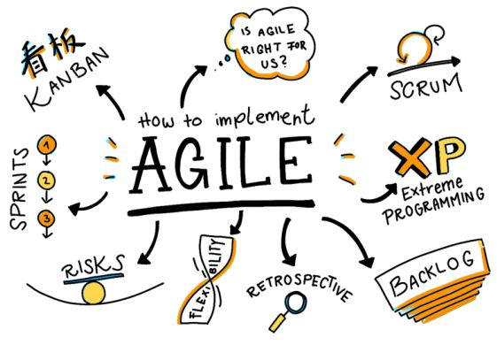
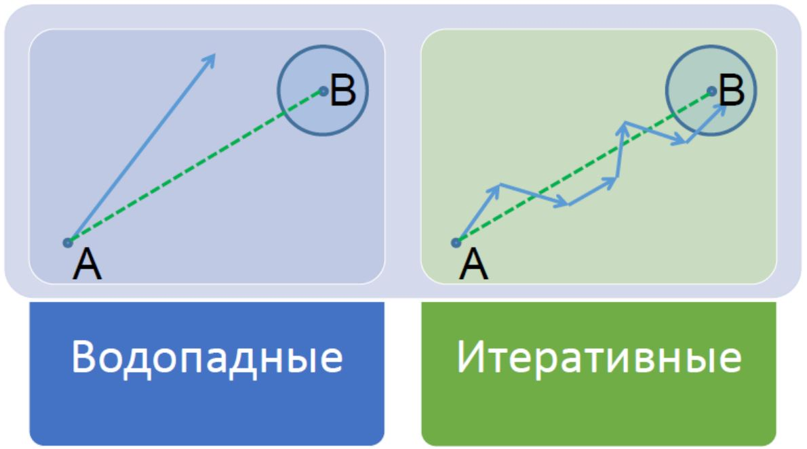
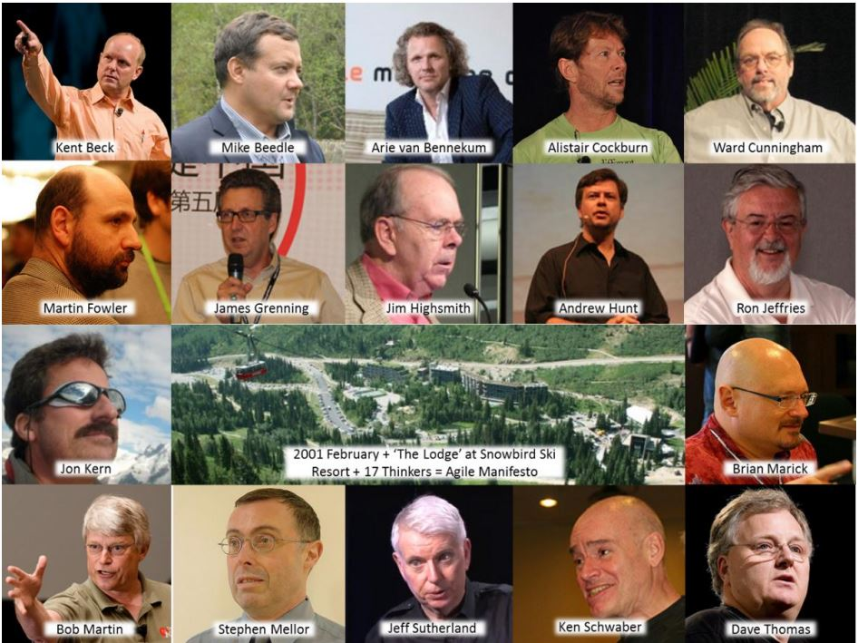
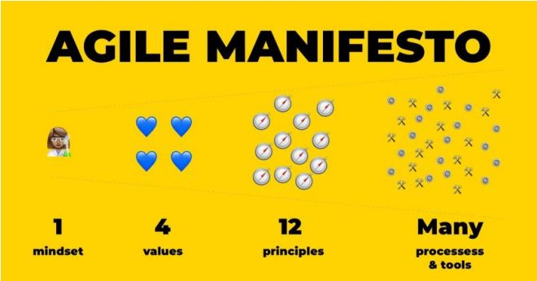
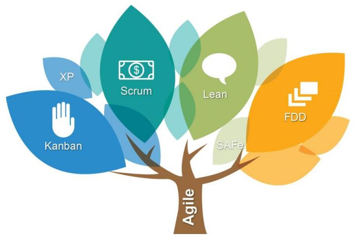
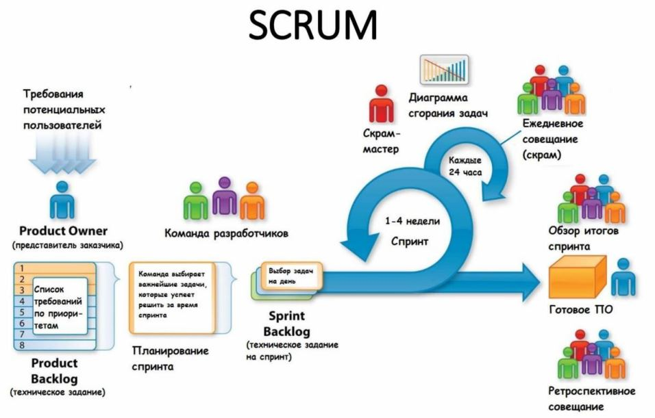
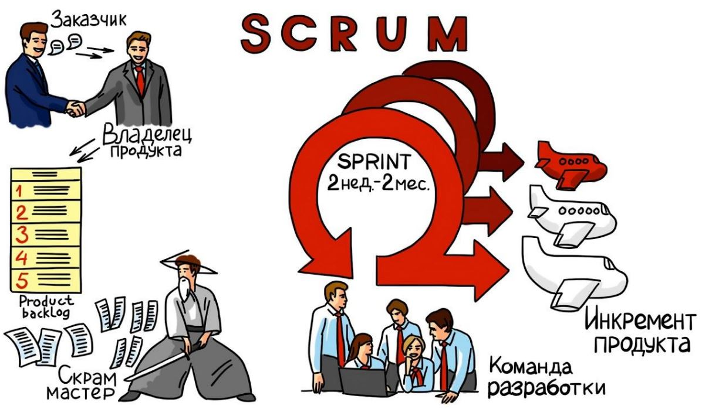

# Урок 14. Итеративная разработка

# Что будет на семинаре сегодня
+ Agile
+ Agile-манифест
+ Scrum
+ Scrum-мастер
+ Scrum-команда
+ Кейсы

# Что такое Agile?

+ c английского переводится как «подвижный, быстрый, проворный»
+ «гибкие методологии»
+ Agile-методология динамично организует разработку ИТ-продукта, постоянно адаптируя проект к новым обстоятельствам и требованиям

# Чем отличается Agile от Waterfall?

## Waterfall
+ конечный продукт должен идеально соответствовать требованиям, целям и задачам, которые были сформулированы до разработки

## Agile
+ в приоритете не исходные установки, а актуальные потребности пользователя
+ нет предварительного генерального плана
+ ИТ-продукт создаётся экспромтом

# Как устроена разработка по Agile?

+ проходит через ряд циклов — итераций
+ каждая итерация — это фактически отдельный проект
+ в рамках итерации разрабатывают фрагмент программы, улучшают функциональность, добавляют новые возможности

# Пример разработки продукта по Agile
+ Коллектив разработчиков создаёт аудиоплеер.
+ Уже написан интерфейс и базовый функционал, воспроизводятся файлы формата MP3, WAV и OGG.
+ Пользователи предлагают добавить проигрывание CD-дисков и подключить горячие клавиши, чтобы быстро управлять плеером.

Начинается новая итерация разработки.

+ Программисты собираются на короткое совещание для реализации нового функционала. 

Один из разработчиков предлагает добавить воспроизведение онлайн-радио.

+ Разработка. Создаётся программный код, интегрируется в продукт, выполняется тестирование.
+ Новый функционал готов – выпускается новая версия продукта.

Итерация завершается и начинается новый виток разработки.

# Как появился Agile?

В феврале 2001 года 17 независимых практиков нескольких методик программирования, именующих себя «Agile Alliance», собрались на горном курорте в штате Юта (США), отдохнули, пообщались и составили небольшой документ – Agile-манифест.

# Создатели Agile

# Agile-манифест
http://agilemanifesto.org/iso/ru/manifesto.html
+ основной документ
+ содержит описание ценностей и принципов гибкой разработки ПО
+ текст манифеста доступен на более чем 50 языках
+ включает в себя 4 ценности и 12 принципов

# Agile-манифест разработки программного обеспечения

Мы постоянно открываем для себя более совершенные методы разработки программного обеспечения, занимаясь разработкой непосредственно и помогая в этом другим. Благодаря проделанной работе мы смогли осознать, что:
+ Люди и взаимодействие важнее процессов и инструментов
+ Работающий продукт важнее исчерпывающей документации
+ Сотрудничество с заказчиком важнее согласования условий контракта
+ Готовность к изменениям важнее следования первоначальному плану

То есть, не отрицая важности того, что справа,
мы всё-таки больше ценим то, что слева.

# Основополагающие принципы Agile-манифеста

## Мы следуем таким принципам:
+ Наивысшим приоритетом для нас является удовлетворение потребностей заказчика, благодаря регулярной и ранней поставке ценного программного
обеспечения.
+ Изменение требований приветствуется, даже на поздних стадиях разработки.
+ Agile-процессы позволяют использовать изменения для обеспечения заказчику конкурентного преимущества.
+ Работающий продукт следует выпускать как можно чаще, с периодичностью от пары недель до пары месяцев.
+ На протяжении всего проекта разработчики и представители бизнеса должны ежедневно работать вместе.
+ Над проектом должны работать мотивированные профессионалы. Чтобы работа была сделана, создайте условия, обеспечьте поддержку и полностью доверьтесь им.
+ Непосредственное общение является наиболее практичным и эффективным способом обмена информацией как с самой командой, так и внутри команды.
+ Работающий продукт — основной показатель прогресса.
+ Инвесторы, разработчики и пользователи должны иметь возможность поддерживать постоянный ритм бесконечно. Agile помогает наладить такой устойчивый процесс разработки.
+ Постоянное внимание к техническому совершенству и качеству проектирования повышает гибкость проекта.
+ Простота — искусство минимизации лишней работы — крайне необходима.
+ Самые лучшие требования, архитектурные и технические решения рождаются у самоорганизующихся команд.
+ Команда должна систематически анализировать возможные способы улучшения эффективности и соответственно корректировать стиль своей работы.

# Agile – это методология? Нет!

Agile – это философия гибкого подхода к разработке, которая вбирает в себя гибкие методологии и фреймворки для управления разработкой ИТ-продукта

# Какие Agile-методологии Вы знаете?

+ Scrum (самая большая и часто применимая методология)
+ Kanban
+ XP (экстремальное программирование)
+ DSDM (Dynamic Systems Development Method)
+ Crystal
+ FDD (Feature Driven Development)
+ …

# Scrum

+ «scrum» было заимствовано из игры в регби;
+ с английского языка переводится как «схватка»;
+ впервые появилось в середине 80-х годов ХХ века в работах японских учёных Икуджиро Нонаки и Хиротаки Такеучи
+ они говорили об успехе проектов, в разработке которых участвовали небольшие команды без жёсткой специализации

# Создатели Scrum

## Джеф Сазерленд

+ американский программист
+ в 1993 году применил этот подход при разработке методологии для компании «Easel»;
+ книга «Scrum – революционный метод управления проектами»;
+ назвал подход официально «Scrum».

## Кен Швабер
+ разработчик и консультант по разработке ПО;
+ формализовал эту методологию применительно ко всей ИТ-сфере;
+ в 1995 году на конференции Объектно-ориентированные системы, языки и приложения для программирования» указал:
+ основой Scrum является итеративная разработка

# Как устроена разработка по Scrum?

+ набор принципов и инструментов, которые чаще всего применяют в ИТ-разработке
+ фреймворк (с английского: каркас, структура)
+ руководство по Scrum (Scrum Guide 2020)

# Кейсы

# Кейс Проект: Разработка системы умный дом.
## Что нужно сделать:
Разработать систему управления чайником, телевизором и холодильником с телефона.

Как организовать разработку по Scrum ?

