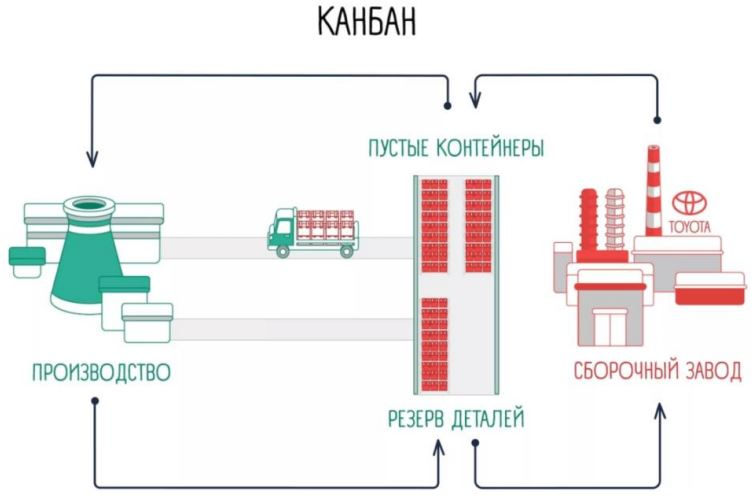
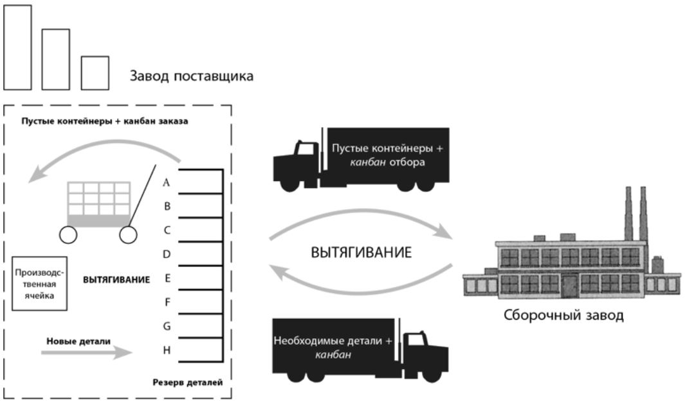
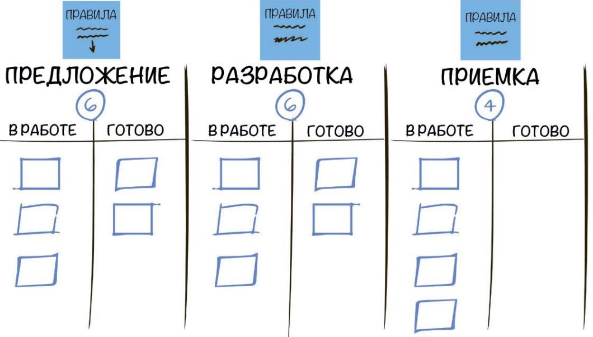
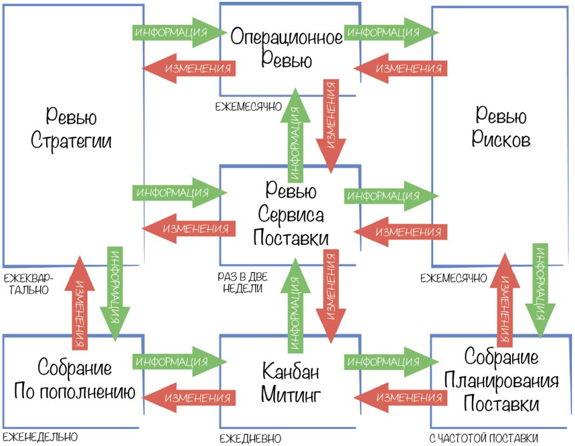
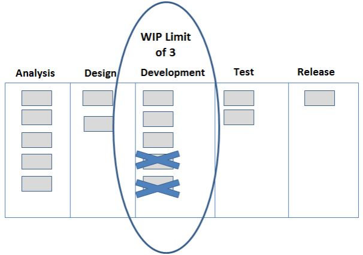
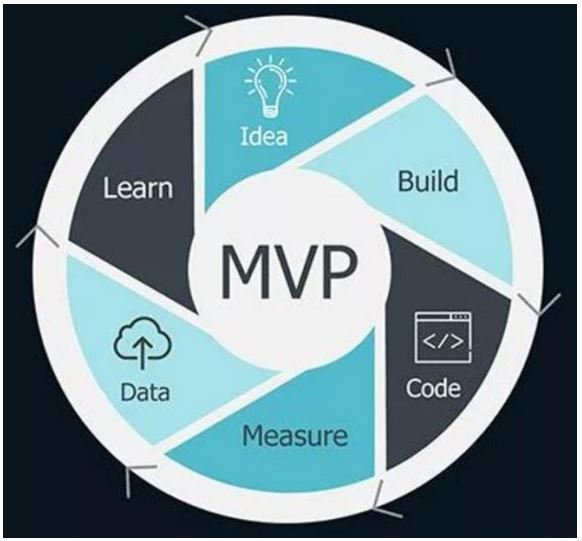
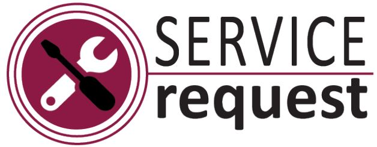

# Урок 15. Что делать, если сроки проекта близки к провалу

# Что будет на семинаре сегодня
+ 📌 Причины срыва сроков
+ 📌 Kanban-метод
+ 📌 Кейсы

# Какие могут быть причины срыва сроков?

+ ✓ Дополнительные требования к продукту
+ ✓ Множество изменений в проекте
+ ✓ Нехватка ресурсов (финансовых, технических, + людских)
+ ✓ Баги в коде
+ ✓ Перегруз команды
+ ✓ …

# Как быть, если команда перегружена и не успевает решать поставленные задачи в срок?

# Kanban-метод

+ ❖ Термин в управлении произошёл от компании Toyota
+ ❖ С японского языка означает «сигнал» или «карточка»
+ ❖ Этим словом называлась бумажка (карточка) с запросом на какие-то действия
+ ❖ На автомобильных заводах такие карточки использовались для передачи информации с одного этапа на следующий о том, сколько и каких деталей потребуется

# Пример

Компании нужно сделать 10 автомобилей точно в срок. 

Отвечаем на следующие вопросы:

Сколько литров краски нам потребуется?
+ Сколько колес?
+ Сколько двигателей?
+ и т.д.

Понимаем сколько каких деталей нам необходимо для производства 10 автомобилей точно в срок.

## Делаем на них отдельный Kanban.

## Не создаем излишки запчастей и экономим на складах, логистике и прочих издержка

# Пример

# А как применить Kanban-метод в ИТ-проектах?

+ ✓ придерживается понятия «точно в срок»
+ ✓ подразумевает интеллектуальный труд
+ ✓ код программиста нельзя пощупать и увидеть, пока он не превратится в ПО
+ ✓ Kanban-метод нужен для визуализации потока интеллектуальной работы и сокращения количества этой незавершенной работы
+ ✓ Достигается равномерная и предсказуемая скорость разработки ПО

# Kanban – это

+ ✓ часть Agile-философии
+ ✓ метод улучшения рабочих процессов путём визуализации и активной работы над незавершёнными задачами
+ ✓ не методология и не фреймворк
+ ✓ метод управления или подход к работе, который можно применять к текущему рабочему процессу
+ ✓ всегда добавление к уже существующему способу работы
+ ✓ __способ улучшить то, что и как вы уже делаете__
+ ✓ не является заменой текущих процессов

# Как выстроить разработку по Kanban?

## Kanban-доска

# Приложения для Kanban-доски

+ ❖ Trello
+ ❖ Asana
+ ❖ Jira
+ ❖ MeisterTask
+ ❖ KanbanFlow
+ ❖ Toggl Plan
+ ❖ YouTrack

# Какая самая главная практика Kanban?

## Ограничивай количество незавершенной работы

+ ❖ работа в процессе (с англ. Work in Progress или WIP) – количество рабочих элементов, находящихся в процессе в определенное время
+ ❖ эффективные системы больше сфокусированы на потоке работы, чем на использовании рабочих ресурсов
+ ❖ когда ресурсы используются максимально, в системе нет свободного места = ухудшение потока (пример: час пик на автостраде)
+ ❖ проблема переключения контекста в интеллектуальной работе = снижает эффективность работы
+ ❖ работа в процессе ограничена = баланс использования ресурсов + поток работы

# Как наладить ритм работы с помощью Kanban?

## Каденции

# Пример: Каденции в проекте по разработке мобильной игры

## Kanban-митинг
+ ❖ ежедневно на 15 минут
+ ❖ проводите у Kanban-доски и обсуждаете что сделали, как проходит ваш поток работы и что можно улучшить в рамках текущего дня
+ ❖ у вас один из разработчиков уходит от выполнения определённой работы
+ ❖ команда совместно должна задать ему вопрос и выяснить почему
+ ❖ найти решение этой проблемы

## Собрание по пополнению очереди
+ ❖ каждую неделю на 30 минут
+ ❖ определяете количество задач, которые будут одновременно в работе и выделяете задачи в работу из бэклога = поддерживаете постоянный поток задач
+ ❖ выбираете 3-4 задачи из бэклога в рамках разработки игры и перемещаете их на доске из столбца «Не начато» в столбец «В работе»

## Собрание планирования поставки

+ ❖ периодичность зависит от количества поставок промежуточного результата работ
+ ❖ занимает 1-2 часа
+ ❖ обсуждение всех моментов выдачи заказчику какого-то результата по вашему проекту
+ ❖ дата релиза MVP мобильной игры
+ ❖ уточнить, кто со стороны заказчика и по каким параметрам будет проверять MVP мобильной игры

## Ревью сервиса поставки
+ ❖ раз в две недели на 30 минут
+ ❖ участвуют: заказчик, менеджер сервиса поставки и команда разработчиков
+ ❖ обсудить с заказчиком, насколько он доволен скоростью выполнения работ в рамках разработки мобильной игры
+ ❖ пропускная способность команды

## Операционная встреча

+ ❖ 1 раз в месяц на 2 часа
+ ❖ выявление слабых и сильных мест в командной работе над всеми проектами в компании
+ ❖ присутствует руководство компании и отделов
+ ❖ параллельно с вашим проектом компания занимается разработкой сайта для интернет-магазина
+ ❖ есть 2 Kanban-системы
+ ❖ на 2 проекта 1 дизайнер, который не справляется с нагрузкой

## Ревью рисков
+ ❖ 1 раз в месяц на 1-2 часа
+ ❖ обсуждаете риски, которые могут сработать при поставке MVP мобильной игры
+ ❖ вырабатываете меры по снижению негативного воздействия рисков

# Ревью стратегии
❖ ежеквартально на полдня
❖ участвует высшее руководство, владельцы портфолио/продукта, члены senior-команды из отделов по работе с клиентами
❖ рассматривают всю операционную деятельность компании в целом
❖ новые тренды в мире разработки + опыт конкурентов
❖ выявляете потенциальные масштабные проблемы и корректируете курс в разработке игры

# Можно ли с помощью Kanban выделить самые важные задачи проекта?

## Да! 4 класса обслуживания

1. __Ускоренный класс__ – неотложная скорая помощь-реанимация.
2. __Класс с фиксированной датой__ – стоимость задержки резко возрастает после определенного периода. Т.е. к определённой дате мы точно должны завершить работу, иначе понесём убытки – штрафы и т.д.
3. __Стандартный класс__ – стоимость задержки растёт пропорционально времени. Если делаем сразу, получаем прибыль сразу. Если делаем долго, получаем прибыль долго.
4. __Нематериальный класс__ – делаем, но явной прибыли эта работа не несёт, стоимость задержки растёт медленно. Например, уборка в доме.

# Предполагает ли Kanban-метод наличие руководителя проекта?
Нет! Есть роли!

## Service Request Manager (SRM)
несёт ответственность за:
+ изучение потребностей и ожидания заказчиков
+ содействие выбору и приоритезации рабочих элементов на Собраниях

Другие названия для данной роли:
+ ✓ Менеджер Продукта
+ ✓ Владелец Продукта
+ ✓ Менеджер Сервиса

## Service Delivery Manager (SDM)
несёт ответственность за:
+ поток работы, в ходе которого выбранные рабочие элементы поставляются заказчикам
+ обеспечение проведения Kanban-митингов и Собрания Планирования Поставки

Другие названия роли:
+ ✓ Менеджер Потока
+ ✓ Менеджер Поставок
+ ✓ Мастер Потока

# Кейсы
## Кейс Проект:
Вы работаете над созданием приложения для прослушивания музыки (что-то очень похожее на Яндекс.Музыка, СберЗвук и т.д.).

У вас в команде достаточное количество людей, но несмотря на это, происходят задержки по выпуску MVP продукта и различные ошибки в коде, которые очень негативно влияют на качество разработки – заказчик недоволен.
Вы используете Scrum-фреймворк. У вас есть Scrum-доска, на которой отображены задачи вашей команды.

Необходимо встроить в свою работу Kanban-метод, чтобы исключить задержки и ошибки в коде.

