# Урок 16. Как комбинировать различные методологии управления разработкой продукта

# Что будет на семинаре сегодня
+ 📌 Гибкие и традиционные методологи
+ 📌 Как бывает в жизни
+ 📌 Кейсы

# Почему в самом начале важно выбрать правильную подходящую методологию управления разработкой?

+ ✓ Методология похожа на технологическую дорожную карту
+ ✓ Показывает набор задач для ИТ-проекта
+ ✓ Даёт команде комплект инструкций
+ ✓ Показывает набор необходимых процессов и фреймворков
+ ✓ Помогает быстро приступить к работе
+ ✓ Способствует стандартизации результатов
+ ✓ Ускоряет принятие решений

# Подходы к выбору методологии

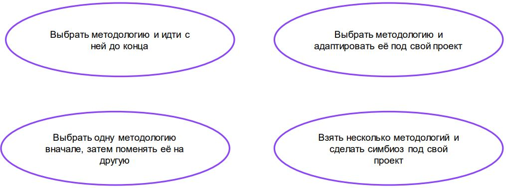

# Можно ли совместить Agile и Waterfall?

Да!

Получится Cтруктурированный AGILE

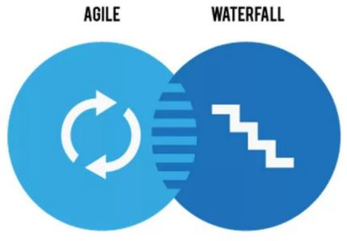

# Чем руководствоваться при выборе методологии?

+ Заинтересованные стороны
+ ИТ-проект
+ Продукт
+ Организация
+ Проектная команда
+ показатели и их значения

## Заинтересованные стороны

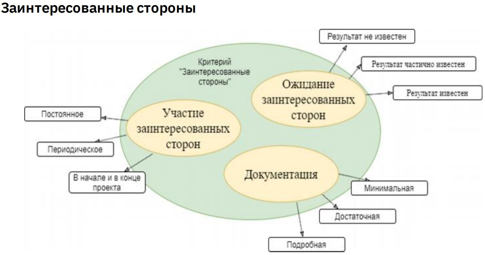

## ИТ-проект

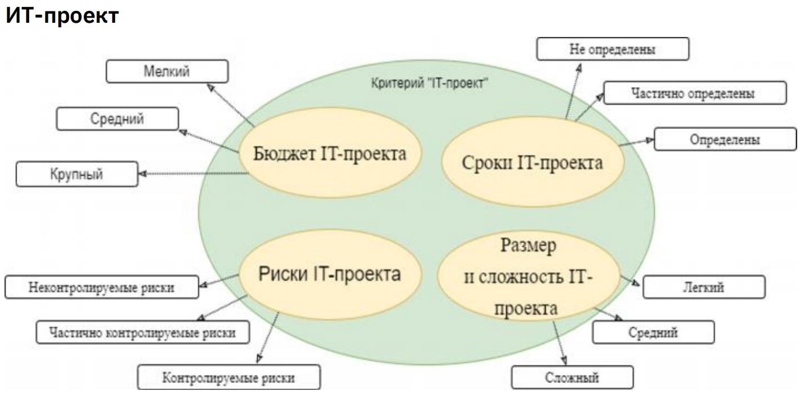

## Организация

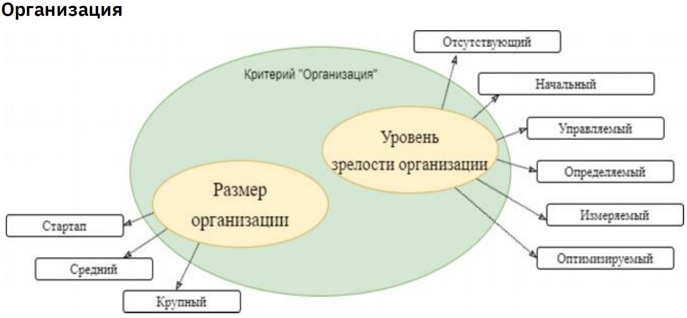

## Проектная команда

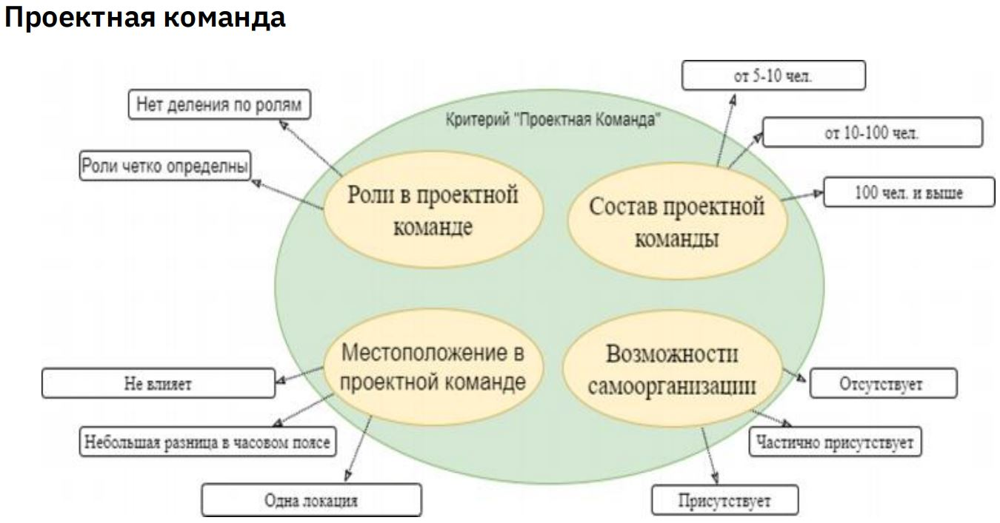

## ИТ-продукт
Показатели критерия:
✓ разработка с нуля
✓ внедрение готового решения
✓ доработка готового решения 

# В итоге
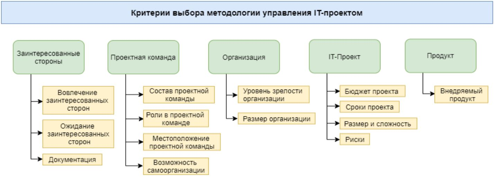

# Кейсы

# Кейс №1

Проект по автоматизации всей финансовой системы одной крупной нефтегазовой компании.

В рамках поставленных задач нужно:

✓ создать полностью автоматизированную систему управления всеми финансовыми потоками предприятия

Проект крупный, бюджет большой, а заказчик – крупная государственная компания с определёнными внутренними правилами планирования финансирования проектов по разработке ИТ-продуктов.

## Во-первых

➢ разделить такого большого слона на маленькие итерации

➢ в рамках итераций наращивать функционал ИТ-продукта

### НО:
✓ есть чётко сформированное ТЗ от заказчика

✓ детально прописан весь функционал системы

✓ заказчик понимает, что всё должно быть реализовано на базе программы SAP

## Во-вторых

➢ вопрос: есть ли риски, что весь требуемый сейчас 

функционал может стать ненужным по мере реализации проекта в условиях изменчивых реалий рынка?

Заказчик отвечает, что нет, таких рисков нет.

Значит, отбрасываем Спиральную модель.

## Берём Waterfall

+ ➢ заказчик хочет сразу увидеть весь бюджет проекта, понимать сроки

+ ➢ мы должны максимально точно всё спланировать

+ ➢ планируем весь проект, детально изучаем ТЗ, осуществляем дополнительный сбор требований заказчика, вносим вместе с заказчиком на самом начальном этапе корректировки в уже имеющееся ТЗ

+ ➢ Начинаем считать потребность в ресурсах: 100 млн.долл. в срок 2 года с командой 120 человек

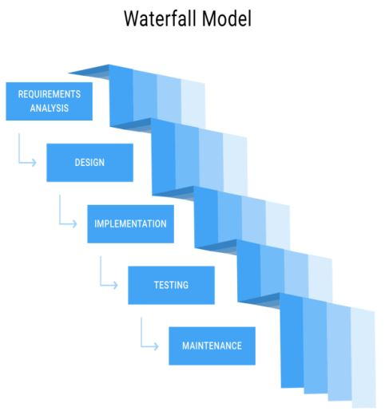

## Waterfall или V-образная модель

+ ➢ ИТ-продукт просто огромный
+ ➢ нужно делить его на этапы (итерации)
+ ➢ нужно тестирование функционала каждого 
компонента продукта
+ ➢ выбираем V-образную модель

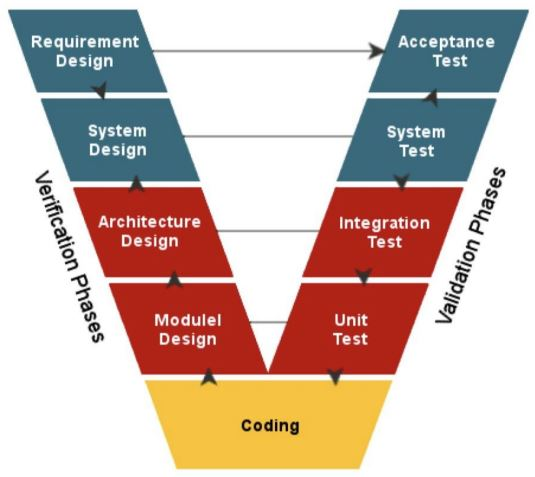

## Организация работы команды

+ 120 человек, разделённых на несколько групп, каждая из которых занимается своими задачами

+ Kanban-метод: перечень задач, ограниченное количество задач и ритм работы с помощью нужных нам каденций:

    1. Kanban-митинги (каждый день по утрам на 15 минут)
    2. Собрание по пополнению очереди (каждую неделю на полчаса)
    3. Собрание планирования поставки (по мере готовности компонента к интеграции в системе заказчика)
    4. Ревью сервиса поставки (раз в две недели на 30 минут)

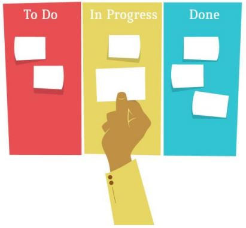

# Почему не Scrum?

+ заказчик не хочет погружаться в проблемы разработки
+ заказчик будет смотреть только готовый компонент разработки
+ заказчику не интересны детали
+ заказчик не готов тратить своё время

# Вывод

Выстроили разработку по 2-м методологиям:
+ V-образная модель
+ Kanban-метод

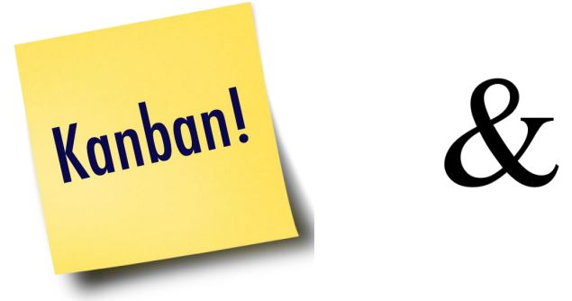

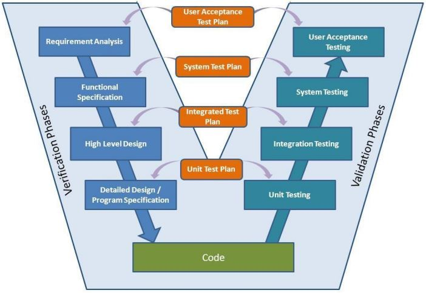

# Кейс №2
+ Проект по разработке модуля автоматизации системы учёта бензина и газа на АЗС
+ Компания крупная, с определённым % гос. доли – есть НПА, регулирующие процедуру закупки услуги ИТ-разработчиков
+ Возможно, нужно будет сразу определить бюджет и сроки – снова Waterfall?

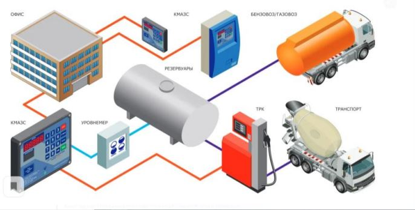

## Новые вводные данные

+ сначала нужно разработать модуль автоматизированной системы учёта бензина
+ спустя год сделать такой же модуль для учёта газа на автозаправочных станциях
+ рисков отсутствия потребности в новом модуле нет – Спиральная модель не применяется

## Особенности

+ у заказчика масса пожеланий, но нет представления как это сделать
+ понимаем – нужен гибкий подход
+ заказчик вовлечён и хочет участвовать в проекте – выбираем Scrum
+ собираем команду: Product Owner, Scrum-мастер, Команда разработчиков
+ пишем бэклог продукта
+ делим проект на спринты и начинаем разработку

## Процесс разработки

+ разработчикине справляются – нужно найти, где проблема
+ Lean-концепция и карта карт потока создания ценности
+ видим, что несколько разработчиков работают над совершенно разными задачами
+ команда довольно активная и все участники готовы друг другу помогать
+ применяем подходы Kanban-метода – ограничиваем количество задач, находящихся одновременно в работе

# Выводы

## В одном проекте применили сразу:
+ Scrum
+ Kanban-метод
+ Lean

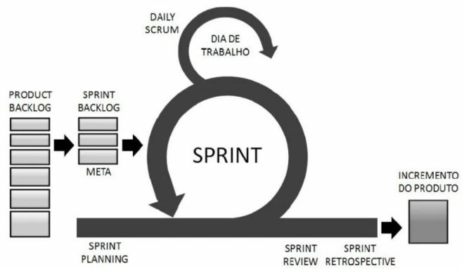

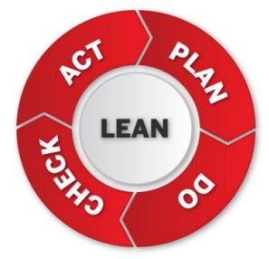

