# Урок 17. Управление командой проекта

# Что будет на семинаре сегодня
+ 📌 Soft-skills
+ 📌 Как выявить мотивацию команды
+ 📌 Для чего это нужно
+ 📌 Кейсы с разборами ситуаций

# Что такое Hard skills?

“Жесткие” или “Твердые” навыки

это технические способности или наборы навыков, которые:
+ легко определить количественно
+ можно наглядно продемонстрировать

“Жесткие” навыки:

+ знание иностранного языка;
+ программирование;
+ скорость набора текста;
+ множество дргуих ...

## Специалист в какой-то области должен в первую очередь владеть специальными навыками

# Какими Hard skills и компетенциями должен обладать PM?

## Треугольник талантов PMI

В недавних исследованиях PMI к навыкам, необходимым руководителям проектов, была применена «Модель развития компетенций менеджера проекта» (Project Manager Competency Development (PMCD) Framework) через «треугольник талантов PMI» (PMI Talent Triangle). 

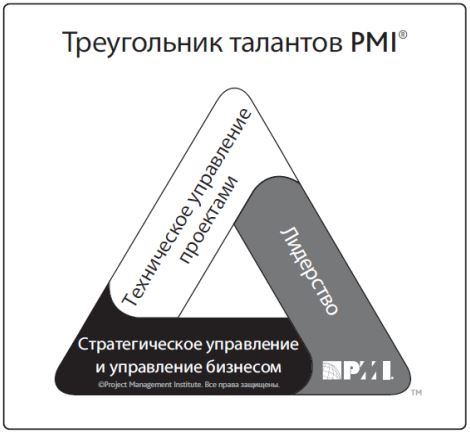

# Техническое управление проектами

Знания, навыки и типы поведения, относящиеся к конкретным областям управления проектом.

Технические аспекты исполнения порученной роли.

Относится к Hard skills.

# Лидерство 

Знания, навыки и типы поведения, необходимые для управления, мотивации и руководства командой с целью помочь организации в достижении её бизнес-целей.

Относится к Soft skills.

Стратегическое управление и управление бизнесом

Знания, профессиональная квалификация и опыт работы в отрасли и организации, которые улучшают исполнение и дают более высокие бизнес-результаты.

Совмещает в себе и Hard skills и Soft skills.

# Исследования PMI
+ наличие только сильных технических навыков управления проектом в современном мире уже недостаточно;
+ компании требуют наличия дополнительных навыков в области лидерства и бизнес-осведомлённости у прожект-менеджеров 
## Почему?
это может помочь в решении более долгосрочных стратегических целей компаний.

# Навыки технического управления проектами Что включает в себя?

## Только технические навыки PM в области разработки ИТ-продукта?

## Ответ: НЕТ, не только!

# Навыки технического управления проектами

Согласно PMBOK выделяются следующие области знаний, необходимые для успешного руководства проектом:
+ Управление интеграцией проекта;
+ Управление содержанием проекта;
+ Управление расписанием проекта;
+ Управление стоимостью проекта;
+ Управление качеством проекта;
+ Управление ресурсами проекта;
+ Управление коммуникациями проекта;
+ Управление рисками проекта;
+ Управление закупками проекта;
+ Управление заинтересованными сторонами проекта.

# Как развивать Hard skills?

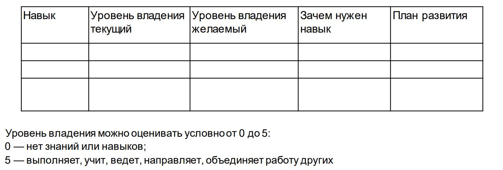

# Что ещё поможет оцениватьи развивать уровень своих Hard skills?

+ Профессиональная литература
+ Гуглить каждое непонятное слово
+ Обратная связь
+ Вести учёт собственных “косяков”
+ Применять информацию на практике
+ Избавляться от того, что не работает
+ Вебинары, курсы, воркшопы, мастерклассы, и т.д.
+ Тестировать себя.

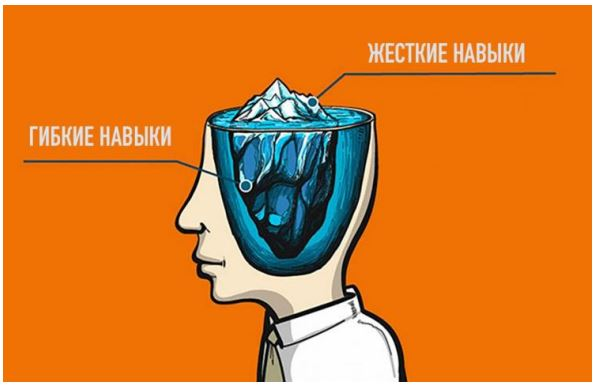

# Что такое Soft-skills?

+ Soft skills в переводе с английского — «гибкие навыки». Иногда переводят буквально — «мягкие навыки», это одно и то же.
+ Не связаны с конкретной профессией.
+ Но помогают хорошо выполнять свою работу и важны для карьеры.

Какие бывают Soft-skills:

+ Чёткость
+ Настойчивость
+ Проактивность
+ Нацеленность на результат
+ Энергия
+ Коммуникации
+ Адаптивность
+ Креативность
+ Убедительность
+ Мышление на 360 градусов
+ Ответственность

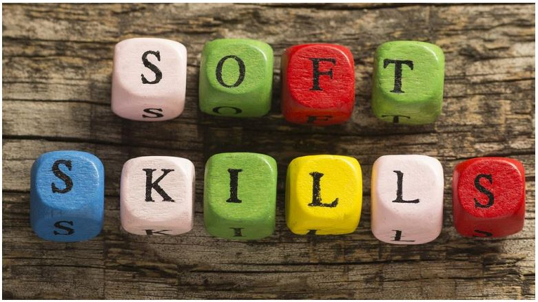

Какой же мягкий навык самый важный?

# Лидерство

Навыки лидерства включают в себя способность направлять деятельность команды, мотивировать её членов и управлять ею. Данные навыки могут включать в себя демонстрацию наиболее важных способностей, таких как ведение переговоров, устойчивость, осуществление коммуникаций, решение проблем, критическое мышление и навыки межличностных отношений.

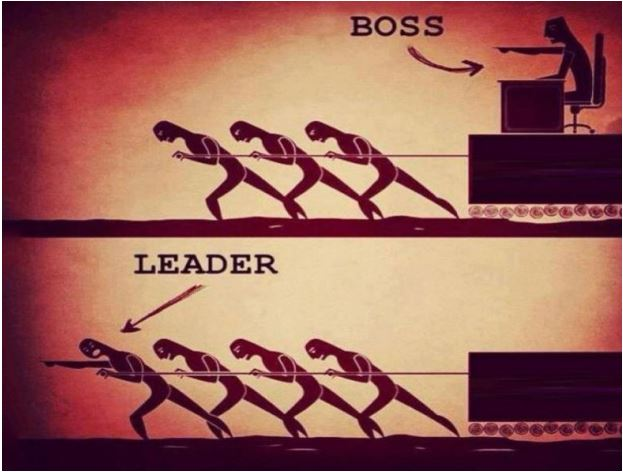

# Почему важны Soft skills?

## Исследования в Гарварде и Стэнфорде

### Влияние на успешность менеджера проекта и на сам проект:
+Hard skills - 15%
+Soft skills - 85%
### Почему?
+ Потому что работа PM связана с общением с другими людьми
+ {>} 70% времени уходит на коммуникации

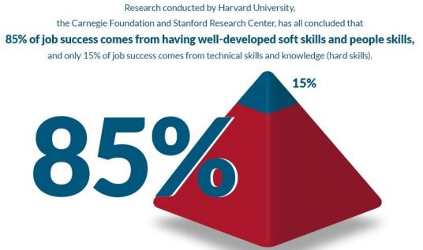

# Как развивать soft skills?

## Нескольких дней точно не хватит
+ чтобы научиться общаться иначе, чем вы привыкли;
+ чтобы начать уверенно анализировать информацию, если раньше вы в этом были не очень сильны;
+ и так почти со всеми soft skills.

## Потому что:
многие из этих качеств связаны с нашими глубинными привычками и установками, а их изменение требует времени.

# Как развивать soft skills?
+ Книги
+ Обратная связь
+ Самоанализ
+ Тренинги

# Как оценить Soft skills?

Представьте, что вы на собеседовании, где потенциальный руководитель или hr задает Вам вопросы по Soft skills.
Например: «В чем заключалась ваша проактивность на предыдущем месте работы или проекте?» 

И вот из каких частей может состоять Ваш ответ на такой вопрос:
1. Как Вы определяете необходимость в проактивности? На что обращаете внимание, как анализируете?
2. Рассказ об успешном примере Вашей проактивности на проекте, обязательно с понятными результатами деятельности.

Просто заявить, что Вы проактивны, не значит в действительности быть таким.

# Что важнее для PM (Hard или Soft skills)?

## Исследования в США и Великобритании
+ Может ли их менеджер в случае необходимость делать их работу?
+ Вырос ли менеджер из специалистов внутри компании?
+ Какой уровень технических компетенций менеджера с точки зрения работника?
# 35 000 респондентов

Ключевой фактор в уровне удовлетворенности сотрудника - высококомпетентный руководитель. 

Даже заработная плата имеет меньшее влияние.

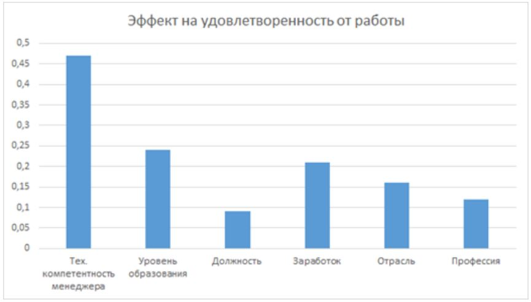

## Нужны?

# Истина посередине

## Не нужны?

# Важно помнить:
+ Без понимания трендов и технологий - Вы будете менее конкурентны на рынке.
+ Без знаний технических деталей - Вы будете меньше удовлетворять команду.
+ Без навыков лидерства и Soft skills Вы не сможете организовать работу команды проекта и отстаивать интересы проекта.

# Что самое важное при формировании своей рабочей группы проекта?

## Энергия группы

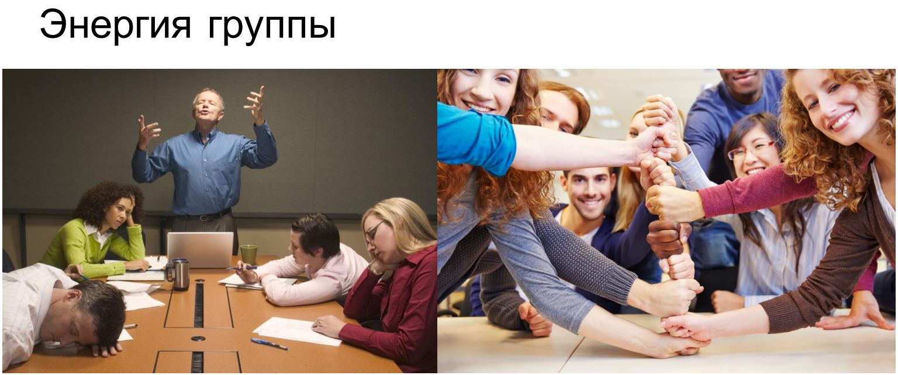

## Процессы в группе

## Групповое развитие

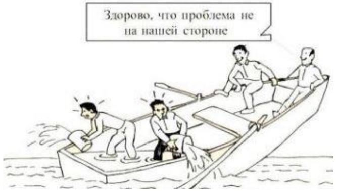

# Стадии развития группы по Брюсу Такману

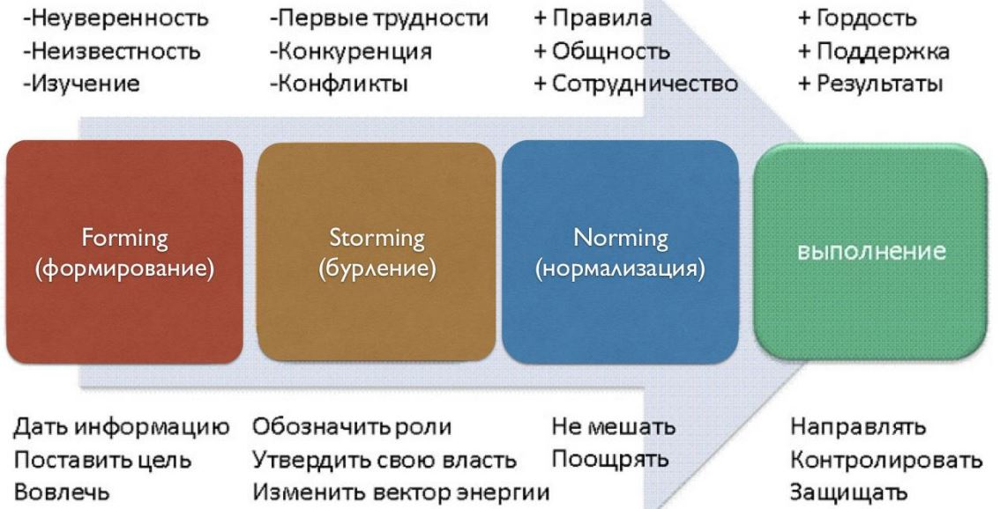

# Группо-динамические процессы и эффекты

## Групповая идентификация: 
самоопределение и личный вклад

## Нормообразование. Наши правила

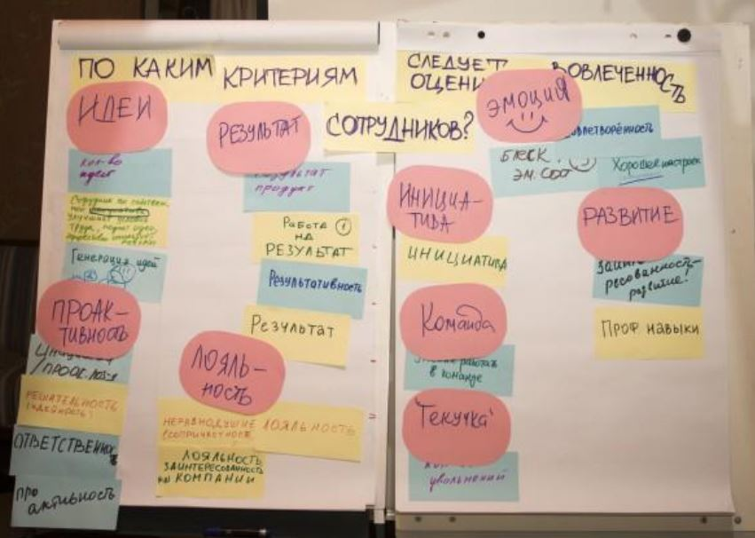

## Групповая сплоченность

## Групповое распределение ролей
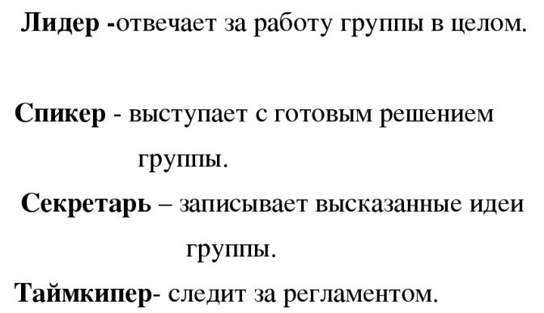

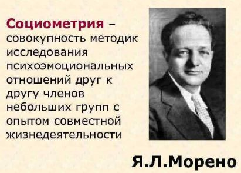

Матрица ROSI

### Звезды 
### Середняки
### Аутсайдеры

## Групповое давление. Конформизм

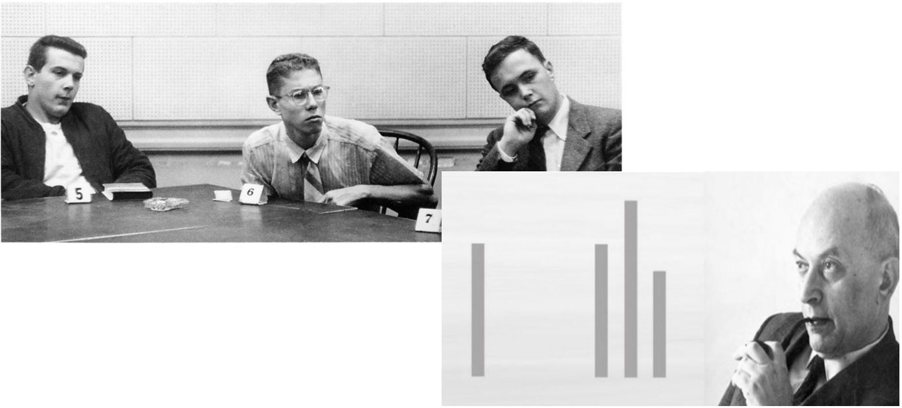

## Групповое принятие решений

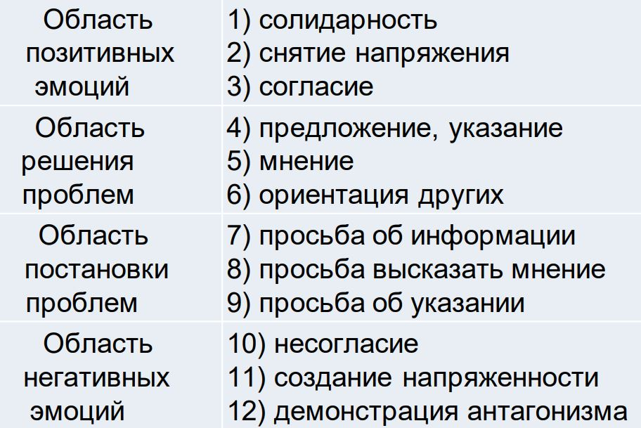

## Каузальная атрибуция
Додумывание 
Интерпретация причин поступков других в условиях дефицита
информации. 

## Групповое табу

Групповая норма-запрет на обсуждение «опасных» тем внутригрупповой жизни. Означает существование в команде устаревших или чрезмерно жестких внутренних правил.

# Кейсы

# Кейс №1 Проект: Разработка мобильного приложения строительной компании для продажи квартир

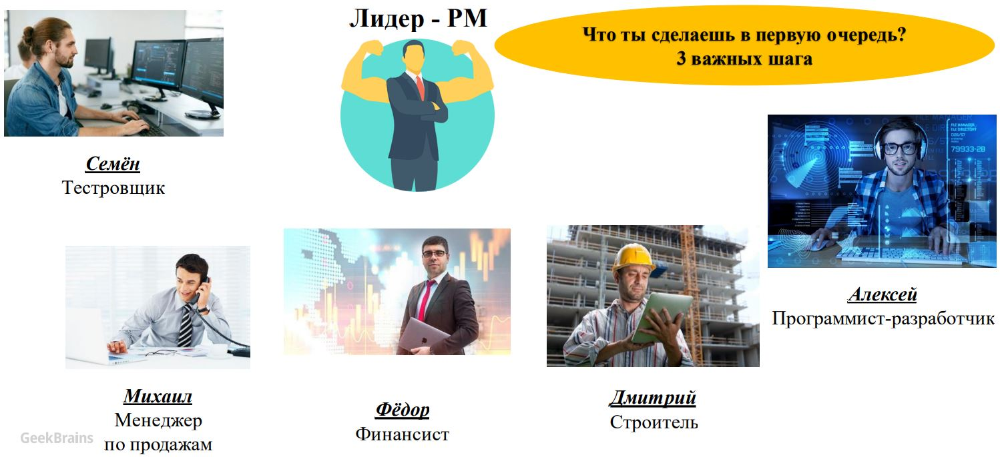

1. Общее собрание!

# Кейс №2 

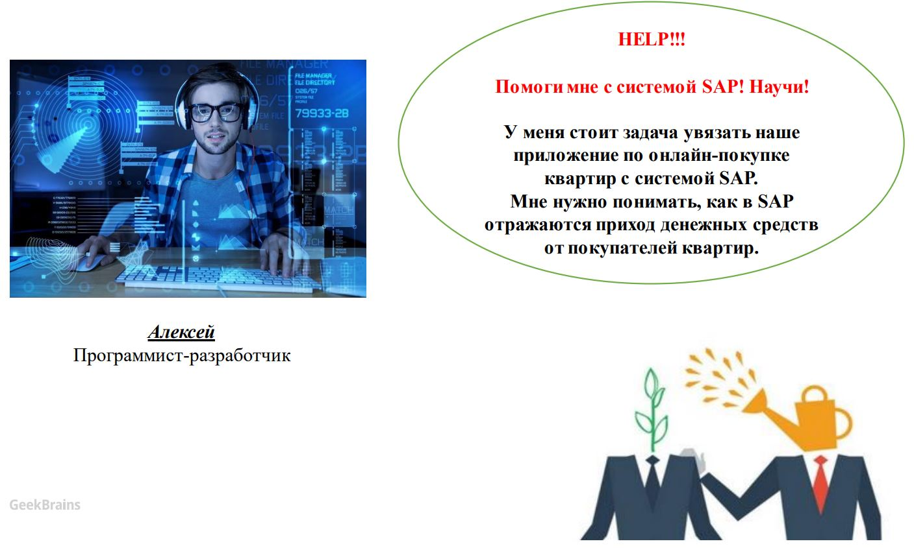

1. Понять насколько вопрос важен
2. Понять чего не хватает
3. Организовать коммуникации с тем кто это знает

# Кейс №3

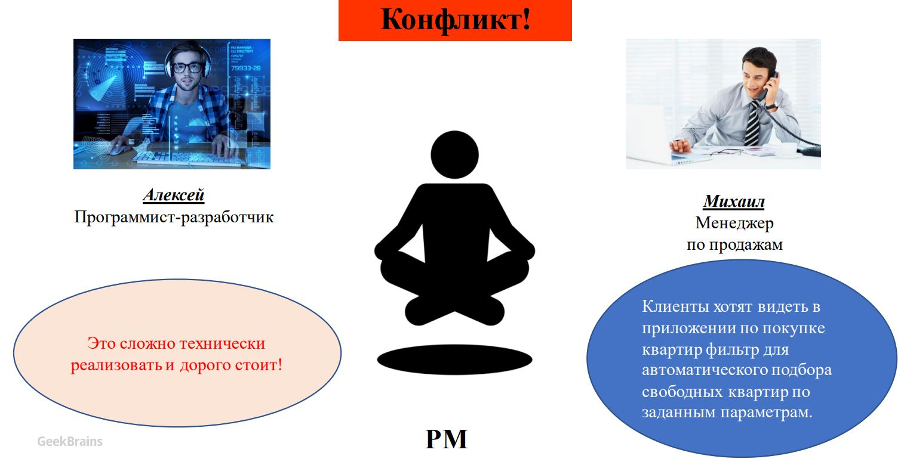

Надо:
1. Понять что хочет Михаил
2. Обратиться к Алексею за зкспертным мнением
3. Анализ запросов и их количества
4. Выйти с предложением к PrOw

# Кейс 4

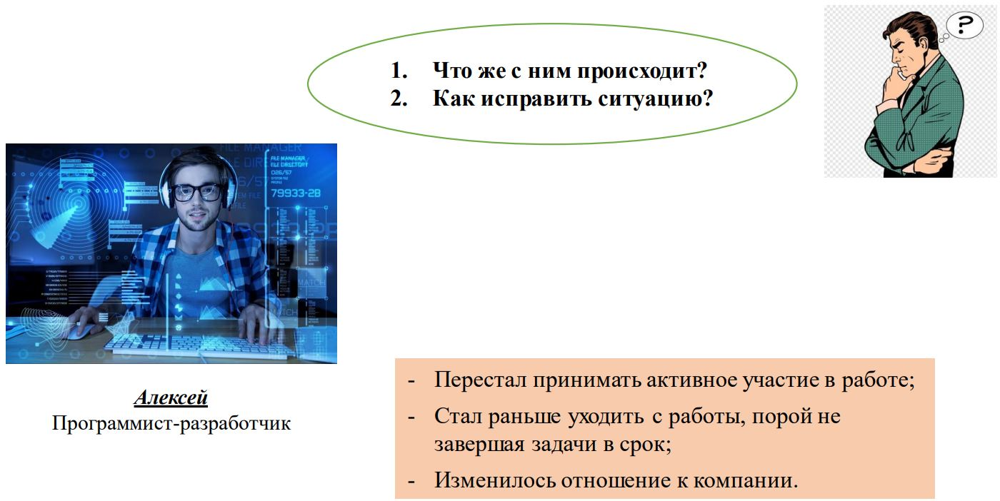

Не рубить! Сначала разобраться! Если не исправиться - избавиться!

