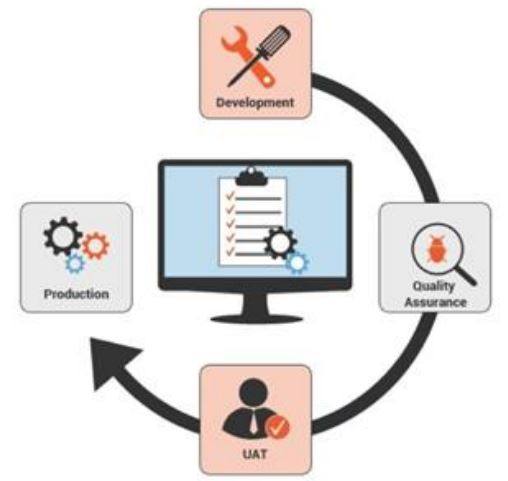
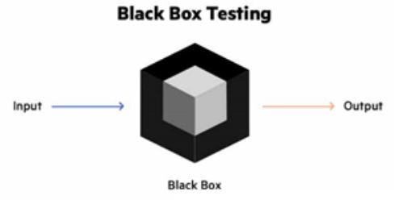
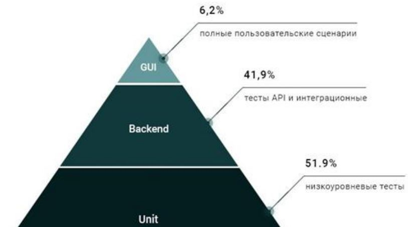
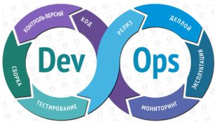
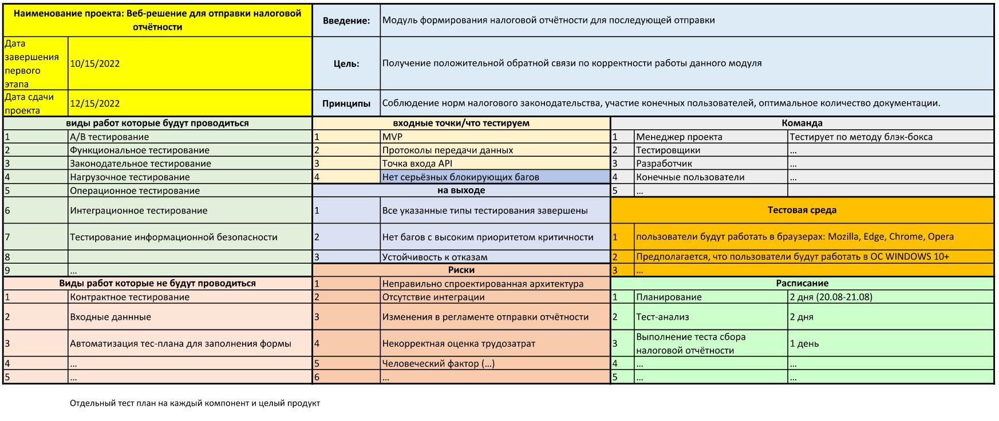

# Урок 18. Что нужно для завершения проекта

# Что будет на семинаре сегодня
+ 📌 Приёмочное тестирование для сдачи проекта
+ 📌 Общие мысли о тестировании
+ 📌 Типы тестов при завершении проекта
+ 📌 Формирование тест-планов
+ 📌 Эксплуатационные испытания продукта проекта
+ 📌 Кейсы

# Зачем нужно тестирование продукта проекта?

## Финальное/приёмочное тестирование

Цель финального тестирования (эксплуатационного испытания) – выявить недостатки разработанного продукта или его части и устранить их, чтобы полученные технические и пользовательские показатели продукта совпадали с запланированными в самом начале проекта.

UAT (User Acceptance Testing) Пользовательское приёмочное тестирование

# Что делает PM при тестировании?

## Роль PM

### Правильное выстраивание процессов тестирования.

# А на самом деле?

Цель финального тестирования (эксплуатационного испытания) – убедить клиента подписать акт приёма-передачи.

# Какие бывают сценарии развития событий при тестировании продукта?

## Процесс приёмки проекта 

### Плохой сценарий:
1. Заканчиваем разработку
2. Заказчик делаетприёмку тем способом, который сам выберет
3. Мы лихорадочно делаем правки, от части правок пытаемся уклониться
4. Манипуляции и давление на клиента пока он не сдастся и не подпишет акт приёмки

### Хороший сценарий:
1. При планировании бьём проект на фазы
2. При планировании проекта пишем также тест план, в котором определяемся верхнеуровнево как будет проходить приёмка и метрики здоровья продукта
3. Согласовываем это с заказчиком
4. В ходе работ над фазой пишем планы и инструкции для UAT-тестирования
5. Делаем официальную приёмку в конце каждой фазы

### Экстремальный сценарий (или продуктовый):
1. При планировании бизнес-фичи пишем тест план, сценарии приёмки и ключевые метрики
2. В ходе работ над фичей пишем план и инструкции для её UAT-тестирования
3. Делаем UAT для каждой фичи по её завершению

Как оформлять приемку фичи? - договоренность о специальной колонке на доске Jira

# Это всё хорошо. Но что делать если всё пошло по плохому сценарию?

+ Главная цель “зафиксироваться”.
+ Получить ФИНАЛЬНЫЙ список правок. И на его основание написать и согласовать __ФИНАЛЬНЫЙ__ план.
+ Подтвердить с заказчиком, что выполнение этих пунктов приведёт к сдаче проекта.
+ Если это не помогает - задумайтесь о фиксировании убытков (не попали в цели либо проблема на стороне клиента)

# Процессы тестирования
Ошибка PM - не видеть процесс, который есть

- подготовка задач к передаче в тестирование
- передача
- приоритезация
- подготовка сред тестирования
- и тд. (процессы могут быть разными)

# Какие Вы знаете типы приёмочного тестирования?

## Еще одно название приёмочного тестирования
UAT (User Acceptance Testing) = Пользовательское приёмочное тестирование

### Цели:
+ Определить, работает ли продукт так, как задумывалось при его создании.
+ Определить, явно ли обозначены все доступные функции.
+ Проверить продукт на наличие багов и сбоев, которые мешают ему выполнять свои основные функции.

Важно: выявить кто должен проводить UAT, установить сроки и внести их в план проекта

# Типы тестирования UAT
+ Альфа/бета тестирование
+ Контрактное приёмочное тестирование
+ Законодательное приёмочное тестирование
+ Операционное приёмочное тестирование
+ Тестирование по стратегии чёрного ящика

## Альфа/бета тестирование
+ Альфа-тест: роль пользователей продукта возлагается на штатных сотрудников и члены проектной команды (в частности, на разработчиков).
+ Бета-тест: проводится уже реальными, специально отобранными пользователями.

## Контрактное приёмочное тестирование (contractual acceptance testing)

__Цель:__ проверить, соответствует ли разработанный продукт проекта контрактным требованиям, согласованным всеми заинтересованными сторонами.

__Используется__ для того, чтобы убедиться в том, что сторонняя команда разработчиков выполнила свои договорные обязательства.

Законодательное приёмочное тестирование (regulation acceptance testing)

Показывает, что продукт соответствует всем законам и предписаниям своей отрасли и юрисдикции.

Такое тестирование необходимо проводить в сферах здравоохранения и финансов.

## Операционное приёмочное тестирование (operational acceptance testing)

__Цель:__ убедиться, что система выполняет свою роль в среде эксплуатации согласно бизнес-модели.

Позволяет оценить следующие процессы:
+ онбординг (эффективное включение пользователей в работу с продуктом);
+ сбор данных и защитные механизмы (отказо-устойчивость, понятны ли выводимые ошибки, соответствует ли требованиям безопасности).

## Тестирование по стратегии чёрного ящика (интуитивное тестирование)
__Цель:__ анализ причинно-следственной связи между взаимодействием пользователя с продуктом и результатом, полученным за счёт этого взаимодействия.

Пользователям говорят, для чего предназначен продукт, но изучать, как именно он работает, они смогут самостоятельно.

## Другие классификации тестов
- функциональные
    - все типы UAT, которые обсуждали выше
    - интеграционное и низкоуровневое (идёт в течении проекта)
- нефункциональные
    - нагрузочное
    - конфигурационное
    - тестирование удобства
- тестирование связанное с изменениями
    - регрессионное

## Другие типы тестов
### Интеграционное
тип тестирования, при котором программные модули объединяются логически и тестируются как группа.

### Нагрузочные
+ эмуляция множества пользователей
+ подвид тестирования производительности, сбор показателей и определение производительности и времени отклика программы или технической системы в ответ на внешний запрос в момент нагруженности системы

# Из чего должны состоять тест-планы?

## Формирование тест-планов

План тестирования должен содержать в себе:
+ что тестируем, приоритеты
+ условия входа и выхода (когда продукт готов к UAT и когда тестирование будет считаться завершенным)
+ кто будет участвовать в тестировании
+ какая роль будет отводиться участникам тестирования в течение всего процесса
+ график и продолжительность тестирования
+ как будут собираться, анализироваться и задействоваться тестовые данные

# Когда формировать тест-планы?

+ Лучше всего одновременно с подготовкой ТЗ.
+ Это помогает при реализации проекта.
+ Имея готовый тест-план и понимая, каким образом будет тестироваться продукт проекта, PM может принимать решения при реализации проекта и чётко видеть, куда двигаться, какие изменения в содержание проекта можно вносить и на что они могут повлиять при итоговой приёмке продукта проекта.

# CI / СD – непрерывная интеграция и поставка

Непрерывная интеграция (Continuous Integration, CI)
Непрерывная поставка (Continuous Delivery, CD)

+ это одна из DevOps-практик
+ относится и к AGILE-практикам
+ автоматизация развёртывания позволяет разработчикам сосредоточиться на реализации бизнес-требований, на качестве кода и безопасности

## Непрерывная интеграция (Continuous Integration, CI)
+ В код вносятся небольшие изменения, но часто
+ Механизм интеграции
+ Механизм тестирования вносимых изменений
+ Обеспечивает последовательный и автоматизированный способ сборки, упаковки и тестирования

## Непрерывная поставка (Continuous Delivery, CD)
+ Стартует после завершения Непрерывной интеграции
+ Автоматизирует развёртывание приложения в различных средах

## Непрерывная интеграция (Continuous Integration, CI)
## Непрерывная поставка (Continuous Delivery, CD)
+ Требует непрерывное тестирование
+ Конечная цель – разработка качественного приложения
+ Зрелая практика CI/CD – непрерывное развёртывание в среде

# Кейсы
## Кейс Проект: Разработка веб-решения для отправки налоговой отчётности в электронном виде

Составим тест-план

### TODO Про CI/CD
https://www.youtube.com/watch?v=7S1ndRRht6M&ab_channel=webDev
