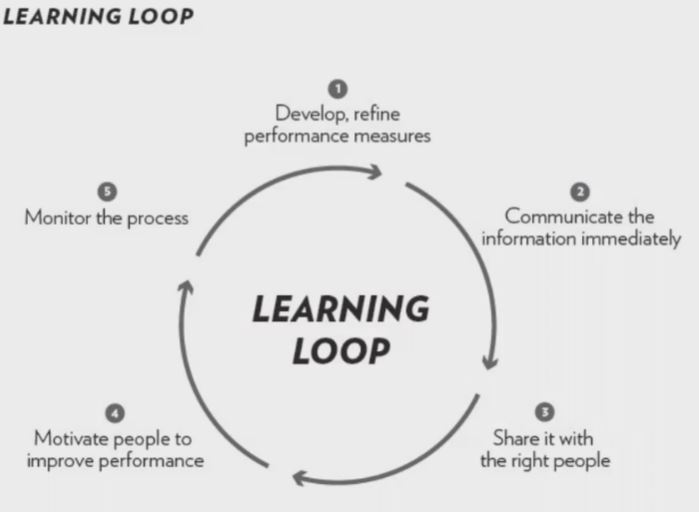
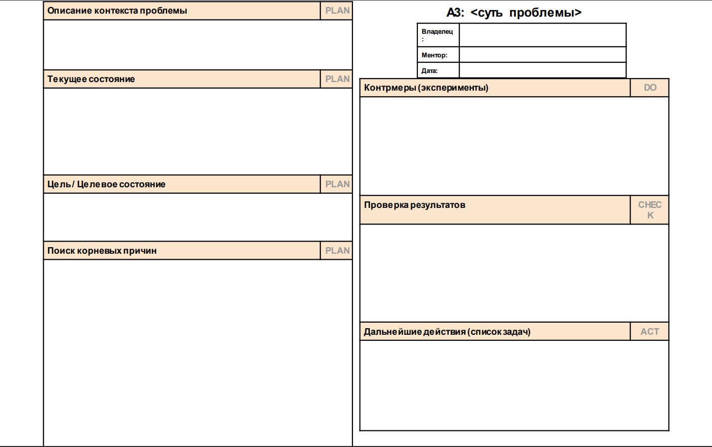
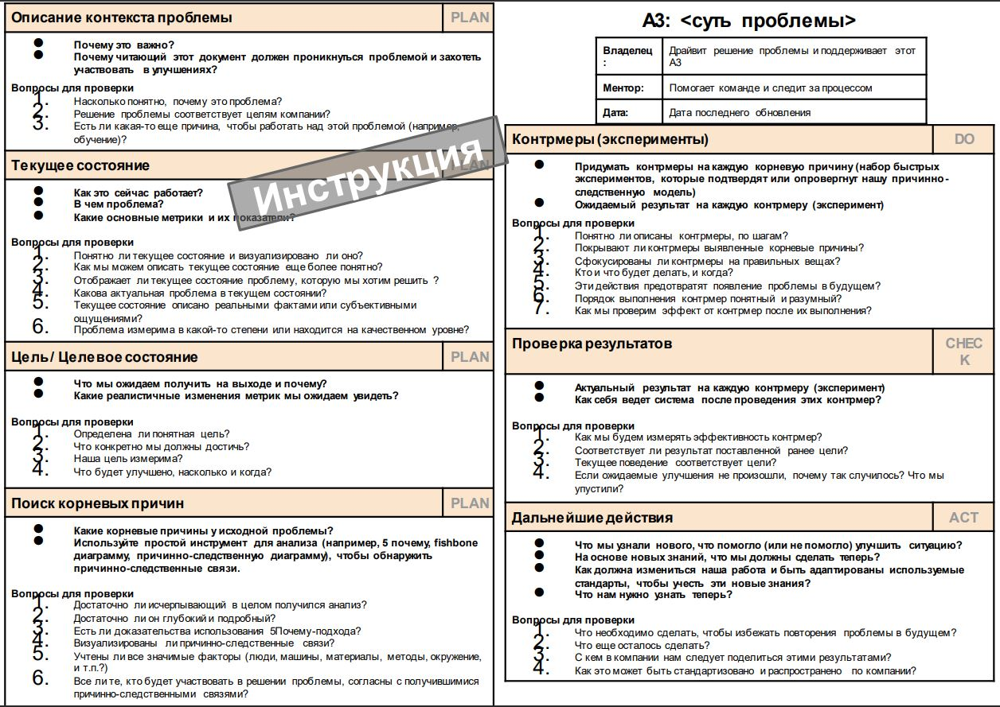
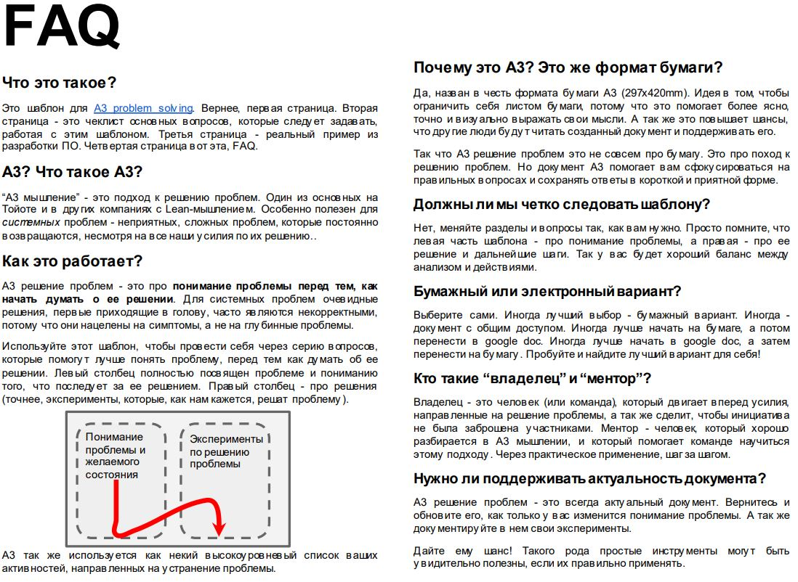
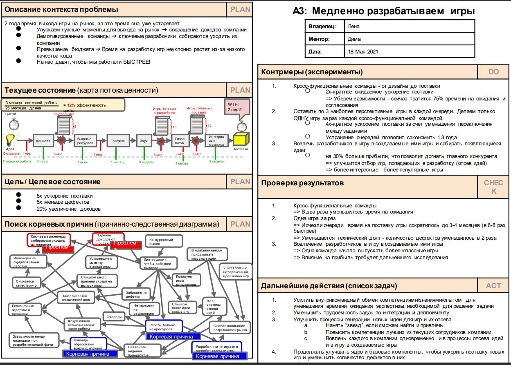

# Урок 19. Как проанализировать свой проект при его завершении

# Что будет на семинаре сегодня
+ 📌 Пост-анализ
+ 📌 Метод А3
+ 📌 Кейс - Отчёт о пост-анализе в формате метода А3

# Что такое пост-анализ проекта?

Пост-анализ – это сравнение фактических показателей проекта с запланированными и анализ всех принятых решений участниками проектной команды, которые привели к таким фактическим показателям.

Пост-анализ включает в себя:
+  сравнение фактических результатов с ожидаемыми при принятии решения о реализации проекта и в ходе управления изменениямипроекта;
+  объяснение причин возникновения различий.

# Для чего это нужно?
## Пост-анализ выполняется после того, как:
+ завершена фаза проекта
+ наступило контрольное событие, веха (заложенные изначально в ИСР проекта)
+ получен MVP*
    *MVP (англ. Minimum Viable Product) – это минимально жизнеспособный продукт, самая ранняя версия продукта, которая обладает только необходимыми функциями, достаточными для того, чтобы донести основополагающие ценности до аудитории и проверить их на первых пользователях.
+ завершён проект.

# Для чего это нужно
+ Выводы, сделанные по завершении работ, крайне полезны в будущих проектах.
+ Всё предвидеть и учесть на этапе планирования и в процессе реализации невозможно, так как проект – уникальный набор работ, направленный на создание уникального продукта.
+ Улучшение будущих оценок
+ Улучшение бизнес-планирования (например, в следующий раз делаем больше экспериментов или сначала делаем MVP, чтобы подтвердить гипотезу)
+ Улучшение процессов ведения проектов

# В чём заключается роль PM?

+ организует работу проектной команды по сбору исходных данных для анализа;
+ может самостоятельно провести пост-анализ;
+ может поручить своей команде провести ост-анализ, изучить Отчёт пост-анализа и принять решение.

Всё зависит от специфики, сферы проекта и набора необходимых специфических знаний для проведения анализа.

# Как делать нельзя?

## Антипатерны пост-анализа!
+ пост-анализ как наказание
+ переход на личности
+ указывание пальцем на ошибки друг друга (работает и для людей и для отделов)

# Как провести пост-анализ?

1. Отобрать ключевые показатели для анализа.
2. Провести анализ план-факт = сравнить плановые показатели по количеству и качеству с тем, что получилось в результате.
3. Выявить отклонения.

# Способ провести пост анализ
+ Post-mortem (ретроспектива)
+ Интервью
+ Сравнение показателей
+ A3

__Ретроспектика__ (или post-mortem) - это инструмент, широко применяемых в гибких методологиях, который нацелен на улучшение работы проектной команды путем анализа текущих результатов.

Ретроспективу проводят на регулярной основе по контрольным точкам.

Например, по завершению спринта/итерации/фазы/релиза/закрытию проекта.

# Как провести ретроспективный пост-анализ проекта?

# Какие ключевые показатели взять для анализа
+ бюджет проекта;
+ сроки проекта;
+ плановые и возникшие риски;
+ управление командой проекта;
+ управление заинтересованными сторонами;
+ управление содержанием проекта;
+ управление изменениями проекта;
+ технические и иные характеристики продукта проекта;
+ иные показатели, требующие анализа, ввиду специфики проекта.

## Бюджет проекта
+ кем формировался
+ как составлялся
+ как отслеживалось сгорание
+ как отслеживалось соотношение ценность/траты
+ как отражались изменения скоупа
+ отслеживалась ли маржинальность (рейты)
+ уложились ли?
+ было ли сужение и расширение команды на разных этапах?
+ были ли бюджетные планы понятны заинтересованным лицам

## Сроки проекта
+ Были ли сроки реалистичны?
+ Был ли план понятен? Был ли доступен? Использовался?
+ В каких задачах не уложились в оценку?
+ Обновлялся ли план своевременно?
+ Были ли активности в проекте, не учтённые в плане (часто UAT забывают)
+ Какие модели прогнозирования использовались и что они показывали на разных этапах?
+ Достаточно ли план был детализирован? Не излишне ли он был детализирован?
+ Как шли по критическому пути?
+ Были ли в плане буферы? Как ими управлялись?

## Управление содержанием проекта
+ Исключение из скоупа
+ Приоритезация
+ Бизнесовое упрощение
+ Техническое упрощение
+ Смена решения/подхода (выход на уровень целей)

Содержание тесно связано со сроками и стоимостью

## Плановые и возникшие риски
+ Какие риски сыграли?
+ Помогли ли планы управления рисками (митигация, уклонение, 
минимизация)
+ Были ли исполнены планы реагирования для сыгравших рисков?
+ Обновлялся ли риск реестр? (новые риски/вероятности)
+ Как риски были отражены в плане проекта?
+ Если риски бюджетировались - хватило или чрезмерно?
+ Эскалировали ли вовремя риски?

## Управление командой проекта
+ Были ли всем понятны задачи, ожидания, области ответственности?
+ Были ли на проекте возможности для роста?
+ Был ли какой-то человек узким горлышком?
+ Был ли bus factor?
+ Насколько эффективны были коммуникации?
+ Каков был индекс счастья команды?
+ Насколько все были вовлечены?
+ Какие конфликты возникали? Как решались?
+ Росла ли скорость команды с ходом проекта?

## Управление заинтересованными сторонами
+ Была ли матрица RACI?
+ Всех ли заинтересованных лиц выявили на старте?
+ Все ли получали достаточно информации?
+ Как заинтересованные лица влияли на проект?
+ Какую оценку проекта дали в конце заинтересованные лица?
+ Индекс удовлетворенности
+ Все ли были в должной мере вовлечены в проект?

## Управление изменениями проекта
+ Был ли процесс?
+ Как быстро мы реагировали на изменения?
+ Как изменения повлияли на результат?
+ Брали ли мы на себя ответственность?
+ Каковы последствия наших решений?

## Технические и иные характеристики продукта проекта
+ Легко ли вносить изменения в наш продукт?
+ Легко ли его поддерживать?
+ Легко ли ввести нового человека?
+ Как мы реагируем на ошибки?
+ Как мы сообщаем об ошибках пользователям?
+ Какой у нас up-time (время непрерывной работы системы)?
+ Есть ли системы мониторинга и алертинга?
+ Как мы реагируем если система упала? Кто-нибудь проснется?
+ Насколько продукт удобный/понятный/простой и т.д.
+ Был ли ответственный за качество?

# Что учесть в Отчёте пост-анализа?
+ параметры и показатели, отобранные для анализа
+ описываются возникшие ситуации и как на них реагировали и какие принимали решения PM и его проектная команда
+ что способствовало успеху или провалу проекта
+ какие выводы должны быть сделаны, дальнейшие шаги по внедрению – поговорим на следующем уроке!

# Метод А3. Слышали о нём?

## Что такое А3 и почему он полезен в пост анализе
+ Agile-методология
+ позволяет находить корневые причины проблем
+ позволит визуализировать дерево причинно-следственных связей и докопаться до корневых причин

Рассмотрим шаблон Henrik Kniberg (коуч и разработчик игр)

# Кейсы

