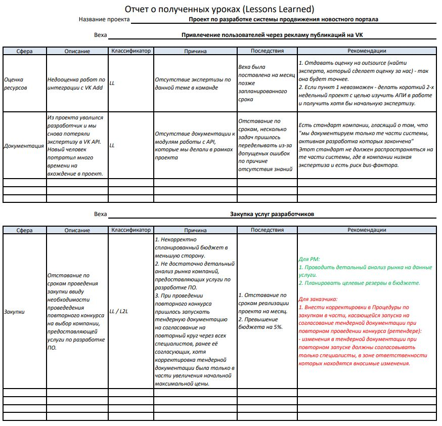

# Урок 20. Как извлечь опыт из своего проекта

# Что будет на семинаре сегодня
+ Что такое LL
+ Процедура LL
+ Отчёт LL
+ LL и L2L
+ Примеры и кейсы

# Как стать хорошим PM?

+ Делать записи
+ Думать прежде чем делать
+ Разговаривать с людьми на проекте
+ Открыто говорить о проблемах
+ Учиться не только на своем опыте
+ Отказаться от списка задач на 1 час в неделю
+ Работать с фактами, а не домыслами
+ Учить или делится опытом
+ Изучать смежные области тоже

# Что такое LL?

__Lessons Learned__ (в переводе с англ. – полученные уроки) – это опыт, накопленный в ходе реализации проекта

# Цели LL
+ Помочь вам и проектной команде в определении корневых причин проблем и потенциальных способов их решений
+ Определить возможные пути повышения результативности будущих проектов
+ Предотвратить повторение ошибок предыдущих проектов
+ Передать лучшие идеи проекта другим проектным командам

# Откуда брать информацию при процедуре LL?

+ трудности, с которыми пришлось столкнуться;
+ непредвиденные ситуации;
+ риски (как идентифицированные в начале, так и возникшие впоследствии);
+ проблемы, которые неизбежно возникают при следовании плану проекта;
+ провалы планирования (сроков, бюджета, качества продукта проекта, распределения ответственностей внутри команды проекта и т.д.);
+ решения и действия, не принесшие должных результатов;
+ успешные решения и дополнения к проекту;
+ недостаточная проработка заинтересованных сторон;
+ проблемы коммуникаций внутри проекта;
+ возможные способы повышения результативности проекта.

# Почему важно документировать,формировать Отчёт LL?
Полученные уроки и сформированные выводы проекта являются важной частью процесса непрерывного улучшения опыта ведения проектов в качестве PM.

# На каких фазах жизненного цикла проекта полезны LL?

## 5 основных стадий проекта
1. Инициирование
2. Планирование
3. Реализация
4. Контроль
5. Завершение

# Применимость LL на стадии Инициирования проекта

## Изучение и анализ уроков предыдущих проектов.
Это необходимо для того, чтобы:
+ определить возможные риски для нового проекта;
+ выработать методы управления такими рисками;
+ использовать опыт предыдущих проектов для успешной реализации текущего проекта;
+ использовать идеи, предложения и выводы для повышения эффективности и прибыльности Вашего нового проекта.

# Применимость LL на стадиях Планирования, реализации и контроля проекта

+ Возникают проблемы и их надо решать!
LL позволяет обоснованно выбрать подходящий метод решения проблемы.

# LL на стадии завершения проекта

+ Происходит подготовка архива проекта, который обязательно должен включать в себя Отчёт о полученных уроках (LL), и сдача его заказчику.
+ Закрытие проекта c точки зрения Project Management невозможно без данного отчёта.

# Процедура LL и PM

Фиксация полученных уроков и выводов проекта проводится непосредственно командой проекта под руководством PM.

_Анализ полученных уроков (Lessons Learned) предыдущих проектов помогает PM-у и всей команде проекта найти корневые причины возникших проблем или вообще избежать этих проблем._

# Давайте поговорим про итоговый документ – Отчёт LL

+ Всю информацию, которую следовало бы учитывать на всех 5-ти основных стадиях проекта, всё, что в дальнейшем Вам поможет не повторить своих ошибок, необходимо включить в Отчёт о полученных уроках (Lessons Learned).
+ Также в Отчёт включается анализ полученных уроков, т.е. что привело к тому или иному исходу, какова была причина.

## Отчёт LL - структура
1. Описание документа
    + Название;
    + Описание проекта;
    + Цель (разъяснение важности и смысла документации полученных уроков);
    + Практическое руководство по использованию шаблона.
2. Полученные уроки
    + Область/сфера применения;
    + Описание;
    + Классификатор (LL или L2L);
    + Причины;
    + Последствия;
    + Рекомендации, замечания, полученные уроки.
3. Акт сдачи/приёма отчёта
    + Основные факторы, повлиявшие на достижение 
    целей и помешавшие выполнению целей;
    + Важная информация, не вошедшая в основной раздел отчёта;
    + Вывод о сдаче/приёме отчёта;
    + Подписи

# LL полезен только PM-у?

## LL и L2L - различия

+ LL (Lessons Learned) полученный урок, применимый к аналогичным проектам.
+ L2L (Lessons To Learn) полученный урок, применимый к Системе менеджмента качества компании заказчика (как для внешнего, так и для внутреннего заказчика по отношению к PM).

# Как отличить LL от L2L
## Задать 2 важных вопроса:
+ Актуален ли полученный опыт только для данного проекта и аналогичных ему проектов?
    
    Если ответ «да», то помечаем LL. Подобная ситуация может возникнуть и в последующих наших аналогичных проектах.
+ Сталкивается ли компания заказчика с подобными ситуациями в ходе своей деятельности?

    Если ответ «да», то помечаем L2L. Такое обстоятельство возникло, ввиду не отлаженной работы каких-то процессов в компании заказчика, из-за чего на проекте возникли проблемы. 

Соответственно, это необходимо учесть компании заказчика при совершенствовании своих бизнес-процессов, особенно если имеется СМК.

# Полезен ли Отчёт LL для заказчика?

Реализуя проект в компании заказчика (как внешнего, так и внутреннего по отношению к PM), необходимо помнить, что реализация проекта также позволяет провести всесторонний анализ своей деятельности в разрезе всей компании заказчика. 

Именно поэтому важно выделять не только опыт, полезный к применению в своих будущих проектах, но и опыт, рекомендованный к внедрению у самого заказчика (L2L).

Отчёт о полученных уроках является полезным не только самому PM, но и заказчику.

# Могут ли извлечённые уроки быть полезны одновременно и PM-у и заказчику (LL / L2L)?

## Да!

Полученные уроки могут одновременно относится и к LL и к L2L.

# Как структурировать анализ LL?

## Важно помнить при формировании Отчёта LL

При заполнении Отчёта о полученных уроках необходимо выделить вехи проекта – по контрольным точкам легче анализировать, что позволило достичь успеха, а что привело к провалу. 

При этом, количество извлечённых уроков не регламентировано, можно указать 5 самых важных, а можно и расписать все 10.

# Кейсы

## Кейс! Проект по разработке системы продвижения новостного портала.

+ недооценка (и переоценка)
+ отсутствие экспертизы в предметной области
+ новые сотрудники (привлечение консультантов)
+ уход разработчика (документация)
+ сложность оценки результатов и ввода в эксплуатацию

