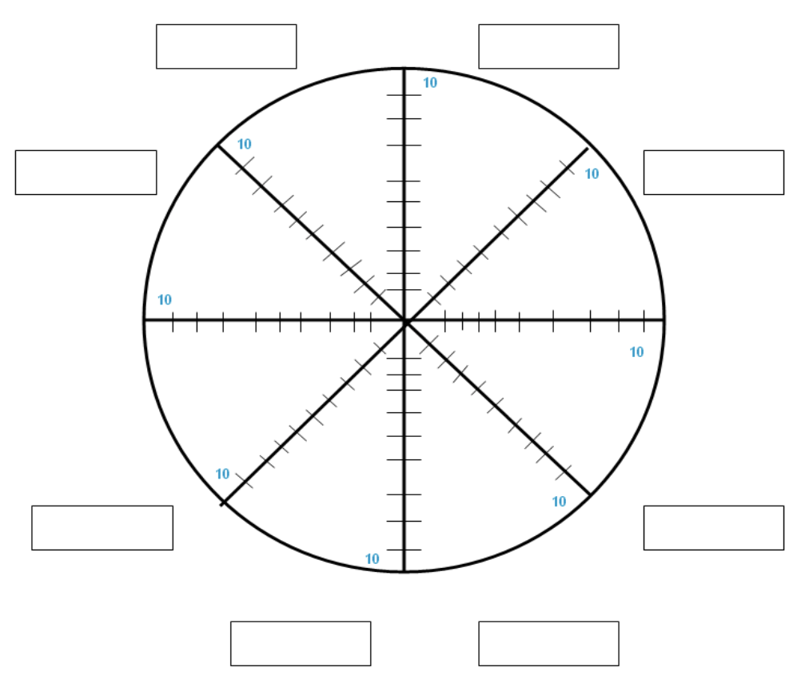
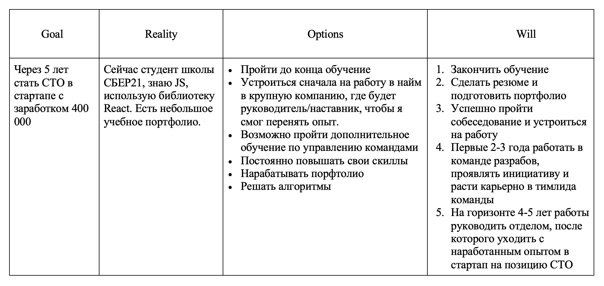
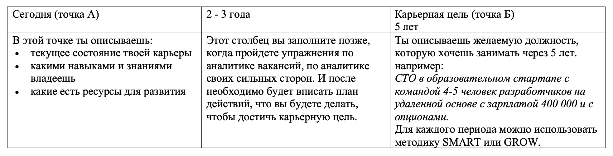
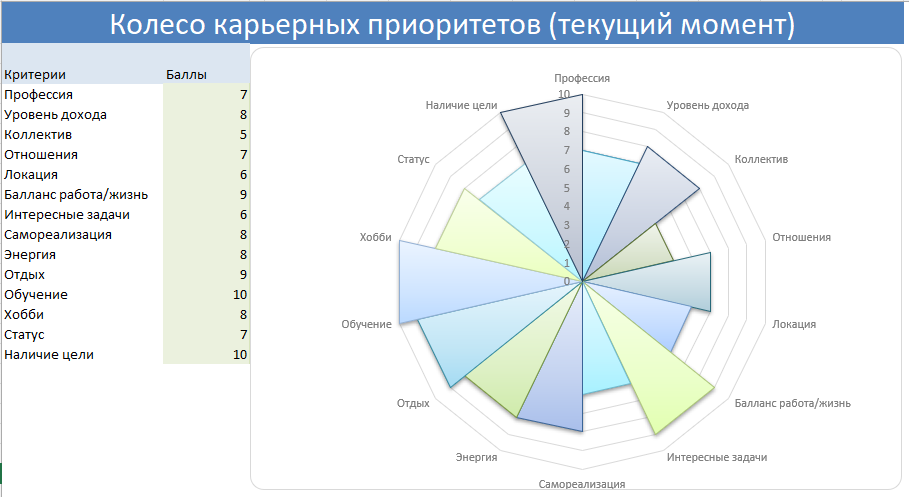
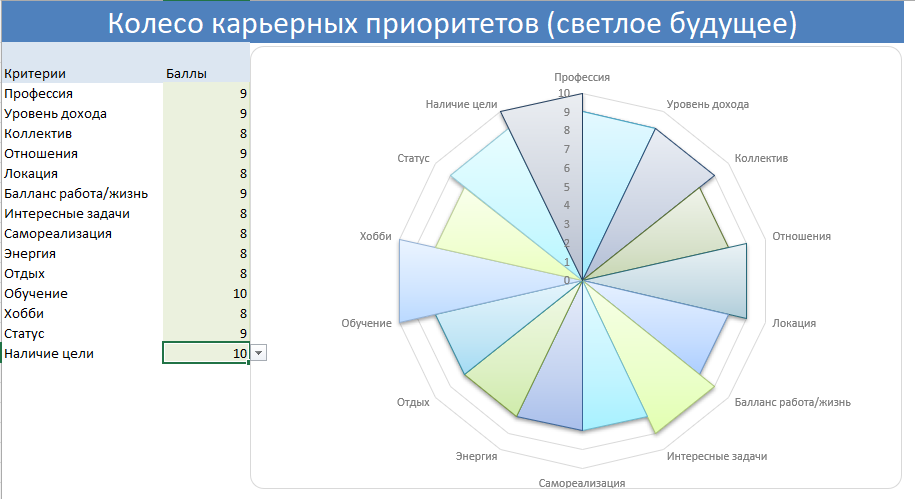

# Career track. Project 00

## Содержание

+ [Project 00](#project-00)
   + [1. Preamble](#1-preamble-00)
   + [2. Genеral rules](#2-genеral-rules)
   + [3. Materials](#3-materials)
      + [3.1 Колесо карьерных приоритетов](#31-колесо-карьерных-приоритетов)
      + [3.2 Постановка карьерной цели](#32-постановка-карьерной-цели)
         + [GROW](#grow-которую-придумал-уитмор)
         + [SMART](#smart)
   + [4. Задача](#4-задача)
      + [Exercise 00 Колесо карьерного баланса](#exercise-00-колесо-карьерного-баланса)
      + [Exercise 01 Карьерные цели](#exercise-01-карьерные-цели)

[Оглавление](/README.md)

# Project 00

В данном проекте ты заложишь основу твоей карьерной траектории, определишь карьерные цели и поймешь, на что важно расставить акценты.

[Содержание](#содержание)

# 1. Preamble 00

Любой поиск работы можно разделить на несколько этапов:
1. Планирование;
2. Анализ рынка;
3. Составление резюме;
4. Отклики;
5. Собеседования;
6. Анализ отказов;
7. Сбор обратной связи;
8. Принятие офера.

Но прежде чем ты начнешь поиск работы-мечты и подходящей для тебя компании, необходимо продумать будущую карьерную траекторию. Именно с этого этапа и начинается твой профессиональный путь и дальнейшее развитие.

В этом уроке ты познакомишься со всеми необходимыми этапами перед составлением резюме.

В этом проекте ты научишься:
+ определять свои ценности;
+ ставить цели и планировать карьеру.

В проекте ты сможешь:
+ сформулировать свои карьерные ценности, которые напрямую влияют на выбор будущей компании и вакансии;
+ выстроить и конкретизировать цели, на основе которых выстроишь карьерную траекторию.

Литература:

1. [Колесо баланса.](https://lifemotivation.online/razvitie-lichnosti/samorazvitie/koleso-balansa-zhizni) [Конспект](/Articles/00_1.md)

2. [Что такое карьерный план.](https://hh.ru/article/25406)
3. [Карьерное планирование: как продумать стратегию своего будущего.](https://www.forbes.ru/forbes-woman/433215-karernoe-planirovanie-kak-produmat-strategiyu-svoego-budushchego)
4. [Как найти баланс между работой, учебой и личной жизнью?.](https://ancor.ru/vacancy/advice/balans-mezhdu-rabotoy-ucheboy-i-lichnoy-zhiznyu/)
5. [Как планировать карьерный путь.](https://weeek.net/ru/blog/kak-planirovat-karernyj-put)

[Содержание](#содержание)

# 2. Genеral rules

1. На протяжении всего курса тебя будет сопровождать чувство неопределенности и острого дефицита информации — это нормально. Не забывай, что информация в репозитории и Google всегда с тобой, так же как пиры и Rocket.Chat. Общайся, ищи, опирайся на здравый смысл и не бойся ошибиться.
2. Будь внимателен к источникам информации: проверяй, думай, анализируй, сравнивай.
3. Будь внимателен к тексту задания, перечитывай по нескольку раз.
Внимательно читай примеры. В них может быть что-то, что не указано в явном виде в самом задании.
4. Могут встретиться несоответствия, когда что-то новое в условиях задачи или примере противоречит уже известному. Если встретилось такое — попробуй разобраться. Если не получилось — запиши вопрос в перечень открытых вопросов и найдешь ответ в процессе работы. Не оставляй открытые вопросы неразрешенными.
6. Если задание кажется непонятным или невыполнимым — так только кажется. Попробуй его декомпозировать. Скорее всего, отдельные части станут понятными.
7. На пути тебе встретятся разные задания. Помеченные звездочкой (*) подходят для самых дотошных и пытливых. Эти задания с повышенной сложностью и не обязательны к выполнению, но если ты их сделаешь, то получишь дополнительный опыт и знания.
8. Не пытайся обмануть систему и окружающих. Ведь в первую очередь ты обманываешь сам себя.
9. Есть вопрос? Спроси соседа справа, если это не помогло — обратись к соседу слева.
10. Когда пользуешься чьей-либо помощью, то всегда разбирайся до конца: почему, как и зачем. Иначе помощь не будет иметь смысла.
11. Всегда делай push только в ветку develop! Ветка master будет проигнорирована. Работай в директории src.
12. В твоей директории не должно быть иных файлов, кроме тех, что обозначены в заданиях.

[Содержание](#содержание)

# 3. Materials

## 3.1 Колесо карьерных приоритетов

Если у тебя нет понимания, что ты хочешь от своей работы, то поиск может затянуться на очень долгое время. Выполнение данного упражнения поможет тебе определить, на что опираться при выборе компании и вакансии. Когда у тебя будет четкое понимание, ты сможешь лучше ориентироваться в рынке труда и выбирать себе работу мечты, на которую ты будешь ходить с удовольствием.

Поиск работы начинается с постановки цели и планирования.
Перед поиском работы можно сделать колесо карьеры с твоими критериями выбора работы:

**Какие это могут быть критерии?**
+ удаленная работа;
+ желаемая вилка ЗП;
+ наличие ДМС / социальный пакет;
+ коллектив и т. д.

Критерии должны быть именно твоими, важными для тебя. Необходимо оценить по 10-балльной шкале, на каком этапе находится каждый критерий сейчас и к чему ты стремишься.

*Зачем это делать?*
Для того чтобы видеть перед глазами, к какой карьере ты стремишься, что ты хочешь улучшить и какие предпринимать шаги по достижению этих целей. 
Расстановка приоритетов поможет тебе при составлении резюме и подборе компаний, прохождении интервью в дальнейшей карьере.  
Работодатели особенно обращают внимание и отмечают тех кандидатов, которые точно знают, чего хотят.

Когда ты будешь выбирать между несколькими предложениями о работе, ты всегда можешь соотнести с твоими приоритетами и правильно сделать выбор.

[Рекомендации.](https://blog.bitobe.ru/article/koleso-balansa/)

[Содержание](#содержание)

## 3.2 Постановка карьерной цели

Постановка карьерной цели помогает декомпозировать твою глобальную цель и быстрее привести к ее достижению.  
Ты можешь поставить цель, например, «хочу стать лидом разработки». Эта цель звучит неплохо, но если ты не понимаешь, как ее достичь, и не разбиваешь на шаги, не анализируешь, что необходимо сделать для ее реализации, то ничего не получится.  
Поэтому существуют разные методики по постановке целей. Их можно применять не только в карьерном направлении, но и просто в жизни. 
Существует множество разных методик по планированию карьеры и постановки целей, которые можно использовать:

[Содержание](#содержание)

### GROW, которую придумал Уитмор:
+ `Goal` — Какая у тебя цель? Чего ты хочешь добиться?
+ `Reality` — Опиши свою ситуацию сейчас.
+ `Options` — Какие есть варианты достижения цели? Кто может тебе помочь? Что тебе нужно? Давай проведем брейнсторминг.
+ `Will` — Что нужно сделать для достижения цели? Какие ближайшие шаги? Когда бы ты мог это сделать?

Например:

Подробнее о [методике](https://hr-portal.ru/story/model-grow-metod-nastavnichestva).

[Содержание](#содержание)

### SMART
После того как определишься с целью, необходимо определиться с ценностями. Каждый человек имеет разные ценности на протяжении всего жизненного пути, и в зависимости от периода жизни они имеют способность меняться. Можно выделить следующие ценности:
+ Автономность,
+ Work-life баланс,
+ Деньги,
+ Стабильность,
+ Новаторство (делаю инновационные проекты),
+ Впечатления (поездки, новые проекты),
+ Команда,
+ Социум/Экология (приношу пользу),
+ Проявление себя / Творчество и т. д.

Подробнее про «Smart» читай [тут](https://in-scale.ru/blog/celi-smart/).

Понимание своих ценностей поможет определиться со списком компаний, которые тебе наиболее подходят, а также к которым ты будешь стремиться.

В помощь можно пройти [тест на ценности](https://onlinetestpad.com/ru/test/74311-test-cennosti-shvarca).

Для того чтобы карьерный путь приобрел четкие планы и при этом придерживался заданного направления, следует карьерную цель разбить на 2 периода:
1. Первая точка отсчета «А» — сегодняшний день.
2. Вторая точка «Б» — твоя карьерная цель на 5 лет вперед. 
Планировать карьеру больше, чем на 5 лет, сложно, потому что мир сейчас меняется очень стремительно, некоторые профессии вымирают, а другие автоматизируются, поэтому важно следить за своим направлением, постоянно совершенствовать свои навыки и быть в тренде.
3. Промежуточная точка между «А» и «Б» — 2-3 года.

Итоговый карьерный план можно нарисовать в MIRO. Там удобно разбивать время на периоды и добавлять необходимые обновления в твоем индивидуальном карьерном треке. Желательно разработать пошаговый карьерный план, в котором будут отображены:
1. Навыки, которыми ты владеешь на текущий момент;
2. Навыки, которых недостает для карьерной цели;
3. Решения, как достичь тех или иных навыков (найти ментора, пройти курсы, взять экспертную оценку и т. д.);
4. Разбивай карьерный план на 2-3 года вперед и на 4-5 лет. Не забывай каждый год сверяться со своим карьерным ростом.

[Содержание](#содержание)

# 4. Задача

Для решения этой задачи необходимо составить твой карьерный трек на ближайшие 3-5 лет. Для этого необходимо понять карьерные цели, ценности и составить пошаговый план реализации.

## Exercise 00 Колесо карьерного баланса

1. Выпиши критерии выбора работы и оцени по шкале от 1 до 10, что происходит на данный момент (от 5 и более).

2. Сделай второе колесо с теми же критериями и оцени их снова от 1 до 10, как бы тебе хотелось, чтобы эти критерии выглядели в будущем.

3. Для каждого критерия придумай и впиши шаги действия, которые ты будешь делать, чтобы его достичь. (Рекомендуем выполнять данное задание с помощью MIRO или подобного инструмента. Прикрепи визуализацию итогового колеса (2 шт.) в папку src.)

**Профессия** - шаг в сторону информационных технологий после всего моего трудового стажа, это конечно тайна мучающая всё моё окружение 🙂 
Сперва родилась версия, что изучение программирования, аналитики, математики и многого другого - это профилактика болезни Альцгеймера 🙃 
Но, все не так однозначно! 
20 лет назад я работал начальником отдела программного обеспечения и связи в одной из "дочек" Газпрома. 
После в моей трудовой деятельности было множество других отраслей народного хозяйства:
+ легкая промышленность (директор трикотажной фабрики)
+ строительство (строил дома, заводы, газопроводы)
+ перерабатывающая промышленность (доля в производстве замороженных продуктов питания)
+ немножко it (заправка картриджей и ремонт принтеров)
+ много юриспруденции (всё таки по первому образованию я юрист 😎)

Сейчас у меня небольшой арендный бизнес. Не могу сказать, что деятельность рутинная и однообразная, скорее наоборот каждый день надо что-то делать и так как мой строительный опыт начинается от подсобника на стройке, то очень многое я умею делать руками 🖐️.

Поэтому в прошлом году я решил нырнуть в it, в этой сфере же очень много ~~денег~~ интересных задач 🙂

Самое главное, что привлекает меня в it, это то что продукт созданный мыслительной деятельность людей становится продуктом, имеющим потребительские свойства и стоимость (главное).

Причем, сначала я очень скептически отнесся к заданиям в CT, а теперь пересмотрев рекомендованные материалы - проникся!

**Уровень дохода** - всех денег не заработаешь, но любой дополнительный доход в отличной от текущей деятельности сферы это пополнение бюджета!

**Коллектив** - тот в моем видении будущего возможны две картины:
+ до определённого момента мой карьерный трек предусматривает работу в найме или фрилансе (тут есть две правды: в большой компании надо брать весь возможный опыт организации трудового и производственного процесса, а в маленьких организациях опыт решения разносторонних задач)
+ итогом я вижу собственный проект или доля в совместном проекте!

**Отношения** - я всегда считал себя способным руководителем, но несколько кризисов пошатнули мою веру в наемный труд и свои способности 😢! 
Теперь изучаю психологию вообще и управления в частности, думаю это должно помочь в комплектовании команды и дальнейшей деятельности!

**Локация** - все деньги в Москве, обучение в Школе 21 для меня такой способ примерить возможность примерить частично удаленную работу!

**Баланс работа/жизнь** - есть у коучей такое высказывание, которое приписывают Конфуцию:
>«Выбери дело, которое любишь, и тебе не придется работать ни одного дня в своей жизни». 
>Конфуций — один из самых известных философов, которого любят цитировать мотивационные коучи и создатели курсов по саморазвитию. К тому же, ссылаться на него удобно: далеко не каждый полезет в Интернет, чтобы удостовериться в авторстве цитаты человека, жившего за 500 лет до нашей эры.

Есть в этом здравое зерно, но для действительно интересной, а главное высокооплачиваемой работой следует попахать!

**Интересные задачи** - тут достаточно вспомнить интенсив, по пол дня сидели силясь понять, что же нужно отправить на проверку, а потом день обсуждали, что же не понравилось Вертеру 😋.

**Самореализация** - тут всё зависит от собственного настроя, но для каждого нацеленного на успех человека даже не большой успех мотивирует на большие свершения!

**Энергия** - выделить этот показатель необходимо, так как это является драйвером развития, принятия решений и их реализации, как и над любым аспектом человеческой деятельности над ним надо работать, у меня был опыт полу-марафона, сейчас пробую встать на рельсы "ЗОЖ", бросил курить, отказался от алкоголя (сам в шоке 🙂)

**Отдых** - с этим проблем не было никогда, но вместо пассивного лежания на диване, пытаюсь найти смысл в выражении: лучший отдых это смена деятельности!

**Обучение** - тут важно найти перечень необходимых знаний и составить план освоения направлений, так как каждый участок как бездонная пропасть - можно накрепко засесть за тонкостями и нюансами и потерять главный ресурс - время!

**Хобби** - когда ты исключаешь из своей жизни само-разрушающие привычки то старые друзья-товарищи очень быстро исключают тебя ищ круга плотного общения, а новые спортсмены-физкультурники не спешат тебя принять в свой круг, надо искать новые сферы интересов и круг общения.

**Статус** - это уже мой персональный запрос, конечно я понимаю что заработная плата решает почти все вопросы, но статусность и известность работодателя для меня тоже важна, хотя в присказке про "шашечки" и "ехать" - я за "ухать"🙂.

**Наличие цели** - утверждение "Вижу цель - не вижу препятствий", это мой случай, с целеуказанием нет проблем, вот только в процессе движения к цели её можно и нужно корректировать в связи с полученой информацией 🙃.

[Содержание](#содержание)

## Exercise 01 Карьерные цели

1. Сделай таблицу твоей карьерной цели на 1-2 года и 4-5 лет.
2. В первой графе опиши текущее состояние карьеры.
3. В третьей графе на основе ценностей и колеса карьерного баланса напиши, к каким карьерным целям через 5 лет ты стремишься, что для тебя важно в работе.
4. Вторую графу пока оставь пустой.

**Для начала воспользуемся методикой GROW, создадим такую табличку**

Goal (Цель) | Reality (Реальность) | Options (Варианты) | Will (Действия)
-|-|-|-
Через 5 - 7 лет подготовить самодостаточный и саморазвивающийся продукт на it-рынке |✔️ Сейчас мне нравиться, что Школа 21 дает непрямолинейные задания, которые находятся на стыке направлений и технологий. ✔️ Всегда есть что изучить подробнее и глубже.  ✔️ Пока нет однозначного понимания точки приложения сил и направления для углубленного изучения |📌Пройти необходимый минимум для доступа к чату стажировок. 📌"Примерить" возможные направления на себя. 📌Углубленно изучить выбранные темы 📌Возможно, обратиться за помощью к карьерным консультантам | 1. Закончить обучение  2. Составить план стажировок и развития карьерного пути  3. Создание собственного продукта. 

Теперь, когда появилось некоторое понимание сделаем таблицу моей карьерной цели.

Сегодня (точка А) | 2 - 3 года | Карьерная цель (точка Б) 5 лет
-|-|-
"Первые шаги", "Проба пера"   Необходимость определения  требуемых компетенций | | Менеджер среднего звена в большой it-компании  Владелец небольшой it-компании   (собственный продукт B2P оказание услуг B2B)   Дальнейшее обучение

[Содержание](#содержание)