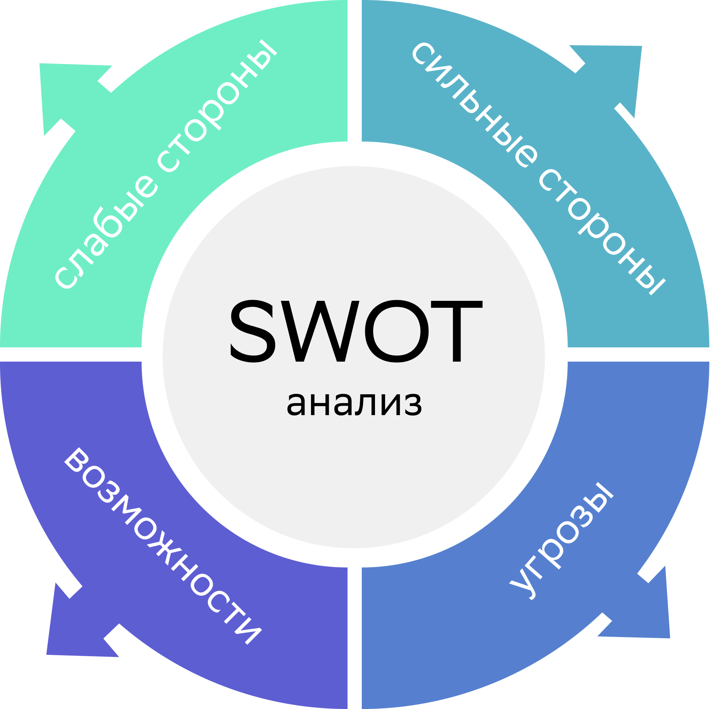

# Career track. Project 01
  
В данном проекте ты познакомишься с основными этапами поиска работы, анализом вакансий, где и как искать позиции, которые релевантны твоему опыту.

## Содержание

1. [Chapter I](#chapter-i)  
    1.1. [Preamble](#preamble)
2. [Chapter II](#chapter-ii)  
    2.1. [General rules](#genеral-rules)
3. [Chapter III](#chapter-iii)  
    + [Аналитика рынка. Где и как искать вакансии и программы стажировок?](#аналитика-рынка) 
        + [Где и как искать вакансии и программы стажировок?](#где-и-как-искать-вакансии-и-программы-стажировок)
        + [Как провести аналитику вакансий?](#как-провести-аналитику-вакансий)
        + [Для чего нужно делать подобную аналитику?](#для-чего-нужно-делать-подобную-аналитику)
        + [Какие существуют ресурсы для поиска вакансий?](#какие-существуют-ресурсы-для-поиска-вакансий)
    + [Советы поиска вакансий через сайты агрегаторы вакансий и карьерные сайты компаний](#советы-поиска-вакансий-через-сайты-агрегаторы-вакансий-и-карьерные-сайты-компаний)
        + [Поиск работы на российском рынке](#поиск-работы-на-российском-рынке)
        + [Если это международная компания](#если-это-международная-компания)
        + [Общие пожелания ко всем целям поиска работы: **Развивай нетворкинг**](#общие-пожелания-ко-всем-целям-поиска-работы-развивай-нетворкинг)
    + [Анализ твоих навыков: hard и soft skills](#анализ-твоих-навыков-hard-и-soft-skills) 
    + [Анализ откликов и отказов](#анализ-откликов-и-отказов)
    + [Критерии выбора вакансии и компании](#критерии-выбора-вакансии-и-компании)
        + [Как не ошибиться с выбором?](#как-не-ошибиться-с-выбором)
        + [Помни про твою цель и приоритеты, что ищешь.](#помни-про-твою-цель-и-приоритеты-что-ищешь)
    + [Анализ требований к кандидатам](#анализ-требований-к-кандидатам)
        + [На что обращают внимание работодатели?](#на-что-обращают-внимание-работодатели)
        + [1. Анализ резюме](#1-анализ-резюме)
        + [2. Анализ soft-skills кандидата](#2-анализ-soft-skills-кандидата)
        + [3. Анализ hard-skills кандидата](#3-анализ-hard-skills-кандидата)
4. [Chapter IV (Задача)](#chapter-iv-задача)
5. [Chapter V](#chapter-v)
    + [Exercise 00 (Выбор компании)](#exercise-00-выбор-компании)
    + [Exercise 01 (Анализ вакансий)](#exercise-01-анализ-вакансий)
    + [Exercise 02 (Анализ навыков)](#exercise-02-анализ-навыков)

## Chapter I

  

---
[Содержание](#содержание)

### Preamble

Представленный проект закладывает прохождение ключевых этапов перед составлением резюме, в частности, проведение аналитики:

1. Анализ рынка вакансий и стажировок. Где и как искать программы стажировок?  
2. Анализ твоих навыков: hard и soft skills. Как анализировать твои навыки для составления резюме?
3. Советы поиска вакансий через сайты-агрегаторы вакансий и карьерные сайты компаний.
4. Анализ откликов и отказов. Дневник поиска работы, который помогает анализировать отклики на вакансии, чтобы понять, что можно улучшить в стратегии поиска.

В рамках проекта ты:

+ упакуешь знания, навыки и опыт для резюме;  
+ выстроишь стратегию поиска работы-мечты;  
+ выберешь актуальные вакансии, которые соответствуют твоим приоритетам и опыту.  

---

[Содержание](#содержание)

## Chapter II

### Genеral rules

1. На протяжении всего курса тебя будет сопровождать чувство неопределенности и острого дефицита информации — это нормально. Не забывай, что информация в репозитории и Google всегда с тобой, так же как пиры и Rocket.Chat. Общайся, ищи, опирайся на здравый смысл и не бойся ошибиться.
2. Будь внимателен к источникам информации: проверяй, думай, анализируй, сравнивай.
3. Будь внимателен к тексту задания, перечитывай по нескольку раз.
4. Внимательно читай примеры. В них может быть что-то, что не указано в явном виде в самом задании.
5. Могут встретиться несоответствия, когда что-то новое в условиях задачи или примере противоречит уже известному. Если встретилось такое — попробуй разобраться. Если не получилось — запиши вопрос в перечень открытых вопросов и найдешь ответ в процессе работы. Не оставляй открытые вопросы неразрешенными.
6. Если задание кажется непонятным или невыполнимым — так только кажется. Попробуй его декомпозировать. Скорее всего, отдельные части станут понятными.
7. На пути тебе встретятся разные задания. Помеченные звездочкой (*) подходят для самых дотошных и пытливых. Эти задания с повышенной сложностью и необязательны к выполнению, но если ты их сделаешь, то получишь дополнительный опыт и знания.
8. Не пытайся обмануть систему и окружающих. Ведь в первую очередь ты обманываешь сам себя.
9. Есть вопрос? Спроси соседа справа, если это не помогло — обратись к соседу слева.
10. Когда пользуешься чьей-либо помощью, то всегда разбирайся до конца: почему, как и зачем. Иначе помощь не будет иметь смысла.
11. Всегда делай push только в ветку develop! Ветка master будет проигнорирована. Работай в директории src.
12. В твоей директории не должно быть иных файлов, кроме тех, что обозначены в заданиях.

---
[Содержание](#содержание)

## Chapter III

### Аналитика рынка

#### Где и как искать вакансии и программы стажировок?

**Анализ рынка вакансий** — это ключ к поиску работы. Именно через анализ можно понять, на какие позиции ты подходишь, какие навыки у тебя уже есть, а какие необходимо подтянуть или приобрести. Аналитика вакансий поможет понять специфику той или иной должности, которая тебе нравится.

#### Как провести аналитику вакансий?

Необходимо вбить в таблицу разные желаемые позиции и определить, какие требования и обязанности чаще всего встречаются.
[Пример таблицы «Аналитики рынка»](../Docs/Анализ_вакансий.xlsx). (доступно для скачивания в папке Docs -> Анализ_вакансий).

#### Для чего нужно делать подобную аналитику?

1. Чтобы иметь четкое представление о будущей профессии.
2. Чтобы определить, каких навыков не хватает и что необходимо подтянуть.
3. Чтобы понять, каким образом ты будешь нарабатывать опыт:  
    + найти дополнительное обучение;
    + приобрести опыт на текущей работе;  
    + найти ментора, который подскажет, какие еще могут быть действия, или даст обратную связь;  
    + найти стажировку.  

Иногда после хорошо проделанной аналитики человек понимает, что вообще не хочет заниматься этой деятельностью, и начинает искать другие вакансии.

Когда ты сделаешь аналитику рынка вакансий, у тебя сформируется полное представление о том, к чему ты стремишься. И уже дальше можно выстраивать конкретные шаги к цели.  

### Какие существуют ресурсы для поиска вакансий?

1. Основные сайты:  
    + HeadHunter – ведущий и один из самых крупных сайтов по поиску работы;  
    + [Работа.ру](https://sber.rabota.ru);  
    + IT-ресурсы: Хабр Карьера, tproger, careerspace;  
    + Если ты рассматриваешь работу за рубежом, то можно обратить внимание на Glassdor и профессиональную социальную сеть Linkedin (работает с VPN).  
2. Сайты со стажировками: Future Today, БудуJobs, icanchoose и др.
3. Карьерные сайты компаний.  

---
[Содержание](#содержание)

## Советы поиска вакансий через сайты агрегаторы вакансий и карьерные сайты компаний

+ Определись **с целью поиска: ты планируешь работать на российском рынке или зарубежном?**
+ Для каждого варианта — свои методы поиска.  
+ Если представить кратко, любой поиск работы выглядит следующим образом:

Составление резюме -> Отклик на вакансию -> Приглашение на собеседование -> Отказ или Офер.  

Но в глобальном смысле поиск работы на разных рынках отличается.  

### Поиск работы на российском рынке

1. Зайди на сайт компании-мечты и найти раздел «вакансии» или «карьера у нас», далее направь резюме и сопроводительное письмо.  
2. Сделай резюме на hh.ru. Также можно оставить отклик как на вакансию, так и на сайте карьеры.  
3. Если в описании вакансии есть контакты рекрутера, можно написать ему сопроводительное письмо, резюме на почту или в мессенджер (в рабочее время).  
4. Подпишись на рассылку вакансий.  
5. Прими участие в [one day offer](https://developers.sber.ru/portal/events/onedayoffer-june).
   + Подобные мероприятия проходят и в других крупных компаниях.  
6. Почти у каждой компании есть свой чат-бот с вакансиями в Телеграме. Подпишись на вакансии и не упускай возможность подать заявку.  

### Если это международная компания

(даже если офис находится в России), то лучше сделать резюме на английском (особенно если вакансия тоже написана на английском):

1. Используй для поиска работы профессиональную сеть Linkedin (работает с VPN), [советы по наполнению здесь](https://habr.com/ru/post/464757/).
2. Откликайся на сайтах компании в разделе «career».
3. Не забывай о дополнительных сайтах по поиску вакансий за рубежом: Glassdor.
4. Подпишись на рассылку вакансий от компании и периодически мониторь.

### Общие пожелания ко всем целям поиска работы: **Развивай нетворкинг**

1. РандомКофе. 
Необходимо выбрать сообщества по интересному для тебя направлению, заводить полезные знакомства, обменяться опытом. Встречи проходят раз в неделю, через Телеграм-бот тебе попадается один человек для знакомства (можно выбирать онлайн или офлайн). Также раз в 2-3 месяца проходят большие нетворк-сессии на 20-25 человек.
2. Принимай участие в профессиональных сообществах (например, proftalk, mesto.co) и хакатонах. Можно следить за [мероприятиями](https://it-events.com).

Такие встречи тебе дадут новые возможности:

+ полезные контакты людей из разных компаний;
+ приглашение на работу;  
+ обратную связь по твоему резюме или тестовому заданию;
+ расширенный поиск ментора для себя.

---
[Содержание](#содержание)

## Анализ твоих навыков: hard и soft skills

Существуют разные методы для анализа твоих навыков. Один из самых популярных — это SWOT-анализ навыков.

Таблицу можно разделить на 4 составляющие:
Первые два пункта можно определить через анализ вакансий.

1. Сильные стороны (к сильным точкам опоры можно отнести):
    + образование;
    + опыт работы;
    + навыки в желаемой сфере, результаты работы и т. д.
2. Слабые стороны — зона развития (к слабым сторонам относят):
    + недостаток информации и опыта;  
    + неумение выстраивать отношения с руководством, коллективом и т. д.  
3. Твои возможности:  
    + наличие времени и мотивации для изучения новой информации.
4. Риски или угрозы:  
    + обстановка в мире;
    + наличие препятствий или конкурентов.

Подробнее, как можно проводить анализ навыков, [здесь](https://www.youtube.com/watch?v=J8EcCQxAzjg&t=125s).

---
[Содержание](#содержание)

## Анализ откликов и отказов

Дневник поиска работы помогает анализировать отклики на вакансии, чтобы понять, что можно улучшить в стратегии поиска работы.
Очень важно анализировать отказы, чтобы при дальнейших действиях оперативно реагировать, вносить изменения и улучшать стратегию поиска работы.

1. Если замечаешь, что больше всего отказов на этапе «рассмотрения резюме», значит, необходимо переработать резюме: проверить должности, какие результаты написаны в опыте работы, твое портфолио.

2. Если отказов больше после собеседования с HR-менеджером, значит, нужно лучше готовиться к собеседованию:
    + лучше продумать рассказ о себе;
    + изучить самые частые [вопросы](https://hh.ru/article/303229);
    + быть готовым к техническим вопросам на [собеседовании](https://tproger.ru/articles/sobesedovanie-v-it-kompaniju-chto-nuzhno-znat-dzhunioru/).  

3. Если отказов больше после техсобеседования / тестовых заданий, обрати внимание на свои hard-скиллы: что необходимо подтянуть?  
4. Можно также обратиться за обратной связью к [менторам](https://getmentor.dev) в своей области или найти человека, который уже работает на данной должности.  

[Пример дневника](../Docs/Diary.xlsx) (доступно для скачивания в папке Docs -> Diary).

---
[Содержание](#содержание)

## Критерии выбора вакансии и компании

### Как не ошибиться с выбором?

Типичная ошибка кандидата — откликаться на все вакансии или во все компании подряд.

Так делать не нужно. Нерелевантные отклики рекрутеры не просматривают.

### Помни про твою цель и приоритеты, что ищешь

Определи, на какие позиции, исходя из своего опыта, ты можешь подойти. 
Составь свой чек-лист выбора вакансии. Пример критериев:

+ Высокая зарплата;
+ Финансовая стабильность компании;
+ Карьерный рост;
+ Интересная работа;
+ Коллектив;
+ Баланс между работой и личной жизнью;
+ Хорошая репутация;
+ Внедрение высоких технологий;
+ Забота об окружающей среде;
+ Участие в волонтерской деятельности;
+ Социальный пакет;
+ Трудоустройство по ТК РФ и др.

Как только ты напишешь свои критерии поиска, будет легче ориентироваться в огромном бассейне разных вакансий.

---
[Содержание](#содержание)

## Анализ требований к кандидатам

### На что обращают внимание работодатели?

Требования к кандидатам можно разделить на 3 части:  

1. Анализ резюме кандидата.  
2. Анализ soft-skills кандидата.  
3. Анализ hard-skills кандидата.  

### 1. Анализ резюме

У каждого рекрутера всегда есть некий прописанный профиль личности кандидата на позицию, которого он ищет.

Что может входить в этот профиль?

+ образование;  
+ определенные навыки / стек технологий;  
+ определенный опыт (например, обязателен опыт в стартапах или обязателен опыт в крупном бизнесе);
+ ожидаемый уровень заработной платы;  
+ желаемый график работы;
+ наличие сопроводительного письма;  
+ знание языков;  
+ наличие портфолио и т. д.  

Исходя из профиля кандидата, рекрутер старается максимально близко найти того, кто ему соответствует, и пригласить на первичный этап собеседования.

### 2. Анализ soft-skills кандидата

Soft-скиллы определяются чаще всего в рамках интервью:  
Проверяются такие компетенции как:

+ коммуникативные навыки;
+ управление собой;
+ мышление (системное, креативное и т. д.);
+ управленческие навыки;
+ предпринимательские навыки и др.

Проверка навыков зависит также от позиции и от профиля кандидата.
Более подробно про интервью будет в DAY 03.

### 3. Анализ hard-skills кандидата

Данный навык проверяется:

+ через тестовое задание;  
+ через техническое собеседование.  

Человек не должен знать все, но может стремиться постоянно улучшать свои знания и становиться экспертом в своей сфере. Поэтому не бойся ошибок, бери обратную связь у более опытных коллег, больше читай профессиональную литературу и решай тестовые задания, например, тут

+ [leetcode](https://leetcode.com/), или тут
+ [codewars](https://www.codewars.com/), или тут
+ [projecteuler](https://projecteuler.net/).

---
[Содержание](#содержание)

## Chapter IV (Задача)

Для решения задачи необходимо определиться с поиском работы: российский или зарубежный рынок.

В этом вопросе нет правильных или неправильных ответов. Ты можешь использовать любые вспомогательные инструменты, задавать больше уточняющих вопросов, записывать, рисовать майнд-мэпы, чтобы прийти к итоговой цели.

По итогу у тебя должно получиться 1-2 вакансии, под которые ты будешь готовить свое резюме.

---
[Содержание](#содержание)

## Chapter V

### Exercise 00 (Выбор компании)

#### Составь чек-лист выбора компании

Обязательно загляни в DAY 00 в упражнение «Карьерное колесо», чтобы все желаемые критерии были максимально соблюдены, насколько это возможно. Это будет Список №1 (от 10 критериев).

1. Локация
2. Профессия
3. Коллектив
4. Отношения
5. Уровень дохода
6. Баланс работа/жизнь
7. Интересные задачи
8. Самореализация
9. Энергия
10. Отдых
11. Обучение
12. Хобби
13. Статус
14. Наличие цели

##### Локация

Решение поставленной задачи я начал с сайта [2gis](https://2gis.ru/) для поиска компаний, находящихся рядом с моим местом нахождения в Москве.

После подключил возможности [hh.ru](https://hh.ru).

Вот кто нашелся:

Компания | Описание
-- | --
[СберТех](https://sbertech.ru/) | ​IT-компания
[Rambler&Co](http://rambler-co.ru/) | Медиахолдинг
[Hopper-IT](https://hopper-it.ru/) | ​Компания по разработке программного обеспечения
[Data World](https://data-world.ru/) | Создаем ПО для ФинТеха
[ЗащитаИнфоТранс](https://www.z-it.ru/) | Государственное предприятие, специализирующееся на цифровизации и внедрении инноваций в транспортной отрасли, эксперт в области защиты информации и обеспечения транспортной безопасности
[Борлас, Консалтинговая группа](https://www.borlas.ru/) | Информационные технологии, системная интеграция, интернет
[Умный дом ЕМЕЛЯ](https://емеля.рф/) | Инновационные технологии управления вашим домом

#### Составь список компаний, где хочется поработать (минимум от 5 компаний)

1. [СберТех](https://sbertech.ru/)
2. [Rambler&Co](http://rambler-co.ru/)
3. [Data World](https://data-world.ru/)
4. [ЗащитаИнфоТранс](https://www.z-it.ru/)
5. [Борлас, Консалтинговая группа](https://www.borlas.ru/)

#### Выпиши ссылки на вакансии из этих компаний, если имеются (от 3 вакансий)

Компания | Вакансии
-- | --
[СберТех](https://sbertech.ru/) | [​Технический писатель (Synapse)](https://rabota.sber.ru/search/4330796/)  [Специалист по исследованию стороннего ПО (Информационная безопасность)](https://rabota.sber.ru/search/4347879/)  [Архитектор (Platform V)](https://rabota.sber.ru/search/4338026/)  [QA Engineer (SberLinux)](https://rabota.sber.ru/search/4319670/)
[Rambler&Co](http://rambler-co.ru/) | [Аналитик данных (Rambler&Co)](https://hh.ru/vacancy/107532720?hhtmFrom=employer)  [BI-аналитик (Rambler&Co)](https://hh.ru/vacancy/107532576?hhtmFrom=employer)  [DevOps/SRE-инженер](https://hh.ru/vacancy/107315897?hhtmFrom=employer)   [Системный инженер (SaaS)](https://hh.ru/vacancy/106968654?hhtmFrom=employer)
[Data World](https://data-world.ru/) | [Технический писатель (Проект Информационные активы Банка)](https://hh.ru/vacancy/108990501?hhtmFrom=employer)  [Инженер BigData (junior)](https://hh.ru/vacancy/109653154?hhtmFrom=employer)  [Системный аналитик (Проект финтех "Стратегии и текстовые коммуникации")](https://hh.ru/vacancy/109075230?hhtmFrom=employer)
[ЗащитаИнфоТранс](https://www.z-it.ru/) | [Аналитик SOC L1](https://hh.ru/vacancy/109666446?hhtmFromLabel=suitable_employer_vacancies&hhtmFrom=vacancy)  [Начальник отдела эксплуатации корпоративной инфраструктуры](https://hh.ru/vacancy/109535070?hhtmFromLabel=suitable_employer_vacancies&hhtmFrom=vacancy)  [Ведущий инженер по системам информационной безопасности](https://hh.ru/vacancy/109666174?hhtmFromLabel=suitable_employer_vacancies&hhtmFrom=vacancy)
[Борлас, Консалтинговая группа](https://www.borlas.ru/) | [Бизнес-аналитик](https://hh.ru/vacancy/107983947?hhtmFrom=employer)  [Администратор баз данных Oracle (OeBS)](https://hh.ru/vacancy/107986952?hhtmFrom=employer)  [Системный администратор](https://hh.ru/vacancy/108344398?hhtmFrom=employer)  [Инженер по сетям передачи данных](https://hh.ru/vacancy/107984680?hhtmFrom=employer)

#### Подпишись на карьерные рассылки 1-2 компании

1. [SberStudent](https://sberstudent.ru/successful-newsletter-subscription/)
2. [Работа в yandex](https://yandex.ru/jobs)
3. [Habr-карьера](https://career.habr.com/)

### Exercise 01 (Анализ вакансий)

1. Создай таблицу «Анализ вакансий» (например, в Google-таблицах — данный инструмент носит рекомендательный характер).
2. Найди не менее 7 вакансий и занеси их в таблицу.
3. Проанализируй 7 желаемых вакансий: необходимо выписать все требования и обязанности из вакансий в таблицу.
4. Исходя из требований и обязанностей, которые выписал, определи, какими владеешь, а какими нет.
5. Что касается требований и обязанностей, которыми ты не владеешь, то необходимо понять, как ты сможешь их достичь. Например, обучение, наставник, опыт на текущем месте, стажировка, фриланс-проект?
6. Вернись в таблицу карьерных целей и на основании аналитики требований и обязанностей пропиши шаги по достижению целей через 2-3 года.

## Exercise 02 (Анализ навыков)

1. Нарисуй в MIRO (данный инструмент носит рекомендательный характер) таблицу SWOT-анализа.
2. Для каждой графы ответь на вопросы и запиши в таблицу:

+ 2.1. **Сильные стороны (Strengths)**:
  + Какие свойства выделяют тебя на фоне остальных? Это могут быть любые навыки, образование, связи.
  + Какие ресурсы имеются в наличии и какие могут быть получены при надобности?
  + Какое качество является твоей сильной стороной по мнению окружающих?
  + Какими достижениями ты можешь похвастаться на данный момент?

+ 2.2. **Слабые стороны (Weaknesses)**:
  + Какие задачи тебе некомфортно выполнять?
  + Какие твои качества считают слабым местом окружающие?
  + Есть ли у тебя негативные привычки, касающиеся работы? (опоздания, вспыльчивость, отсутствие стрессоустойчивости и т. д.)
  + Есть ли у тебя особенности характера, блокирующие движение к цели?
+ 2.3. **Возможности (Opportunities)**:
  + В каком состоянии сейчас пребывает сфера твоей деятельности? Какое преимущество это представляет для тебя?
  + Какие инновационные технологии ускорят достижение цели?
  + Какие изменения и закономерности наблюдаются в индустрии и стране в целом? Как это сможет помочь тебе?
  + Какие ошибки ты можешь выделить из неудачного опыта других людей, работающих в этой сфере?
+ 2.4. **Угрозы (Threats)**:
  + С какими трудностями ты сталкиваешься при выполнении рабочих обязанностей?
  + Есть ли у тебя прямые конкуренты? (например, за повышение)
  + Могут ли твои слабые стороны застопорить движение к цели?
