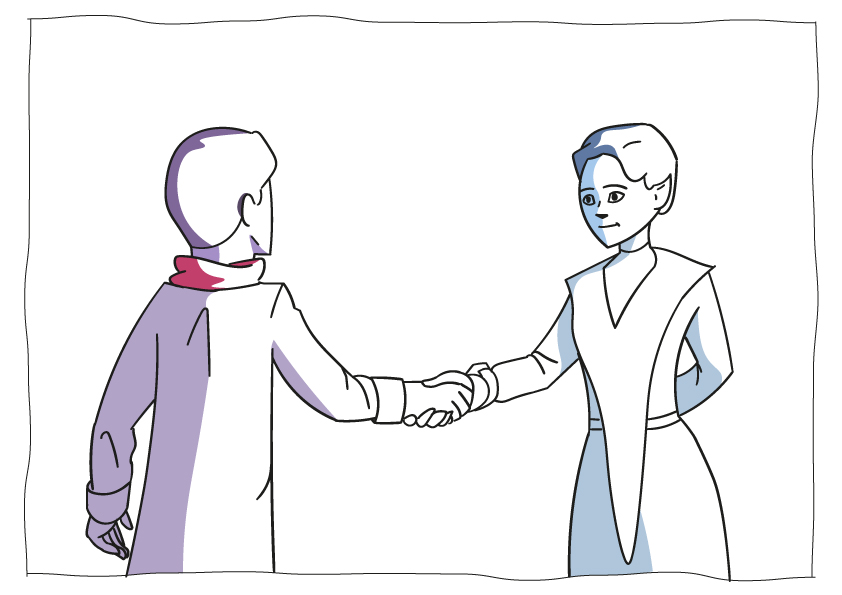
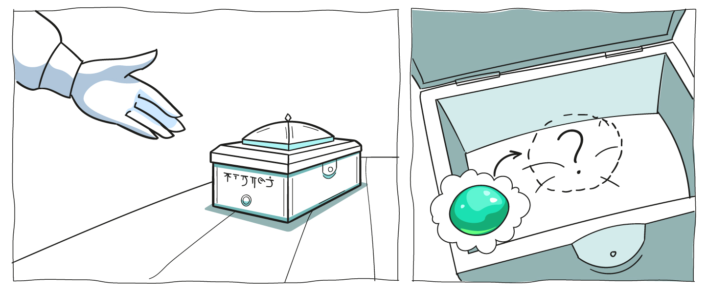
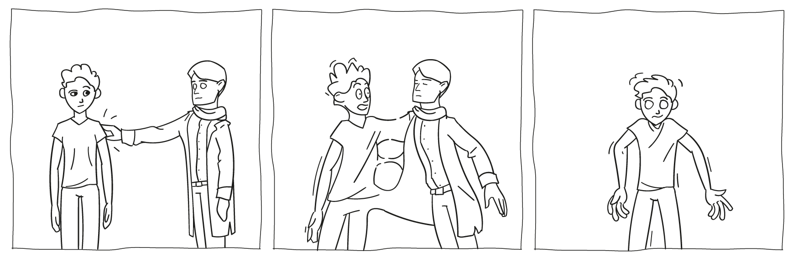

# 1. Информация о курсе

## 1.1 Что такое "Процион"

### Погружение

Здравствуй, дорогой детектив. Добро пожаловать на борт корабля исследователей скиллфорианцев "Сапфир". Его капитан уже ждет тебя на мостике.

Они пригласили тебя не просто так. Прошлой ночью из каюты капитана украли Камень мудрости. В плохих руках он может натворить бед, поэтому важно найти его как можно скорее.

В одно время с кражей с корабля сбежал один из членов экипажа. Его путь удалось отследить по мониторам. Это и есть твоя первая зацепка, с которой начнется поиск.

Ты считаешься лучшим детективом, так как обладаешь способностью Слияния с другими представителями космоса. Это очень помогает в работе.

**Небольшая сводка про способность Слияния:**

Слияние - врожденная сверхспособность, которая характерна для отдельных счастливчиков, а не определенной расы. Именно поэтому встречается в природе она крайне редко. По своей сути слияние похоже на обмен телами. Но в ходе него два тела и разума образуют симбиоз, поэтому они имеют общие знания, навыки и мысли. А внешний вид остается за тем, в чье тело вселяются.

Пробыть в таком состоянии долго невозможно. Однако в работе детектива бывает полезно принять облик другого человека и узнать все то, о чем он думает, особенно если он связан с преступником.

[Оглавление](../README.md)
