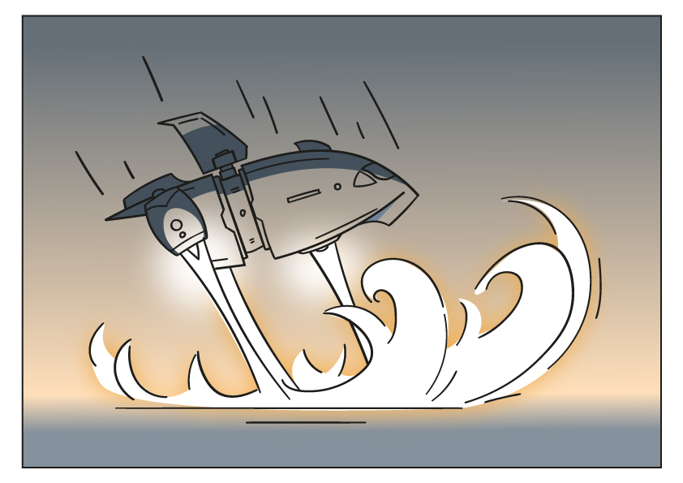

# 2. Тайм-менеджмент

Тайм-менеджмент - это умение распределять своё время для эффективной и продуктивной работы.

## Содержание

+ [2.1 Круг забот и круг влияния](#21-круг-забот-и-круг-влияния)
+ [2.2 Лягушки и слоны, как с ними справляться](#22-лягушки-и-слоны-как-с-ними-справляться)
+ [2.3 Матрица Эйзенхауэра](#23-матрица-эйзенхауэра)
+ [2.4 Распределение времени](#24-распределение-времени)

[Оглавление](../README.md)

## 2.1 Круг забот и круг влияния

### Начало расследования

Первая зацепка привела тебя со скиллфорианцами на планету **Провидентиа**. Ее населяет раса видентисев. Они также обладают особым даром, но он отличен от твоего. Они могут видеть будущее. Однажды видентисы предсказали то, что никак не могли остановить, - **гибель их планеты**. Весь народ охватила паника, и проблема не решалась. Вы прибыли туда за **10 марсов** до катастрофы. На календаре значилось 3 число.

**Капитан:** Беглеца мы найти не смогли, но узнали, что он тесно дружит с правителем планеты Заклом!

**Детектив:** Отлично, я переселюсь в тело Закла, чтобы найти следующую подсказку. Однако в такой обстановке будет трудно вести расследование.

**Капитан:** Тогда сначала поможем видентисам.

Тебе как новоиспеченному правителю планеты предстоит многому научиться у скиллфорианцев, чтобы спасти население и продолжить работу. Поэтому давай начнем.

### Круг влияния и круг забот

**Скиллфорианцы:** По предсказаниям видентисев катастрофа должна произойти уже 13 числа. Чтобы этого не допустить, важно уметь правильно действовать в условиях ограниченного времени. Поэтому первое, о чем мы тебе расскажем, это **тайм-менеджмент**.

**Аннотация:**

+ Круг влияния;
+ Круг забот;
+ Правильная расстановка приоритетов.

В течение уроков по теме "тайм-менеджмент" ты узнаешь, как эффективнее распределять время, чтобы выполнять наиболее важные задачи.

**Тайм-менеджмент** — это совокупность техник (да, это не только скучные расписания), которые помогают **правильно распределять время и приоритеты** для большей эффективности в работе. Термин дословно переводится как «управление временем».

Важно отметить, что заниматься тайм-менеджментом нужно только тогда, когда в этом появляется необходимость. Если ты хочешь планировать время, потому что это "модно", то вряд ли это принесет тебе реальную пользу. Поэтому мы советуем тебе перед тем, как встать на путь изучения техник планирования времени, понять: "Зачем тебе это нужно?" "Какую проблему ты хочешь ими решить?"

Наше первое занятие будет посвящено сферам влияния.

Как часто ты думал о том, что хочешь что-то изменить, но не можешь? Или наоборот, ты слишком много сил уделял какому-то делу, но в итоге это не приносило результатов? Именно об этом и пойдёт речь. Сферы жизни делятся на 2 типа: те, которые мы можем поменять и те, которые от нас не зависят. Давай разберёмся с этим поподробнее.

**Скиллфорианцы:** Стоит отметить, что для некоторых уроков тебе понадобится листок бумаги и ручка. Большинство ответов будут  развёрнутыми, так что не стесняйся выражать свои мысли.

А теперь давай разберёмся с кругом влияния и кругом забот!

### Круг влияния и забот

Давай нарисуем большой круг, а внутри него круг поменьше. **Круг, что поменьше – это те сферы жизни, на которые мы можем влиять. Большой круг - это те сферы, на которые мы повлиять не можем**, то есть они находятся за нашей границей "влияния".

Сейчас мы приведем пару примеров. Возьмём погоду. Как бы мы ни хотели, но пока влиять на неё мы не можем. Это значит, что эта сфера относится к кругу "забот". А теперь возьмём противоположную сферу - хобби. Как раз на хобби, в отличии от погоды мы влиять можем. Значит наши хобби относятся к "кругу влияния".

Вот пример круга влияния и забот, который составили мы.

Примечание: политика была отнесена к кругу забот, потому что до 18-летия мы не можем голосовать, а следовательно влиять на власть и политику.

Теперь тебе нужно сделать небольшое упражнение. Помнишь, мы говорили, что понадобится листочек и ручка? Самое время ими воспользоваться:

1. Выпиши в столбик все сферы и темы, которые тебя волнуют.
2. Теперь нарисуй "круг влияния" и "круг забот". Они могут быть какими угодно, цветными, блестящими и тд. Тут тебя ограничивает только полёт собственной фантазии.
3. А сейчас распредели все сферы, из 1 пункта, в круги

**Детектив:** Отлично, пройдя урок, я понял, на какие сферы мне нужно делать упор, а на какие не стоит обращать внимание. Конечно же, некоторые темы со временем могут перейти из "круга забот" в "круг влияния" из-за профессии или возраста, поэтому подобные круги нужно рисовать с некоторой периодичностью. Но пока я составил актуальную схему, которая поможет мне в спасении видентисев. Надеюсь, когда я вернусь в свое тело, эти знания останутся у Закла, и в будущем он будет править мудрее.

---
[Содержание](#содержание)

## 2.2 Лягушки и слоны, как с ними справляться

### Работа продолжается

После того, как ты изучил, что такое круг забот и круг влияния, и нарисовал их, стало понятно, какие проблемы есть у видентисев. Теперь их нужно решить, но как?

**Детектив:** Время поджимает, а народ все еще в опасности, и предполагаемый преступник не пойман. Я в растерянности.

**Капитан:** Не переживай, мои лучшие исследователи подскажут, что делать!

Скорее возвращайся к скиллфорианцам и изучай следующую тему.

### Слоны, лягушки и как с ними справиться?

Аннотация: Задачи слоны; Задачи лягушки; Советы по выполнению подобных задач.

**Скиллфорианцы:** Наш второй урок будет посвящён довольно важной теме, а именно задачам. Ранее мы разобрали сферы влияния, но ты прав -  для того, чтобы на что-то повлиять, нужно что-то делать. Так что давай разберёмся: "Какие бывают задачи, и чем они отличаются?"

### Лягушки и слоны

Лягушки...слоны...и нет, мы говорим не про животных, а про задачи.

**Лягушками называют противные и мелкие задачи.** Например, почистить лабораторию после экспериментов со звездной пылью. Это маленькое дело, но не особо приятное. **А слоны — это крупные, грандиозные, масштабные задачи, к которым страшно подступиться.** Например, выучить язык сигнофогов. Это занятие не на один месяц, и даже не на один год, поэтому каждый раз находится оправдание, чтобы начать завтра.

Так давай разберёмся, что делать с лягушками и слонами

### Лягушки. Что с ними делать?

***Интересный факт***

Выражение **«съесть лягушку»** в тайм-менеджменте означает **«выполнить какое-нибудь неприятное дело»**.

Эта идиома позаимствована из афоризма, который приписывают известному на всю галактику писателю Марку Твену:

*"Если с утра вы съедите лягушку, то ничего более страшного с вами в этот день не случится.".*

Как же «поедать» лягушек?

1. Старайся **планировать свой день и делать всё самое неприятное с утра.**
2. **Выполняй** подобные задачи **каждый день понемногу**, тогда не придётся разгребать слишком много за один раз.
3. И последнее, **из нескольких лягушек выбирай самую страшную**.

Боишься, что не справишься? Вот несколько советов как этого не допустить:

1. Считай, что **лягушка – это вызов**. Не воспринимай это как мучение, считай, что это испытание, которое помогает показать свои способности и перейти на новый уровень.
2. **Не думай о неприятной задаче, до её выполнения.** Чем больше мы думаем о лягушке, тем сильнее накручиваем себя.
3. **Стремись к быстрому выполнению задачи.** Не растягивай неприятный момент, и тогда ты сможешь быстрее избавиться от проблемы.
4. Не получается сразу выполнить неприятную задачу? **Раздели её на несколько подзадач** или "головастиков" и выполняй их.
5. **Выполняй сразу, не собирайся с духом, а прыгай в неё с головой!**

### Слоны. Что с ними делать?

В отличие от «лягушек», **«слоны» не вызывают у нас жгучего отвращения** (хотя иногда встречаются и «слоновые лягушки»). Но при этом они требуют много времени, сил и других ресурсов. **Браться за такие дела страшно, поэтому их, так же как и «лягушек», часто откладывают "на потом"**.

**Слонов обычно делят на более мелкие задачи («бифштексы»), которые затем регулярно выполняют.** Маленькие задачи не кажутся нам настолько страшными, сложными, непонятными или невыполнимыми, поэтому у нас реже возникает искушение отложить их. Например, написание книги. Разбиваем эту задачу, на более мелкие: написание одной главы в день или 1000 слов в день. Теперь это не кажется таким страшным и звучит вполне выполнимо.

**Скиллфорианцы:** Слышишь, детектив? Кажется, кто-то из членов экипажа увидел беглеца недалеко от нашего корабля. Мы проверим, а ты пока выполни небольшое задание, чтобы закрепить тему.

Подумай, какие "задания - лягушки" тебе нужно выполнить завтра, постарайся с ними расправиться, используя те советы, которые мы разобрали выше. Подумай, какую задачу слона ты хочешь выполнить, и начни двигаться к новой цели.

Здесь напиши о своих успехах: "Удалось ли выполнить "задачи - лягушки", насколько это было легко или же наоборот, сложно?"

Немного усложним задачу. А теперь подумай, какие "задания - лягушки и слоны" ты планируешь выполнить. Выпиши на листик и положи на видное место.

### Дедлайны

Ставь четкие сроки сдачи работы — дедлайны. Понятные сроки стимулируют работать быстрее и помогают справиться с прокрастинацией.

**Скиллфорианцы:** А теперь к твоему списку с "заданиями - лягушками и слонами" добавь дедлайны. Сделал? Супер! Совсем скоро твои задумки начнут воплощаться в жизнь.

Когда закончишь с выполнением, то поделись своими успехами здесь.

---
[Содержание](#содержание)

## 2.3 Матрица Эйзенхауэра

### Время не ждет

Теперь ты знаешь намного больше о задачах и понимаешь, как с ними работать. Но времени мало, так что нужно выяснить, какие задачи решать в первую очередь.

**Детектив:** Давайте приступать к следующему уроку, я готов!

**Скиллфорианцы:** Отлично, у нас есть, что еще рассказать.

**Скиллфорианцы:** Это твой последний урок из цикла тем по тайм-менеджменту. Матрица Эйзенхауэра. Звучит пока непонятно, но на деле это просто и полезно!

**Аннотация:**

+ Матрица Эйзенхауэра;
+ Для чего она нужна;
+ Правильная расстановка приоритетов.

Какие же проблемы помогает решить матрица Эйзенхауэра? Бывают такие дни, когда кажется, что вроде бы сделал кучу дел, но пользы никакой не получил, никакого результата. Это называется проблемой целеполагания, и её последствия могут быть очень разрушительными.

### Матрица Эйзенхауэра

**Суть матрицы Эйзенхауэра: разделить задачи и дела, задавая вопросы: «Это важно?», «Это срочно?».**

В итоге получается нечто подобное:

---
[Содержание](#содержание)

## 2.4 Распределение времени

---
[Содержание](#содержание)
