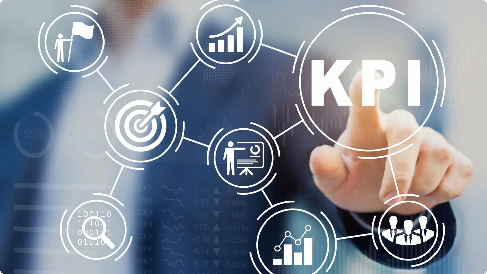
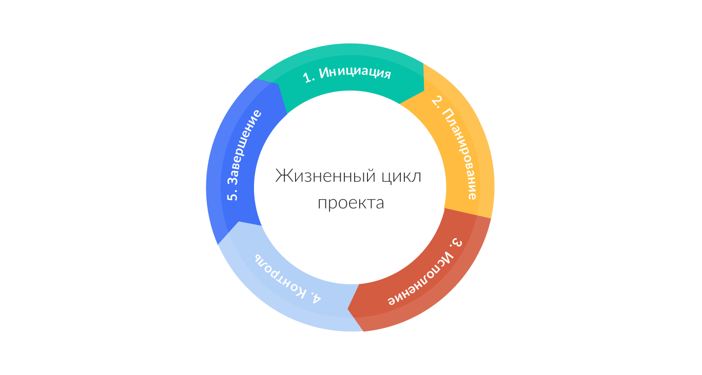
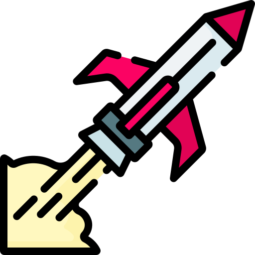
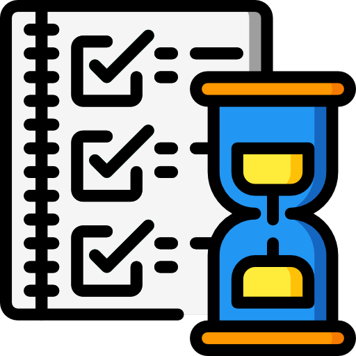
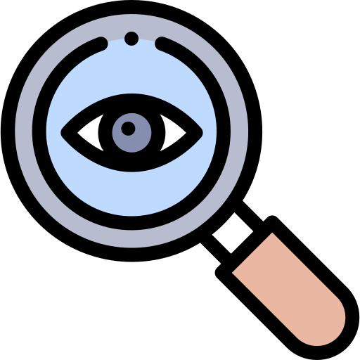
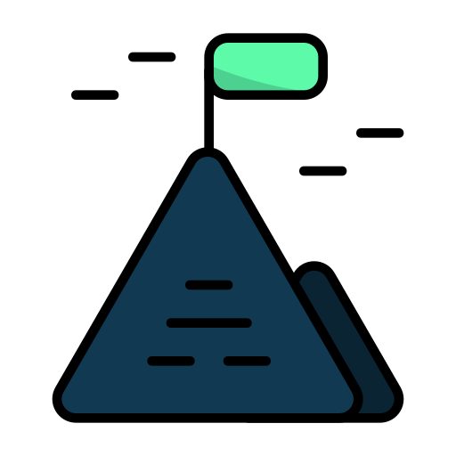

# 2. Добро пожаловать в мир проектов

## Содержание

+ [2.1 Что такое проект?](#21-что-такое-проект)
  + [Что же такое проектная деятельность?](#что-же-такое-проектная-деятельность)
  + [Сферы проектной деятельности](#сферы-проектной-деятельности)
  + [Примеры существующих проектов](#примеры-существующих-проектов)
    + [Сфера бизнеса](#сфера-бизнеса)
    + [Сфера информационных технологий](#сфера-информационных-технологий)
    + [Сфера культуры](#сфера-культуры)
    + [Сфера образования](#сфера-образования)
  + [Отличие проекта от продукта](#отличие-проекта-от-продукта)
+ [2.2 Жизненный цикл развития проекта](#22-жизненный-цикл-развития-проекта)
  + [Жизненный цикл развития проекта](#жизненный-цикл-развития-проекта)
  + [Действия, которые характеризуют каждый этап жизненного цикла проекта](#действия-которые-характеризуют-каждый-этап-жизненного-цикла-проекта)
+ [2.3 Зачем заниматься проектами?](#23-зачем-заниматься-проектами)

[Оглавление](../README.md)

## 2.1 Что такое проект?

**Аннотация:**

+ Все о проектной деятельности;
+ Основные составляющие;
+ Сферы проектной деятельности;
+ Отличие проекта от продукта.

---
[Содержание](#содержание)

### Что же такое проектная деятельность?

**Проектная деятельность** - это процесс планирования, реализации и контроля проекта с целью достижения конкретных результатов в рамках определенного бюджета и с использованием ограниченных ресурсов.

Звучит страшновато? Но на самом деле все просто, ведь согласитесь, это определение очень напоминает жизнь. Все мы решаем определённый набор задач, чтобы прийти к той самой цели, которую ставим когда-то в детстве и корректируем в ходе собственного развития. В проекте всё также, только временной промежуток покороче.

Что включает в себя проектная деятельность?

+ Планирование работ
+ Определение задач и целей
+ Распределение ресурсов
+ Управление рисками
+ Контроль прогресса выполнения проекта
+ Коммуникации

*Все эти аспекты реализации проектов будут рассмотрены на курсе на конкретных кейсах и примерах из практики компаний и стартапов

---
[Содержание](#содержание)

### Сферы проектной деятельности

Проектная деятельность окружает нас повседневно, большинство объектов сделано в результате реализации проекта. Порой, мы даже не замечаем, что используем инструменты ПД в работе над повседневными задачами. Ниже приведена малая часть сфер, в которых используется проектная деятельность.

|Сфера деятельности| Направления проектной деятельности|
| -- | -- |
|Бизнес | Создание новых продуктов и услуг   Запуск новых производственных линий   Улучшение процессов   Проведение маркетинговых кампаний|
|IT | Разработка программного обеспечения Создание сайтов Запуск компьютерных сетей Внедрение новых технологий|
|Строительство | Возведение новых зданий и сооружений Реконструкция и ремонт существующих объектов|
|Исследования | Научные исследования Разработка новых технологий|
|Образование | Создание новых учебных программ Проведение научных конференций Организация учебных мероприятий и форумов|
|Социальные проекты | Организация благотворительных мероприятий Проведение социологических исследований Развитие инфраструктуры|
|Культура | ​Организация культурных мероприятий, выставок, фестивалей|
|Спорт | Создание спортивных объектов Проведение спортивных мероприятийОрганизация тренировок и сборов|

---
[Содержание](#содержание)

### Примеры существующих проектов

Давайте разберем примеры проектов из различных сфер, рассмотрим их этапы и цели. Таким образом, у вас сформируется полное понимание, что такое проектная деятельность.

#### Сфера бизнеса

**Название компании: "GreenTech Innovations"** 
Компания "GreenTech Innovations" занимается разработкой экологически чистых технологий и продуктов. Одним из проектов  является разработка и производство электромобиля на базе новых технологий, позволяющих уменьшить вредные выбросы в атмосферу и повысить энергоэффективность автомобиля.

Проект включает в себя несколько этапов:

+ Исследование и анализ рынка электромобилей и новых технологий в этой области.
+ Разработка концепции автомобиля и его технических характеристик.
+ Разработка и тестирование прототипа автомобиля.
+ Проведение сертификации и получение разрешений на производство и эксплуатацию автомобиля.
+ Запуск производства и продажа электромобиля на рынке.
+ Разработка и внедрение улучшений в автомобиль, обновление модели и технических характеристик.

**Цель проекта** - предоставить на рынок экологически чистый автомобиль, который будет конкурировать с традиционными бензиновыми и дизельными. Это позволит уменьшить вредное воздействие на окружающую среду и сделать транспорт более экономичным и энергоэффективным.

#### Сфера информационных технологий

**Название компании: "DataSolutions"** 
Компания "DataSolutions" специализируется на разработке программного обеспечения и решений для управления данными в бизнесе. Одним из проектов компании является разработка системы управления клиентскими данными для компаний, занимающихся продажей товаров и услуг.

Проект включает в себя несколько этапов:

+ Исследование и анализ потребностей компаний в управлении клиентскими данными.
+ Разработка концепции и функциональных требований к системе управления клиентскими данными.
+ Разработка и тестирование программного обеспечения системы.
+ Внедрение системы управления клиентскими данными в компании-заказчике и обучение персонала.
+ Поддержка и сопровождение системы, обновление и доработка функционала по мере необходимости.

**Цель проекта** - предоставить компаниям-клиентам эффективный инструмент для управления клиентскими данными, что позволит им улучшить качество обслуживания, повысить лояльность клиентов и увеличить продажи. Разработка и внедрение такой системы может помочь компаниям повысить конкурентоспособность и стать более эффективными в своей деятельности.

#### Сфера культуры

**Название компании: "ArtLab"**  
Компания "ArtLab" занимается организацией культурных мероприятий и развитием художественной индустрии. Одним из проектов компании является создание и проведение выставки современного искусства "ART NOW".

Проект включает в себя несколько этапов:

+ Определение концепции и тематики выставки.
+ Подбор художников и работ для выставки.
+ Организация логистики и аренды выставочного пространства.
+ Разработка маркетинговой стратегии и продвижение выставки.
+ Организация открытия выставки и проведение сопутствующих мероприятий (мастер-классы, лекции, экскурсии и т.д.).
+ Проведение выставки и организация работы персонала.
+ Разборка выставочного пространства и утилизация материалов.

**Цель проекта** - продвижение современного искусства и создание площадки для творческой самореализации художников. Выставка "ART NOW" может стать важным культурным событием, привлечь внимание общественности и способствовать развитию художественной индустрии в регионе.

#### Сфера образования

**Название компании: "Smart Education"** 
Описание проекта: компания "Smart Education" занимается разработкой и внедрением инновационных методик и технологий в образовательном процессе. Одним из проектов компании является создание онлайн-платформы для обучения английскому языку "Smart English".

Проект включает в себя несколько этапов:

+ Разработка программы обучения, включающей в себя интерактивные уроки, тесты и задания на закрепление материала.
+ Создание онлайн-платформы, в которой студенты могут проходить обучение в удобное для них время и из любой точки мира.
+ Подбор и обучение преподавателей, которые будут проводить онлайн-уроки.
+ Разработка системы оценки знаний студентов и выдачи сертификатов.
+ Маркетинговая кампания и привлечение студентов на платформу.

**Цель проекта** - сделать обучение английскому языку доступным и удобным для людей из любой точки мира, обеспечить высокое качество обучения и результативность. Платформа "Smart English" может стать одним из лидеров на рынке онлайн-обучения и привлечь большое количество студентов, которые будут получать качественное образование и повышать свой уровень знаний.

---
[Содержание](#содержание)

### Отличие проекта от продукта

Вы возможно слышали такие профессии как Product manager или Project manager, но в чем их различие? Для этого разберем, что такое проект и что такое продукт.

**Проект** - это временное усилие, направленное на достижение определенной цели. Он характеризуется определенными сроками, бюджетом, ресурсами и задачами, которые должны быть выполнены для достижения цели. Примерами проектов могут быть строительство здания, разработка программного обеспечения, организация мероприятия и т.д.

**Продукт** - это конечный результат процесса производства, который может быть представлен на рынке и приносить доход компании. Продукт может быть физическим или цифровым и разрабатывается для удовлетворения потребностей конечных потребителей. Примерами продуктов могут быть автомобиль, мобильное приложение, бытовая техника и т.д.

Но как создать проект или продукт? Для этого существует понятие процесс.

**Процесс** - это последовательность действий, которые необходимо выполнить для достижения конкретной цели или производства продукта. Процесс может быть определенным стандартом или процедурой, которую необходимо соблюдать при выполнении задачи. Примерами процессов могут быть процесс разработки продукта, процесс производства товаров, процесс управления проектом и т.д.

*Таким образом, основное отличие между проектом, продуктом и процессом заключается в том, что проект - это временное усилие, направленное на достижение цели, продукт - это конечный результат производственного процесса, который может быть представлен на рынке и приносить доход, а процесс - это последовательность действий, необходимых для достижения цели или производства продукта.*

---
[Содержание](#содержание)

## 2.2 Жизненный цикл развития проекта

**Аннотация:**

+ О каждом этапе цикла развития проекта;
+ Действия, которые характеризуют каждый этап.

### Жизненный цикл развития проекта

**Жизненный цикл реализации проекта** (Project Development Life Cycle) - это последовательность фаз, которые проект проходит от начала до завершения. Он может различаться в некоторых подходах и проектах, но каркас выглядит следующим образом:

1. **Инициация:** определение причин и целей проекта, анализ возможных рисков и оценка его жизнеспособности. В результате этой фазы формируется начальный проектный план и определяются его ключевые характеристики.
2. **Планирование:** создание подробного проектного плана, включающего задачи, расписание, бюджет, ресурсы и структуру управления проектом. В результате этой фазы формируется подробный план работ и оценивается потребность в ресурсах.
3. **Реализация:** выполнение задач, определенных в проектном плане, управление ресурсами, контроль прогресса и решение возникающих проблем. В результате этой фазы достигаются основные цели проекта и его задачи.
4. **Мониторинг и контроль:** отслеживание прогресса выполнения проекта и контроль за соответствием плана, идентификация и управление рисками, анализ производительности и корректирование плана при необходимости.
5. **Завершение проекта:** завершение работ, документирование результатов, оценка выполнения проекта и выявление уроков для будущих проектов. В результате этой фазы формируется отчет о проекте и выполняется формальное закрытие проекта.

Но зачем знать жизненный цикл развития проекта?

Он помогает организовать работу по достижению поставленных целей, снизить риски и обеспечить эффективное управление ресурсами. Результат каждой фазы является основой для начала следующей (поэтапность перехода).

---
[Содержание](#содержание)

### Действия, которые характеризуют каждый этап жизненного цикла проекта

Конкретные деятельности участников проекта на каждом этапе могут различаться в зависимости от потребностей проекта, его сложности и масштаба, а также от индивидуальных ролей и ответственностей каждого участника. Однако, ниже приведены общие примеры деятельности участников проекта на каждом этапе жизненного цикла проекта:

Этап жизненного цикла проекта | Примеры деятельности
--|--
 Инициация проекта | Определение требований и целей проекта; Сбор информации для создания бизнес-плана; Определение и описание рисков проекта; Назначение главного менеджера проекта; Разработка краткого плана проекта; Определение ресурсов, необходимых для реализации проекта.
 Планирование проекта | Разработка подробного плана проекта; Определение ролей и ответственности каждого участника проекта; Определение бюджета проекта; Разработка плана управления качеством; Разработка плана управления рисками; Определение критериев успешности проекта.
 Выполнение проекта | Выполнение работы в соответствии с планом проекта; Мониторинг прогресса и контроль качества работы; Управление ресурсами проекта (людьми, финансами, временем); Решение возникающих проблем; Отчетность и коммуникация с заинтересованными сторонами (заказчиками, руководством и т.д.).
 Мониторинг и контроль | Оценка прогресса проекта; Оценка выполнения бюджета и контроль за затратами; Решение возникающих проблем; Отчетность и коммуникация с заинтересованными сторонами.
 Завершение проекта | Завершение всех задач проекта; Составление отчета о выполнении проекта; Оценка результатов проекта; Архивирование документации проекта; Отчетность и коммуникация с заинтересованными сторонами.

---
[Содержание](#содержание)

## 2.3 Зачем заниматься проектами?

**Аннотация:** Как проектная деятельность помогает в обычной жизни?

Если посмотреть на прошлые элементы курса и сделать выводы, то с лёгкостью можно понять, что проектная деятельность позволяет развивать очень широкий набор навыков и применять их в разных сферах деятельности. На этом шаге мы подробней рассмотрим те моменты, которые кратно улучшаются при реализации проектов.

1. **Решение сложных задач.** Проектная деятельность позволяет решать сложные задачи, которые требуют интеграции различных знаний, навыков и ресурсов. При этом участники проекта могут проявить свои лучшие качества, включая лидерские, творческие и аналитические способности.
2. **Эффективное использование ресурсов.** Проектная деятельность позволяет использовать ресурсы более эффективно благодаря точному планированию, управлению временем и бюджетом, а также оптимальной организации работы команды.
3. **Умение оценивать риски.** Проектная деятельность включает анализ и управление рисками, что позволяет снизить вероятность непредвиденных событий и увеличить вероятность успеха проекта.
4. **Улучшение коммуникации.** Проектная деятельность требует хорошей коммуникации между членами команды, заказчиком и другими заинтересованными сторонами. Это помогает улучшить качество работы, сократить время и избежать недоразумений.
5. **Развитие навыков.** Участие в проектной деятельности способствует развитию навыков управления проектами, коммуникации, решения проблем, творческого мышления и других навыков, которые могут быть полезны в любой сфере деятельности.
6. **Достижение результатов.** Проектная деятельность позволяет достигать конкретных результатов в виде новых продуктов, услуг, идей или улучшения процессов, что способствует развитию бизнеса, науки, технологий и других областей.

А как вы думаете, где в обычной жизни может пригодиться проектная деятельность?

---
[Содержание](#содержание)
