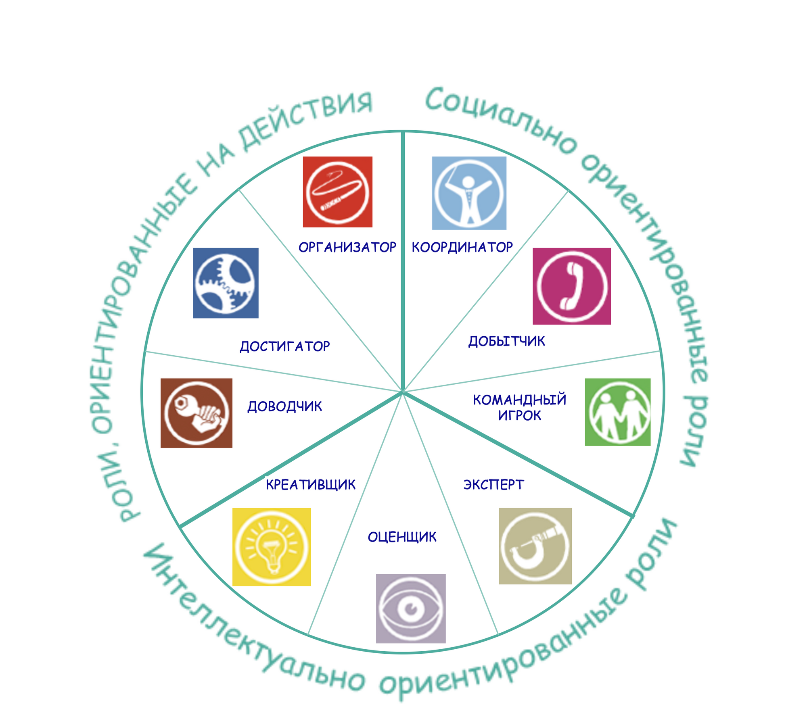
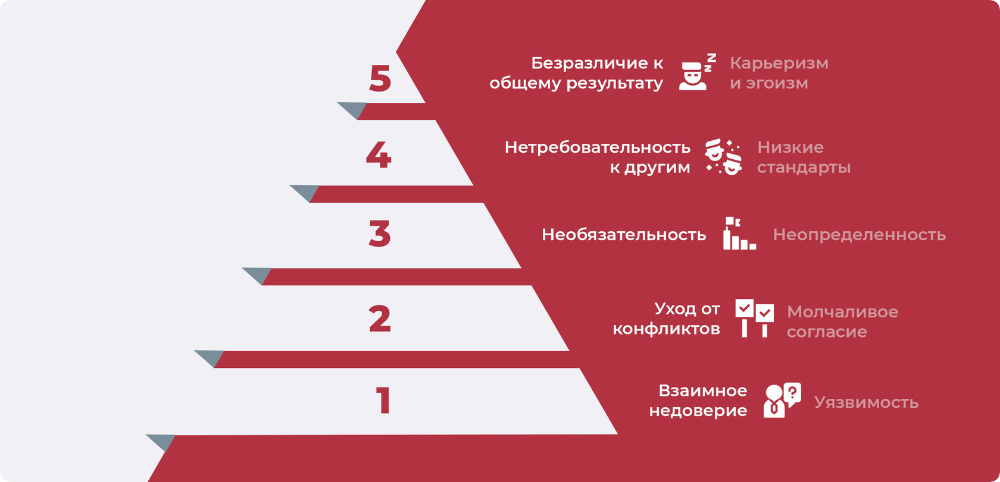
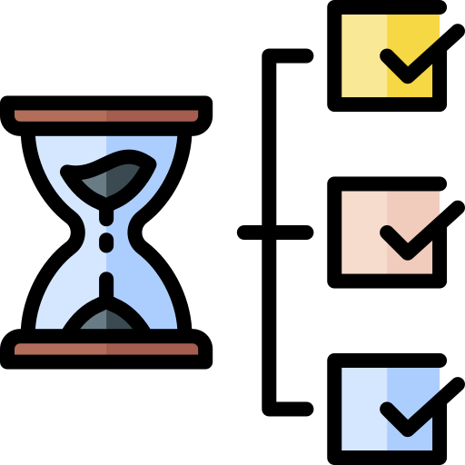
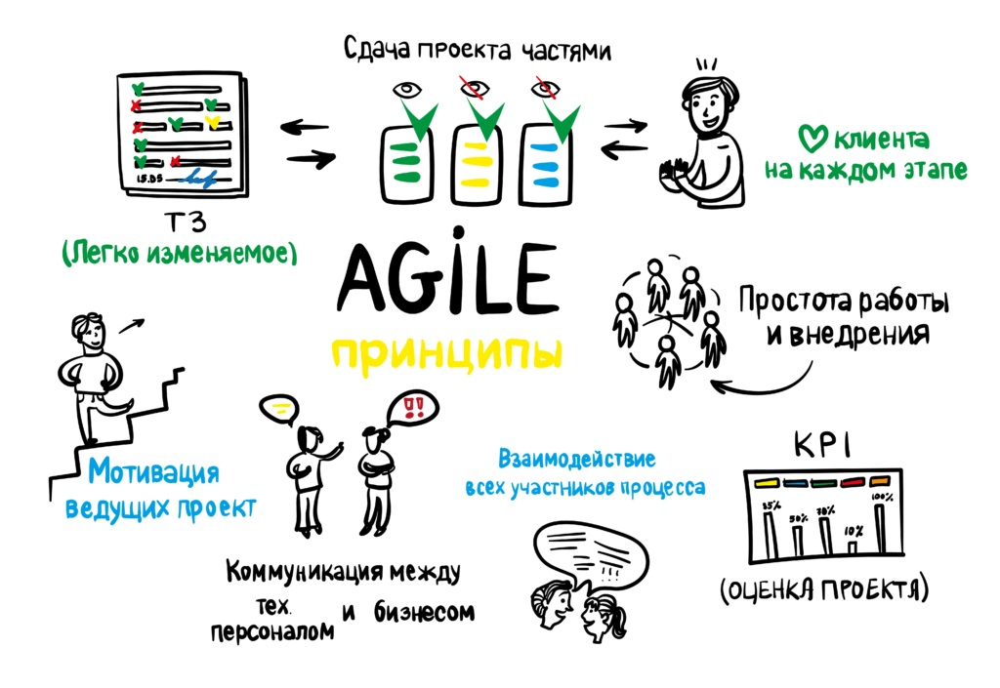
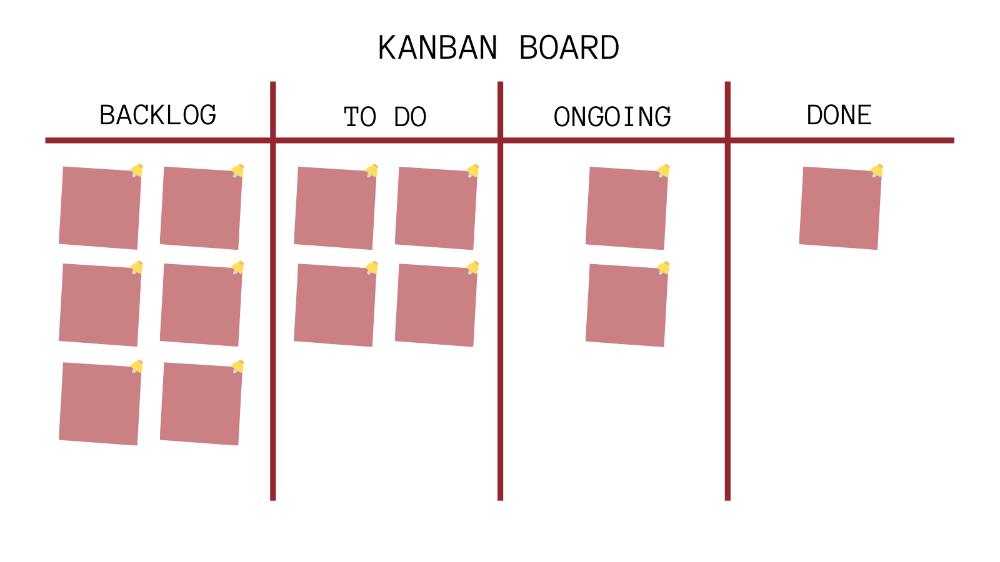
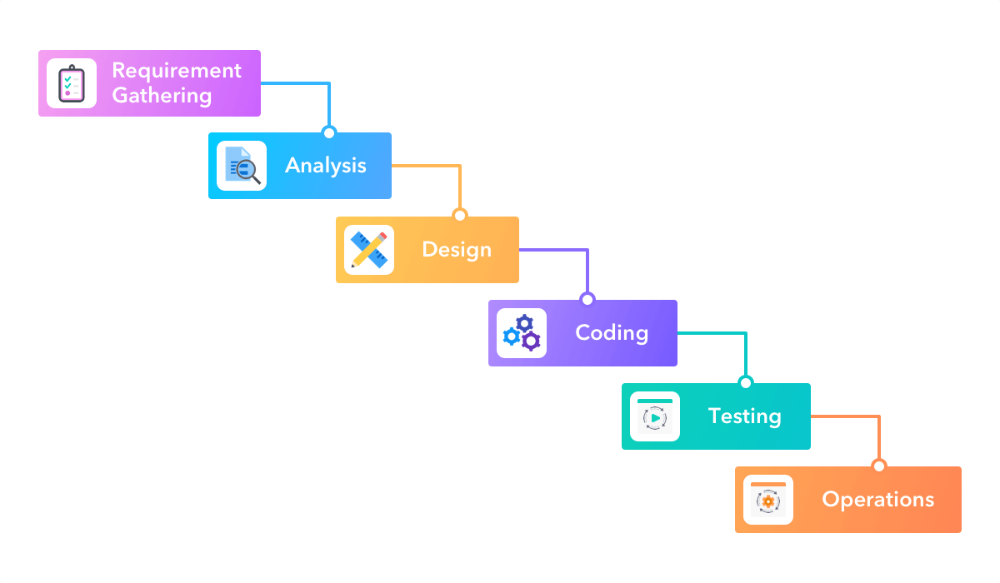

# 3. Командная работа и управление

## Содержание

+ [3.1 Командные роли и жизненный цикл команды](#31-командные-роли-и-жизненный-цикл-команды)
  + [Командные роли по Белбину](#командные-роли-по-белбину)
  + [Интеллектуальные роли](#интеллектуальные-роли)
  + [Социальные роли](#социальные-роли)
  + [Роли действия](#роли-действия)
  + [Жизненный цикл команды по Такману](#жизненный-цикл-команды-по-такману)
  + [Модель Ленсиони](#модель-ленсиони)
+ [3.2 Методологии управления](#32-методологии-управления)
  + [История появления методологий управления](#история-появления-методологий-управления)
  + [Agile](#agile)
  + [SCRUM](#scrum)
  + [Kanban](#kanban)
  + [Waterfall](#waterfall)
+ [3.3 Инструменты командной работы](#33-инструменты-командной-работы)
  + [Возможности цифровых решений](#возможности-цифровых-решений)
  + [Trello](#trello)
  + [Asana](#asana)
  + [Notion](#notion)
  + [Коммуникационные сервисы](#коммуникационные-сервисы)
    + [Zoom](#zoom)
    + [Discord](#discord)
    + [Google meet](#google-meet)
  + [Miro](#miro)
+ [3.4 Как улучшить свои навыки работы в команде](#34-как-улучшить-свои-навыки-работы-в-команде)

[Оглавление](../README.md)

## 3.1 Командные роли и жизненный цикл команды

**Аннотация:**

+ Теория командных ролей Белбина,
+ типы командных ролей.

### Командные роли по Белбину

В ходе командной работы над проектом вы можете заметить, что участники процесса **проявляют себя по-разному**:

+ кто-то стремится наладить микро-климат команды,
+ кто-то постоянно предлагает идеи,
+ кто-то критикует предложения и старается делать выводы отталкиваясь от цифр.

Это вовсе не иллюзия, людям свойственно проявлять определённую роль при решении задач в команде. Над изучением данного явления работали многие учёные, далее будет представлена концепция, которая используется в крупных компаниях для формирования рабочих групп и команд.

В 20 веке один учёный ([Рэймонд Мередит Белбин](../Lib/Типы_ролей_в_командах_менеджеров.djvu)) выдвинул гипотезу о 9 командных ролях, которые он разделил на 3 типа:

+ Роли, ориентированные на действия;
+ Социально-ориентированные роли;
+ Интеллектуально-ориентированные роли.

Каждая из этих ролей соотносится с характерным для неё поведением и сильными сторонами личности. Относительно этой информации может показаться, что командная роль закреплена за человеком навсегда. Это вовсе не так, они могут меняться с количеством реализованных проектов, а знание о командных ролях позволяет вам проявлять себя в разных аспектах при работе над задачами.

Также прикладываем [ссылку](https://test-belbina.github.io/test_belbina/) на прохождения теста Белбина, которая позволит вам определить свою командую роль.

---
[Содержание](#содержание)

### Интеллектуальные роли

На ближайших 3 этапах глубже погрузимся в каждую из командных ролей. В класс интеллектуально-ориентированных ролей входят следующие: генератор идей, аналитик, специалист. У этих командных ролей виден уклон в мыслительную деятельность, любят работать с данными и опираться на свои компетенции.

1. Генератор идей

**Характерные черты:** исполнитель данной командной роли выдвигает новые идеи и стратегии, уделяя при этом внимание решению основных проблем, с которыми сталкивается команда. Индивидуалист. Имеет склонность к интроверсии, сильно реагирует как на критику, так и на похвалу. Часто идеи представителя данной роли имеют радикальный характер,  а также ему не хватает практических усилий. 
**Положительные качества:** изобретательность, предприимчивость, высокий интеллект, эрудиция, способен решает сложные проблемы, мыслить творчески. 
**Приемлемые недостатки:** «витает в облаках», игнорирует детали, могут быть слабыми в общении с людьми другого уровня или направления. 
Генераторы идей относительно редко встречаются в спокойных и устоявшихся компаниях, значительно чаще - в недавно сформированных. Они необходимы на начальных стадиях проектов или когда проект находится под угрозой срыва; также могут являться основателями компаний или организаторами новых производств. Тем не менее, эксперты не рекомендуют совмещать роль Генератора идей и  руководителя проекта/координатора.

2. Аналитик

**Характерные особенности:** исполнитель данной роли анализирует проблемы. Он оценивает идеи и предложения, чтобы команда могла принимать сбалансированные решения. Благоразумный, невозмутимый, предусмотрительный. Продуманность каждого слова предпочитает быстроте словесного потока. Аналитик умеет быть проницательным в суждениях, принимая во внимание все факторы. 
**Положительные черты:** рассудительность, проницательность, отличные умственные способности. Хорошо развито стратегическое и критическое мышление. Способен обстоятельно аргументировать собственную точку зрения. 
**Приемлемые недостатки:** отсутствие вдохновения или способности мотивировать других. Склонность к скептицизму. 
С одной стороны, качества Аналитика могут показаться не типичными для командной работы, но он часто великолепно вписывается в команду. Это происходит особенно просто и легко, если роль Аналитика понятна и ему, и команде. Многие Аналитики занимают стратегические посты в бизнесе и на производстве, постоянно продвигаются на все более высокие должности – в основном, в головных структурах компании.

3. Специалист

**Характерные особенности:** исполнитель данной роли гордится техническими навыками и умениями в узкой области. Ориентация на экспертность в выбранной профессии (или направлении деятельности). Играет специфическую роль в команде, благодаря своим особым навыкам, на которых и базируется сервис или производство компании.  
**Положительные черты:** искренний, самостоятельный, преданный. Обладает редкими знаниями и навыками. Преданность делу. 
**Приемлемые недостатки:**  приобретение знаний только в рамках собственных интересов. Узкая специализация. Увлекается техническими деталями. Смотрит сквозь пальцы на общую картину. Медлительность. 
Важность роли обусловлена двумя причинами: во-первых, при реализации многочисленных проектов часто требуется консультация компетентного специалиста (как технического эксперта), во-вторых, данная роль имеет большое значение для карьеры сотрудников фирмы. Специалистам нужны руководители, которые верят в их профессионализм, ценят их и дают свободу действий, делегируя свои полномочия. Будучи руководителями, они пользуются уважением, так как знают намного больше о своем предмете, чем кто-либо еще и обычно вынуждены принимать решение, опираясь на свой глубокий опыт.

---
[Содержание](#содержание)

### Социальные роли

1. Душа команды

**Характерные особенности:** исполнитель этой командной роли способствует проявлению достоинств всех членов команды, поддерживает коллег в случае. Он улучшает взаимоотношения между коллегами и стимулирует подъем командного настроя. Социально-ориентированный, спокойный, чувствительный. 
**Положительные черты:** способность нести ответственность за людей и отвечать за ситуацию. Предотвращает трения и успокаивает людей. 
**Приемлемые недостатки:** нерешительность, легко поддается влиянию. В крайнем случае – избегание напряженных отношений. 
Дипломат широко представлен в кругах топ-менеджеров. При авторитарном и конфликтном режиме управления, навыки дипломатии и проницательности превращаются в незаменимые качества. Привлекает к себе внимание как человек, под началом которого готовы работать все.

2. Исследователь ресурсов

**Характерные особенности:** исполнитель данной командной роли обнаруживает и сообщает о новых идеях, разработках и ресурсах, имеющихся за пределами группы. Налаживает полезные для команды внешние контакты и успешно проводит переговоры. Экстраверт, увлеченный, пытливый, общительный. Легко подхватывает идеи других и развивают их. 
**Положительные черты:** хорошо контактирует с людьми,  разрабатывает новые концепты,  легко подхватывают идеи других и развивают их. Проявляет стойкость в новой обстановке.
**Приемлемые недостатки:** теряет интерес к работе, как только проходит первоначальный энтузиазм, бывает излишне оптимистичным. 
Менеджеров-исследователей ресурсов никогда не застанешь на месте (выясняют,  что творится вокруг, разговаривают с людьми, задают хорошо продуманные вопросы), но если даже он на месте, то обязательно «сидит» на телефоне. Они умеют вести бизнес, а также способны начинать новые дела.

3. Координатор

**Характерные особенности:** исполнитель данной командной роли выбирает путь продвижения команды к общим целям, обеспечивая оптимальное использование ресурсов команды. Определяет сильные и слабые стороны команды и добивается эффективного  применения личностного потенциала каждого члена команды. 
**Положительные черты:** способность без предубеждения выслушивать и рассматривать и оценивать достоинства всех предложений. Сильная мотивация на достижение поставленных целей. Зрелый и уверенный в себе человек, хороший руководитель. 
**Приемлемые недостатки:** средний уровень интеллекта и творческих способностей. Может подпадать под влияние людей. Склонность к лени, если можно найти кого-то, кто сделает его работу. 
Координаторы за счет большого опыта работы и искусства дипломатии могут компенсировать недостатки интеллектуальных способностей и несовершенные навыки решения практических проблем. В организациях такие работники воспринимают других такими, какие они есть; осознают ответственность за внешние факторы деятельности; спокойны и невозмутимы в спорах, склонны принимать практичные решения.

---
[Содержание](#содержание)

### Роли действия

1. Завершитель

**Характерные особенности:** исполнитель данной командной роли, насколько это возможно, избавляет команду от ошибок, связанных как с деятельностью, так и с бездеятельностью. Контролер выявляет такие аспекты в работе, которые требуют повышенного внимания. Он побуждает команду проявлять настойчивость в достижении цели. Способен довести начатое дело до конца. Скрупулезный, организованный, добросовестный, эмоционально неустойчивый. Скорее интроверт, чем экстраверт. 
**Положительные черты:** способность завязывать дружеские отношения, стремление добиваться совершенства во всем. Имеют высокоразвитое чувство самоконтроля и самодисциплины. Настойчив в достижении целей. 
**Приемлемые недостатки:** тенденция  к беспокойству по поводу мелочей, в крайних случаях - навязчивое поведение и придирчивость к другим. Неохотно делегирует свои полномочия. 
Способность Контролеров доводить работу до конца делает их бесценными подчиненными для руководителей, которые проявляют инициативу и дорожат результатами, качеством работы. Хорошо проводят различные митинги,  соблюдают высокие стандарты деятельности (не возьмутся за работу, если есть сомнения в том, что не справятся).  

2. Реализатор

**Характерные особенности:** исполнителям данной командной роли присущи здравый смысл , развитый самоконтроль и дисциплина. Они любят тяжелую работу и преодоление проблем в системном режиме. Люди компаний, они менее сконцентрированы на преследовании собственных интересов. 
**Положительные черты:** дисциплинированный, надежный, предусмотрительный и квалифицированный. Претворяет идеи в практические дела и рабочие процедуры. 
**Приемлемые недостатки:** приверженность к традиционным и проверенным методам работы, в крайнем случае – препятствуют внедрению изменений. Медленно реагирует на новые возможности. 
Реализаторы отличаются постоянной готовностью к практической работе, они успешно взаимодействуют со многими типами людей и как руководители, и как коллеги по работе. Но если их взаимоотношения не заладятся, это создает серьезные проблемы. Стараются поддерживать с подчиненными формальные взаимоотношения.

3. Формирователь

**Характерные особенности:** придает действиям команды упорядоченную форму, направляя внимание членов команды на стоящие перед ними задачи и обозначает приоритеты, упорядочивает групповые обсуждения. Формирователю нравится вести команду за собой. Он обладает напором и мужеством  для преодоления препятствий. Чаще экстраверт. 
**Положительные черты:** внутренний импульс и готовность бороться с инертностью, бездействием. Стремление к достижению успеха, адаптивность. 
**Приемлемые недостатки:** склонность к недовольству, критике, раздражительности и нетерпению. Может быть резким в другими людьми, задевать их чувства. 
Менеджер-мотиватор очень активный и неугомонный в деятельности, становится эффективным руководителем благодаря тому, что умеет генерировать действия и успешно работать под давлением. Он, скорее, согласится на трехдневный семинар, чем на десятинедельный курс менеджмента в тихом и милом местечке.

Представь, что ты создаешь проект, тебе нужно собрать команду. На данный момент у тебя есть выбор из следующих участников.

Сотрудник | Описание | Роль
-- | -- | --
Bob  | Bob очень креативный человек. Занимается искусством и увлекается философией. Любит создавать что-то новое. | Генератор идей
John  | John опытный программист. Напишет любой код, если у него под рукой есть чашечка кофе, даже если это займет у него немало времени. | Специалист
Anna  | Anna копирайтер со стажем. Любит кошек и всегда пишет посты в соответствии с дедлайном. | Реализатор
July  | July учится на филфаке. Коллектив считает ее милой с высоким уровнем эмоционального интеллекта. | Душа команды
Dima  | Dima менеджер. Умеет организовать работу так, чтобы все было выполнено в срок. | Координатор

---
[Содержание](#содержание)

### Жизненный цикл команды по Такману

Теория Такмана о жизненном цикле команды описывает развитие и изменения, которые происходят внутри группы людей, работающих в команде, на протяжении времени. Теория была разработана Брюсом У. Такманом в 1965 году и дополнена им в последующие годы. Согласно этой теории, жизненный цикл команды включает пять основных этапов:

1. Формирование (Forming):
    + Этап начала работы команды.
    + Члены команды знакомятся друг с другом, исследуют задачу и определяют роли.
2. Шторм (Storming):
    + Этап, на котором члены команды начинают конфликтовать и спорить из-за различий во мнениях, стилях работы и ролевой структуре.
    + Необходимость определить лидерство и распределение ответственности становится очевидной.
    + Этот этап может быть сложным, но он также способствует более глубокому пониманию и установлению общих целей.
3. Нормализация (Norming):
    + На этом этапе команда начинает разрешать конфликты и устанавливать более стабильные отношения.
    + Развиваются общие ценности, нормы и ожидания внутри команды.
    + Члены начинают лучше понимать роли друг друга и проявлять больше взаимодействия.
4. Работа (Performing):
    + Этап, на котором команда достигает оптимальной производительности при выполнении задачи.
    + Члены команды работают согласованно и эффективно, оптимизируя свои роли и умения.
    + Команда способна достигать результатов и преодолевать трудности.
5. Распад (Adjourning):
    + Этап завершения работы команды, когда цель достигнута или проект завершен.
    + Члены команды могут чувствовать удовлетворение от достижения цели.
    + Происходит разрешение задач и ролей, и команда переформировывается.

Такман подчеркивал, что каждый из этих этапов важен и естественен в развитии команды. Однако не все команды обязательно будут проходить через все этапы, и порядок может варьироваться в зависимости от различных факторов, таких как тип задачи, характер лидерства и динамика группы.

---
[Содержание](#содержание)

### Модель Ленсиони

[Модель Ленсиони](../Lib/Ленсиони_Пять_пороков_команды_2019.pdf) описывает пять дисфункций, которые могут возникнуть в командах и негативно повлиять на их эффективность. Эта модель разработана Патриком Ленсиони и описана в его книге "Пять исключительных дисфункций команды". Он считает, что устранение этих дисфункций может значительно улучшить сотрудничество и результативность в команде.

1. Взаимное недоверие:
    + Основание команды — взаимное доверие.
    + Если члены команды не чувствуют, что могут открыто выражать свои мысли, беспокойства и ошибки, это приводит к снижению эффективности.
    + Открытое обсуждение помогает предотвратить недоразумения и способствует развитию коллективного разумения.
2. Уход от конфликтов:
    + Конструктивные конфликты способствуют развитию идей и нахождению наилучших решений.
    + Однако многие команды избегают конфликтов, боясь негативных последствий.
    + Это приводит к поверхностным обсуждениям и неполным решениям.
3. Отсутствие обязательства:
    + Когда члены команды не участвуют в процессе принятия решений, их обязательство к этим решениям ослабевает.
    + Неясные или неполноценно обсужденные решения могут вызвать сомнения и снижение вовлеченности.
4. Избегание ответственности:
    + Если члены команды не чувствуют ответственности за результаты, это может привести к прокрастинации и недовольству.
    + Установление четких ролей и ожиданий помогает создать ответственную среду.
5. Безразличие к общему результату:
    + Когда индивидуальные интересы превалируют над общими целями команды, это может привести к недостижению результатов.
    + Приоритет должен быть установлен на достижении коллективных целей, а не на индивидуальных успехах.

Ленсиони считает, что устранение этих дисфункций начинается с развития открытой коммуникации, взаимного доверия и готовности к конструктивному конфликту. Он подчеркивает, что работа над этими аспектами может сильно улучшить сотрудничество и результативность команды.

---
[Содержание](#содержание)

## 3.2 Методологии управления

**Аннотация:**

+ История появления методологий;
+ Agile;
+ Scrum;
+ Kanban;
+ Waterfall.

### История появления методологий управления

**Проект** - это крайне сложный механизм, в котором не существует мелочей, поэтому управление является ключевым фактором в его реализации. В этом разделе мы рассмотрим процесс развития методологий управления и постараемся выделить плюсы и минусы каждой при использовании в "боевых" условиях.

Многие говорят, что проектное управление появилось ещё в эпоху строительства Египетских пирамид, но это невозможно доказать из-за отсутствия документов, которые могли бы отразить механики работы. Поэтому историю проектного управления принято считать начало - середину 20 века и делить на 4 этапа.

Этап | Описание
-- | --
 1 этап | Разделение задач и эффективное использование времени
 2 этап | Активное развитие технологий
 3 этап | Массовое распространение
 4 этап | Создание нового пространства

---
[Содержание](#содержание)

### Agile

**Методология Agile** (гибкая методология) - это набор принципов и подходов к управлению проектами, которые призваны обеспечить гибкость, адаптивность и эффективность в процессе разработки программного обеспечения и других проектов. 
Agile подразумевает итеративный и инкрементальный подход к работе, что позволяет более эффективно реагировать на изменения в требованиях и условиях.

**Основные принципы методологии Agile:**

+ **Люди и взаимодействие важнее процессов и инструментов:** Подразумевает акцент на командной работе, общении и сотрудничестве между участниками проекта.
+ **Работающий продукт важнее исчерпывающей документации:** Более акцентирует внимание на разработке рабочего функционала, а не на длительных этапах документирования.
+ **Сотрудничество с заказчиком важнее согласования условий контракта:** Определяет важность активного взаимодействия с заказчиком, получение обратной связи и учет изменяющихся требований.
+ **Реакция на изменения важнее следования плану:** Основное внимание уделяется способности адаптироваться к меняющимся условиям и требованиям, а не жесткому следованию начальному плану.

**Популярные методологии Agile:**

1. **Scrum:** Разбивает работу на короткие циклы, называемые спринтами, обычно длительностью 2-4 недели. Каждый спринт имеет свой план, цели и завершается предъявлением работающего продукта.
2. **Kanban:** Основан на визуальном представлении потока работы и управлении ограничением рабочего процесса, чтобы обеспечить непрерывное движение задач.
3. **Extreme Programming (XP):** Ориентирован на техническую сторону разработки, акцентируя внимание на автоматизации тестирования, планировании и частых релизах.
4. **Lean:** Основан на концепциях, заложенных в системе производства Toyota, и направлен на минимизацию ресурсов, эффективное управление потоком работы и устранение "лишних" элементов.

**Преимущества методологии Agile:**

+ **Быстрая обратная связь:** Частые итерации позволяют оперативно получать обратную связь от заказчика и корректировать направление работы.
+ **Адаптивность:** Возможность реагировать на изменения требований и рыночных условий в процессе разработки.
+ **Меньший риск:** Маленькие итерации сокращают риск долгосрочного неудачного проекта.
+ **Большее вовлечение заказчика:** Заказчик активно участвует в процессе и может влиять на приоритеты.
+ **Высокое качество:** Регулярное тестирование и интеграция обеспечивают высокий стандарт качества.

Важно отметить, что успешная реализация Agile требует хорошей коммуникации внутри команды и с заказчиком, а также понимания и принятия принципов этой методологии всеми участниками проекта.

---
[Содержание](#содержание)

### SCRUM

**Scrum** - это одна из наиболее популярных методологий Agile, ориентированная на эффективное управление и разработку продукта.  
Основной акцент в Scrum делается на самоорганизации команды, итеративном подходе и четко определенных ролях и событиях. Вот основные концепции Scrum:

1. **Роли:**
    + **Scrum Master:** Он отвечает за внедрение Scrum в команде, обеспечение соблюдения процессов и помощь команде в решении проблем. Скрам-мастер устраняет барьеры, обеспечивает команде оптимальные условия для работы и поддерживает процесс постоянного улучшения.
    + **Владелец продукта:** Этот человек представляет интересы заказчика или пользователей и определяет приоритеты и требования к продукту. Владелец продукта составляет и управляет Бэклогом продукта, определяя, какие задачи следует выполнять и в какой последовательности.
    + **Разработчики:** Команда, ответственная за создание и доставку рабочего продукта. В нее могут входить разработчики, тестировщики, дизайнеры и другие специалисты.
2. **Артефакты:**
    + **Бэклог продукта:** Список всех задач и требований к продукту, упорядоченных по приоритетам. Это по сути список задач, которые могут быть выполнены для создания продукта.
    + **Бэклог спринта:** Список задач, выбранных из Бэклога продукта на конкретный спринт. Этот список составляется командой перед началом спринта. *Спринт - некий промежуток времени, в который выполняются задачи (обычно 1/2 недели)
    + **Инкремент продукта:** Рабочая версия продукта, полученная в результате завершения спринта. Она должна быть готова для демонстрации и использования заказчиком.
3. **События:**
    + **Спринт:** Ограниченный по времени (обычно 2-4 недели) период, в течение которого команда работает над созданием инкремента продукта.
    + **Планирование спринта:** Мероприятие, на котором команда определяет, какие задачи будут выполнены в текущем спринте и как они будут реализованы.
    + **Ежедневное событие:** Короткое ежедневное собрание команды для обсуждения прогресса, планов на день и устранения препятствий.
    + **Обзор спринта:** Мероприятие, на котором команда представляет инкремент продукта заказчику и получает обратную связь.
    + **Ретроспектива спринта:** Собрание команды для анализа прошлого спринта и выявления способов улучшения процесса.

**Scrum** предоставляет структурированный и гибкий способ управления проектами, способствующий быстрому реагированию на изменения и максимальному использованию ценности продукта. Команда работает в коротких итерациях, что позволяет быстро демонстрировать результаты и корректировать направление работы в зависимости от обратной связи и изменяющихся условий.

---
[Содержание](#содержание)

### Kanban

Методология работы над проектами **Kanban** - это подход к управлению процессами, ориентированный на визуализацию потока работы и постоянное улучшение производительности. 
Основная идея Kanban заключается в том, чтобы добиться непрерывного движения задач через систему и улучшать процесс в зависимости от обнаруженных узких мест и проблем. Вот основные компоненты методологии Kanban:

1. **Роли:** (В методологии Kanban роли не так жестко определены, как в других методологиях Agile, таких как Scrum. Однако есть несколько важных ролей:)
    + **Канбан-мастер:** Этот специалист отвечает за внедрение и поддержание методологии Kanban в команде. Он/она обеспечивает правильное функционирование доски Kanban, помогает разработчикам и управленческому персоналу применять принципы Kanban и способствует улучшению процессов.
    + **Команда разработки:** Это группа специалистов, работающих над задачами в рамках проекта. Каждый разработчик отвечает за выполнение конкретных задач.
2. **Артефакты:**
    + **Доска Kanban:** Визуальное представление потока работы, где задачи представлены в виде карточек и перемещаются через разные стадии процесса, от начала до завершения.
    + **Карточки задач:** Физические или виртуальные карточки, представляющие отдельные задачи, которые перемещаются по доске Kanban.
    + **Ограничение рабочего процесса:** Максимальное количество задач, которые могут находиться в конкретной стадии процесса одновременно. Это ограничение помогает избежать перегрузки и улучшает поток работы.
3. **События:**
    + **Ежедневное совещание:** Краткое ежедневное собрание, на котором члены команды делятся информацией о проделанной работе, планах и возможных препятствиях.
    + **Обзор работ:** Регулярное событие, на котором команда обсуждает новые задачи, которые будут добавлены на доску Kanban.
    + **Обзор цикла:** Событие, на котором команда и интересующие стороны анализируют прошедший период работы, обсуждают достижения и выявляют области для улучшения.
    + **Ретроспектива:** Мероприятие, на котором команда анализирует прошедший период работы и определяет, как можно улучшить процесс и принять корректирующие меры.

Методология Kanban способствует более гибкому и плавному движению задач через процесс, позволяя лучше управлять рабочей нагрузкой, избегать бутылочных горлышек и непрерывно улучшать процесс. Она особенно полезна для команд и проектов, где требуется более адаптивный и гибкий подход к управлению.

---
[Содержание](#содержание)

### Waterfall

Методология работы над проектами Waterfall («водопад») - это традиционный последовательный подход к управлению проектами, в котором каждая фаза разработки строго следует за предыдущей. Этот метод подходит для проектов с четко определенными и стабильными требованиями, когда изменения в ходе проекта не ожидаются или нежелательны.

1. **Роли:**
    + **Заказчик:** Лицо или организация, заказывающие и финансирующие проект. Они определяют требования и цели проекта.
    + **Руководитель проекта:** Ответственен за планирование, организацию и координацию выполнения всех фаз проекта, а также за управление ресурсами и временем.
    + **Аналитики и проектировщики:** Занимаются анализом требований, проектированием архитектуры системы и созданием спецификаций.
    + **Разработчики:** Отвечают за создание и программирование компонентов системы на основе спецификаций.
    + **Тестировщики:** Осуществляют тестирование продукта, проверяя его соответствие требованиям и выявляя ошибки.
    + **Интеграторы:** Отвечают за интеграцию различных компонентов системы и проверку их взаимодействия.
    + **Поддержка:** Занимаются обеспечением продукта после его развертывания, обслуживанием и решением возникающих проблем.
2. **Артефакты:**
    + **Техническое задание:** Документ, описывающий требования к продукту, его функциональность и характеристики.
    + **Проектный план:** Документ, определяющий расписание выполнения работ, ресурсы, бюджет и другие детали проекта.
    + **Дизайн-документ**: Описывает архитектуру и дизайн системы, включая структуру, компоненты и взаимосвязи.
    + **Код**: Реализация системы на программном уровне в соответствии с требованиями и спецификациями.
    + **Тестовые планы**: Документы, определяющие стратегию и методику тестирования продукта.
    + **Документация**: Руководства пользователя, инструкции по развертыванию, техническая документация и другие материалы.
3. **События:**
    + **Планирование**: Определение требований, разработка плана и графика работ, а также анализ рисков.
    + **Анализ и проектирование**: Определение бизнес-требований, разработка архитектуры системы и создание детальных спецификаций.
    + **Разработка**: Написание кода, создание компонентов системы на основе спецификаций и дизайна.
    + **Тестирование**: Проверка системы на соответствие требованиям, выявление ошибок и дефектов.
    + **Интеграция**: Объединение различных компонентов системы в единое целое.
    + **Деплоймент**: Развертывание системы на целевой платформе или сервере.
    + **Поддержка**: Обеспечение стабильной работы системы после ее развертывания, обслуживание и устранение проблем.

Методология Waterfall обеспечивает структурированный подход к разработке проектов и обычно применяется в случаях, когда требования четко определены и маловероятны изменения в ходе работы. Однако он может быть менее гибким и адаптивным по сравнению с методологиями Agile, что делает его менее подходящим для проектов с быстро меняющимися требованиями.

---
[Содержание](#содержание)

## 3.3 Инструменты командной работы

**Аннотация:**

+ Возможности цифровых решений;
+ Trello;
+ Asana;
+ Notion;
+ Коммуникационные сервисы;
+ Miro.

### Возможности цифровых решений

В этой главе мы коснёмся разных инструментов командной работы, рассмотрим примеры работы в этих пространствах.

А именно:

+ Командные трекеры (Trello, Asana, Notion)
+ Коммуникационные инструменты (Zoom, Discord, Google meet)
+ Дополнительные ресурсы (Miro)

С переходом в эпоху цифровизации огромные бумажные планы и доски заменили приложения, в которых можно вести документацию, распределять задачи, проводить встречи и фиксировать прогресс. Всё это позволило больше времени выделять на работу над проектом, а не на бесполезное заполнение огромного количества отчётных бумаг.

---
[Содержание](#содержание)

### Trello

**Trello** - это [онлайн-инструмент](https://trello.com/ru) для управления проектами и задачами, который позволяет командам организовывать работу, отслеживать прогресс и совместно выполнять задачи в удобном визуальном формате. Он представляет собой виртуальную доску с карточками, которые можно перемещать и настраивать в соответствии с потребностями проекта и команды. 
Trello обеспечивает простой и гибкий подход к управлению, что делает его популярным среди различных команд и организаций.

Вот основные характеристики и функции Trello для командной работы над проектами:

1. Доски (Boards): Доски представляют проект или область работы. На доске можно создавать списки задач, которые соответствуют этапам проекта или категориям задач. Например, "В очереди", "В работе", "Готово".
2. Списки (Lists): Списки разбивают доску на удобные разделы. Вы можете создавать сколько угодно списков и назначать им названия в соответствии с вашими потребностями.
3. Карточки (Cards): Каждая карточка представляет собой отдельную задачу, проект или элемент работы. Вы можете добавлять подробности, описания, вложения, сроки и другую информацию на карточки.
4. Перемещение карточек (Drag and Drop): Главная особенность Trello - это возможность легко перемещать карточки между списками, что позволяет визуально отслеживать прогресс задач.
5. Сроки (Due Dates): Вы можете назначать сроки выполнения задач и устанавливать напоминания для себя и членов команды.
6. Метки (Labels): Метки помогают классифицировать и отмечать карточки разными цветами, что полезно для идентификации задач различных типов или приоритетов.
7. Комментарии и обсуждения (Comments and Discussions): Вы можете комментировать карточки, задавать вопросы и обсуждать детали работы прямо на доске.

---
[Содержание](#содержание)

### Asana

**Asana** - это [онлайн-платформа](https://asana.com/ru) для управления проектами и задачами, предназначенная для координации и совместной работы в команде. Она позволяет организовать задачи, проекты и коммуникацию на одной платформе, облегчая планирование, отслеживание и выполнение задач.
Asana используется многими компаниями и командами разных масштабов для улучшения процессов управления и сотрудничества.

Основные характеристики и функции Asana для командной работы над проектами:

1. Проекты и задачи: Вы можете создавать проекты и внутри них разделять задачи на подзадачи. Это позволяет логически группировать задачи и удобно управлять порядком их выполнения.
2. Списки и доски: В Asana есть возможность представления задач в виде списков или досок (похоже на методологию Kanban), что позволяет визуально контролировать ход выполнения задач.
3. Сроки и напоминания: Вы можете устанавливать сроки выполнения задач, а также настраивать напоминания для себя и других участников команды.
4. Ответственные и назначения: Каждой задаче можно назначить ответственного, что помогает определить, кто за что отвечает в команде.
5. Комментарии и обсуждения: Внутри задачи вы можете обсуждать детали работы, задавать вопросы и делиться информацией с другими участниками.
6. Приоритеты и метки: Asana позволяет устанавливать приоритеты задачам и применять метки для классификации и организации.
7. Календари и графики Ганта: Asana предоставляет календарный вид и графики Ганта для наглядного отображения временных графиков и зависимостей задач.
8. Интеграции с другими инструментами: Asana интегрируется с популярными инструментами для коммуникации, управления задачами и рабочим процессом.
9. Отчеты и аналитика: Платформа предоставляет возможность создавать отчеты о ходе выполнения задач, распределении нагрузки и другие аналитические данные.

---
[Содержание](#содержание)

### Notion

**Notion** - это многофункциональная платформа для организации знаний, задач и проектов. Она предоставляет командам инструменты для совместной работы, управления проектами, создания документации и многого другого. 
Notion обладает гибкостью и мощными возможностями настройки, что делает ее популярным выбором для командной работы над проектами.

Основные характеристики и функции Notion для командной работы над проектами:

1. Блоки и страницы: Notion основан на понятии "блоков", которые могут содержать различные типы контента, такие как текст, списки, таблицы, изображения, файлы, видео и многое другое. Блоки можно организовывать на страницах, создавая структуру для проектов.
2. Базы данных и таблицы: Notion позволяет создавать базы данных с использованием таблиц. Это удобно для управления списками задач, проектных данных, клиентов и многого другого.
3. Ссылки и вложения: Вы можете вставлять ссылки на другие страницы, базы данных, внешние ресурсы и вложения, такие как файлы и документы.
4. Комментарии и обсуждения: Команды могут комментировать блоки, обсуждать детали и делиться мнениями прямо в Notion.
5. Совместная работа в режиме реального времени: Notion обеспечивает совместное редактирование документов и задач, позволяя участникам видеть изменения в реальном времени.
6. Календари и графики Ганта: Notion поддерживает создание календарей и графиков Ганта для планирования и визуализации проектных задач.
7. Приоритеты и метки: Вы можете присваивать приоритеты задачам и добавлять метки для организации и классификации.
8. Интеграции и API: Notion предоставляет интеграции с другими инструментами через API, позволяя связывать данные и автоматизировать рабочие процессы.
9. Персонализация и шаблоны: Notion позволяет создавать собственные шаблоны и настраивать рабочие пространства в соответствии с потребностями команды.
10. Мобильные приложения: Notion имеет мобильные версии для смартфонов и планшетов, что позволяет работать над проектами в любое время и в любом месте.

Notion предоставляет возможность командам организовать свою работу и знания в одной удобной платформе. Она подходит как для управления проектами, так и для создания документации, баз знаний и других видов информации. 
Гибкий и интуитивно понятный интерфейс Notion делает ее привлекательным инструментом для командной работы различных специализаций и масштабов.

---
[Содержание](#содержание)

### Коммуникационные сервисы

#### Zoom

**Zoom** - это [видеоконференц-платформа](https://zoom.us/ru), предназначенная для проведения онлайн-встреч, обучения, вебинаров и совместной работы в режиме реального времени. Хотя Zoom не является специфическим инструментом для управления проектами, он часто используется командами для обсуждения задач, обмена информацией и совместной работы над проектами.

#### Discord

**Discord** - это [платформа для голосового и текстового общения](https://discord.com/), которая изначально была создана для сообществ геймеров, но с течением времени стала популярным инструментом для командной работы над проектами. Discord предоставляет множество функций для обмена информацией, совместной работы и координации усилий в команде. С помощью голосовых каналов вы с лёгкостью можете проводить обсуждения внутри команды по направлениями в одно время и вести переписку по веткам, что является удобным при разработке проекта.

#### Google meet

Довольно-таки стандартная [платформа для видеоконференций](https://meet.google.com/), которая была разработана компанией Google не так давно. Но имеет одну интересную фичу при работе в сервисах цифрового гиганта - Google Meet интегрируется с другими инструментами Google Workspace, такими как Google Документы, Google Презентации и другие, что упрощает совместную работу над документами.

---
[Содержание](#содержание)

### Miro

**Miro** - это [онлайн-платформа](https://miro.com/index/) для визуального сотрудничества и командной работы, предназначенная для создания и совместной работы над диаграммами, досками, мозговыми штурмами, планами и другими типами визуальных материалов. Miro позволяет командам организовывать идеи, обсуждать проектные задачи и координацию в удобной и интерактивной форме.

Основные характеристики и функции Miro для командной работы над проектами:

1. **Доски и холсты**: Miro предоставляет бесконечные виртуальные доски, на которых вы можете создавать различные типы визуальных материалов, такие как мозговые штурмы, диаграммы, карты, схемы и др.
2. **Карточки и блоки**: Вы можете создавать карточки с текстом, изображениями, видео и другими элементами, которые можно перемещать, организовывать и группировать.
3. **Совместная работа в реальном времени**: Miro позволяет нескольким участникам одновременно работать на одной доске, видеть изменения в реальном времени и вносить свои вклады.
4. **Комментарии и обсуждения**: Участники могут оставлять комментарии, аннотации и обсуждать детали визуальных элементов.
5. **Шаблоны и рамки**: Miro предоставляет богатую библиотеку шаблонов и рамок для быстрого создания структуры на доске.
6. **Интеграции с другими инструментами**: Платформа поддерживает интеграции с инструментами для управления задачами, документами и другими, что позволяет связать визуальное представление с другими аспектами проекта.
7. **Упоминания и уведомления**: Вы можете упоминать других участников, чтобы привлечь их внимание к конкретным элементам на доске.

Какие инструменты командной работы используете вы при разработке проектов? Поделитесь этим в комментариях!

---
[Содержание](#содержание)

## 3.4 Как улучшить свои навыки работы в команде

**Аннотация:** Инструменты для улучшения навыков командной работы.

Улучшение навыков командной работы - **это постоянный процесс, который требует усилий, практики и самосовершенствования**. Ниже будет приведено несколько рекомендаций, как можно улучшить свои навыки командной работы:

1. **Активное слушание:** Один из ключевых навыков командной работы - это умение внимательно слушать других участников и **задавать содержательные вопросы**. Это помогает лучше понимать их идеи, потребности и точку зрения.
2. **Развивайте коммуникационные навыки:** Улучшите свою способность четко и ясно выражать свои мысли. Используйте невербальные сигналы, такие как **жесты и мимика**, чтобы улучшить эффективность своей коммуникации.
3. **Разберитесь в ролях и обязанностях:** Понимание ролей и обязанностей каждого участника команды **помогает избежать дублирования работ и конфликтов**. Это также позволяет сосредоточиться на своих сильных сторонах.
4. **Обучение и развитие:** Инвестируйте время в обучение и совершенствование навыков, которые могут быть полезными для командной работы. Это может быть обучение **лидерству, конфликтному разрешению, управлению временем** и др.
5. **Умение работать с разнообразием:** В командах часто встречаются люди с разным опытом, стилями работы и точками зрения. Учитесь **адаптироваться к разнообразию и находить способы сотрудничества**, которые учитывают различия.
6. **Распределение задач:** Учитесь **эффективно распределять задачи** внутри команды, **учитывая сильные стороны каждого участника**. Это поможет достигать оптимальных результатов.
7. **Управление конфликтами:** Научитесь эффективно управлять конфликтами, разрешая их **конструктивным образом**. Конфликты могут возникать в любой команде, и **умение разрешать их способствует здоровой динамике**.
8. **Поддержка и мотивация:** Стремитесь создать **атмосферу поддержки в команде**. Поощряйте и мотивируйте своих коллег, признавая их достижения и старания.
9. **Адаптирование к изменениям:** Будьте гибкими и **открытыми к изменениям**. Способность быстро адаптироваться к новым ситуациям способствует эффективной командной работе.

*Соблюдая эти принципы вы сможете быстрее двигаться к успеху в мире, где изменения происходят каждую минуту.*

А какие принципы вы закладываете в проектную работу? Поделитесь своим ответом в комментариях!

---
[Содержание](#содержание)
