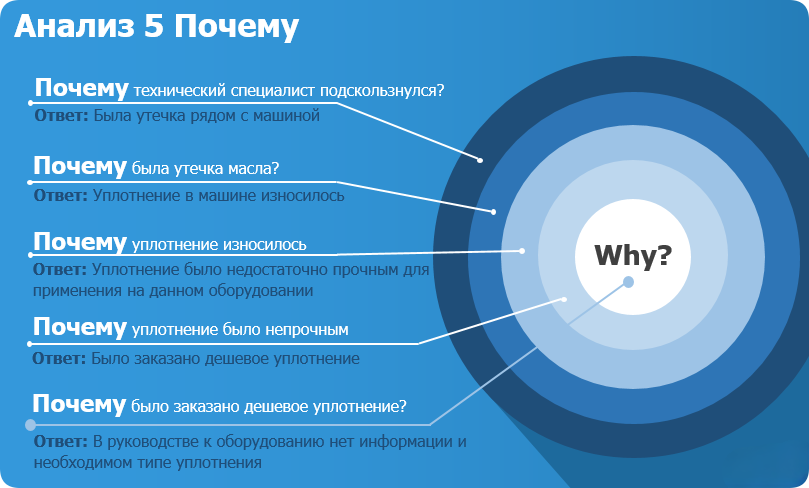
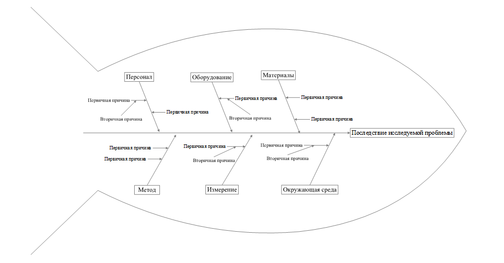
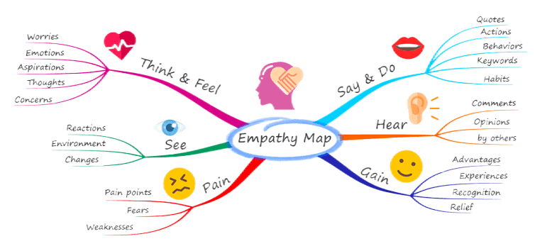
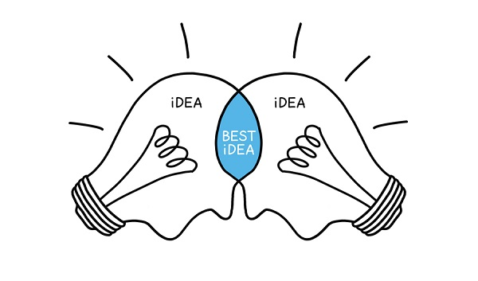
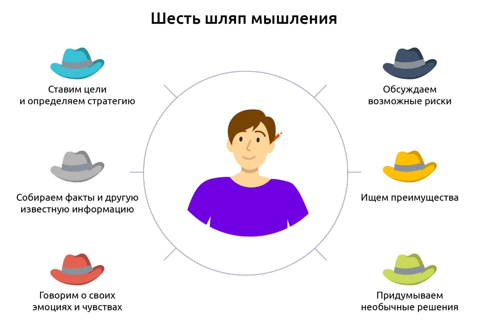
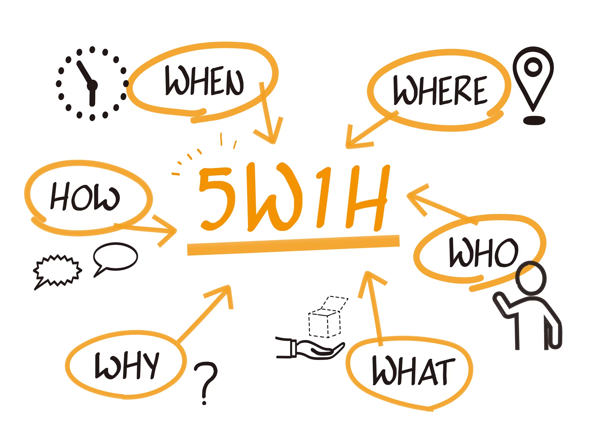

# 4. Анализ проблемы и идея

## Содержание

+ [4.1 Анализ проблемы](#41-анализ-проблемы)
  + [Почему проект надо начинать с проблемы?](#почему-проект-надо-начинать-с-проблемы)
  + [Проблема и критерии, которым она должна соответствовать](#проблема-и-критерии-которым-она-должна-соответствовать)
  + [5 Почему (5 Why)](#5-почему-5-why)
  + [Диаграмма Исикавы](#диаграмма-исикавы)
  + [Ментальные карты (Mind Map)](#ментальные-карты-mind-map)
+ [4.2 Формирование идей](#42-формирование-идей)
  + [Мозговой штурм](#мозговой-штурм)
  + [Разновидности мозгового штурма](#разновидности-мозгового-штурма)
    + [Мозговое письмо (брейнрайтинг)](#мозговое-письмо-брейнрайтинг)
    + [Обратный штурм](#обратный-штурм)
    + [Ролевой штурм](#ролевой-штурм)
  + [Метод "6 шляп"](#метод-6-шляп)
  + [Метод Киплинга (5W1H)](#метод-киплинга-5w1h)

[Оглавление](../README.md)

## 4.1 Анализ проблемы

**Аннотация:**

+ Почему надо определять проблему;
+ Критерии проблемы;
+ Методы определения проблемы.

### Почему проект надо начинать с проблемы?

Казалось бы, зачем вот эти все проблемы и так своих навалом. Как раз для этого нужен проект, чтобы решать проблемы групп людей, а не существовать абстрактно. Этот этап при реализации является крайне важным, так как это опора всего проекта и нельзя пренебрегать анализом.

Начиная проект с проблемы, команда может:

1. Провести исследование,
2. Выявить причины возникновения проблемы
3. B разработать план действий для ее решения.

**Это позволяет определить не только цель, но и его задачи, этапы, сроки, бюджет и риски.** Кроме того, фокусирование на проблеме помогает выявить потребности и ожидания заинтересованных сторон, что может повысить вероятность успеха проекта. Если же работа начинается без анализа и постановки проблемы, то это может привести к тому, что проект не будет иметь ясных целей и задач, а также может быть неоправданно затратным и неэффективным.

На этой страничке мы разберём основные критерии, которым должна соответствовать проблема, а на следующих шагах рассмотрим различные инструменты по работе с ней: от поиска до постановки.

---
[Содержание](#содержание)

### Проблема и критерии, которым она должна соответствовать

**Критерии, которым должна соответствовать проблема**, очень сильно пересекаются с постановкой цели и задач. Это вовсе не случайно, на всех этапах работы над проектом важно контролировать процесс по определённым меткам, которые говорят о том, что вы на верном пути. В этом блоке заложим фундамент работы с критериями.

+ **Проблема должна быть существующей** 
Данный критерий направлен на предотвращение ресурсных затрат на анализ и решение вымышленных или незначительных проблем, которые не оказывают реального воздействия на окружающий мир или субъекта. Он способствует более эффективному использованию усилий и ресурсов при разрешении реальных и актуальных проблем.
+ **Формулировка должна быть конкретной** 
Этот критерий означает, что при анализе, исследовании или решении задачи следует иметь дело с четко определенной и ограниченной проблемой или вопросом, который можно однозначно идентифицировать и описать. Конкретность проблемы подразумевает, что она не должна быть слишком абстрактной, неопределенной или размытой.
+ **Формулировка должна быть *атомарна*** 
Данный критерий подразумевает, что при представлении или описании определенной ситуации или вопроса, важно выделить только один конкретный аспект или сложность. Это помогает обеспечить четкость, фокусировку и более эффективное обсуждение проблемы или поиска решения.
+ **Не стоит детализировать проблему до мельчайших деталей** 
Этот критерий подразумевает, что при описании проблемы или задачи не следует углубляться в чрезмерные технические или мельчайшие аспекты, которые могут отвлекать от сути проблемы и усложнять понимание её сути. Вместо этого, необходимо выявить основные аспекты и ключевые элементы, которые имеют наибольшее влияние на суть проблемы.

---
[Содержание](#содержание)

### 5 Почему (5 Why)

**"5 почему"** - это метод исследования причинно-следственных связей, используемый для анализа проблем и выявления корневых причин их возникновения. Эта техника позволяет проникнуть глубже и выявить источник проблемы, а не только её поверхностные признаки.

Суть техники заключается в том, чтобы **задавать вопрос "почему?"** в ответ на каждый предыдущий ответ, чтобы последовательно раскрыть корневую причину проблемы. Обычно достаточно задать этот вопрос пять раз, чтобы выявить настоящую причину.

Применение "5 почему" позволяет достичь следующих целей:

+ Определить настоящую причину проблемы, а не только ее симптомы
+ Разработать эффективные меры по ее устранению
+ Сделать проект, который зацепит большую аудиторию

Техника "5 почему" может использоваться не только в реализации проектов, но и в производстве, логистике, маркетинге и других областях нашей жизни. Она позволяет более глубоко понимать проблемы, находить эффективные решения и улучшать производительность и качество работы.

---
[Содержание](#содержание)

### Диаграмма Исикавы

Диаграмма Исикавы, также известная как **"диаграмма рыбьей кости", - это графический метод определения причин возникновения проблем**. Он был разработан японским инженером Каору Исикавой в 1960-х годах и стал одним из основных инструментов системного подхода в менеджменте качества.

**Суть диаграммы Исикавы** заключается в том, что проблема представляется в виде рыбьей кости, где голова соответствует проблеме, а кости - ее возможным причинам. Каждый фактор, который может повлиять на проблему, записывается на соответствующем элементе. В результате получается структурированное представление причин, которые могут быть связаны с проблемой.

Применение диаграммы Исикавы позволяет достичь следующих целей:

+ Изучить проблему с помощью структурированного подхода
+ Определить все возможные причины проблемы и выделить наиболее значимые из них
+ Улучшить коммуникацию между участниками процесса и снизить уровень конфликтов (*"Диаграмма Исикавы" - очень гибкий инструмент и его можно использовать в поиске причин конфликтов в команде, но не стоит этим увлекаться*)

Диаграмма Исикавы может использоваться в любой сфере деятельности, где есть необходимость в определении и устранении проблем. Она позволяет систематически подходить к решению проблем и достигать более эффективных результатов.

---
[Содержание](#содержание)

### Ментальные карты (Mind Map)

**"Ментальные карты" - это метод, используемый для определения и структурирования проблемы, а также для генерации идей и решений**. Она позволяет организовать информацию в виде диаграммы, которая помогает понять связи и отношения между различными аспектами проблемы.

**Суть техники** заключается в создании диаграммы, которая представляет собой центральную основную проблему и ветви, отходящие от нее, представляющие связанные с ней идеи, понятия, причины и аргументы. Для создания ментальной карты можно использовать бумагу и ручку, а также различные программы для создания диаграмм (Draw io, Miro).

Преимущества использования техники "Ментальные карты":

+ Помогает структурировать информацию и идеи
+ Улучшает понимание проблемы и ее составляющих частей
+ Позволяет генерировать новые идеи и решения
+ Улучшает коммуникацию и взаимодействие в команде проекта
+ Способствует более эффективному принятию решений

**"Ментальные карты"** - очень гибкий инструмент, который активно используется во многих сферах жизни: проекты, образование, маркетинг, научные исследования и другие. Он позволяет визуализировать информацию, облегчая ее восприятие и обработку, и помогает в развитии креативного мышления.

Вспомните ситуацию, которая произошла с вами на днях, может быть вы что-то забыли или не сделали. Разберите её с помощью техники "5 почему" и напишите процесс размышлений в ответ.

>Иногда я включаю принцип: Если что-то можно отложить на завтра, то это можно вообще не делать 🙂 Иногда очень помогает отсечь не нужное и не важное 🙂

А вот ситуация от нас🙂

Почему моя машина не заводится?

Оставьте ваш анализ данной проблемы в комментариях.

---
[Содержание](#содержание)

## 4.2 Формирование идей

**Аннотация:**

+ Процесс формирования идей;
+ Мозговой штурм;
+ И его разновидности;
+ Метод "6 шляп";
+ Метод Киплинга.

Самый распространенный вопрос людей, которые занимаются инновационными проектами — как найти идею для стартапа. Второй по популярности вопрос — **есть ли у вас какие-нибудь идеи стартапа для них**.

На появление уникальных идей влияет множество факторов:

+ Количество реализованных проектов,
+ Знание о сфере,
+ Качественное окружение
+ И множество других.

Точно предсказать какой из них окажет наибольшее влияние крайне тяжело, поэтому стоит гармонично развивать все направления своей жизни. Мы же зайдём с научной точки зрения и попробуем рассмотреть конкретные инструменты для формирования идей.

---
[Содержание](#содержание)

### Мозговой штурм

Самым распространённым подходом к формированию идей - мозговой штурм.

**Мозговой штурм** (или брейнсторминг) - это **креативная методология, направленная на генерацию широкого спектра идей или решений для определенной проблемы или задачи**.

Вот основные шаги и принципы методологии мозгового штурма:

1. **Подготовка и определение цели:** Определите четкую цель мозгового штурма. Это может быть разработка новой идеи, решение проблемы, создание продукта или другая задача. В проекте важно основываться на проблеме, анализ которой вы сделали.
2. **Формирование группы:** Соберите небольшую группу участников, представляющих разные аспекты проблемы или имеющих разнообразные точки зрения. Разнообразие помогает генерировать более разнообразные идеи.
3. **Правила брейнсторминга:** Установите правила, которые способствуют открытому и свободному обмену идеями. Например, запретите критику в начале процесса, поощрите нестандартные идеи и приветствуйте количество, а не качество на данном этапе.
4. **Сессия генерации идей:** Запустите сессию брейнсторминга. Участники предлагают идеи поочередно, в быстром темпе. Одна идея может стимулировать другие, поэтому важно, чтобы процесс был энергичным и плавным.
5. **Запись идей:** Важно записывать все идеи без оценки или критики. Это поможет сохранить поток мыслей и предотвратить утерю ценных идей.
6. **Комбинирование и развитие идей:** После генерации идей перейдите к их анализу и комбинированию. Идеи можно развивать, комбинировать различные элементы или адаптировать под определенные требования.
7. **Оценка и выбор лучших идей:** Проведите сессию обсуждения и оценки сгенерированных идей. Выберите те, которые наилучшим образом соответствуют вашей цели или задаче.

Помните, что мозговой штурм может быть очень эффективным, если все участники сосредоточены на генерации идей, открыты к экспериментам и не боятся высказывать даже самые необычные предложения.

---
[Содержание](#содержание)

### Разновидности мозгового штурма

#### Мозговое письмо (брейнрайтинг)

Этот метод быстро завоевал популярность в проектных командах, так как позволял сосредоточиться каждому участнику на своих мыслях.
В процессе участвует группа лиц, которая записывает все свои идеи на лист бумаги. После этого идеи распространяются по группе в определённой последовательности, затем начинается новый цикл обдумывания. И только после этого наступает этап обсуждения зафиксированных идей.

Но и у этого метода есть свои недостатки:

+ Занимает много времени
+ Не очень эффективен при большом количестве людей

Поэтому для такого формата мозгового штурма очень хорошо действует правило “6-3-5”: 6 человек, 3 идеи, 5 минут. Процесс брейнрайтинга выглядит следующим образом:

+ Группа из 6 человек садится за стол
+ Ведущий запускает 5 минут
+ Каждый участник пишет ровно 3 идеи
+ Лист бумаги передаётся по кругу
+ Процесс продолжается, пока каждый не напишет 3 идеи на каждом листе (всего - 90 идей)

---
[Содержание](#содержание)

#### Обратный штурм

При классическом мозговом штурме перед участниками стоит задача генерировать идеи, которые сработают – помогут решить задачу или достичь цели.

Подход «от обратного» дает возможность заняться вредительством – предлагать идеи, которые вряд ли сработают или не сработают точно. Казалось бы, пользы мало, но неверные решения могут навести на ценные мысли, до которых вы бы никогда не додумались, идя классическим путем. Процесс проведения обратного штурма:

+ Участники высказывают негативные решения для поставленной проблемы
+ Ведущий фиксирует идеи на доску
+ Проводится отбор идей и предлагаются положительные решения

Хорошо работает перед релизами проекта или продукта на рынок, позволяет найти слабости и недостатки.

---
[Содержание](#содержание)

#### Ролевой штурм

Ролевой штурм позволяет выйти за рамки своих принципов и посмотреть на ситуацию с позиции другого человека. Этот метод даёт примерить на себя разные роли и с этих позиций дать оценку сформированной проблеме. Процесс проведения ролевого штурма следующий:

+ Ведущий формирует список ролей, с которых необходимо смотреть на проблему
+ Участники примеряют на себя роль и высказывает возможное решение проблемы
+ Происходит процесс обсуждения идей

Довольно-таки универсальный метод мозгового штурма, хорошо работает в связке с другими. К примеру, можно выявить недостатки используя обратный штурм, а возможные решения искать с помощью ролевого.

---
[Содержание](#содержание)

### Метод "6 шляп"

**Методология "Шесть шляп мышления"** – это **инструмент, разработанный Эдвардом де Боно для структурирования и улучшения процесса генерации идей**.

Он представляет шесть различных "шляп", каждая из которых символизирует определенный способ мышления.

Вместе они помогают команде заниматься анализом и обсуждением идей с разных точек зрения. Ниже приведено описание каждой из шести шляп:

1. **Белая шляпа (Информационная):** Эта шляпа связана с фактами и данными. В этом режиме мы анализируем информацию, собираем факты и цифры, описываем текущую ситуацию. На этом этапе избегаем оценок и мнений.
2. **Красная шляпа (Эмоциональная):** Здесь фокусируемся на эмоциональных реакциях и интуиции. Мы можем выражать чувства, предположения, интуитивные ощущения и страхи. Это позволяет выразить эмоциональную сторону идеи.
3. **Черная шляпа (Критическая):** Центральный аспект – критическое мышление. Здесь мы анализируем недостатки и риски, рассматриваем проблемы и потенциальные опасности. Черная шляпа помогает выявить уязвимости и возможные препятствия.
4. **Желтая шляпа (Позитивная):** Эта шляпа сосредотачивается на позитивных аспектах и плюсах идеи. Мы рассматриваем потенциальные преимущества, позитивные результаты и выгоды. Желтая шляпа позволяет видеть оптимистичные перспективы.
5. **Зеленая шляпа (Творческая):** Здесь у нас свобода творчества и генерации новых идей. Мы исследуем альтернативные подходы, варианты и решения. Зеленая шляпа стимулирует креативность и инновационное мышление.
6. **Синяя шляпа (Управления процессом):** Синяя шляпа занимается организацией процесса и анализом того, как проходят обсуждения. Она отвечает за структурирование дискуссии, управление временем, формулирование вопросов и обобщение выводов.

Подводя итог, методология "Шесть шляп мышления" предоставляет структурированный и многогранный подход к генерации идей, что может существенно обогатить процесс принятия решений и помочь находить более творческие и инновационные решения проблем.

---
[Содержание](#содержание)

### Метод Киплинга (5W1H)

**Методология Киплинга** – **это инструмент для систематической генерации идей и анализа проблем, разработанный на основе стихотворения**.

Этот метод помогает структурировать мышление и подходить к задачам более творчески и аналитически. Он состоит из серии вопросов, которые помогают исследовать идею или проблему с разных точек зрения. Ниже приведено описание этой методологии:

1. **Что? (What):** Вопрос описания ситуации, идеи или проблемы. Четкое определение и описание является первым шагом в понимании контекста.
2. **Почему? (Why):** Вопрос о причинах и мотивациях. Позволяет понять, почему данная идея или проблема существует и какие факторы влияют на нее.
3. **Где? (Where):** Вопрос о местоположении и контексте. Это может относиться к физическому месту, среде или культурным аспектам.
4. **Когда? (When):** Вопрос о временных рамках и последовательности событий. Позволяет оценить динамику и изменения.
5. **Кто? (Who):** Вопрос о вовлеченных сторонах или персонах. Кто причастен к ситуации? Какие интересы участников?
6. **Что делать? (What to do):** Вопрос о действиях и возможных решениях. Этот вопрос позволяет перейти к поиску альтернативных путей и решений.
7. **Как? (How):** Вопрос о способах реализации и выполнения действий. Это позволяет разработать конкретные планы и стратегии.
8. **С чем? (With what):** Вопрос о ресурсах и инструментах. Какие ресурсы, знания и инструменты могут быть использованы для реализации планов?
9. **Сколько? (How much):** Вопрос о количественных оценках, затратах и рисках. Помогает оценить масштаб и сложность реализации идей.
10. **Зачем? (For what):** Вопрос о целях и пользе. Зачем нужно решать данную проблему или реализовывать идею? Какая выгода от этого?

Методология Киплинга помогает структурировать анализ и генерацию идей, позволяет рассмотреть задачу с разных сторон и выявить важные аспекты. Она может быть полезной для принятия обоснованных решений.

А теперь задание. У вас возникла следующая ситуация: Ваш компьютер не работает.

Сгенерируйте идеи, по каким причинам компьютер не работает, а также присоединитесь к ответам других участников курса - развивайте их идеи.

Если у вас был положительный или отрицательных опыт мозгового штурма или другого способа генерации идей - поделитесь своим кейсом в комментариях.

---
[Содержание](#содержание)
