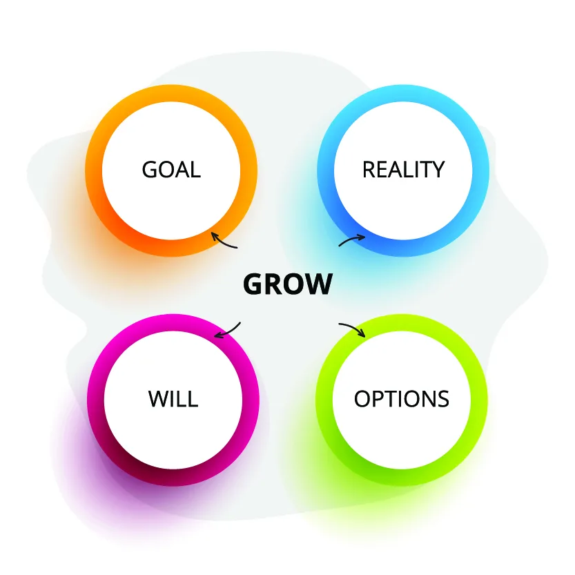

# 5. Цель и задачи в проекте

## Содержание

+ [5.1 Цель](#51-цель)
+ [5.2 Задачи](#52-задачи)

[Оглавление](../README.md)

## 5.1 Цель

Аннотация: Что такое цель; SMART(ER); GROW; OKR.

### Что такое цель?

На этом этапе мы сделаем переход от общих рассуждений и формулировок к конкретике и постановке цели и задач. Сейчас разберёмся с понятием "цель" и зачем их использовать, если уже есть идея и можно идти делать прототип.

**Цель в проекте** - это **конечный результат, который нужно достичь в рамках проекта**. Она является одним из основных элементов планирования проекта и позволяет определить, что именно нужно достигнуть, чтобы считать проект успешным.

Установка целей в проекте важна по нескольким причинам:

1. **Направляет усилия команды проекта.** Определение целей помогает команде проекта фокусироваться на конечном результате и на том, что необходимо сделать, чтобы достичь этого результата.
2. **Помогает оценить прогресс в проекте.** Цели позволяют определить, насколько хорошо продвигается проект и сколько работы еще осталось.
3. **Служит основой для оценки успеха проекта.** Определение целей помогает определить, насколько успешно завершен проект. Если цели были достигнуты, то проект можно считать успешным.
4. **Улучшает коммуникацию в команде.** Цели позволяют команде проекта лучше понимать, что нужно достичь и какие шаги нужно предпринять для достижения этой цели.

### SMART(ER)

На этом шаге начинаем погружение в методологии, которые используют крупные компании в своей работе. Долгое время при постановке целей почти во всех сферах использовалась методология SMART, но в условиях быстрых изменений данная аббревиатура получила две дополнительные буквы "ER", что же это за приятный бонус разберёмся ниже:

+ **S (Specific)** – конкретная цель, четко сформулированная и ясно определенная. Например, вместо цели "хочу стать более успешным" лучше поставить цель "заработать 100 000 рублей за год".
+ **M (Measurable)** – цель должна быть измеримой. Например, для цели "заработать 100 000 рублей за год" можно измерять прогресс, следя за доходами каждый месяц.
+ **A (Achievable)** – цель должна быть достижимой, но в то же время вызывать некоторый вызов. Например, если вы зарабатываете 300 000 рублей в год, цель заработать 1 000 000 рублей может быть слишком амбициозной.
+ **R (Relevant)** – цель должна быть релевантной, то есть иметь значение и отношение к вашим личным ценностям, желаниям, навыкам и возможностям. Например, если вы не интересуетесь продажами, то цель стать лучшим продавцом может не быть релевантной.
+ **T (Time-bound)** – цель должна быть ограничена временными рамками. Например, вместо цели "заработать 100 000 рублей" целевое значение может быть определено, как "заработать 100 000 рублей до конца года".
+ **E - Evaluated (оценка)** - цель должна быть оцениваться на регулярной основе, чтобы определить прогресс и внести изменения при необходимости.
+ **R - Rewarded (вознаграждение)** - достижение цели должно быть вознаграждено, чтобы мотивировать и поддерживать желание реализовывать последующие цели

Методология **SMART** стала стандартом на долгое время во всех сферах постановки целей, но в текущих реалиях надбавка (**ER**) крайне необходима. Так как она позволяет быстро пересматривать цели и корректировать вектор прогресса.

### GROW

Методология позволяет определить цель, а затем работать с конкретными шагами и действиями, которые необходимо предпринять для её достижения. **GROW** помогает оценить текущую ситуацию и ресурсы, доступные для достижения цели, и определить, какие действия необходимо предпринять, чтобы перейти от текущего состояния к желаемому результату.

**GROW** - это акроним, который расшифровывается следующим образом:

+ **G - Goal (цель)** - определение конкретной и измеримой цели.
+ **R - Reality (реальность)** - оценка текущего положения дел, определение сильных и слабых сторон, а также возможных препятствий для достижения цели.
+ **O - Options (варианты)** - построение траекторий реализации и поиск препятствий на пути достижения результата.
+ **W - Will (путь)** - разработка плана действий, включающего шаги для достижения цели.

Эта методология также может быть использована для управления прогрессом и оценки результатов. Она позволяет пересмотреть план, если необходимо, и внести изменения в действия и цели. Кроме того, **GROW** может быть использована для мотивации и поддержки участников в достижении их целей, учитывая их индивидуальные потребности и предпочтения.

### OKR

**Методология постановки целей OKR (Objectives and Key Results)** - это **подход к управлению целями, который используется для установки целей организации и отдельных сотрудников.** Она была разработана компанией Intel в 1970-х годах и успешно используется в многих компаниях, включая Google, LinkedIn, Twitter и другие.

OKR состоит из двух элементов:

1. **Цели (Objectives)** - это высокоуровневые описания того, что нужно достичь. Цели должны быть конкретными, измеримыми, достижимыми, релевантными и ограниченными по времени.
2. **Ключевые результаты (Key Results)** - это измеряемые результаты, которые помогают определить, насколько хорошо были достигнуты цели. Ключевые результаты должны быть конкретными, измеримыми и связанными с целями.

Процесс OKR состоит из следующих этапов:

1. **Определение целей (Objectives)** - установка целей на основе общих стратегических целей организации. Цели должны быть амбициозными и в то же время достижимыми.
2. **Определение ключевых результатов (Key Results)** - установка измеряемых результатов, которые позволят оценить прогресс в достижении целей. Ключевые результаты должны быть конкретными и связанными с целями.
3. **Оценка и обновление** - регулярная оценка прогресса в достижении целей и ключевых результатов. Если цели не достигнуты, то необходимо определить причины и внести корректировки в планы.

Методология **OKR** помогает организациям и сотрудникам более эффективно управлять целями и достигать желаемых результатов. Она позволяет связать личные цели с общими стратегическими целями организации и дает возможность оценить прогресс в достижении целей на регулярной основе.

---
[Содержание](#содержание)

## 5.2 Задачи

Аннотация: Зачем делить цели на задачи; Матрица Эйзенхауэра.

### Зачем делить цели на задачи?

**Декомпозиция цели на задачи** - **это процесс разбиения целей на более мелкие, конкретные и измеримые шаги, которые необходимо выполнить для достижения.** Зачастую, цель может быть сложной и содержать множество задач, которые должны быть выполнены, чтобы достичь её. Ниже будут пункты, почему декомпозиция цели на задачи является важным шагом в достижении успеха:

1. **Увеличивается понимание цели:** Когда цель разбивается на конкретные задачи, она становится более понятной и доступной для всех участников проекта. Все знают, какую задачу им предстоит выполнить и как это будет способствовать достижению цели.
2. **Разделение сложных задач на более простые:** Декомпозиция цели на задачи помогает разделить сложную и масштабную цель на более простые и понятные части, что делает их более выполнимыми.
3. **Определение приоритетов:** Декомпозиция целей на задачи помогает участникам проекта определить приоритеты в их работе. Каждая задача имеет свою важность и сроки выполнения, и их выполнение в порядке приоритета поможет участникам проекта справляться с работой более эффективно и своевременно.
4. **Лучшее управление проектом:** Когда цель декомпозируется на задачи, управление проектом становится проще. Это помогает лучше планировать и управлять работой в рамках проекта.
5. **Более точное измерение прогресса:** Когда цель декомпозируется на задачи, можно лучше измерять прогресс выполнения проекта. Каждая задача имеет свои сроки выполнения, их выполнение позволяет более точно отслеживать прогресс проекта и корректировать планы при необходимости.

---
[Содержание](#содержание)

### Матрица Эйзенхауэра

**Матрица Эйзенхауэра** - это инструмент для приоритезации задач, разработанный 34-м президентом Соединенных Штатов. Она помогает структурировать и управлять вашим временем, определяя приоритеты на основе важности и срочности задач.

Матрица Эйзенхауэра имеет четыре квадранта, основанные на двух критериях: важность и срочность.

1. **Важные и срочные (Квадрант I):** Задачи, которые требуют немедленного внимания и выполнения. Это могут быть кризисные ситуации, неотложные проекты и т.д. В этом квадранте вы должны фокусироваться на том, чтобы выполнить задачи в срок.
2. **Важные, но не срочные (Квадрант II):** Задачи, которые имеют высокую важность для достижения ваших долгосрочных целей, но не требуют мгновенного внимания. В этом квадранте вы должны планировать и распределять время для выполнения таких задач, чтобы избежать их превращения в срочные.
3. **Не важные, но срочные (Квадрант III):** Задачи, которые кажутся срочными, но имеют меньшую важность или даже не связаны с вашими целями. В этом квадранте важно минимизировать время, потраченное на такие задачи, и, по возможности, делегировать их другим.
4. **Не важные и не срочные (Квадрант IV):** Задачи, которые незначительны с точки зрения важности и срочности. В этом квадранте можно рассмотреть возможность устранения таких задач или, по крайней мере, сократить на них время.

**Применение матрицы Эйзенхауэра позволяет вам:**

+ Определить приоритеты и сконцентрироваться на наиболее важных задачах.
+ Предотвратить перегрузку срочными, но не обязательно важными делами.
+ Уделить внимание долгосрочным стратегическим целям.
+ Рационально использовать время и эффективно управлять задачами.

Для применения матрицы Эйзенхауэра следует:

1. **Составить список задач:** Запишите все задачи, которые у вас есть.
2. **Определить важность и срочность:** Распределите каждую задачу в один из четырех квадрантов в зависимости от ее важности и срочности.
3. **Приоритизировать:** Начните с выполнения задач из Квадранта I, затем переходите к Квадранту II, и так далее.
4. **Планировать и действовать:** Создайте план действий для выполнения задач из различных квадрантов и придерживайтесь этого плана.
5. **Постоянно обновлять:** Регулярно обновляйте матрицу, добавляя новые задачи и пересматривая приоритеты с учетом изменений обстоятельств.

Матрица Эйзенхауэра представляет собой простой, но мощный метод для эффективной приоритизации задач и управления временем.

**Соотнесите задачи из сферы "Задачи по спорту и физической активности" с их квадрантом из Матрицы Эйзенхауэра.**

**Соотнесите задачи из сферы "задачи по социальной жизни и общению с друзьями" с их квадрантом из Матрицы Эйзенхауэра.**

**Соотнесите задачи из сферы "Задачи по личностному росту и развитию" с их квадрантом из Матрицы Эйзенхауэра.**

---
[Содержание](#содержание)
