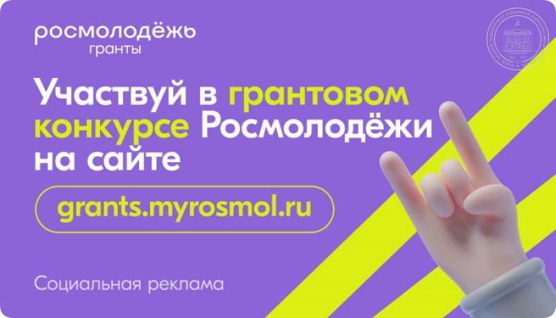
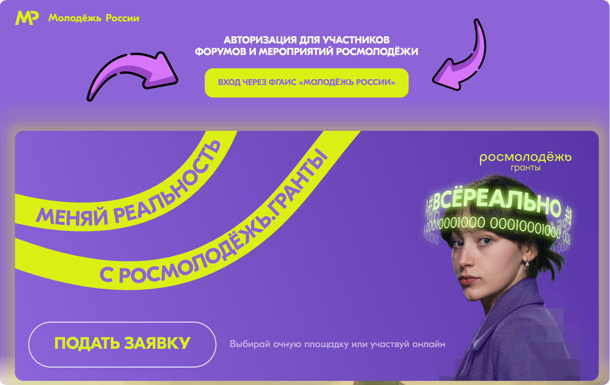

# 12. Подача заявки на Росмолодежь.Гранты

## 12.1 О Росмолодежь.Гранты и сути этого модуля

Аннотация: Что такое Росмолодежь.Гранты; Как получить первый капитал для своего проекта; Создание нового проекта.

### Что такое Росмолодежь.Гранты?

**Росмолодежь.Гранты - проект для активных молодых людей, которые хотят реализовать свои идеи** и готовы конкретными действиями улучшать мир вокруг себя.

Конкурс дает шанс выиграть грант на развитие своих социально значимых проектов. Он в числе первых присоединился к платформе «Россия – страна возможностей» и уже **объединил 56,6 тысячи молодых россиян**, образовательных и общественных организаций.

**Победителями конкурса стали 8,7 тысячи проектов,** которые получили грантовую **поддержку на общую сумму в 7,3 миллиарда рублей**.

### Как получить первый капитал для своего проекта?

Этот модуль посвящен заполнению заявки на Росмолодежь.Гранты. Платформа Росмолодежь ежегодно проводит огромное количество мероприятий, в рамках которых дает гранты на реализацию проектов их участникам. В этом модуле мы научим вас как заполнить заявку на грант так, чтобы ваш проект обязательно получил финансовую поддержку.

Если готовы, то скорее [регистрируйтесь на платформе](https://grants.myrosmol.ru/)!

