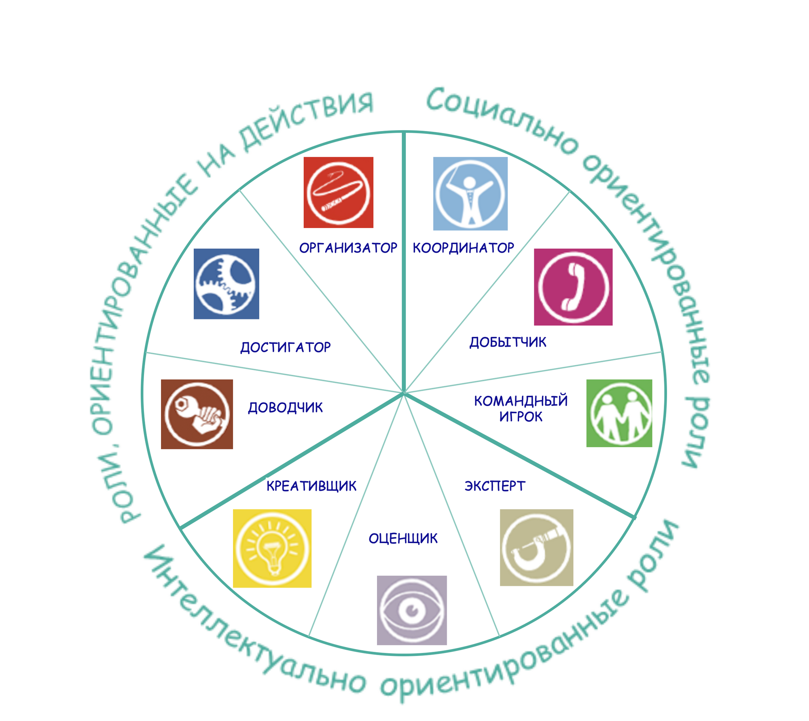
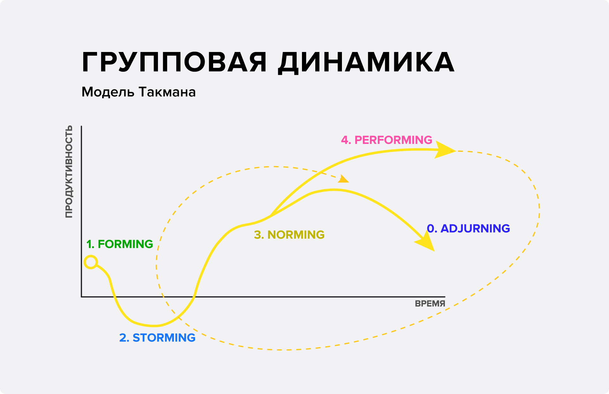
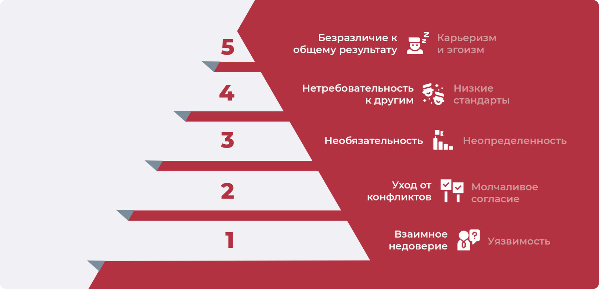
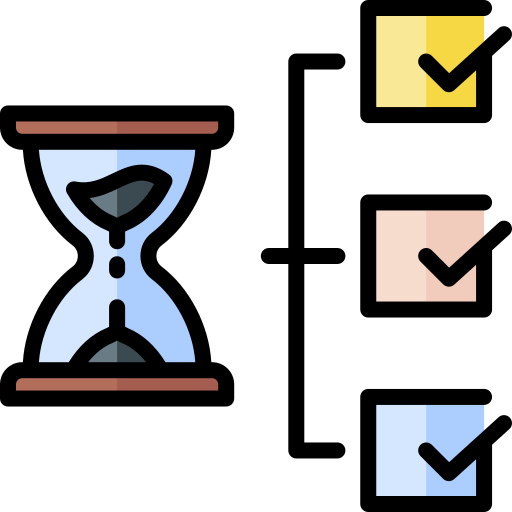
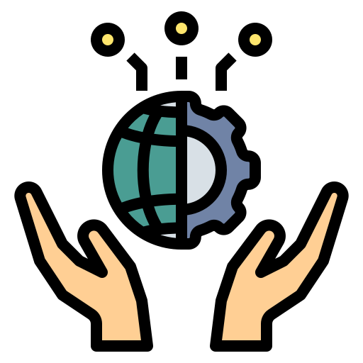
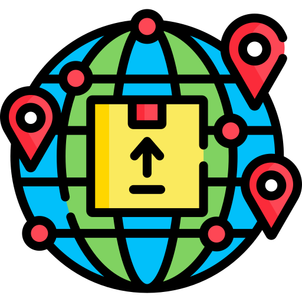
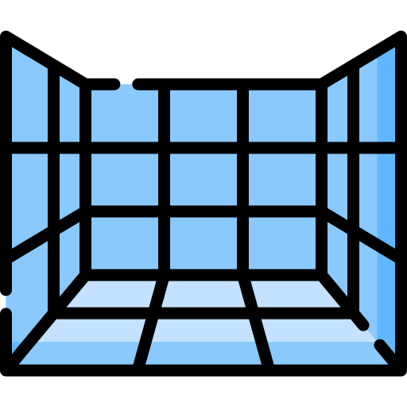
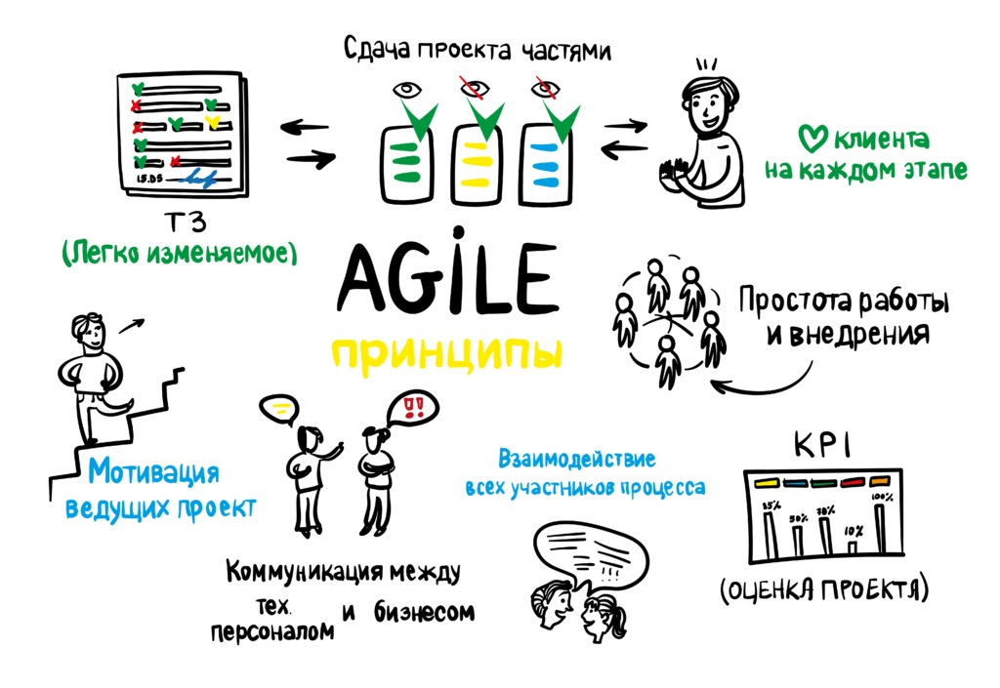
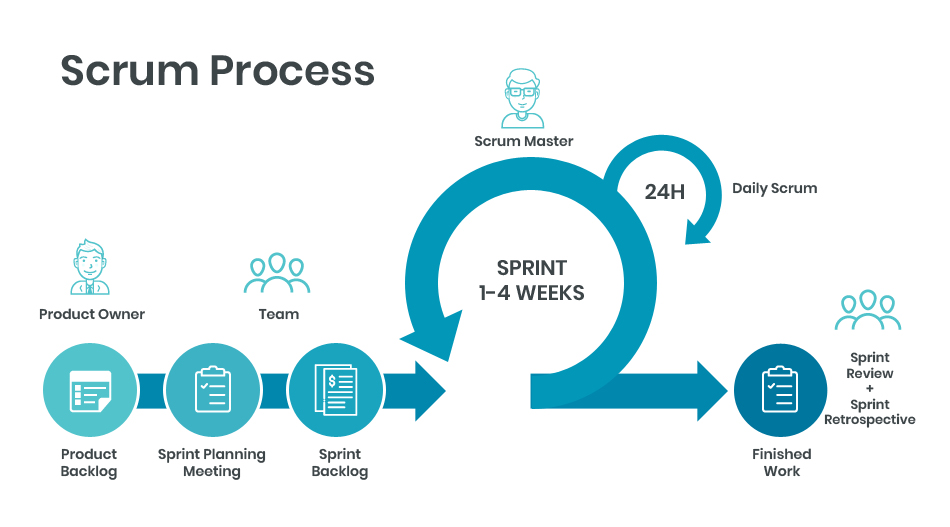
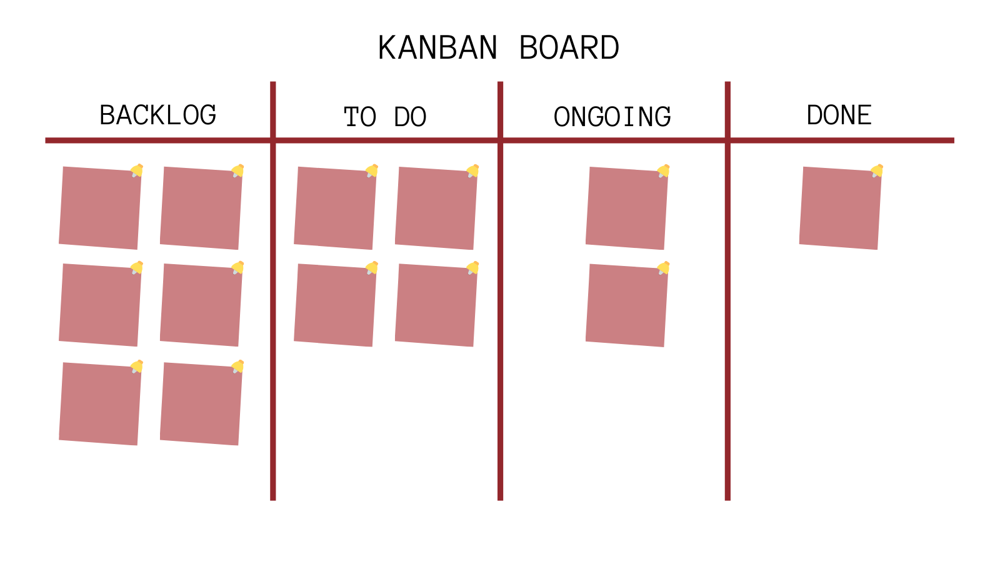

# Стартап с 0: Основы проектной деятельности

## Содержание

[Оглавление](../README.md)

## 1. Информация о курсе

### 1.1 Что такое Процион?

Приветствуем!  
Вы начали прохождение курса "Стартап с 0: Основы проектной деятельности" от Образовательного проекта "Процион".

Но для начала, что такое "Процион"?

**Процион** - всероссийский социально-образовательный проект

**Наша миссия:** Создавать доступное и качественное образование, делая обучение не только эффективным, но и интересным.

**Что мы делаем?** 🤔  
Мы создаем доступные и качественные образовательные продукты в сферах IT, Soft skills и проектной деятельности, ориентированные на новичков, делая обучение наших учеников максимально эффективным и интересным для освоение нового навыка за минимальный промежуток времени.

**Для кого мы работаем:**

1. Для амбициозных и целеустремленных  
Для того, кто ставит перед собой амбициозные цели и мечтает стать лучшим в своем деле и готов двигаться к ним дальше
2. Для смелых  
Для того, перед кем стоит сложная профессиональная задача или вызов и кто готов покорять новые галактики
3. Для тех, кто знает, что ещё много предстоит узнать  
Для того, кто потерялся в необъятном космосе, устал, ищет себя и свое предназначение, а также ценит опыт других и готов учиться

**Наши принципы и ценности**  
👨‍🏫 *Качество образования* - мы стремимся предоставлять высококачественные продукты, которые помогут нашим ученикам достичь космического успеха в своей карьере  
💜 *Доступность* - мы верим, что каждая разумная форма жизни должна иметь возможность получить образование в сфере IT, Soft skills и проектной деятельности, независимо от планеты, на которой она обитает, или финансового положения  
💻 *Инновации* - мы всегда открыты для новых идей и межпланетарных технологий, которые могут улучшить наши продукты и помочь нашим ученикам достичь большего
👥 *Сообщество* - мы стремимся создать сообщество обучающихся и преподавателей со всей вселенной, которые могут поддерживать и вдохновлять друг друга на пути к обучению и развитию  
⏸ *Равноправие* - мы уважаем и ценим разнообразие наших обучающихся и преподавателей

Готовы создать свой стартап?

**Цель**  
Перед началом обучения, ответьте на вопрос, что вы ожидаете от прохождения курса, чего вы хотите достичь?
(Оставьте свой ответ в комментариях ниже)

*Например:*

+ Мне интересна эта сфера, поэтому я хочу познакомиться с ней поближе
+ У меня уже есть идея своего стартапа, не терпится приступить к его реализации, но для этого нужны специальные знания и навыки, я пришел за ними!
+ У меня уже имеется немалый опыт в данной сфере, хочу проверить его на прочность

---
[Содержание](#содержание)

## 2. Добро пожаловать в мир проектов

### 2.1 Что такое проект?

**Аннотация:**

+ Все о проектной деятельности;
+ Основные составляющие;
+ Сферы проектной деятельности;
+ Отличие проекта от продукта.

#### Что же такое проектная деятельность?

**Проектная деятельность** - это процесс планирования, реализации и контроля проекта с целью достижения конкретных результатов в рамках определенного бюджета и с использованием ограниченных ресурсов.

Звучит страшновато? Но на самом деле все просто, ведь согласитесь, это определение очень напоминает жизнь. Все мы решаем определённый набор задач, чтобы прийти к той самой цели, которую ставим когда-то в детстве и корректируем в ходе собственного развития. В проекте всё также, только временной промежуток покороче.

Что включает в себя проектная деятельность?

+ Планирование работ
+ Определение задач и целей
+ Распределение ресурсов
+ Управление рисками
+ Контроль прогресса выполнения проекта
+ Коммуникации

*Все эти аспекты реализации проектов будут рассмотрены на курсе на конкретных кейсах и примерах из практики компаний и стартапов

#### Сферы проектной деятельности

Проектная деятельность окружает нас повседневно, большинство объектов сделано в результате реализации проекта. Порой, мы даже не замечаем, что используем инструменты ПД в работе над повседневными задачами. Ниже приведена малая часть сфер, в которых используется проектная деятельность.

|Сфера деятельности| Направления проектной деятельности|
| -- | -- |
|Бизнес | Создание новых продуктов и услуг   Запуск новых производственных линий   Улучшение процессов   Проведение маркетинговых кампаний|
|IT | Разработка программного обеспечения Создание сайтов Запуск компьютерных сетей Внедрение новых технологий|
|Строительство | Возведение новых зданий и сооружений Реконструкция и ремонт существующих объектов|
|Исследования | Научные исследования Разработка новых технологий|
|Образование | Создание новых учебных программ Проведение научных конференций Организация учебных мероприятий и форумов|
|Социальные проекты | Организация благотворительных мероприятий Проведение социологических исследований Развитие инфраструктуры|
|Культура | ​Организация культурных мероприятий, выставок, фестивалей|
|Спорт | Создание спортивных объектов Проведение спортивных мероприятийОрганизация тренировок и сборов|

---
[Содержание](#содержание)

#### Примеры существующих проектов

Давайте разберем примеры проектов из различных сфер, рассмотрим их этапы и цели. Таким образом, у вас сформируется полное понимание, что такое проектная деятельность.

##### Сфера бизнеса

**Название компании: "GreenTech Innovations"** 
Компания "GreenTech Innovations" занимается разработкой экологически чистых технологий и продуктов. Одним из проектов  является разработка и производство электромобиля на базе новых технологий, позволяющих уменьшить вредные выбросы в атмосферу и повысить энергоэффективность автомобиля.

Проект включает в себя несколько этапов:

+ Исследование и анализ рынка электромобилей и новых технологий в этой области.
+ Разработка концепции автомобиля и его технических характеристик.
+ Разработка и тестирование прототипа автомобиля.
+ Проведение сертификации и получение разрешений на производство и эксплуатацию автомобиля.
+ Запуск производства и продажа электромобиля на рынке.
+ Разработка и внедрение улучшений в автомобиль, обновление модели и технических характеристик.

**Цель проекта** - предоставить на рынок экологически чистый автомобиль, который будет конкурировать с традиционными бензиновыми и дизельными. Это позволит уменьшить вредное воздействие на окружающую среду и сделать транспорт более экономичным и энергоэффективным.

##### Сфера информационных технологий

**Название компании: "DataSolutions"** 
Компания "DataSolutions" специализируется на разработке программного обеспечения и решений для управления данными в бизнесе. Одним из проектов компании является разработка системы управления клиентскими данными для компаний, занимающихся продажей товаров и услуг.

Проект включает в себя несколько этапов:

+ Исследование и анализ потребностей компаний в управлении клиентскими данными.
+ Разработка концепции и функциональных требований к системе управления клиентскими данными.
+ Разработка и тестирование программного обеспечения системы.
+ Внедрение системы управления клиентскими данными в компании-заказчике и обучение персонала.
+ Поддержка и сопровождение системы, обновление и доработка функционала по мере необходимости.

**Цель проекта** - предоставить компаниям-клиентам эффективный инструмент для управления клиентскими данными, что позволит им улучшить качество обслуживания, повысить лояльность клиентов и увеличить продажи. Разработка и внедрение такой системы может помочь компаниям повысить конкурентоспособность и стать более эффективными в своей деятельности.

##### Сфера культуры

**Название компании: "ArtLab"**  
Компания "ArtLab" занимается организацией культурных мероприятий и развитием художественной индустрии. Одним из проектов компании является создание и проведение выставки современного искусства "ART NOW".

Проект включает в себя несколько этапов:

+ Определение концепции и тематики выставки.
+ Подбор художников и работ для выставки.
+ Организация логистики и аренды выставочного пространства.
+ Разработка маркетинговой стратегии и продвижение выставки.
+ Организация открытия выставки и проведение сопутствующих мероприятий (мастер-классы, лекции, экскурсии и т.д.).
+ Проведение выставки и организация работы персонала.
+ Разборка выставочного пространства и утилизация материалов.

**Цель проекта** - продвижение современного искусства и создание площадки для творческой самореализации художников. Выставка "ART NOW" может стать важным культурным событием, привлечь внимание общественности и способствовать развитию художественной индустрии в регионе.

##### Сфера образования

**Название компании: "Smart Education"** 
Описание проекта: компания "Smart Education" занимается разработкой и внедрением инновационных методик и технологий в образовательном процессе. Одним из проектов компании является создание онлайн-платформы для обучения английскому языку "Smart English".

Проект включает в себя несколько этапов:

+ Разработка программы обучения, включающей в себя интерактивные уроки, тесты и задания на закрепление материала.
+ Создание онлайн-платформы, в которой студенты могут проходить обучение в удобное для них время и из любой точки мира.
+ Подбор и обучение преподавателей, которые будут проводить онлайн-уроки.
+ Разработка системы оценки знаний студентов и выдачи сертификатов.
+ Маркетинговая кампания и привлечение студентов на платформу.

**Цель проекта** - сделать обучение английскому языку доступным и удобным для людей из любой точки мира, обеспечить высокое качество обучения и результативность. Платформа "Smart English" может стать одним из лидеров на рынке онлайн-обучения и привлечь большое количество студентов, которые будут получать качественное образование и повышать свой уровень знаний.

---
[Содержание](#содержание)

#### Отличие проекта от продукта

Вы возможно слышали такие профессии как Product manager или Project manager, но в чем их различие? Для этого разберем, что такое проект и что такое продукт.

**Проект** - это временное усилие, направленное на достижение определенной цели. Он характеризуется определенными сроками, бюджетом, ресурсами и задачами, которые должны быть выполнены для достижения цели. Примерами проектов могут быть строительство здания, разработка программного обеспечения, организация мероприятия и т.д.

**Продукт** - это конечный результат процесса производства, который может быть представлен на рынке и приносить доход компании. Продукт может быть физическим или цифровым и разрабатывается для удовлетворения потребностей конечных потребителей. Примерами продуктов могут быть автомобиль, мобильное приложение, бытовая техника и т.д.

Но как создать проект или продукт? Для этого существует понятие процесс.

**Процесс** - это последовательность действий, которые необходимо выполнить для достижения конкретной цели или производства продукта. Процесс может быть определенным стандартом или процедурой, которую необходимо соблюдать при выполнении задачи. Примерами процессов могут быть процесс разработки продукта, процесс производства товаров, процесс управления проектом и т.д.

*Таким образом, основное отличие между проектом, продуктом и процессом заключается в том, что проект - это временное усилие, направленное на достижение цели, продукт - это конечный результат производственного процесса, который может быть представлен на рынке и приносить доход, а процесс - это последовательность действий, необходимых для достижения цели или производства продукта.*

---
[Содержание](#содержание)

### 2.2 Жизненный цикл развития проекта

**Аннотация:**

+ О каждом этапе цикла развития проекта;
+ Действия, которые характеризуют каждый этап.

#### Жизненный цикл развития проекта

**Жизненный цикл реализации проекта** (Project Development Life Cycle) - это последовательность фаз, которые проект проходит от начала до завершения. Он может различаться в некоторых подходах и проектах, но каркас выглядит следующим образом:

1. **Инициация:** определение причин и целей проекта, анализ возможных рисков и оценка его жизнеспособности. В результате этой фазы формируется начальный проектный план и определяются его ключевые характеристики.
2. **Планирование:** создание подробного проектного плана, включающего задачи, расписание, бюджет, ресурсы и структуру управления проектом. В результате этой фазы формируется подробный план работ и оценивается потребность в ресурсах.
3. **Реализация:** выполнение задач, определенных в проектном плане, управление ресурсами, контроль прогресса и решение возникающих проблем. В результате этой фазы достигаются основные цели проекта и его задачи.
4. **Мониторинг и контроль:** отслеживание прогресса выполнения проекта и контроль за соответствием плана, идентификация и управление рисками, анализ производительности и корректирование плана при необходимости.
5. **Завершение проекта:** завершение работ, документирование результатов, оценка выполнения проекта и выявление уроков для будущих проектов. В результате этой фазы формируется отчет о проекте и выполняется формальное закрытие проекта.

Но зачем знать жизненный цикл развития проекта?

Он помогает организовать работу по достижению поставленных целей, снизить риски и обеспечить эффективное управление ресурсами. Результат каждой фазы является основой для начала следующей (поэтапность перехода).

#### Действия, которые характеризуют каждый этап жизненного цикла проекта

Конкретные деятельности участников проекта на каждом этапе могут различаться в зависимости от потребностей проекта, его сложности и масштаба, а также от индивидуальных ролей и ответственностей каждого участника. Однако, ниже приведены общие примеры деятельности участников проекта на каждом этапе жизненного цикла проекта:

Этап жизненного цикла проекта | Примеры деятельности
--|--
 Инициация проекта | Определение требований и целей проекта; Сбор информации для создания бизнес-плана; Определение и описание рисков проекта; Назначение главного менеджера проекта; Разработка краткого плана проекта; Определение ресурсов, необходимых для реализации проекта.
 Планирование проекта | Разработка подробного плана проекта; Определение ролей и ответственности каждого участника проекта; Определение бюджета проекта; Разработка плана управления качеством; Разработка плана управления рисками; Определение критериев успешности проекта.
 Выполнение проекта | Выполнение работы в соответствии с планом проекта; Мониторинг прогресса и контроль качества работы; Управление ресурсами проекта (людьми, финансами, временем); Решение возникающих проблем; Отчетность и коммуникация с заинтересованными сторонами (заказчиками, руководством и т.д.).
 Мониторинг и контроль | Оценка прогресса проекта; Оценка выполнения бюджета и контроль за затратами; Решение возникающих проблем; Отчетность и коммуникация с заинтересованными сторонами.
 Завершение проекта | Завершение всех задач проекта; Составление отчета о выполнении проекта; Оценка результатов проекта; Архивирование документации проекта; Отчетность и коммуникация с заинтересованными сторонами.

---
[Содержание](#содержание)

### 2.3 Зачем заниматься проектами?

**Аннотация:** Как проектная деятельность помогает в обычной жизни?

Если посмотреть на прошлые элементы курса и сделать выводы, то с лёгкостью можно понять, что проектная деятельность позволяет развивать очень широкий набор навыков и применять их в разных сферах деятельности. На этом шаге мы подробней рассмотрим те моменты, которые кратно улучшаются при реализации проектов.

1. **Решение сложных задач.** Проектная деятельность позволяет решать сложные задачи, которые требуют интеграции различных знаний, навыков и ресурсов. При этом участники проекта могут проявить свои лучшие качества, включая лидерские, творческие и аналитические способности.
2. **Эффективное использование ресурсов.** Проектная деятельность позволяет использовать ресурсы более эффективно благодаря точному планированию, управлению временем и бюджетом, а также оптимальной организации работы команды.
3. **Умение оценивать риски.** Проектная деятельность включает анализ и управление рисками, что позволяет снизить вероятность непредвиденных событий и увеличить вероятность успеха проекта.
4. **Улучшение коммуникации.** Проектная деятельность требует хорошей коммуникации между членами команды, заказчиком и другими заинтересованными сторонами. Это помогает улучшить качество работы, сократить время и избежать недоразумений.
5. **Развитие навыков.** Участие в проектной деятельности способствует развитию навыков управления проектами, коммуникации, решения проблем, творческого мышления и других навыков, которые могут быть полезны в любой сфере деятельности.
6. **Достижение результатов.** Проектная деятельность позволяет достигать конкретных результатов в виде новых продуктов, услуг, идей или улучшения процессов, что способствует развитию бизнеса, науки, технологий и других областей.

А как вы думаете, где в обычной жизни может пригодиться проектная деятельность?

---
[Содержание](#содержание)

## 3. Командная работа и управление

### 3.1 Командные роли и жизненный цикл команды

**Аннотация:**

+ Теория командных ролей Белбина,
+ типы командных ролей.

#### Командные роли по Белбину

В ходе командной работы над проектом вы можете заметить, что участники процесса **проявляют себя по-разному**:

+ кто-то стремится наладить микро-климат команды,
+ кто-то постоянно предлагает идеи,
+ кто-то критикует предложения и старается делать выводы отталкиваясь от цифр.

Это вовсе не иллюзия, людям свойственно проявлять определённую роль при решении задач в команде. Над изучением данного явления работали многие учёные, далее будет представлена концепция, которая используется в крупных компаниях для формирования рабочих групп и команд.

В 20 веке один учёный ([Рэймонд Мередит Белбин](../Lib/Типы_ролей_в_командах_менеджеров.djvu)) выдвинул гипотезу о 9 командных ролях, которые он разделил на 3 типа:

+ Роли, ориентированные на действия;
+ Социально-ориентированные роли;
+ Интеллектуально-ориентированные роли.

Каждая из этих ролей соотносится с характерным для неё поведением и сильными сторонами личности. Относительно этой информации может показаться, что командная роль закреплена за человеком навсегда. Это вовсе не так, они могут меняться с количеством реализованных проектов, а знание о командных ролях позволяет вам проявлять себя в разных аспектах при работе над задачами.

Также прикладываем [ссылку](https://test-belbina.github.io/test_belbina/) на прохождения теста Белбина, которая позволит вам определить свою командую роль.

---
[Содержание](#содержание)

#### Интеллектуальные роли

На ближайших 3 этапах глубже погрузимся в каждую из командных ролей. В класс интеллектуально-ориентированных ролей входят следующие: генератор идей, аналитик, специалист. У этих командных ролей виден уклон в мыслительную деятельность, любят работать с данными и опираться на свои компетенции.

1. Генератор идей

**Характерные черты:** исполнитель данной командной роли выдвигает новые идеи и стратегии, уделяя при этом внимание решению основных проблем, с которыми сталкивается команда. Индивидуалист. Имеет склонность к интроверсии, сильно реагирует как на критику, так и на похвалу. Часто идеи представителя данной роли имеют радикальный характер,  а также ему не хватает практических усилий. 
**Положительные качества:** изобретательность, предприимчивость, высокий интеллект, эрудиция, способен решает сложные проблемы, мыслить творчески. 
**Приемлемые недостатки:** «витает в облаках», игнорирует детали, могут быть слабыми в общении с людьми другого уровня или направления. 
Генераторы идей относительно редко встречаются в спокойных и устоявшихся компаниях, значительно чаще - в недавно сформированных. Они необходимы на начальных стадиях проектов или когда проект находится под угрозой срыва; также могут являться основателями компаний или организаторами новых производств. Тем не менее, эксперты не рекомендуют совмещать роль Генератора идей и  руководителя проекта/координатора.

2. Аналитик

**Характерные особенности:** исполнитель данной роли анализирует проблемы. Он оценивает идеи и предложения, чтобы команда могла принимать сбалансированные решения. Благоразумный, невозмутимый, предусмотрительный. Продуманность каждого слова предпочитает быстроте словесного потока. Аналитик умеет быть проницательным в суждениях, принимая во внимание все факторы. 
**Положительные черты:** рассудительность, проницательность, отличные умственные способности. Хорошо развито стратегическое и критическое мышление. Способен обстоятельно аргументировать собственную точку зрения. 
**Приемлемые недостатки:** отсутствие вдохновения или способности мотивировать других. Склонность к скептицизму. 
С одной стороны, качества Аналитика могут показаться не типичными для командной работы, но он часто великолепно вписывается в команду. Это происходит особенно просто и легко, если роль Аналитика понятна и ему, и команде. Многие Аналитики занимают стратегические посты в бизнесе и на производстве, постоянно продвигаются на все более высокие должности – в основном, в головных структурах компании.

3. Специалист

**Характерные особенности:** исполнитель данной роли гордится техническими навыками и умениями в узкой области. Ориентация на экспертность в выбранной профессии (или направлении деятельности). Играет специфическую роль в команде, благодаря своим особым навыкам, на которых и базируется сервис или производство компании.  
**Положительные черты:** искренний, самостоятельный, преданный. Обладает редкими знаниями и навыками. Преданность делу. 
**Приемлемые недостатки:**  приобретение знаний только в рамках собственных интересов. Узкая специализация. Увлекается техническими деталями. Смотрит сквозь пальцы на общую картину. Медлительность. 
Важность роли обусловлена двумя причинами: во-первых, при реализации многочисленных проектов часто требуется консультация компетентного специалиста (как технического эксперта), во-вторых, данная роль имеет большое значение для карьеры сотрудников фирмы. Специалистам нужны руководители, которые верят в их профессионализм, ценят их и дают свободу действий, делегируя свои полномочия. Будучи руководителями, они пользуются уважением, так как знают намного больше о своем предмете, чем кто-либо еще и обычно вынуждены принимать решение, опираясь на свой глубокий опыт.

---
[Содержание](#содержание)

#### Социальные роли

1. Душа команды

**Характерные особенности:** исполнитель этой командной роли способствует проявлению достоинств всех членов команды, поддерживает коллег в случае. Он улучшает взаимоотношения между коллегами и стимулирует подъем командного настроя. Социально-ориентированный, спокойный, чувствительный. 
**Положительные черты:** способность нести ответственность за людей и отвечать за ситуацию. Предотвращает трения и успокаивает людей. 
**Приемлемые недостатки:** нерешительность, легко поддается влиянию. В крайнем случае – избегание напряженных отношений. 
Дипломат широко представлен в кругах топ-менеджеров. При авторитарном и конфликтном режиме управления, навыки дипломатии и проницательности превращаются в незаменимые качества. Привлекает к себе внимание как человек, под началом которого готовы работать все.

2. Исследователь ресурсов

**Характерные особенности:** исполнитель данной командной роли обнаруживает и сообщает о новых идеях, разработках и ресурсах, имеющихся за пределами группы. Налаживает полезные для команды внешние контакты и успешно проводит переговоры. Экстраверт, увлеченный, пытливый, общительный. Легко подхватывает идеи других и развивают их. 
**Положительные черты:** хорошо контактирует с людьми,  разрабатывает новые концепты,  легко подхватывают идеи других и развивают их. Проявляет стойкость в новой обстановке.
**Приемлемые недостатки:** теряет интерес к работе, как только проходит первоначальный энтузиазм, бывает излишне оптимистичным. 
Менеджеров-исследователей ресурсов никогда не застанешь на месте (выясняют,  что творится вокруг, разговаривают с людьми, задают хорошо продуманные вопросы), но если даже он на месте, то обязательно «сидит» на телефоне. Они умеют вести бизнес, а также способны начинать новые дела.

3. Координатор

**Характерные особенности:** исполнитель данной командной роли выбирает путь продвижения команды к общим целям, обеспечивая оптимальное использование ресурсов команды. Определяет сильные и слабые стороны команды и добивается эффективного  применения личностного потенциала каждого члена команды. 
**Положительные черты:** способность без предубеждения выслушивать и рассматривать и оценивать достоинства всех предложений. Сильная мотивация на достижение поставленных целей. Зрелый и уверенный в себе человек, хороший руководитель. 
**Приемлемые недостатки:** средний уровень интеллекта и творческих способностей. Может подпадать под влияние людей. Склонность к лени, если можно найти кого-то, кто сделает его работу. 
Координаторы за счет большого опыта работы и искусства дипломатии могут компенсировать недостатки интеллектуальных способностей и несовершенные навыки решения практических проблем. В организациях такие работники воспринимают других такими, какие они есть; осознают ответственность за внешние факторы деятельности; спокойны и невозмутимы в спорах, склонны принимать практичные решения.

---
[Содержание](#содержание)

#### Роли действия

1. Завершитель

**Характерные особенности:** исполнитель данной командной роли, насколько это возможно, избавляет команду от ошибок, связанных как с деятельностью, так и с бездеятельностью. Контролер выявляет такие аспекты в работе, которые требуют повышенного внимания. Он побуждает команду проявлять настойчивость в достижении цели. Способен довести начатое дело до конца. Скрупулезный, организованный, добросовестный, эмоционально неустойчивый. Скорее интроверт, чем экстраверт. 
**Положительные черты:** способность завязывать дружеские отношения, стремление добиваться совершенства во всем. Имеют высокоразвитое чувство самоконтроля и самодисциплины. Настойчив в достижении целей. 
**Приемлемые недостатки:** тенденция  к беспокойству по поводу мелочей, в крайних случаях - навязчивое поведение и придирчивость к другим. Неохотно делегирует свои полномочия. 
Способность Контролеров доводить работу до конца делает их бесценными подчиненными для руководителей, которые проявляют инициативу и дорожат результатами, качеством работы. Хорошо проводят различные митинги,  соблюдают высокие стандарты деятельности (не возьмутся за работу, если есть сомнения в том, что не справятся).  

2. Реализатор

**Характерные особенности:** исполнителям данной командной роли присущи здравый смысл , развитый самоконтроль и дисциплина. Они любят тяжелую работу и преодоление проблем в системном режиме. Люди компаний, они менее сконцентрированы на преследовании собственных интересов. 
**Положительные черты:** дисциплинированный, надежный, предусмотрительный и квалифицированный. Претворяет идеи в практические дела и рабочие процедуры. 
**Приемлемые недостатки:** приверженность к традиционным и проверенным методам работы, в крайнем случае – препятствуют внедрению изменений. Медленно реагирует на новые возможности. 
Реализаторы отличаются постоянной готовностью к практической работе, они успешно взаимодействуют со многими типами людей и как руководители, и как коллеги по работе. Но если их взаимоотношения не заладятся, это создает серьезные проблемы. Стараются поддерживать с подчиненными формальные взаимоотношения.

3. Формирователь

**Характерные особенности:** придает действиям команды упорядоченную форму, направляя внимание членов команды на стоящие перед ними задачи и обозначает приоритеты, упорядочивает групповые обсуждения. Формирователю нравится вести команду за собой. Он обладает напором и мужеством  для преодоления препятствий. Чаще экстраверт. 
**Положительные черты:** внутренний импульс и готовность бороться с инертностью, бездействием. Стремление к достижению успеха, адаптивность. 
**Приемлемые недостатки:** склонность к недовольству, критике, раздражительности и нетерпению. Может быть резким в другими людьми, задевать их чувства. 
Менеджер-мотиватор очень активный и неугомонный в деятельности, становится эффективным руководителем благодаря тому, что умеет генерировать действия и успешно работать под давлением. Он, скорее, согласится на трехдневный семинар, чем на десятинедельный курс менеджмента в тихом и милом местечке.

Представь, что ты создаешь проект, тебе нужно собрать команду. На данный момент у тебя есть выбор из следующих участников.

Сотрудник | Описание | Роль
-- | -- | --
Bob  | Bob очень креативный человек. Занимается искусством и увлекается философией. Любит создавать что-то новое. | Генератор идей
John  | John опытный программист. Напишет любой код, если у него под рукой есть чашечка кофе, даже если это займет у него немало времени. | Специалист
Anna  | Anna копирайтер со стажем. Любит кошек и всегда пишет посты в соответствии с дедлайном. | Реализатор
July  | July учится на филфаке. Коллектив считает ее милой с высоким уровнем эмоционального интеллекта. | Душа команды
Dima  | Dima менеджер. Умеет организовать работу так, чтобы все было выполнено в срок. | Координатор

---
[Содержание](#содержание)

#### Жизненный цикл команды по Такману

Теория Такмана о жизненном цикле команды описывает развитие и изменения, которые происходят внутри группы людей, работающих в команде, на протяжении времени. Теория была разработана Брюсом У. Такманом в 1965 году и дополнена им в последующие годы. Согласно этой теории, жизненный цикл команды включает пять основных этапов:

1. Формирование (Forming):
    + Этап начала работы команды.
    + Члены команды знакомятся друг с другом, исследуют задачу и определяют роли.
2. Шторм (Storming):
    + Этап, на котором члены команды начинают конфликтовать и спорить из-за различий во мнениях, стилях работы и ролевой структуре.
    + Необходимость определить лидерство и распределение ответственности становится очевидной.
    + Этот этап может быть сложным, но он также способствует более глубокому пониманию и установлению общих целей.
3. Нормализация (Norming):
    + На этом этапе команда начинает разрешать конфликты и устанавливать более стабильные отношения.
    + Развиваются общие ценности, нормы и ожидания внутри команды.
    + Члены начинают лучше понимать роли друг друга и проявлять больше взаимодействия.
4. Работа (Performing):
    + Этап, на котором команда достигает оптимальной производительности при выполнении задачи.
    + Члены команды работают согласованно и эффективно, оптимизируя свои роли и умения.
    + Команда способна достигать результатов и преодолевать трудности.
5. Распад (Adjourning):
    + Этап завершения работы команды, когда цель достигнута или проект завершен.
    + Члены команды могут чувствовать удовлетворение от достижения цели.
    + Происходит разрешение задач и ролей, и команда переформировывается.

Такман подчеркивал, что каждый из этих этапов важен и естественен в развитии команды. Однако не все команды обязательно будут проходить через все этапы, и порядок может варьироваться в зависимости от различных факторов, таких как тип задачи, характер лидерства и динамика группы.

---
[Содержание](#содержание)

#### Модель Ленсиони

[Модель Ленсиони](../Lib/Ленсиони_Пять_пороков_команды_2019.pdf) описывает пять дисфункций, которые могут возникнуть в командах и негативно повлиять на их эффективность. Эта модель разработана Патриком Ленсиони и описана в его книге "Пять исключительных дисфункций команды". Он считает, что устранение этих дисфункций может значительно улучшить сотрудничество и результативность в команде.

1. Взаимное недоверие:
    + Основание команды — взаимное доверие.
    + Если члены команды не чувствуют, что могут открыто выражать свои мысли, беспокойства и ошибки, это приводит к снижению эффективности.
    + Открытое обсуждение помогает предотвратить недоразумения и способствует развитию коллективного разумения.
2. Уход от конфликтов:
    + Конструктивные конфликты способствуют развитию идей и нахождению наилучших решений.
    + Однако многие команды избегают конфликтов, боясь негативных последствий.
    + Это приводит к поверхностным обсуждениям и неполным решениям.
3. Отсутствие обязательства:
    + Когда члены команды не участвуют в процессе принятия решений, их обязательство к этим решениям ослабевает.
    + Неясные или неполноценно обсужденные решения могут вызвать сомнения и снижение вовлеченности.
4. Избегание ответственности:
    + Если члены команды не чувствуют ответственности за результаты, это может привести к прокрастинации и недовольству.
    + Установление четких ролей и ожиданий помогает создать ответственную среду.
5. Безразличие к общему результату:
    + Когда индивидуальные интересы превалируют над общими целями команды, это может привести к недостижению результатов.
    + Приоритет должен быть установлен на достижении коллективных целей, а не на индивидуальных успехах.

Ленсиони считает, что устранение этих дисфункций начинается с развития открытой коммуникации, взаимного доверия и готовности к конструктивному конфликту. Он подчеркивает, что работа над этими аспектами может сильно улучшить сотрудничество и результативность команды.

---
[Содержание](#содержание)

### 3.2 Методологии управления

**Аннотация:**

+ История появления методологий;
+ Agile;
+ Scrum;
+ Kanban;
+ Waterfall.

#### История появления методологий управления

**Проект** - это крайне сложный механизм, в котором не существует мелочей, поэтому управление является ключевым фактором в его реализации. В этом разделе мы рассмотрим процесс развития методологий управления и постараемся выделить плюсы и минусы каждой при использовании в "боевых" условиях.

Многие говорят, что проектное управление появилось ещё в эпоху строительства Египетских пирамид, но это невозможно доказать из-за отсутствия документов, которые могли бы отразить механики работы. Поэтому историю проектного управления принято считать начало - середину 20 века и делить на 4 этапа.

Этап | Описание
-- | --
 1 этап | Разделение задач и эффективное использование времени
 2 этап | Активное развитие технологий
 3 этап | Массовое распространение
 4 этап | Создание нового пространства

---
[Содержание](#содержание)

#### Agile

**Методология Agile** (гибкая методология) - это набор принципов и подходов к управлению проектами, которые призваны обеспечить гибкость, адаптивность и эффективность в процессе разработки программного обеспечения и других проектов. 
Agile подразумевает итеративный и инкрементальный подход к работе, что позволяет более эффективно реагировать на изменения в требованиях и условиях.

**Основные принципы методологии Agile:**

+ **Люди и взаимодействие важнее процессов и инструментов:** Подразумевает акцент на командной работе, общении и сотрудничестве между участниками проекта.
+ **Работающий продукт важнее исчерпывающей документации:** Более акцентирует внимание на разработке рабочего функционала, а не на длительных этапах документирования.
+ **Сотрудничество с заказчиком важнее согласования условий контракта:** Определяет важность активного взаимодействия с заказчиком, получение обратной связи и учет изменяющихся требований.
+ **Реакция на изменения важнее следования плану:** Основное внимание уделяется способности адаптироваться к меняющимся условиям и требованиям, а не жесткому следованию начальному плану.

**Популярные методологии Agile:**

1. **Scrum:** Разбивает работу на короткие циклы, называемые спринтами, обычно длительностью 2-4 недели. Каждый спринт имеет свой план, цели и завершается предъявлением работающего продукта.
2. **Kanban:** Основан на визуальном представлении потока работы и управлении ограничением рабочего процесса, чтобы обеспечить непрерывное движение задач.
3. **Extreme Programming (XP):** Ориентирован на техническую сторону разработки, акцентируя внимание на автоматизации тестирования, планировании и частых релизах.
4. **Lean:** Основан на концепциях, заложенных в системе производства Toyota, и направлен на минимизацию ресурсов, эффективное управление потоком работы и устранение "лишних" элементов.

**Преимущества методологии Agile:**

+ **Быстрая обратная связь:** Частые итерации позволяют оперативно получать обратную связь от заказчика и корректировать направление работы.
+ **Адаптивность:** Возможность реагировать на изменения требований и рыночных условий в процессе разработки.
+ **Меньший риск:** Маленькие итерации сокращают риск долгосрочного неудачного проекта.
+ **Большее вовлечение заказчика:** Заказчик активно участвует в процессе и может влиять на приоритеты.
+ **Высокое качество:** Регулярное тестирование и интеграция обеспечивают высокий стандарт качества.

Важно отметить, что успешная реализация Agile требует хорошей коммуникации внутри команды и с заказчиком, а также понимания и принятия принципов этой методологии всеми участниками проекта.

---
[Содержание](#содержание)

#### SCRUM

**Scrum** - это одна из наиболее популярных методологий Agile, ориентированная на эффективное управление и разработку продукта.  
Основной акцент в Scrum делается на самоорганизации команды, итеративном подходе и четко определенных ролях и событиях. Вот основные концепции Scrum:

1. **Роли:**
    + **Scrum Master:** Он отвечает за внедрение Scrum в команде, обеспечение соблюдения процессов и помощь команде в решении проблем. Скрам-мастер устраняет барьеры, обеспечивает команде оптимальные условия для работы и поддерживает процесс постоянного улучшения.
    + **Владелец продукта:** Этот человек представляет интересы заказчика или пользователей и определяет приоритеты и требования к продукту. Владелец продукта составляет и управляет Бэклогом продукта, определяя, какие задачи следует выполнять и в какой последовательности.
    + **Разработчики:** Команда, ответственная за создание и доставку рабочего продукта. В нее могут входить разработчики, тестировщики, дизайнеры и другие специалисты.
2. **Артефакты:**
    + **Бэклог продукта:** Список всех задач и требований к продукту, упорядоченных по приоритетам. Это по сути список задач, которые могут быть выполнены для создания продукта.
    + **Бэклог спринта:** Список задач, выбранных из Бэклога продукта на конкретный спринт. Этот список составляется командой перед началом спринта. *Спринт - некий промежуток времени, в который выполняются задачи (обычно 1/2 недели)
    + **Инкремент продукта:** Рабочая версия продукта, полученная в результате завершения спринта. Она должна быть готова для демонстрации и использования заказчиком.
3. **События:**
    + **Спринт:** Ограниченный по времени (обычно 2-4 недели) период, в течение которого команда работает над созданием инкремента продукта.
    + **Планирование спринта:** Мероприятие, на котором команда определяет, какие задачи будут выполнены в текущем спринте и как они будут реализованы.
    + **Ежедневное событие:** Короткое ежедневное собрание команды для обсуждения прогресса, планов на день и устранения препятствий.
    + **Обзор спринта:** Мероприятие, на котором команда представляет инкремент продукта заказчику и получает обратную связь.
    + **Ретроспектива спринта:** Собрание команды для анализа прошлого спринта и выявления способов улучшения процесса.

**Scrum** предоставляет структурированный и гибкий способ управления проектами, способствующий быстрому реагированию на изменения и максимальному использованию ценности продукта. Команда работает в коротких итерациях, что позволяет быстро демонстрировать результаты и корректировать направление работы в зависимости от обратной связи и изменяющихся условий.

---
[Содержание](#содержание)

#### Kanban

Методология работы над проектами **Kanban** - это подход к управлению процессами, ориентированный на визуализацию потока работы и постоянное улучшение производительности. 
Основная идея Kanban заключается в том, чтобы добиться непрерывного движения задач через систему и улучшать процесс в зависимости от обнаруженных узких мест и проблем. Вот основные компоненты методологии Kanban:

1. **Роли:** (В методологии Kanban роли не так жестко определены, как в других методологиях Agile, таких как Scrum. Однако есть несколько важных ролей:)
    + **Канбан-мастер:** Этот специалист отвечает за внедрение и поддержание методологии Kanban в команде. Он/она обеспечивает правильное функционирование доски Kanban, помогает разработчикам и управленческому персоналу применять принципы Kanban и способствует улучшению процессов.
    + **Команда разработки:** Это группа специалистов, работающих над задачами в рамках проекта. Каждый разработчик отвечает за выполнение конкретных задач.
2. **Артефакты:**
    + **Доска Kanban:** Визуальное представление потока работы, где задачи представлены в виде карточек и перемещаются через разные стадии процесса, от начала до завершения.
    + **Карточки задач:** Физические или виртуальные карточки, представляющие отдельные задачи, которые перемещаются по доске Kanban.
    + **Ограничение рабочего процесса:** Максимальное количество задач, которые могут находиться в конкретной стадии процесса одновременно. Это ограничение помогает избежать перегрузки и улучшает поток работы.
3. **События:**
    + **Ежедневное совещание:** Краткое ежедневное собрание, на котором члены команды делятся информацией о проделанной работе, планах и возможных препятствиях.
    + **Обзор работ:** Регулярное событие, на котором команда обсуждает новые задачи, которые будут добавлены на доску Kanban.
    + **Обзор цикла:** Событие, на котором команда и интересующие стороны анализируют прошедший период работы, обсуждают достижения и выявляют области для улучшения.
    + **Ретроспектива:** Мероприятие, на котором команда анализирует прошедший период работы и определяет, как можно улучшить процесс и принять корректирующие меры.

Методология Kanban способствует более гибкому и плавному движению задач через процесс, позволяя лучше управлять рабочей нагрузкой, избегать бутылочных горлышек и непрерывно улучшать процесс. Она особенно полезна для команд и проектов, где требуется более адаптивный и гибкий подход к управлению.

---
[Содержание](#содержание)

#### Waterfall

Методология работы над проектами Waterfall («водопад») - это традиционный последовательный подход к управлению проектами, в котором каждая фаза разработки строго следует за предыдущей. Этот метод подходит для проектов с четко определенными и стабильными требованиями, когда изменения в ходе проекта не ожидаются или нежелательны.

1. **Роли:**
    + **Заказчик:** Лицо или организация, заказывающие и финансирующие проект. Они определяют требования и цели проекта.
    + **Руководитель проекта:** Ответственен за планирование, организацию и координацию выполнения всех фаз проекта, а также за управление ресурсами и временем.
    + **Аналитики и проектировщики:** Занимаются анализом требований, проектированием архитектуры системы и созданием спецификаций.
    + **Разработчики:** Отвечают за создание и программирование компонентов системы на основе спецификаций.
    + **Тестировщики:** Осуществляют тестирование продукта, проверяя его соответствие требованиям и выявляя ошибки.
    + **Интеграторы:** Отвечают за интеграцию различных компонентов системы и проверку их взаимодействия.
    + **Поддержка:** Занимаются обеспечением продукта после его развертывания, обслуживанием и решением возникающих проблем.
2. **Артефакты:**
    + **Техническое задание:** Документ, описывающий требования к продукту, его функциональность и характеристики.
    + **Проектный план:** Документ, определяющий расписание выполнения работ, ресурсы, бюджет и другие детали проекта.
    + **Дизайн-документ**: Описывает архитектуру и дизайн системы, включая структуру, компоненты и взаимосвязи.
    + **Код**: Реализация системы на программном уровне в соответствии с требованиями и спецификациями.
    + **Тестовые планы**: Документы, определяющие стратегию и методику тестирования продукта.
    + **Документация**: Руководства пользователя, инструкции по развертыванию, техническая документация и другие материалы.
3. **События:**
    + **Планирование**: Определение требований, разработка плана и графика работ, а также анализ рисков.
    + **Анализ и проектирование**: Определение бизнес-требований, разработка архитектуры системы и создание детальных спецификаций.
    + **Разработка**: Написание кода, создание компонентов системы на основе спецификаций и дизайна.
    + **Тестирование**: Проверка системы на соответствие требованиям, выявление ошибок и дефектов.
    + **Интеграция**: Объединение различных компонентов системы в единое целое.
    + **Деплоймент**: Развертывание системы на целевой платформе или сервере.
    + **Поддержка**: Обеспечение стабильной работы системы после ее развертывания, обслуживание и устранение проблем.

Методология Waterfall обеспечивает структурированный подход к разработке проектов и обычно применяется в случаях, когда требования четко определены и маловероятны изменения в ходе работы. Однако он может быть менее гибким и адаптивным по сравнению с методологиями Agile, что делает его менее подходящим для проектов с быстро меняющимися требованиями.

---
[Содержание](#содержание)
